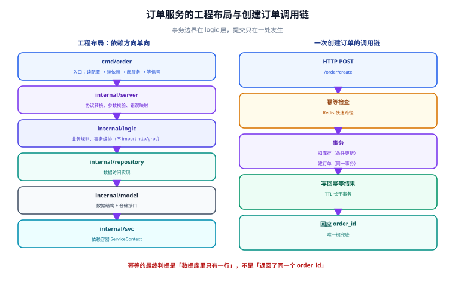

# 实战：订单服务

一句话定位：这一页把前面两页的抽象落成一个**能本地跑起来、能被压测、能被定位**的 Go 服务。全程只有一条主链：HTTP 请求 → 订单逻辑 → MySQL + Redis → 返回，但每一层都按生产标准接上治理与可观测。



## 一、目标与验收

### 要做成什么

一个 `order-svc`，对外暴露两个接口：

| 接口 | 语义 | 关键要求 |
| --- | --- | --- |
| `POST /order/create` | 创建订单 | 幂等（同 `idempotency_key` 只成功一次）；扣库存失败要回滚 |
| `GET /order/get` | 查订单 | 走 Redis 缓存；缓存未命中回落 DB |

内部还要能被 `user-svc` 以 gRPC 调用（`order.v1.OrderService/GetOrder`），并暴露 `/metrics` 与 `/debug/pprof`（仅在运维端口）。

### 验收判据（六步，全部可执行）

| 步骤 | 命令 | 期望 |
| --- | --- | --- |
| 1. 服务可启动 | `go run ./cmd/order` | 日志出现 `order rpc listening on 0.0.0.0:8080` 与 `http listening on 0.0.0.0:8888` |
| 2. 接口可调用 | `curl -X POST .../order/create -d '{...}'` | 返回 `{"order_id":1001}` |
| 3. 幂等生效 | 同参数再调一次 | 返回**同一个** `order_id`，DB 只有一行 |
| 4. 缓存生效 | 连续两次 `GET /order/get` | 第二次日志出现 `cache hit`，耗时降到 < 5 ms |
| 5. 指标可见 | `curl :9100/metrics \| grep rpc_server` | 三个指标都有数据 |
| 6. 能定位热点 | `go tool pprof http://127.0.0.1:9100/debug/pprof/profile?seconds=15` | 能输出 `top` 火焰数据 |

第 5、6 步是「可观测」这条要求在实战里的具体形态——**没有这两步，服务只是「能跑」，不是「能运维」**。

## 二、工程布局

```text [目录结构]
order-svc/
├─ api/
│  └─ order/
│     └─ v1/
│        ├─ order.proto
│        ├─ order.pb.go
│        └─ order_grpc.pb.go
├─ cmd/
│  └─ order/
│     └─ main.go              # 唯一入口：读配置 → 装依赖 → 起服务 → 等信号
├─ internal/
│  ├─ config/config.go        # 配置结构体（只有一处定义）
│  ├─ logic/                  # 业务逻辑：不 import http/grpc，可被单测直接调用
│  │  ├─ createorder.go
│  │  └─ getorder.go
│  ├─ model/                  # 数据模型与仓储接口
│  │  ├─ order.go
│  │  └─ orderrepo.go
│  ├─ repository/             # 仓储实现（MySQL / Redis）
│  │  ├─ order_mysql.go
│  │  └─ order_cache.go
│  ├─ server/                 # 传输层装配：HTTP + gRPC
│  │  ├─ http.go
│  │  └─ grpc.go
│  ├─ interceptor/            # 拦截器：recover / trace / timeout / metric
│  └─ svc/                    # 依赖容器 ServiceContext
│     └─ context.go
├─ deploy/
│  ├─ docker-compose.yml      # 本地依赖：MySQL + Redis + etcd
│  └─ Dockerfile
├─ etc/
│  ├─ order.yaml              # 默认配置
│  └─ order-prod.yaml         # 生产覆盖
├─ go.mod
└─ Makefile
```

### 分层职责与「谁能 import 谁」

| 层 | 职责 | 允许 import | 禁止 import |
| --- | --- | --- | --- |
| `cmd` | 装配与生命周期 | 所有 internal 包 | — |
| `server` | 协议转换、参数校验、错误映射 | `logic`、`svc` | 直接 import `repository` |
| `logic` | 业务规则、事务编排 | `model`（含仓储**接口**）、`svc` | `server`、`http`、`grpc` |
| `repository` | 数据访问实现 | `model` | `logic`、`server` |
| `model` | 数据结构 + 仓储接口 | 仅标准库 | 任何 internal 包 |

::: tip 这条依赖方向是整套设计的地基
`logic` 只依赖**仓储接口**（定义在 `model` 里），不依赖具体实现。带来的三个好处：
1. 单测不需要起 MySQL，注入一个内存实现就能测业务规则；
2. 换存储（MySQL → TiDB）只改 `repository`，`logic` 一行不动；
3. 依赖方向单向，不会出现 `logic` 与 `repository` 互相 import 的循环。
:::

## 三、配置：一份结构体，多处覆盖

```yaml [etc/order.yaml]
Name: order-svc
Log:
  Level: info
  Mode: console

RpcServerConf:
  ListenOn: 0.0.0.0:8080
  Timeout: 1500          # 服务端超时预算（ms）

HttpServerConf:
  ListenOn: 0.0.0.0:8888
  Timeout: 3000

OpsServerConf:           # 运维端口：只在内网暴露
  ListenOn: 0.0.0.0:9100
  EnableMetrics: true
  EnablePprof: true

MySQL:
  DataSource: root:pass@tcp(127.0.0.1:3306)/shop?parseTime=true&loc=Local
  MaxOpenConns: 100
  MaxIdleConns: 20
  ConnMaxLifetime: 300s

Redis:
  Host: 127.0.0.1:6379
  Type: node
  Pass: ""

Etcd:
  Hosts:
    - 127.0.0.1:2379
  Key: order.rpc
```

```go [internal/config/config.go]
type Config struct {
    Name           string
    Log            LogConf
    RpcServerConf  RpcServerConf
    HttpServerConf HttpServerConf
    OpsServerConf  OpsServerConf
    MySQL          MySQLConf
    Redis          RedisConf
    Etcd           EtcdConf
}

type MySQLConf struct {
    DataSource      string
    MaxOpenConns    int           `json:",default=100"`
    MaxIdleConns    int           `json:",default=20"`
    ConnMaxLifetime time.Duration `json:",default=300s"`
}
```

加载时**允许环境变量覆盖**，且**禁止兜底默认值掩盖配置错误**：

```go
// 从文件加载；关键项必须存在，缺失直接退出（不要用空字符串兜底）
var c config.Config
conf.MustLoad(*configFile, &c, conf.UseEnv())   // UseEnv 允许 MySQL_DataSource 覆盖
if c.MySQL.DataSource == "" {
    logx.Fatal("MySQL.DataSource 未配置，拒绝启动")
}
```

::: danger 注意：配置的两种错误处理必须分清
- **结构性配置缺失**（监听地址、数据库连接串）→ **启动即失败**。带默认值启动等于把错误推迟到第一次请求，排查成本高十倍。
- **可降级的配置缺失**（缓存地址、灰度开关）→ **可以带默认值 + 打 `warn` 日志**，但日志里必须能让运维看见。

另一个必须避免的写法是**在多个文件里定义同一个配置项**。全部配置集中在 `internal/config/config.go` 一个文件里，环境差异靠 `etc/*.yaml` 覆盖——这是「配置漂移」类事故的唯一有效防线。
:::

## 四、数据层：连接池、事务、错误映射

### 连接池参数不是「越大越好」

| 参数 | 建议值 | 定法 |
| --- | --- | --- |
| `MaxOpenConns` | `min(DB max_connections / 实例数 × 0.8, 100)` | 先算「每个实例能用多少」，再打八折留余量 |
| `MaxIdleConns` | `MaxOpenConns` 的 20%~30% | 太小会导致频繁建连 |
| `ConnMaxLifetime` | 5~30 分钟 | 必须**小于** DB 或中间件的空闲超时（MySQL 默认 `wait_timeout=28800s`，但云数据库常在 5~30 分钟主动断连） |
| `ConnMaxIdleTime` | 1~5 分钟 | 回收长期空闲连接 |

```go
db, err := sqlx.NewMysql(c.MySQL.DataSource).RawDB()
if err != nil { return nil, err }
db.SetMaxOpenConns(c.MySQL.MaxOpenConns)
db.SetMaxIdleConns(c.MySQL.MaxIdleConns)
db.SetConnMaxLifetime(c.MySQL.ConnMaxLifetime)
db.SetConnMaxIdleTime(2 * time.Minute)
```

::: danger 注意：`ConnMaxLifetime` 不设会踩「连接被服务端单方面关闭」
云数据库（RDS / PolarDB）通常有 `wait_timeout` 或代理层空闲回收。如果 Go 的连接池里存着一条已被服务端关闭的连接，下次复用时收到的是 **`invalid connection`** 或 `unexpected EOF`，表现为**每小时固定出现一小批 500**。设置 `ConnMaxLifetime` 小于服务端的回收时间，让连接由客户端主动淘汰，问题就消失了。
:::

### 事务与「先扣库存还是先建订单」

```go
func (l *CreateOrderLogic) CreateOrder(ctx context.Context, req *pb.CreateOrderRequest) (*pb.CreateOrderReply, error) {
    // 1. 幂等检查走 Redis（快路径），命中直接返回上次结果
    if cached, err := l.repo.GetIdemResult(ctx, req.IdempotencyKey); err == nil && cached != nil {
        return cached, nil
    }

    // 2. 业务逻辑与事务
    var orderID int64
    err := l.repo.Transact(ctx, func(tx *sql.Tx) error {
        // 2.1 扣库存（带条件更新，防超卖）
        aff, err := l.repo.DeductStock(tx, req.SkuId, req.Quantity)
        if err != nil { return err }
        if aff == 0 { return ErrStockNotEnough }

        // 2.2 建订单（同一事务内）
        orderID, err = l.repo.InsertOrder(tx, req, req.AmountCents)
        return err
    })
    if err != nil { return nil, mapRepoErr(err) }

    // 3. 幂等结果写回 Redis（长于事务的 TTL）
    l.repo.SetIdemResult(ctx, req.IdempotencyKey, orderID)
    return &pb.CreateOrderReply{OrderId: orderID}, nil
}
```

**先扣库存再建订单**是正确的：扣库存用带条件的 `UPDATE ... SET stock = stock - ? WHERE sku_id = ? AND stock >= ?`，靠 `RowsAffected == 0` 判断失败，这是防超卖最简可靠的写法（单行更新天然带行锁）。

### 错误映射：把存储错误翻成对外的语义

```go
func mapRepoErr(err error) error {
    switch {
    case errors.Is(err, ErrStockNotEnough):
        return status.Error(codes.FailedPrecondition, "库存不足")
    case errors.Is(err, sql.ErrNoRows):
        return status.Error(codes.NotFound, "订单不存在")
    case errors.Is(err, context.DeadlineExceeded):
        return status.Error(codes.DeadlineExceeded, "处理超时，请稍后重试")
    default:
        // 不把底层错误透出，只写日志
        logx.Errorf("repo error: %v", err)
        return status.Error(codes.Internal, "服务内部错误")
    }
}
```

## 五、依赖容器：ServiceContext

把所有依赖集中到一个结构体里，Server 层与 Logic 层都通过它拿依赖，**不要在 Logic 里 new 任何东西**。

```go [internal/svc/context.go]
type ServiceContext struct {
    Config   config.Config
    MySQL    *sql.DB
    Redis    *redis.Client
    OrderRepo repository.OrderRepo        // 依赖的是接口，不是实现
    Breaker   *breaker.Breaker
}

func NewServiceContext(c config.Config) *ServiceContext {
    return &ServiceContext{
        Config:    c,
        MySQL:     mustDB(c.MySQL),
        Redis:     mustRedis(c.Redis),
        OrderRepo: repository.NewOrderRepo(mustDB(c.MySQL), mustRedis(c.Redis)),
        Breaker:   breaker.NewBreaker(),
    }
}
```

好处有两个：**单测里可以整体替换**（造一个 `ServiceContext{OrderRepo: 内存实现}`）；**依赖关系一眼可见**（不看构造函数就能知道这个服务依赖哪些外部资源）。

## 六、优雅退出：完整实现

```go [cmd/order/main.go]
func main() {
    flag.Parse()
    var c config.Config
    conf.MustLoad(*configFile, &c, conf.UseEnv())
    svcCtx := svc.NewServiceContext(c)
    defer svcCtx.Close()                          // 关闭 DB / Redis

    registry := zrpc.MustNewRegistry(c.Etcd.Hosts, c.Etcd.Key)

    rpcSrv := zrpc.MustNewServer(c.RpcServerConf, func(gs *grpc.Server) {
        pb.RegisterOrderServiceServer(gs, server.NewOrderServer(svcCtx))
    }, zrpc.WithRegistry(registry),
        zrpc.WithUnaryInterceptors(interceptor.UnaryRecover(), interceptor.UnaryTrace(),
            interceptor.UnaryTimeout(), interceptor.UnaryMetric()))

    httpSrv := server.NewHTTP(svcCtx)
    opsSrv := server.NewOps(svcCtx)               // /metrics + /debug/pprof，仅内网

    go rpcSrv.Start()
    go httpSrv.Start()
    go opsSrv.Start()
    logx.Infof("%s started", c.Name)

    // ---- 关键：三步顺序 ----
    ch := make(chan os.Signal, 1)
    signal.Notify(ch, syscall.SIGINT, syscall.SIGTERM)
    sig := <-ch
    logx.Infof("received %v, shutting down", sig)

    registry.Deregister()                          // 1. 先从注册中心摘除
    time.Sleep(5 * time.Second)                    // 2. 等调用方刷新实例列表
    rpcSrv.GracefulStop()                          // 3. 停新请求，等存量结束
    httpSrv.Shutdown(context.Background())
    opsSrv.Shutdown(context.Background())
    logx.Info("bye")
}
```

::: warning 说明：为什么第 2 步是 5 秒
这个值必须 **> 注册中心推送到客户端的最大延迟**（etcd watch 通常 < 1 s，Nacos 长轮询典型 1~3 s，K8s Endpoints 同步通常 < 5 s）。压测验证的方法：滚动更新 20 次，统计期间 5xx 数量，从 0 秒开始往上加，直到 5xx 归零。**5 秒是保守起点，不是规定值**。
:::

## 七、本地起环境

依赖用 docker-compose 一键起，配好初始化 SQL：

```yaml [deploy/docker-compose.yml]
services:
  mysql:
    image: mysql:8.4
    environment:
      MYSQL_ROOT_PASSWORD: pass
      MYSQL_DATABASE: shop
    ports: ["3306:3306"]
    volumes:
      - ./init.sql:/docker-entrypoint-initdb.d/init.sql:ro
    command: --default-authentication-plugin=caching_sha2_password --max_connections=500
    healthcheck:
      test: ["CMD", "mysqladmin", "ping", "-h", "127.0.0.1", "-ppass"]
      interval: 5s
      retries: 20

  redis:
    image: redis:8-alpine
    ports: ["6379:6379"]
    command: redis-server --appendonly yes --maxmemory 256mb --maxmemory-policy allkeys-lru

  etcd:
    image: quay.io/coreos/etcd:v3.5
    command: >
      /usr/local/bin/etcd --name n1
      --advertise-client-urls http://0.0.0.0:2379
      --listen-client-urls http://0.0.0.0:2379
    ports: ["2379:2379"]
```

```sql [deploy/init.sql]
CREATE TABLE `t_order` (
  `id`            BIGINT UNSIGNED NOT NULL AUTO_INCREMENT,
  `user_id`       BIGINT UNSIGNED NOT NULL,
  `sku_id`        BIGINT UNSIGNED NOT NULL,
  `quantity`      INT NOT NULL,
  `amount_cents`  BIGINT UNSIGNED NOT NULL COMMENT '单位：分',
  `status`        TINYINT NOT NULL DEFAULT 0,
  `idem_key`      VARCHAR(64) NULL,
  `created_at`    DATETIME(3) NOT NULL DEFAULT CURRENT_TIMESTAMP(3),
  PRIMARY KEY (`id`),
  UNIQUE KEY `uk_idem` (`idem_key`),           -- 幂等的最后一道防线
  KEY `idx_user_created` (`user_id`, `created_at`)
) ENGINE=InnoDB DEFAULT CHARSET=utf8mb4;

CREATE TABLE `t_sku_stock` (
  `sku_id` BIGINT UNSIGNED NOT NULL,
  `stock`  INT NOT NULL,
  PRIMARY KEY (`sku_id`)
) ENGINE=InnoDB DEFAULT CHARSET=utf8mb4;

INSERT INTO t_sku_stock VALUES (1, 1000), (2, 500);
```

::: tip `uk_idem` 是幂等的兜底
应用层已经用 Redis 挡了一次重复请求，但 Redis 可能被清空、可能超时。**数据库唯一键是最后一道防线**：即使 Redis 失效、两个并发请求同时走到 `INSERT`，也只有一个能成功，另一个拿到 `Duplicate entry` 错误——把它映射成「返回已存在的订单」即可。**幂等必须有数据库级的兜底，只靠缓存不算幂等。**
:::

## 八、可验证步骤（照着做）

```shell
# 0. 起依赖并等健康
cd deploy && docker compose up -d && docker compose ps
# 期望：mysql 状态为 healthy

# 1. 起服务
cd .. && go run ./cmd/order -f etc/order.yaml
# 期望日志：order rpc listening on 0.0.0.0:8080 / http listening on 0.0.0.0:8888

# 2. 创建订单
curl -s -X POST http://127.0.0.1:8888/order/create \
  -H 'Content-Type: application/json' \
  -d '{"user_id":1,"sku_id":1,"quantity":2,"idempotency_key":"k-001"}'
# 期望：{"order_id":1}

# 3. 幂等验证：同 key 再调一次
curl -s -X POST http://127.0.0.1:8888/order/create \
  -H 'Content-Type: application/json' \
  -d '{"user_id":1,"sku_id":1,"quantity":2,"idempotency_key":"k-001"}'
# 期望：仍为 {"order_id":1}

# 4. 确认库里只有一行（幂等的最终判据）
docker exec -i deploy-mysql-1 mysql -uroot -ppass shop \
  -e "SELECT COUNT(*) AS c FROM t_order WHERE idem_key='k-001';"
# 期望：c = 1

# 5. 缓存生效
curl -s 'http://127.0.0.1:8888/order/get?order_id=1' > /dev/null
time curl -s 'http://127.0.0.1:8888/order/get?order_id=1' | head -c 80
# 期望：第二次耗时 < 5ms，日志出现 cache hit

# 6. 库存被正确扣减
docker exec -i deploy-mysql-1 mysql -uroot -ppass shop \
  -e "SELECT stock FROM t_sku_stock WHERE sku_id=1;"
# 期望：998（1000 - 2）

# 7. 指标有数据
curl -s http://127.0.0.1:9100/metrics | grep -E '^rpc_server_(requests_total|errors_total)'
```

::: danger 注意：第 4 步不能省
「同一个 `order_id` 返回了两次」**不等于**幂等生效——也可能是两次都写了、只是返回了旧值。**唯一可靠的判据是数据库里只有一行**。这就是「幂等要有 DB 级断言」的含义。
:::

## 九、压测与 pprof 定位

### 先压出基线

```shell
# 用 hey 打 60 秒、并发 50
hey -z 60s -c 50 -m POST -H 'Content-Type: application/json' \
  -d '{"user_id":1,"sku_id":1,"quantity":1,"idempotency_key":"bench-1"}' \
  http://127.0.0.1:8888/order/create
# 关注输出：Requests/sec、P50/P95/P99、以及非 2xx 的数量
```

### 出问题时按 pprof 三件套定位

| 症状 | 采集命令 | 看什么 |
| --- | --- | --- |
| **CPU 高** | `go tool pprof http://127.0.0.1:9100/debug/pprof/profile?seconds=30` → `top`、`web` | 前 5 名的累积占比；`top -cum` 看调用链上的「大户」 |
| **内存持续涨** | `go tool pprof http://127.0.0.1:9100/debug/pprof/heap` → `top`、`list <func>` | 是**泄漏**（`inuse_space` 只涨不降）还是**正常缓存**（`alloc_space` 大但 `inuse` 稳定） |
| **卡住 / 不返回** | `curl 'http://127.0.0.1:9100/debug/pprof/goroutine?debug=2'` | goroutine 数是否持续增长；**卡在同一个函数**就是死锁或阻塞点 |
| **偶发长尾延迟** | `go tool trace http://127.0.0.1:9100/debug/pprof/trace?seconds=5` | 看 GC 停顿、goroutine 调度阻塞、`Syscall` 阻塞 |

::: tip 压测的判据不是 TPS 数字，而是「拐点」
单独看一个 TPS 数字没有意义。**要找到 TPS 不再线性增长的那一点**，同时看两个信号：加并发后 TPS 增量明显衰减，**并且**资源水位触顶（CPU > 85%、连接池排队、GC 占比 > 10%）。两个信号同时出现才算找到拐点。完整的量表与方法见 [性能测试](../../../../project/Base/BackendTemplate/PerformanceTest/index.md)。
:::

### 一次真实的定位过程

现象：并发从 50 加到 100，TPS 不升反降，p99 从 30 ms 涨到 900 ms。

1. `goroutine` 端点：goroutine 数从 120 涨到 3000+，且大量卡在同一处 → **有阻塞**。
2. `debug=2` 的栈显示卡在 `database/sql.(*DB).conn` → **在等连接**。
3. 查 `MaxOpenConns = 100`，DB `max_connections = 500`，两个实例各占 100 → 没超。
4. `SHOW PROCESSLIST` 发现大量 `Sending data` 的慢查询 → **连接是被慢查询占住的**，不是连接池配小了。
5. `EXPLAIN` 那条 SQL，`idx_user_created` 没被用上（条件顺序与索引前缀不匹配）→ **加索引解决**。

结论：**「连接池不够」几乎总是慢查询的症状，不是原因**。先看 `PROCESSLIST` 与 `EXPLAIN`，再动连接池参数。

## 十、常见问题与排错

| 现象 | 高概率原因 | 定位手段 |
| --- | --- | --- |
| 启动报 `listen tcp :8080: bind: address already in use` | 上一次进程没退干净 | `netstat -ano \| findstr :8080` 后结束进程 |
| 每小时固定一批 500 | 连接池持有已被服务端关闭的连接 | 设置 `ConnMaxLifetime` 小于服务端空闲回收时间 |
| 幂等偶发失效 | 只靠 Redis 挡，未加 DB 唯一键 | 查 `t_order` 是否有重复 `idem_key` |
| 滚动更新零星 5xx | 退出时未摘除/未等待 | 检查退出三步顺序；看 5xx 与发布时间的相关性 |
| 内存只涨不降 | goroutine 泄漏或缓存无上限 | `goroutine?debug=2` + `heap` 对比两次采样 |
| 日志里有 `context canceled` | 上游超时后下游仍在跑 | 检查是否每层都从上游 `ctx` 派生超时 |

## 参考资料

- [go-zero 官方文档：快速开始](https://go-zero.dev/docs/tasks)
- [Kratos 官方文档](https://go-kratos.dev/docs/)
- [database/sql 连接池参数说明](https://pkg.go.dev/database/sql#DB.SetConnMaxLifetime)
- [Go 官方：Profiling Go Programs](https://go.dev/blog/pprof)
- [Go 官方：Diagnostics（pprof / trace / godebug）](https://go.dev/doc/diagnostics)
- [MySQL：innodb 与连接超时相关参数](https://dev.mysql.com/doc/refman/8.4/en/server-system-variables.html)

## 相关页面

- [Go 微服务概述与选型](../Overview/index.md) —— 先定架构决策，再动手
- [gRPC 与 Protobuf 工程化](../GRPC/index.md) —— 本页里 `api/order/v1` 的来源
- [服务治理：注册发现到可观测](../Governance/index.md) —— 本页里拦截器与 `/metrics` 的展开
- [Go 并发模型](../../Go/Concurrency/index.md) —— goroutine 泄漏与 `context` 取消的语言基础
- [Docker](../../../Ops/Docker/index.md) —— 把本页的服务打成多阶段构建的镜像
- [性能测试](../../../../project/Base/BackendTemplate/PerformanceTest/index.md) —— 容量拐点的完整方法论
