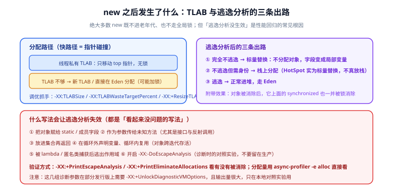
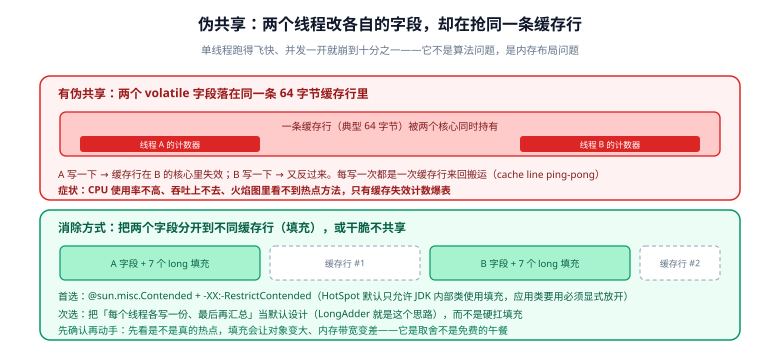

# 分配与内存效率

Java 的 GC 让「随便 new」看起来很便宜——**年轻代回收确实很便宜，但「便宜」不等于免费**：每一次分配都要移动指针、每一次存活都要被复制、每一个对象都要占用一条缓存行的一部分。当分配速率成为瓶颈时，症状通常不是「CPU 打满」，而是**吞吐下降 + GC 频率上升 + 长尾抖动**。这一页讲三件事：分配本身怎么工作（TLAB）、哪些写法会让优化失效（逃逸分析）、以及减少对象与提升局部性的具体手段。



## 1. 分配路径：绝大多数 `new` 比你想象的便宜

| 步骤 | 做了什么 | 何时变贵 |
| --- | --- | --- |
| ① **TLAB 内指针碰撞** | 每个线程有一块私有 Eden 区间（TLAB），分配就是移动 `top` 指针，**无锁** | 几乎从不 |
| ② TLAB 用尽 → 申请新 TLAB | 从 Eden 再划一块，可能有同步 | TLAB 太小 → 频繁 refill；太大 → 浪费与更多碎片 |
| ③ 直接在 Eden 分配（放弃 TLAB） | 大对象走这条路，需要原子操作 | 分配速率极高时成为竞争点 |
| ④ 大对象直接进老年代 | 超过 `-XX:PretenureSizeThreshold`（G1 下由 humongous region 规则决定） | 大数组 / 大字符串频繁创建 |

```shell
# 观察 TLAB 的浪费与 refill 情况
java -Xlog:gc+tlab=info -jar app.jar

# 关注两个指标：refill 次数是否异常高、waste 百分比是否可观（-XX:TLABWasteTargetPercent 默认 1）
```

| 相关参数 | 默认 | 什么时候动它 |
| --- | --- | --- |
| `-XX:+UseTLAB` | 开 | 不要关 |
| `-XX:+ResizeTLAB` | 开 | 保持开启，让 JVM 自适应 |
| `-XX:TLABSize` | 0（自适应） | 线程数很多且每个线程分配量小而均匀时可显式设置 |
| `-XX:TLABWasteTargetPercent` | 1 | 分配极频繁时略微调大能减少 refill，代价是浪费内存 |
| `-XX:PretenureSizeThreshold` | 0（G1 下通常不生效） | 明确知道有一类「一创建就长期存活的大对象」时 |

::: tip 先看分配速率，再谈优化
用 JMH 的 `-prof gc` 拿到 `gc.alloc.rate.norm`（每次操作分配多少字节），或用 `-Xlog:gc` 里的分配速率，或直接用 [async-profiler 的 `-e alloc`](../Profiling/index.md) 看「谁在造对象」。**先有分配速率这个数字，才知道值不值得为省几次分配去改代码。** 没有这个数字就动手，多半在优化不在关键路径上的代码。
:::

## 2. 逃逸分析：让「不逃逸的对象」根本不存在

C2 会判断一个对象是否「逃出」它的创建作用域。如果没逃出，它可以做**标量替换（scalar replacement）**——把对象的字段拆成局部变量，**对象根本不会被分配**；顺带把对象上的 `synchronized` 也消除掉（锁消除）。

> 注意一个常见误解：**HotSpot 并不做真正意义上的「栈上分配」**。所谓「栈上分配」在这套实现里就是标量替换——对象被拆散，连分配都省了。

| 优化 | 参数 | 作用 |
| --- | --- | --- |
| 逃逸分析 | `-XX:+DoEscapeAnalysis`（默认开） | 判断对象的作用域 |
| 标量替换 | `-XX:+EliminateAllocations`（默认开） | 不逃逸的对象不分配 |
| 锁消除 | `-XX:+EliminateLocks`（默认开） | 只在单线程可见的对象上的同步被去掉 |
| 诊断输出 | `-XX:+PrintEscapeAnalysis` / `-XX:+PrintEliminateAllocations` | 看有没有被消除（输出量大，仅本地对照用） |

### 让逃逸分析失效的六种写法

```java
// ① 赋给成员 / 静态字段：对象逃出方法
private static Point CACHE;
void bad1() { CACHE = new Point(1, 2); }

// ② 作为参数传给未知方法（尤其是接口、反射、日志框架的可变参数）
void bad2(Consumer<Point> c) { c.accept(new Point(1, 2)); }

// ③ 放进集合再返回
List<Point> bad3() {
    List<Point> list = new ArrayList<>();
    list.add(new Point(1, 2));
    return list;                       // 整个集合都逃逸了
}

// ④ 在循环外声明变量、循环内复用
void bad4(int n) {
    Point p = new Point(0, 0);          // 对象跨迭代存活
    for (int i = 0; i < n; i++) { p.x = i; use(p); }
}

// ⑤ 被 lambda / 匿名类捕获后逃出作用域
Runnable bad5() { Point p = new Point(1, 2); return () -> use(p); }

// ⑥ 直接关掉优化（诊断对照可以，生产不要）
// java -XX:-DoEscapeAnalysis
```

正确写法是**把对象的生命周期压到最小作用域内**：

```java
int good(int n) {
    int sum = 0;
    for (int i = 0; i < n; i++) {
        Point p = new Point(i, i);      // 每次迭代一个、当场用完 → 可能被完全消除
        sum += p.x + p.y;
    }
    return sum;
}
```

::: danger 「对象池」是这类场景里最常见的反向优化
对**普通短生命周期对象**（POJO、DTO、事件、String），对象池几乎总是净损失：

1. **池化拦住了逃逸分析**：对象一旦被放进池子，就永远「逃逸」了，标量替换彻底失效。
2. **把年轻代的廉价回收换成了长期的存活对象**：短命对象在年轻代回收里几乎不花钱，而池里的对象会被晋升、被 GC 反复扫描。
3. **引入状态残留 bug**：忘了重置字段导致的脏数据，是最难查的一类缺陷。
4. **引入同步开销**：既然要池化，就必须考虑并发取还，于是又回到锁竞争。

**只有这四类资源值得池化**：数据库连接、线程、网络连接、大块直接内存（ByteBuf / `DirectByteBuffer`）。它们的共同点是**创建本身就昂贵或受操作系统资源限制**，而不是「创建次数多」。
:::

## 3. 缓存行与伪共享

现代 CPU 按**缓存行**（典型 64 字节）而不是按字节读取内存。如果两个线程各自修改的变量落在**同一条缓存行**里，一条写操作就会让另一个核心的副本失效，缓存行在两个核心之间来回搬运——这就是伪共享（false sharing）。



| 症状 | 说明 |
| --- | --- |
| 单线程很快、并发一开就崩到几分之一 | 最典型的伪共享信号 |
| CPU 使用率不高但吞吐上不去 | 时间花在缓存一致性协议上，不在执行指令上 |
| 火焰图看不到热点方法 | 问题不在「哪一行代码」，而在「哪些变量住在同一行」 |

```java
import sun.misc.Contended;      // 需要 -XX:-RestrictContended 才允许应用代码使用

public class PaddedCounters {
    @Contended
    volatile long a;            // 与 b 被强行分到不同缓存行

    @Contended
    volatile long b;
}
```

```shell
# HotSpot 默认只允许 JDK 内部类使用 @Contended，应用类必须显式放开
java -XX:-RestrictContended -jar app.jar
```

::: warning 先确认再填充，别把填充当默认动作
填充会让对象变大、增加内存带宽压力，并可能反过来降低缓存命中率。**只有在下列三条同时成立时才做**：

1. 已经用锁剖析 / wall-clock 剖析（见 [剖析工具链](../Profiling/index.md)）确认瓶颈在同步而不是算法；
2. 已经算出该字段确实是**每线程一份、高频写、彼此独立**的（典型：统计计数器、状态标志）；
3. 填充前后的对照实验显示确有提升，且提升大于本底噪声。

更好的做法通常是**结构上不共享**：让每个线程各写自己的一份，最后再汇总——`LongAdder` 就是靠这个思路跑赢 `AtomicLong` 的（见 [锁与并发原语的性能](../LockOptimize/index.md)）。
:::

## 4. 集合与字符串的真实开销

### 集合：把容量预估出来

| 集合 | 关键行为 | 做法 |
| --- | --- | --- |
| `ArrayList` | 首次添加时容量 10；扩容按 `oldCapacity + (oldCapacity >> 1)`（约 1.5 倍） | 已知数量时直接 `new ArrayList<>(n)`；一次性 `addAll` 比循环 `add` 少几次扩容 |
| `HashMap` | 默认容量 16、负载因子 0.75；单桶链表长度到 **8** 且总容量 ≥ 64 时**树化**，降到 **6** 时退化 | 容量按 `期望元素数 ÷ 0.75` 向上取 2 的幂；避免用可变对象做 key |
| `StringBuilder` | 默认容量 16；扩容 `(old << 1) + 2` | 拼接前 `new StringBuilder(预估长度)` |
| `Arrays.asList` / `List.of` | 固定大小 | 明确不需要变更时用，省一层扩容逻辑 |

### 字符串：`String` 本身很便宜，`byte[]` 才是成本

JDK 9 起 `String` 内部是 `byte[] value` + `byte coder`（紧凑字符串）：纯 Latin-1 字符每字符只占 **1 字节**。这带来两个结论：

- 「一个 10 字符的 ASCII 字符串」的堆成本主要是 `String` 对象头 + `byte[]` 对象头 + 10 字节数据 + 两处对齐填充，而不是「20 字节字符数据」。
- **字符串的拼接产物会长期停留**：`+=` 在循环里每次都新建字符串，且旧串立刻变垃圾。循环内拼接一律用 `StringBuilder`。

```java
// 反例：每次迭代产生两个临时字符串
String s = "";
for (int i = 0; i < 1000; i++) s += i;

// 正例
StringBuilder sb = new StringBuilder(4096);
for (int i = 0; i < 1000; i++) sb.append(i);
String result = sb.toString();
```

::: tip 常量池与 `String.intern()` 的取舍
`intern()` 把字符串放进常量池共享，能减少重复字符串的内存占用；但它需要**查表并可能加锁**，而且被 intern 的字符串会**长期存活**（常量池不是年轻代的对象，几乎不会被回收）。结论：**只在「同一组有限值被反复创建」时用**（如枚举式的状态码、国家码），绝不要用在用户输入、URL、日志文本上——那会把堆泄漏伪装成「内存占用高」。
:::

## 5. 一条常被忽略的线：序列化与反射

JSON 序列化（Jackson / Gson / fastjson 等）常常是**单次请求里分配量最大的地方**，原因有三：

| 原因 | 说明 |
| --- | --- |
| 中间对象 | 序列化框架会构造内部 buffer、Token 对象、字段描述符 |
| 反射调用 | 首次使用某个类时建立元数据（这也是它「第一次慢」的原因）；现代版本多用字节码/方法句柄优化，但仍需确认版本与配置 |
| 大对象与大字符串 | 一个 1MB 的响应体会导致一个 2MB 级别的 `byte[]`（扩容后）与最终字符串 |

三个可操作的优化方向：

1. **复用 `ObjectMapper`**（它是线程安全的），不要每次请求 `new`。这是最常见也最值钱的一条。
2. **减少一次传输的数据量**：分页、字段裁剪（`@JsonInclude` / 视图），比优化序列化器本身更有效。
3. **别在热路径上做「序列化再反序列化」的深拷贝**：那是把两次大分配写进了主链路，拷贝的动机值得重新审视（能否改用不可变对象直接传递）。

## 6. 堆与启动期的两个实用参数

| 参数 | 作用 | 什么时候用 |
| --- | --- | --- |
| `-XX:+AlwaysPreTouch` | 启动时把整块堆内存真的触摸一遍（而非惰性分配） | 大堆（≥ 8GB）服务；代价是启动时间变长，收益是运行时不再因首次触碰而抖动 |
| `-XX:+HeapDumpOnOutOfMemoryError` + `-XX:HeapDumpPath=` | OOM 时自动转储 | **生产必备**，事故复盘全靠它 |
| `-XX:MaxDirectMemorySize=` | 限制直接内存 | 用了 NIO / Netty 但没有配限额时，直接内存溢出会表现为「堆正常但进程被杀」 |

## 7. 验证方式

1. **分配量可量化**：用 `-prof gc` 得到 `gc.alloc.rate.norm`，对被优化的那段代码记录「改前 / 改后 字节每操作」两个数字；零分配优化必须做到 `0.000 B/op`。
2. **逃逸分析确实生效**：对同一段代码分别在开启与关闭 `-XX:+DoEscapeAnalysis` 时跑 JMH，若两次结果几乎相同，说明该对象**本来就没被消除**（可能逃逸了），此时「优化分配」的方向是错的。
3. **伪共享的因果链完整**：先确认单线程与多线程的相对耗时差（8 线程应接近线性扩展，若只有 1/5 就继续查），填充后再测一次，得到前后对照数字，而不是「感觉快了」。
4. **对象池的收益为负的证据**：把对象池版本与直造版本放在同一个 JMH 基准里对比，并额外观察 `-prof gc` 的分配量——如果池化后分配量下降但耗时上升，就应当把池去掉。
5. **内存占用可核对**：用 `GraphLayout.parseInstance(...).toFootprint()` 打印一个真实集合的整体占用，和你的容量预估对比，判断「浪费在容量」还是「浪费在头与填充」。

## 相关文档

- [对象布局：从对象头到紧凑对象头](../MemoryLayout/index.md)：头与填充怎么算
- [锁与并发原语的性能](../LockOptimize/index.md)：`LongAdder` 与 `AtomicLong` 的差异来源
- [剖析工具链：JFR 与 async-profiler](../Profiling/index.md)：`-e alloc` 看「谁在造对象」
- [JVM 基础 · 内存结构](../../Java/JavaSE/JVM/MemoryStructure/index.md)：堆、TLAB、元空间的位置关系
- [Java 集合框架](../../Java/JavaSE/Collection/Overview/index.md)：各集合的复杂度与扩容行为
- [Java 函数式编程](../../Java/JavaSE/FunctionalProgramming/index.md)：`Stream` 的开销来源

## 参考资料

- Java HotSpot VM 性能相关选项（Oracle 官方 `java` 命令参考）：https://docs.oracle.com/en/java/javase/25/docs/specs/man/java.html
- JEP 519: Compact Object Headers：https://openjdk.org/jeps/519
- async-profiler 分配剖析（`-e alloc`）：https://github.com/async-profiler/async-profiler/blob/master/docs/ProfilerOptions.md
- JOL：Java Object Layout（含 `GraphLayout` footprint）：https://github.com/openjdk/jol
- JMH `-prof gc` 说明（官方样例 `JMHSample_33_Profiler`）：https://github.com/openjdk/jmh/tree/master/jmh-samples/src/main/java/org/openjdk/jmh/samples
