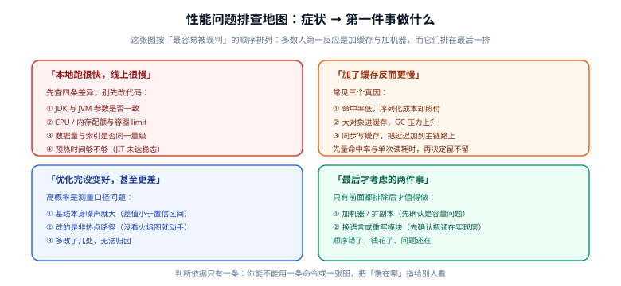

# 常见问题与最佳实践

这一页收的是**在真实项目里最容易被误判的性能问题**：本地跑很快线上很慢、加了缓存反而更慢、优化完没变好，以及对象、锁、JIT 三个领域里被重复转述了很多年的过期结论。每条都按「症状 → 先做什么 → 怎么验证」写，而不是只给结论。



## 这一页怎么用

先按症状定位到对应小节，再进对应的正文页拿方法：

| 你的症状 | 先看本节 | 方法在 |
| --- | --- | --- |
| 不知道从哪儿下手，谁说的都有道理 | [一、排查地图](#一、排查地图-先做哪件事-顺序错了要花钱) | [性能工程全景](../Overview/index.md) |
| 两个写法谁快说不清，测出来还反复 | [二、测量口径](#二、测量口径-先让数字可信) | [JMH 基准测试](../JmhBenchmark/index.md) |
| 本地压测很好，线上指标很难看 | [三、本地快线上慢](#三、「本地很快-线上很慢」) | [剖析工具链](../Profiling/index.md) |
| 加了缓存，接口反而更慢 | [四、加缓存反而更慢](#四、「加了缓存反而更慢」) | [分配与内存效率](../AllocationOptimize/index.md) |
| 改完了，指标没动甚至更差 | [五、优化完没变好](#五、「优化完没变好-甚至更差」) | [实战：把慢接口的 P99 打下来](../Practice/index.md) |
| 对象、字符串、内存相关 | [六、对象与内存的六个误解](#六、对象与内存的六个常见误解) | [对象布局](../MemoryLayout/index.md) |
| 并发上不去、锁相关 | [七、锁与并发的五个误解](#七、锁与并发的五个高频误解) | [锁与并发原语的性能](../LockOptimize/index.md) |
| 预热、去优化、AOT 相关 | [八、JIT 的四个问题](#八、jit-相关的四个问题) | [JIT 与分层编译](../JitCompiler/index.md) |
| 要在生产环境采样 | [九、生产剖析的纪律](#九、生产环境剖析的纪律) | [剖析工具链](../Profiling/index.md) |
| 怎么防止性能悄悄退化 | [十、性能门禁](#十、把结论固化下来-性能门禁) | [CI/CD · 自动化测试与质量门禁](../../../Tools/CICD/Testing/index.md) |

## 一、排查地图：先做哪件事，顺序错了要花钱

上图那一列排的是**处理顺序**，不是重要性顺序。多数人遇到「慢」的第一反应是加缓存、加机器，而这两件事在图上排最后一行——原因很直接：

| 动作 | 做错的代价 | 为什么排这个位置 |
| --- | --- | --- |
| 改代码 | 白干一场，还可能引入 bug | 只有定位到具体热点后才值得动 |
| 加缓存 | **把问题掩盖住**，并把一致性风险加进来 | 命中率低的时候，它只增加了一跳网络与一次序列化 |
| 加机器 | 钱花了、问题还在；扩容后指标可能更好看，但单请求成本没降 | 只有先确认是容量问题才有效 |
| 换语言 / 重写模块 | 数周到数月的成本，且很可能重写在一个不在关键路径上的模块 | 只有确认瓶颈在实现层（而非架构、IO、数据量）时才考虑 |

::: tip 唯一有效的判据
**你能不能只用一条命令或一张图，把「慢在哪」指给别人看。** 做不到，说明还没到优化阶段，先补观测：延迟直方图、火焰图、GC 日志、慢查询日志，四者按「等 / 算」分类。
:::

先做一次分类，把「慢」拆成两半：

```text
等（waiting）：IO、锁等待、下游调用、GC 停顿、连接池排队
算（computing）：CPU 时间花在哪些方法、哪些数据结构上
```

「等」的问题优先在架构与容量层解决（连接池、超时、批量化、缓存、并发度），本专题的工具只用来看清它；「算」的问题才是 JIT、对象布局、分配与锁优化的战场。

## 二、测量口径：先让数字可信

### Q1 用 `System.nanoTime()` 包一层 `for` 循环，测出来的数字可信吗

不可信，而且错的方向不可预测。手写循环会同时踩到四类坑：**死代码消除**（JIT 发现结果没被用，把整个循环删掉）、**常量折叠**（参数是编译期常量，被测代码被算成结果）、**循环无关代码提升**（不变的计算被挪出循环）、**预热不足**（前几轮跑的是解释执行）。实测差距可以是几十倍，极端情况下测到的是「空循环」的时间。

正确做法是用 JMH，并且让被测方法与「消费结果」之间有真实的数据依赖：

```java
// JMH 里让结果不可消除的标准写法
@Benchmark
public void parse(Blackhole bh) {
    bh.consume(JsonParser.parse(SAMPLE));   // 不要写 String s = parse(...) 然后什么都不做
}
```

完整的四类假结果、`@State` 的作用域与 `-prof` 参数用法见 [JMH 基准测试](../JmhBenchmark/index.md)。

### Q2 两个版本差 3%，算不算变快

**不算，除非差值超过置信区间。** JMH 输出的 `Score ± Error`，那个 `±` 就是 99.9% 置信区间。判断规则只有一条：

| 情况 | 结论 |
| --- | --- |
| 两个版本的区间**不重叠** | 有统计意义，可以下结论 |
| 区间重叠、点估计更优 | **证据不足**，加大迭代次数或改测更稳定的指标 |
| 差值 < 5% 且区间重叠 | 直接当「没有变化」处理，别为了这个数改代码 |

三个降低噪声的固定动作：`@Fork(3)` 以上（跨进程重新预热，排除同进程内的编译器状态干扰）、`@Warmup(iterations = 5, time = 1)` 起步、跑之前确认机器没有别的重负载（如果 `Score` 的 `±` 超过均值的 5%，先别信结果）。

### Q3 平均延迟降了，P99 却涨了，这算优化成功吗

要看你的 SLO 写在哪个分位上。**均值是最没用的一个数**：1000 个请求里 999 个 1ms、1 个 1s，均值也只有约 2ms——用户投诉的是那 1 个。常见原因是优化把「均匀的慢」换成了「偶发的很慢」：批量合并、锁分段、缓存批量淘汰都会这样。

判据：优化前后必须比的是**同一个分位口径**（比如 P99 与 P999），并且必须拿到**延迟直方图**而不是一个数。T-Digest / HdrHistogram 这类直方图能保留尾部形状，均值与百分比在它上面都能算出来。

### Q4 该测吞吐还是测延迟

取决于系统是**开环**还是**闭环**：

| 场景 | 该看什么 | 原因 |
| --- | --- | --- |
| 有排队与限流（网关、线程池、DB 连接池） | **延迟**，且必须是固定并发下的延迟 | 吞吐可以被「无限排队」堆高，延迟会先崩 |
| 离线批处理、无交互 | 吞吐（单位时间处理量） | 没有用户等待 |
| 服务端 API | 两者都要，但**先看延迟再看吞吐** | 用「延迟达标前提下的最大吞吐」描述容量 |

反例：把并发从 8 调到 800 然后说「吞吐提升了 40 倍」，这只是在把等待时间往后推，P99 往往已经涨到不可接受——这不是优化，是把问题挪到了队列里。

### Q5 基线要跑到什么程度才算「干净」

基线必须满足三条，缺一条后面对比都白做：**同一台机器、同一份数据量、同一组 JVM 参数**；**连续跑三遍，结果落在同一区间内**（如果三遍的均值飘超过 5%，说明环境不稳，先解决环境）；**基线代码与优化代码只差你要验证的那一处**。

```shell
# 基线可复现的最小记录：把这三个输出一起存下来
java -version
java -XX:+PrintFlagsFinal -version | grep -E "UseCompactObjectHeaders|TieredCompilation|ActiveProcessorCount"
uname -a   # Windows 下用 systeminfo | findstr /C:"OS 名称"
```

## 三、「本地很快，线上很慢」

这一条的排查成本最低、收益最高：四条差异**逐条比对**，多数人的问题在第 ② 或第 ④ 条，却先跑去改代码。

| 差异 | 怎么验证 | 常见的修法 |
| --- | --- | --- |
| ① JDK 版本与 JVM 参数 | `java -version` 两边对比；`-XX:+PrintFlagsFinal -version` 导出成文件后 `diff` | 把生产参数写进 `JAVA_TOOL_OPTIONS` 或镜像启动脚本，别靠「记忆中的那串参数」 |
| ② CPU / 内存配额与容器 limit | `cat /sys/fs/cgroup/cpu.max`、`cat /sys/fs/cgroup/memory.max`；`jcmd <pid> VM.info` 看可用核数与堆上限 | 用 `-XX:ActiveProcessorCount=N` 显式对齐并行度；堆上限与容器 limit 挂钩而不是与宿主机内存挂钩 |
| ③ 数据量与索引 | 比对两边行数级；`EXPLAIN` 同一条 SQL | 本地小数据量测不出索引缺失的代价，用脱敏后的量级数据做基准 |
| ④ 预热时间够不够 | 看进程启动后前几分钟的延迟曲线，是否单调下降后走平 | 预热期不做容量判断；必要时用 AOT cache 缩短冷启动（见 [JIT 与分层编译](../JitCompiler/index.md)） |

::: danger 三条最贵的误判
1. **「本地 8 核跑 8 个线程很快，容器限 1 核也没问题」**：JDK 9 起虽然能感知 cgroup 配额，但**并行度默认值**（GC 线程数、ForkJoinPool 公共池、JIT 编译线程）在很多部署形态下仍与宿主核数有关，务必用 `ActiveProcessorCount` 与 `-XX:ParallelGCThreads` 显式对齐，否则会出现「GC 线程争抢 1 个 CPU」这类看不见的抖动。
2. **「本地是 JDK 25，线上是 JDK 17 也没差」**：紧凑对象头（JDK 25）、AOT cache（JDK 24/25）、`G1` 的默认参数都在版本之间变过，跨大版本比较必须先把两边参数与版本对齐，否则测的是 JDK 差异。
3. **「线上慢一定是 CPU 密集」**：先用 `top -H -p <pid>`（或 `jcmd <pid> Thread.print`）看线程都在干什么。大量线程停在 `TIMED_WAITING` 通常是「等」，此时优化 CPU 一分钱都省不下来。
:::

## 四、「加了缓存反而更慢」

缓存不是「加速开关」，它是一个**用内存与一致性换延迟**的交易。加完更慢，几乎总是下面三个真因之一：

| 真因 | 怎么量 | 判断与修法 |
| --- | --- | --- |
| **命中率低，序列化成本却照付** | 埋点统计 `hit / (hit + miss)`，并单独统计一次序列化/反序列化的耗时 | 命中率低于 60% 时缓存基本是净亏；先确认 key 设计对不对（把用户 id 拼进 key 导致命中率趋近 0 是最常见的） |
| **大对象进缓存，GC 压力上升** | 看缓存实例的 `size()` 与总占用、GC 频率与老年代增长曲线 | 给缓存设**上限**与淘汰策略，别用无界 `Map`；大对象缓存前先裁剪字段（只存渲染需要的那几个） |
| **同步写缓存，把延迟加到主链路上** | 火焰图上看写缓存那一段占主链路多少 | 写路径改为异步失效（提交事务后再删），**降级不能阻塞主流程**；缓存故障必须能跳过 |

::: tip 一条更根本的判据
**如果一次缓存 miss 的代价（重建成本 × miss 率）大于一次命中的收益（省下的时间 × 命中率），缓存就是负优化。** 先用这条算一遍，再去调缓存参数。
:::

## 五、「优化完没变好，甚至更差」

指标没动的时候，先怀疑测量，再怀疑代码。三种口径问题按发生频率排序：

1. **基线本身噪声就大**：差值小于置信区间，你在看随机数。回到 [Q2](#q2-两个版本差-3-算不算变快) 的处理。
2. **改的不是热点路径**：没看火焰图就动手，改的方法在采样里占比不到 1%。这类改动在任何口径下都不会有数字上的变化。
3. **一次改了多处，无法归因**：五个改动一起上，指标好了也不知道是哪个起了作用，指标坏了也不知道该回退哪个。

对应的纪律只有三条：**一次只改一处**；**每处改动都留下一条可复现的验证命令与前后对照数**；**改完先看火焰图有没有变化，再看端到端指标**——火焰图没变化的改动，端到端变化基本是噪声。

## 六、对象与内存的六个常见误解

| 误解 | 事实 | 怎么验证 |
| --- | --- | --- |
| 「字符串拼接一定慢，必须手写 `StringBuilder`」 | 编译期常量会直接折叠；非常量循环里 `+` 由 `invokedynamic` 走 `StringConcatFactory`，与手写 `StringBuilder` 在多数场景接近。真正常见的浪费是**循环内重复 `toString()`** 与**默认容量不足导致扩容拷贝** | 循环里拼 N 次，对比 `+`、`StringBuilder`、预设容量的 `StringBuilder` 三者，见 [JMH 基准测试](../JmhBenchmark/index.md) |
| 「开了逃逸分析，对象就一定在栈上分配」 | `-XX:+DoEscapeAnalysis` 默认开启，但主流实现省下的主要是**标量替换**（对象被拆成若干个局部变量），不是真的「栈上分配对象」。且对象被放进数组、被 `synchronized` 锁、被作为参数传给未知方法等六类写法都会让它失效 | `-XX:+UnlockDiagnosticVMOptions -XX:+PrintEliminateAllocations` 打印被消除的分配 |
| 「对象越小越快」 | 决定成本的是**内存布局**：字段重排后仍会被对齐填充，两个 `long` 拼成一个对象可能比两个对象各自填充更省；反过来，把热字段与冷字段混在一起会让缓存行被冷数据占满 | 用 JOL 打印 `ClassLayout.parseInstance(obj).toPrintable()`，看真实的 `instance size` 与填充 |
| 「`String.intern()` 能省内存」 | 它把字符串放进常量池，池本身占内存且是**全局竞争点**（JDK 7 起池在堆里，回收依赖 Full GC 周期）。它适合「重复度极高、取值集合很小」的场景（枚举化的 key），不适合当通用去重手段 | 对比 interning 前后的堆占用与 GC 曲线，并测高并发下的吞吐 |
| 「`ThreadLocal` 只在自建线程里才会泄漏」 | 线程池场景**更常见也更严重**：线程不结束，`ThreadLocalMap` 就一直在，旧的 key 与 value 都会留住，还会让下一次任务读到上一次的残留值 | 在池化线程里放值后不 `remove`，观察多次任务间的值是否串了；池化线程用完必须 `remove()`（写在 `finally`） |
| 「`DirectByteBuffer` 一定比堆内快」 | 省下的是**拷贝**（写入系统调用时不用再复制一次），代价是**分配与释放明显更慢**，且受 `-XX:MaxDirectMemorySize` 限制。小对象短生命周期用它反而是负优化 | 直接 `ByteBuffer.allocateDirect` 与池化复用做对比；需要复用时考虑池化而不是每次新建 |

## 七、锁与并发的五个高频误解

| 误解 | 事实 |
| --- | --- |
| 「`synchronized` 有偏向锁，单线程最快」 | **偏向锁在现行 JDK 上已经不存在**：JDK 15 默认关闭（JEP 374），JDK 18 相关参数作废。现行是 **无锁 → 轻量级锁 → 重量级锁** 三级，单线程重复进入同一锁走的是轻量级锁的 CAS 路径 |
| 「把锁拆细就一定更快」 | 拆细降低竞争，但增加**锁的数量与获取次数**，并可能破坏原子性。读多写少时更划算的是 `StampedLock` 的乐观读：读路径完全不加锁，只在版本号变化时重读 |
| 「`LongAdder` 一定比 `AtomicLong` 快」 | 低竞争下单线程场景 `AtomicLong` 往往更快——`LongAdder` 的写入要选 cell、读取要汇总所有 cell。它的优势只在**高竞争写入**下体现 |
| 「`volatile` 只影响可见性，不影响性能」 | 写 `volatile` 会插入内存屏障并禁止相关重排序，**写后立刻被别的核读**会引发缓存行来回传输（乒乓）。高频计数器用 `volatile long` 累加是典型的自伤写法 |
| 「无锁队列一定比加锁快」 | 高竞争下 CAS 会大量失败重试，重试消耗的 CPU 可能超过阻塞唤醒。选型按**竞争强度**而不是「有没有锁」来判断 |

锁状态的三级模型与各种原语的适用场景，见 [锁与并发原语的性能](../LockOptimize/index.md)；正确性（内存语义、可见性）见 [Java 并发](../../Java/JavaSE/Multithreading/index.md)——**先正确，再快**，两页分工不要混。

## 八、JIT 相关的四个问题

### 为什么程序「跑一会儿才快」

因为分层编译（Tiered Compilation）在按热度逐级提升：解释执行 → C1（带采样与轻量优化）→ C2（重优化，含内联与逃逸分析）。这个过程需要真实执行到足够次数，无法跳过。所以：

- **不要把启动后头几秒的指标当容量结论**，它测的是解释器与 C1。
- 需要缩短这段窗口时，用 JDK 24/25 的 **AOT cache**（`-XX:AOTCacheOutput=` 生成一次，之后 `-XX:AOTCache=` 复用），能把类加载与部分方法 profile 前置。
- 想看真实状态：`-XX:+PrintCompilation`（每行一次编译事件，`%` 表示走了 OSR、`made not entrant` 表示去优化）。

### 为什么日志里方法「又变慢了」

那是**去优化（deoptimization）**：C2 依据乐观假设编译的代码，在假设被打破时（比如某处类型只有一种，后来出现了第二种）会被作废，回退到解释器或 C1 重新收集 profile。临时性能下降是正常现象；如果**反复出现**（同一方法频繁 `made not entrant`），说明类型不稳定，通常是过度泛型化或反射/动态代理引入的多态，结合火焰图排查。

### AOT cache 能不能省掉预热

不能完全替代。JDK 25 的 AOT cache（JEP 514/515）覆盖的是**类加载、链接与一部分方法 profile**，让 C2 更快拿到可用的 profile，从而缩短爬坡时间；它不改变「必须在稳态下测」这条口径，也不适用于所有 JVM 参数组合（生成 cache 时的参数与运行时参数需匹配）。发布流程里它解决的是**冷启动与扩容时的响应质量**，不是抹掉预热。

### `-Xms` 与 `-Xmx` 要不要设成一样，`AlwaysPreTouch` 要不要开

| 配置 | 效果 | 建议 |
| --- | --- | --- |
| `-Xms == -Xmx` | 避免堆动态扩张带来的抖动 | 长驻服务建议设一样 |
| `-XX:+AlwaysPreTouch` | 启动时把堆页全部触达，避免运行中缺页中断造成的毛刺 | 对延迟敏感、且启动时间可接受时开启 |
| `-XX:+UseCompactObjectHeaders`（JDK 25 产品特性） | 对象头从 128 位降到 64 位，堆占用与缓存局部性双收益，**仍需显式开启** | 先在小流量环境验证 JOL/序列化/反射相关的兼容性再全量 |

## 九、生产环境剖析的纪律

**可以开，但要按纪律开。** JFR（JDK Flight Recorder）是 JDK 自带的低开销方案，默认模板在设计上把开销控制在可接受范围，适合常态化开启；async-profiler 的采样开销同样可控，但**采样间隔与火焰图形态会直接影响排队与延迟**，要按下面三条执行。

| 纪律 | 具体做法 |
| --- | --- |
| 采样要**限时** | 用 `duration` / `timeout` 参数（如 60 秒）而不是「开着，等我找到问题」，避免长期采样累积成容量问题 |
| 采样要**分流** | 在大盘看指标、在采样进程看归因；不要对承载主要流量的实例采样，优先选同类节点的副本 |
| 结论要**可复现** | 采样期间必须记录：开始结束时间、流量水平、JVM 参数、采样参数。脱离这些的一次火焰图不能作为改代码的依据 |

读火焰图只需要记住一条：**横向宽度是采样次数（近似占比），不是耗时绝对值**；从下往上是调用栈，找的是「宽而平」的那一片——宽表示占比高，平表示在这一层几乎没有再往下调用，说明工作就花在这里。

::: warning 采样偏差是真实存在的
1. **安全点偏差**：基于 JVM 采样（如 JFR 的 `jdk.ExecutionSample`）只在安全点记录栈，被 JIT 优化掉的、不经过安全点的方法会被系统性低估——所以「火焰图上没看到某个方法」不等于它不耗 CPU，用 CPU 侧的 `perf` 交叉验证。
2. **短命方法**：执行时间远小于采样间隔的方法基本采不到，靠 `-XX:+PrintCompilation` 或字节码插桩补齐。
3. **wall clock 与 CPU 的分工**：`wall` 模式看的是「等」（IO、锁），`cpu` 模式看的是「算」。分不清这两者，会得到一张误导性极强的图。
:::

## 十、把结论固化下来：性能门禁

一次性的优化会被下一次提交悄悄抹掉。把结论固化成门禁要守三条：

1. **不在 CI 上设绝对阈值**。CI 机器共享、噪声大，写死「必须小于 12ms」只会得到一个忽红忽绿的门禁，最后所有人都学会忽略它。正确姿势是**回归对比**：存档一份基线结果，只对「相对基线退化超过容忍带（如 10%）」报警。
2. **门禁本身要被证伪**。把基准方法故意改慢一倍，门禁必须报红——做不到的断言是假门禁（这条原则与功能测试完全一致，见 [CI/CD · 自动化测试与质量门禁](../../../Tools/CICD/Testing/index.md)）。
3. **线上要有性能预算**。门禁只能守住「你测过的那些路径」；真正长期有效的是把 P99、GC 停顿、线程池队列深度这类指标写进监控与告警，当成和错误率同级的信号。

```shell
# JMH 结果存档与回归对比的最小形态（伪代码，落到你自己的工程里）
mvn -q -pl perf-tests test -Dtest=OrderServiceBenchmark -Djmh.result.format=JSON
# 把结果写进 results/order-service-$(git rev-parse --short HEAD).json
# 与 results/baseline.json 逐指标比对，退化 > 10% 时退出码非 0
```

## 十一、最后才考虑的两件事

只有前面所有可能都排除后，这两条才值得做：

| 动作 | 前提条件（缺一条就别做） |
| --- | --- |
| 加机器 / 扩副本 | 已确认瓶颈是**容量**（CPU 打满且火焰图热点是真实业务计算、或水位已接近阈值），而不是某处串行等待或慢查询 |
| 换语言 / 重写模块 | 已确认瓶颈在**实现层**（算法复杂度、数据结构错误），且该模块占了足够大的开销比例——重写之后仍要回到同一口径验证 |

## 十二、速查表

| 场景 | 一条命令 / 一个入口 |
| --- | --- |
| 进程目前在哪儿、堆多大 | `jcmd <pid> VM.info` |
| 线程都在干什么 | `jcmd <pid> Thread.print`（大量 `TIMED_WAITING` 优先查「等」） |
| 生产低开销记录 | `jcmd <pid> JFR.start duration=60s filename=trace.jfr` |
| CPU 火焰图 | async-profiler：`asprof -e cpu -d 60 -f cpu.html <pid>` |
| 内存分配剖析 | async-profiler：`asprof -e alloc -d 60 -f alloc.html <pid>` |
| 锁竞争 | async-profiler：`asprof -e lock -d 60 -f lock.html <pid>` |
| 对象真实布局 | JOL：`System.out.println(ClassLayout.parseInstance(obj).toPrintable())` |
| 方法是否在被去优化 | `-XX:+PrintCompilation`（搜 `made not entrant`） |
| 生效的编译相关参数 | `java -XX:+PrintFlagsFinal -version \| grep Tiered` |

## 相关页面

- [性能工程全景：指标口径与优化决策](../Overview/index.md)：本页所有判据的出发点，「等」与「算」的分类都在那里
- [JMH 基准测试](../JmhBenchmark/index.md)：测量口径问题的完整解法
- [JIT 与分层编译](../JitCompiler/index.md)：预热、去优化、AOT cache 的机制
- [对象布局](../MemoryLayout/index.md)：字段重排、对齐填充与紧凑对象头
- [分配与内存效率](../AllocationOptimize/index.md)：TLAB、逃逸分析失效写法、伪共享
- [锁与并发原语的性能](../LockOptimize/index.md)：三级锁状态与原语选型
- [剖析工具链](../Profiling/index.md)：按症状选工具与火焰图读法
- [实战：把慢接口的 P99 打下来](../Practice/index.md)：把本页的判据走成一次完整闭环
- [JVM 基础](../../Java/JavaSE/JVM/index.md)：GC 收集器与调优参数（本页只讲怎么测、怎么判）
- [Java 并发](../../Java/JavaSE/Multithreading/index.md)：并发原语的正确性

## 参考资料

- JMH 官方样例（四类假结果的原始出处）：https://github.com/openjdk/jmh/tree/master/jmh-samples/src/main/java/org/openjdk/jmh/samples
- JEP 374: Deprecate and Disable Biased Locking：https://openjdk.org/jeps/374
- JEP 515: Ahead-of-Time Method Profiling：https://openjdk.org/jeps/515
- JDK 25 迁移指南（含被移除特性清单）：https://docs.oracle.com/en/java/javase/25/migrate/
- async-profiler 官方文档（采样模式与偏差说明）：https://github.com/async-profiler/async-profiler
- Java Object Layout（JOL）官方仓库：https://github.com/openjdk/jol
- HdrHistogram（尾部分位统计的正确做法）：https://github.com/HdrHistogram/HdrHistogram
