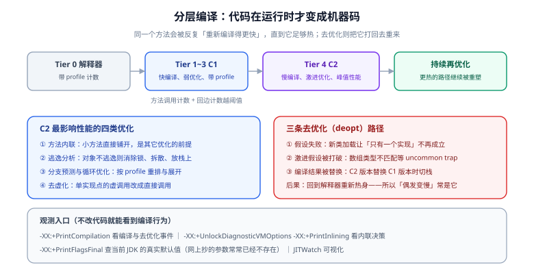

# JIT 与分层编译

Java 的「一次编写、到处运行」是靠解释执行字节码实现的，但它的**峰值性能**来自另一件事：运行期把热点字节码编译成针对当前 CPU 的机器码。这意味着同一个方法在你程序运行的不同时刻是**不同的东西**——先是解释执行，然后被 C1 编译一次，再被 C2 编译一次，还可能被「打回重来」。不理解这个过程，就无法解释三件最常见的现象：为什么需要预热、为什么「偶发变慢」、为什么微基准容易骗人。



## 1. 一句话理解分层编译

**HotSpot 不会一上来就用最强的编译器。** 它先用便宜的编译器快速把代码变快，同时收集「这段代码实际怎么执行」的 profile 数据；等确认某个方法足够热、且 profile 有价值，再用最贵的编译器（C2）做激进优化。这个「分级」设计要解决的是矛盾：C2 编译慢、耗内存，但生成的代码快；如果对所有方法都用 C2，光是编译本身就会拖垮启动。

| 层 | 编译器 | 特点 | 触发条件（简） |
| --- | --- | --- | --- |
| **Tier 0** | 解释器 | 最慢，但顺带做方法调用与循环回边的计数 | 一开始所有方法都在这层 |
| **Tier 1** | C1 | 编译快、优化弱，**不带** profile | 极简方法，被判定不需要 profile 时 |
| **Tier 2** | C1 | 带基础 profile（方法/循环计数） | 中等热度的过渡层 |
| **Tier 3** | C1 | 带完整 profile（含分支、类型） | 主流过渡层，绝大多数方法会先到这里 |
| **Tier 4** | C2 | 编译慢、优化激进、峰值性能 | 方法调用与回边计数越过阈值后 |

::: tip 为什么要知道这些层次
**因为你观测到的性能取决于「测量时它停在哪一层」。** 一个只跑几百次的方法可能一直停在 Tier 3（C1 编译后又降级回解释器都有可能），而 JMH 会把它推到 Tier 4。线上偶发的「第一次慢、之后快」也常是层间的迁移过程。看到 `-XX:+PrintCompilation` 输出里同一个方法出现多次（编译、再编译、去优化），不要意外——那是设计行为。
:::

可以用参数把编译停在某一层，做「验证某个优化是否来自 C2」的对照实验：

```shell
# 只允许到 C1（诊断用，绝不要留在生产）
java -XX:TieredStopAtLevel=1 -jar app.jar

# 完全关闭编译，纯解释执行（只用于定位「是不是编译引入的问题」）
java -Xint -jar app.jar
```

## 2. 内联：几乎所有其它优化的前提

C2 最重要的优化是**方法内联**——把被调用方法的字节码直接铺进调用点。内联本身不省多少时间，但它**打开了后续优化的门**：只有内联之后，编译器才能做常量传播、分支消除、逃逸分析、锁消除、去虚化。所以「一个方法没被内联」往往意味着它上面的一整串优化都没发生。

| 维度 | 说明 |
| --- | --- |
| 阈值 | `-XX:MaxInlineSize`（默认约 35 字节码）、`-XX:FreqInlineSize`（热方法上限，默认约 325 字节码） |
| 为什么小方法更容易被内联 | 内联是按**字节码大小**决策的，不是按行数 |
| 常见反例 | 一个 getter 因为带了 `try` / 多层嵌套 / 链式调用而变得超过阈值，导致外层的逃逸分析失效 |
| 单向阀 | `@CompilerControl(CompilerControl.Mode.INLINE / DONT_INLINE)` 可以做内联与否的对照实验 |

```shell
# 看内联决策（需要诊断参数）
java -XX:+UnlockDiagnosticVMOptions -XX:+PrintInlining -jar app.jar | head -50
```

```text
                              @ 12  java.lang.String::length (6 bytes)   inline (hot)
                              @ 18  com.example.OrderService::validate (412 bytes)   too big
   @ 25  com.example.OrderService::calculate (28 bytes)   inline (hot)
```

::: danger 「为了减少一次方法调用而把方法拆碎」是反向优化
把一个大方法拆成十几个 private 小方法**有助于**内联（每个都更小、更容易达到阈值）；反过来，为了「减少调用开销」把逻辑都塞进一个超大方法，会让它自己无法被内联到调用方，外层那一整串优化也一起消失。**代码可读性与 JIT 友好度在这里是一致的**，不必牺牲前者。
:::

## 3. 去优化（Deoptimization）：为什么「偶发变慢」常常是它

C2 的优化建立在**运行时假设**上，假设一旦被打破，JVM 必须把已经编译好的机器码作废，退回解释执行重新收集 profile。这条路径叫去优化，它有三个主要来源：

| 来源 | 典型场景 | 表现 |
| --- | --- | --- |
| **类型假设失败** | 编译时某接口只有一个实现（虚拟调用被直接化），之后加载了第二个实现类 | 该方法的编译版本作废，短时间内变慢 |
| **uncommon trap** | 分支预测里「几乎不可能发生」的那条路径真的发生了（数组类型不匹配、null 检查等） | 掉回解释器，该次执行极慢 |
| **替换编译结果** | C1 版本被 C2 版本替换（正常升级），或反之内联树被重组 | `-XX:+PrintCompilation` 里同一方法出现多次 |

观测与确认：

```shell
# 打印编译与去优化事件；带 % 的行是去优化标记
java -XX:+PrintCompilation -jar app.jar | grep -E "made not entrant|made zombie"
```

```text
   1234  456 %     3       com.example.OrderService::calculate @ 25 (108 bytes)   made not entrant
```

::: warning 「每隔一段时间慢一次」的三种可能，先分清再动手
1. **GC**：周期性、与堆活跃量相关。用 GC 日志或 JFR 对齐时间点即可确认（见 [JVM · 垃圾收集器](../../Java/JavaSE/JVM/GcCollector/index.md)）。
2. **去优化**：通常发生在「新类加载 / 新代码路径首次执行」之后，属于一次性事件，不是周期性。
3. **定时任务 / 连接池重建 / 缓存集体过期**：与时间点严格对齐，查应用日志即可。

**先做时间对齐（把慢请求的时间戳与三类日志放在一起看），再决定去查哪一个。** 顺序反了就会变成「一边猜一边改参数」。
:::

## 4. 预热：为什么「刚启动的 JVM 很慢」

从进程启动到达到稳定性能，要依次完成：类加载与校验 → 解释执行 → C1 编译 → C2 编译 → profile 收敛。这个过程叫预热（warmup），它是 **Java 服务「刚发布完的一段时间延迟偏高」的根本原因**，也是压测必须丢弃前一段时间样本的原因。

| 手段 | 做了什么 | 适用场景 |
| --- | --- | --- |
| 预热流量 / 预热脚本 | 启动后主动打一段真实流量，把热点方法推到 C2 | 服务发布后短暂延迟升高，可接受少量额外资源 |
| AppCDS / 动态 CDS | 把类加载与链接的结果缓存起来，减少启动期 CPU 争夺 | 启动慢为主、稳定后性能没问题 |
| **AOT cache**（JDK 24/25） | 缓存类 + **方法 profile**，让 JIT 在启动时就能按 profile 编译 | 想要「启动即接近稳态」，见下一节 |
| native-image（GraalVM） | 构建期直接编译成本地可执行文件，无 JIT | 对启动时间极敏感（CLI、Serverless），愿意换掉一些动态能力 |

## 5. AOT cache：把「预热」搬到上一次运行里（JDK 24 起）

思路很直白：**既然预热的关键是「让 JIT 看到足够多的真实执行数据」，那就把上次运行看到的数据存下来，下次直接加载。** JDK 24 用 JEP 483 缓存了类加载与链接的结果；JDK 25 用 JEP 515 把**方法 profile** 也放了进去，于是 C2 可以在应用刚启动时就按 profile 直接编译——不必再从零收集。

```shell
# JDK 25：一步生成（JEP 514 简化后的写法）
# 训练运行：跑一段有代表性的流量，退出时写出缓存
java -XX:AOTCacheOutput=app.aot -Xms2g -Xmx2g -jar app.jar

# 部署运行：加载缓存
java -XX:AOTCache=app.aot -Xmx2g -jar app.jar

# 想确认缓存是否真的被用上
java -XX:AOTCache=app.aot -XX:AOTMode=on -jar app.jar
```

三条效果与约束（官方口径）：

- `-XX:AOTMode=on` 会在 JVM 无法按预期使用缓存时报错，适合在 CI 里当**「缓存有效性」的断言**用，而不是只发个警告。
- 官方基准里，AOT cache 让若干主流框架应用的**启动时间下降约 50%~70%**；加入方法 profile 后，预热到峰值的时间进一步缩短（简单 Stream 程序启动性能提升约 19%，而缓存体积只增加约 2.5%）。
- **一步生成会吃双倍堆**：生成缓存时的子调用会用一个与训练运行同样大小的堆。命令行写了 `-Xms2g -Xmx2g`，这个流程实际需要约 4GB 可用内存。资源紧张的环境应改用两步（训练产 `aotconf` → 单独装配出 `aot`）。

::: danger AOT cache 的适用条件（不满足会静默失效）
官方给出的一致性与适用条件，逐条看：

1. **训练运行与生产运行必须用同一 JDK 版本、同一架构与操作系统**。
2. **训练运行的行为要和生产接近**：训练时最热的方法，生产里也应当是最热的，否则缓存的 profile 反而误导编译器。
3. **类路径要以 JAR 列表形式给出**，不要用目录、通配符、嵌套 JAR；生产类路径必须是训练类路径的超集。
4. **jar 的时间戳要跨运行保持一致**（很多构建系统每次生成的时间戳不同，会让缓存失效）。
5. 不要用会调用 `AddToBootstrapClassLoaderSearch` / `AddToSystemClassLoaderSearch` 的 JVMTI agent。

**JEP 544（AOT Code Compilation）是这条线的下一步**：把「编译本身」也提前——缓存里直接放优化过的本地代码。它仍在推进中，目标版本以 OpenJDK 页面为准，不要在文章里写成已交付。
:::

## 6. 一个必须更新的认知：Graal JIT 已经不在 JDK 里

网络上流传的「把 C2 换成 Graal JIT 可以更快」在今天的 JDK 上**已经无法照做**：

- 可选的实验性 **Graal JIT 编译器在 JDK 25 已被移除**。`-XX:+UseJVMCICompiler` 这类配置在 JDK 25+ 上不再成立。
- Graal 目前对绝大多数团队可见的形态是 **GraalVM 的 native-image**（AOT 编译成本地可执行文件），它解决的是**启动时间与内存占用**，而不是「替换 JIT 提升峰值吞吐」。

::: tip 选型上怎么理解这件事
如果你的诉求是「启动快、内存小」（CLI 工具、Serverless、短生命周期容器）→ 考虑 native-image 或 JDK 25 的 AOT cache。
如果你的诉求是「长时间运行的吞吐」→ 优化方向在 C2 的可见行为（内联、逃逸分析、去优化）与你的代码本身，而不是换编译器。
:::

## 7. 常用观测参数速查

| 参数 | 看什么 | 注意 |
| --- | --- | --- |
| `-XX:+PrintCompilation` | 编译事件、去优化（`%`、`made not entrant`） | 输出量大，建议重定向到文件后分析 |
| `-XX:+UnlockDiagnosticVMOptions -XX:+PrintInlining` | 内联决策（`inline (hot)` / `too big`） | 需配合 `PrintCompilation` 才完整 |
| `-XX:+PrintFlagsFinal -version` | **当前 JDK 的真实默认值** | 抄参数前必须先看这里，很多老参数已作废 |
| `-XX:+LogCompilation` + JITWatch | 可视化编译与内联树 | 日志体积大，只在本地做 |
| `-XX:+PrintEscapeAnalysis` / `-XX:+PrintEliminateAllocations` | 逃逸分析与分配消除是否发生 | 诊断级，见 [分配与内存效率](../AllocationOptimize/index.md) |

```shell
# 打出与编译相关的最终参数值
java -XX:+PrintFlagsFinal -version 2>&1 | grep -iE "inline|compilethreshold|tiered"
```

## 8. 验证方式

1. **能看到层次迁移**：给一个方法写一个跑 1 万次的小程序，加 `-XX:+PrintCompilation`，应当依次看到它被 C1、C2 编译（或至少出现一次编译事件）；把循环次数改成 10 次，编译事件应当消失——这证明你确实在观察 JIT 而不是在猜。
2. **能观察到去优化**：写一段「先只加载实现类 A、之后加载实现 B」的代码，在第二次加载后应看到 `made not entrant` 事件。
3. **内联决策可见**：用 `-XX:+PrintInlining` 找到一条 `too big` 的记录，把该方法拆小后重跑，确认它变成 `inline (hot)`。
4. **AOT cache 生效**：训练运行产出 `app.aot` 后用 `-XX:AOTMode=on` 启动，JVM 不报错即为缓存按预期使用；把 `app.aot` 删掉再跑同一命令，应当报错——**这一步是在验证你的断言有牙齿**。
5. **对参数的说法做现场核对**：任何「某参数默认值是 X」的说法，都用 `-XX:+PrintFlagsFinal` 在你手上的 JDK 上确认一次。

## 相关文档

- [JMH 基准测试](../JmhBenchmark/index.md)：预热、Fork、死代码消除在基准测试里的具体处理
- [分配与内存效率](../AllocationOptimize/index.md)：逃逸分析与标量替换的细节
- [锁与并发原语的性能](../LockOptimize/index.md)：锁消除、去虚化对同步代码的影响
- [JVM 基础 · 类加载机制](../../Java/JavaSE/JVM/ClassLoading/index.md)：类型假设与去优化背后的类加载时机
- [JVM 基础 · 故障排查](../../Java/JavaSE/JVM/Troubleshoot/index.md)：从现象出发的排障路径

## 参考资料

- JEP 483: Ahead-of-Time Class Loading & Linking：https://openjdk.org/jeps/483
- JEP 514: Ahead-of-Time Command-Line Ergonomics：https://openjdk.org/jeps/514
- JEP 515: Ahead-of-Time Method Profiling：https://openjdk.org/jeps/515
- JEP 544: Ahead-of-Time Code Compilation（在途）：https://openjdk.org/jeps/544
- JDK 25 重要变更（含 Graal JIT 移除的说明）：https://docs.oracle.com/en/java/javase/25/migrate/
- AOT cache 使用指南（Oracle Inside Java）：https://inside.java/2026/01/09/run-aot-cache/
- JITWatch（编译日志可视化）：https://github.com/AdoptOpenJDK/jitwatch
