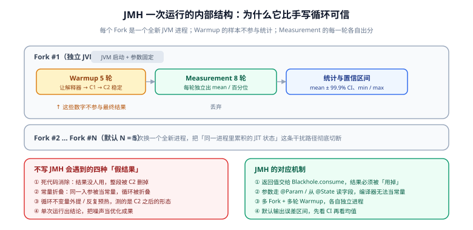

# JMH 基准测试

手写一个 `for` 循环、前后各取一次 `System.nanoTime()`，这是绝大多数「性能对比」的做法，也是绝大多数错误结论的来源。JIT 编译器会把你用来测试的代码删掉、折叠、提前执行、或者干脆不编译它——你测出来的数字可以和真实性能差几十倍。**JMH（Java Microbenchmark Harness）就是官方（OpenJDK）为这件事提供的框架**，它把「预热、隔离进程、防止代码被优化掉、统计误差」这四件事一次性做对。



::: info 适用范围（先明确边界，避免误用）
JMH 只能回答一类问题：**「同一进程内、已完成预热、执行时间在纳秒到微秒级的热代码，A 与 B 谁更快」**。它**不能**回答「接口 QPS 能到多少」「加缓存有没有用」「换 MySQL 版本快不快」——那些是压测与端到端验证的事（见 [性能工程全景](../Overview/index.md)与[网络编程 · 性能基准与压测](../../NetworkProgramming/BenchmarkPractice/index.md)）。用 JMH 的结论去回答端到端问题，是最常见的越界。
:::

## 1. 不写 JMH 会得到的四种「假结果」

| # | 现象 | 机制 | 你会看到什么 |
| --- | --- | --- | --- |
| ① | **死代码消除** | 计算结果没人用，C2 直接把整段计算删掉 | 平白无故「快了几十倍」，甚至快到不合常理 |
| ② | **常量折叠 / 循环不变量外提** | 入参是 `static final` 常量，编译器在编译期就算完了 | 结果与输入规模无关，n=1 和 n=10000 一样快 |
| ③ | **只测到 C2 之后的形态** | 循环跑了几亿次，方法早已被 C2 编译成激进优化版本 | 数字远好于线上真实表现（线上方法可能一直是 C1） |
| ④ | **把噪声当成果** | 单次运行、单次取样的结果本身波动巨大 | 两次运行结果差 2 倍，你却把它当成优化效果 |

::: danger 一个能亲手复现的假结果
下面的代码是**错误示范**：`Math.log` 的入参是编译期常量，C1/C2 会在编译期直接算出结果，循环体会被优化成重复赋值。你会测出「一亿次求对数只要几毫秒」。

```java
// 错误示范：不要这样写基准测试
public class NaiveBenchmark {
    private static final double X = 42.0;   // 常量 → 编译器可折叠

    public static void main(String[] args) {
        long start = System.nanoTime();
        double sum = 0;
        for (int i = 0; i < 100_000_000; i++) {
            sum += Math.log(X);              // 结果没人用 → 可被消除
        }
        System.out.println((System.nanoTime() - start) / 1e6 + " ms, sum=" + sum);
    }
}
```

正确写法是让入参来自**运行期可变的字段**（`@State` 里的实例字段），并让结果被真正**消费**（`Blackhole.consume`）。这两条正是 JMH 帮你强制执行的。
:::

## 2. 最小可运行工程

JMH 官方推荐**独立工程**（独立 module），不要和业务代码混在一个 `src/main` 里。

```xml [pom.xml]
<properties>
  <jmh.version>1.37</jmh.version>
</properties>

<dependencies>
  <dependency>
    <groupId>org.openjdk.jmh</groupId>
    <artifactId>jmh-core</artifactId>
    <version>${jmh.version}</version>
  </dependency>
  <dependency>
    <groupId>org.openjdk.jmh</groupId>
    <artifactId>jmh-generator-annprocess</artifactId>
    <version>${jmh.version}</version>
    <scope>provided</scope>
  </dependency>
</dependencies>

<build>
  <plugins>
    <!-- 用 javac 的 -proc 生成 BenchmarkList，避免手动注册 -->
    <plugin>
      <groupId>org.apache.maven.plugins</groupId>
      <artifactId>maven-compiler-plugin</artifactId>
      <configuration>
        <annotationProcessorPaths>
          <path>
            <groupId>org.openjdk.jmh</groupId>
            <artifactId>jmh-generator-annprocess</artifactId>
            <version>${jmh.version}</version>
          </path>
        </annotationProcessorPaths>
      </configuration>
    </plugin>
    <!-- 打成自包含可执行 jar -->
    <plugin>
      <groupId>org.apache.maven.plugins</groupId>
      <artifactId>maven-shade-plugin</artifactId>
      <executions>
        <execution>
          <phase>package</phase>
          <goals><goal>shade</goal></goals>
          <configuration>
            <finalName>benchmarks</finalName>
            <transformers>
              <transformer implementation="org.apache.maven.plugins.shade.resource.ManifestResourceTransformer">
                <mainClass>org.openjdk.jmh.Main</mainClass>
              </transformer>
            </transformers>
          </configuration>
        </execution>
      </executions>
    </plugin>
  </plugins>
</build>
```

```shell
mvn -q clean verify                # 产物：target/benchmarks.jar
java -jar target/benchmarks.jar -h # 查看全部可用参数
```

用 Gradle 时上 `me.champeau.jmh` 插件即可，插件会自己处理依赖与 task 组织。

::: warning `provided` 不是可选项
`jmh-generator-annprocess` 必须是 `provided`（只在编译期用），否则注解处理器会被打进产物 jar，运行时可能触发重复处理。另一个常见坑是**注解处理器没生效**：症状是运行时提示「No matching benchmarks found」，原因是 `BenchmarkList` 没有生成，此时检查 `annotationProcessorPaths` 是否配在当前模块的编译插件上。
:::

## 3. 一个完整基准：从注解到结果

```java [StringBenchmark.java]
@BenchmarkMode(Mode.AverageTime)            // 每次操作的平均耗时
@OutputTimeUnit(TimeUnit.NANOSECONDS)       // 输出单位
@Warmup(iterations = 5, time = 1)           // 预热 5 轮，每轮 1 秒
@Measurement(iterations = 8, time = 1)      // 测量 8 轮，每轮 1 秒
@Fork(value = 2, jvmArgsAppend = {})        // 两个独立 JVM 进程
@Threads(1)                                 // 单线程（并发测试要显式写清）
@State(Scope.Thread)                        // 状态作用域：每个线程一份
public class StringBenchmark {

    @Param({"8", "64"})                     // 参数化：两种输入规模
    int length;

    private String a;
    private String b;

    @Setup(Level.Trial)                     // 每个 Fork 开始时执行一次
    public void setup() {
        a = "x".repeat(length);
        b = "y".repeat(length);
    }

    @Benchmark
    public String concatWithPlus() {
        return a + b;                       // 返回值交给 JMH 消费
    }

    @Benchmark
    public String concatWithStringBuilder() {
        return new StringBuilder(a.length() + b.length())
                .append(a).append(b).toString();
    }

    @Benchmark
    public String concatWithJoin() {
        return String.join("", a, b);
    }
}
```

```shell
java -jar target/benchmarks.jar StringBenchmark -f 2 -wi 5 -i 8 -t 1
```

典型输出：

```text
Benchmark                        (length)  Mode  Cnt   Score   Error  Units
StringBenchmark.concatWithJoin          8  avgt   16   9.412 ± 0.213  ns/op
StringBenchmark.concatWithJoin         64  avgt   16  14.870 ± 0.402  ns/op
StringBenchmark.concatWithPlus          8  avgt   16   6.105 ± 0.180  ns/op
StringBenchmark.concatWithPlus         64  avgt   16  12.330 ± 0.351  ns/op
StringBenchmark.concatWithStringBuilder 8  avgt   16  11.204 ± 0.276  ns/op
StringBenchmark.concatWithStringBuilder 64  avgt   16  15.902 ± 0.388  ns/op
```

::: warning 示例数字是占位，不要引用
上面的数字仅用于说明输出格式（列名、单位、`Cnt` = 样本数）。**真实数值随 JDK 版本、CPU 型号、String 内部实现而变**——`a + b` 在 JDK 9 之后由 `invokedynamic`/`StringConcatFactory` 生成，与 JDK 8 的 `StringBuilder` 展开完全不同，因此「+ 比 StringBuilder 慢」这条老结论在新 JDK 上常常反过来。跑你自己的机器，才有利于用结论。
:::

## 4. 注解体系：每个注解管什么

| 注解 | 作用 | 关键取值 |
| --- | --- | --- |
| `@Benchmark` | 标记被测方法 | 只能标在 public 方法上 |
| `@BenchmarkMode` | 测量模式 | `Throughput` / `AverageTime` / `SampleTime` / `SingleShotTime` / `All` |
| `@OutputTimeUnit` | 输出时间单位 | `NANOSECONDS` / `MICROSECONDS` / `MILLISECONDS` |
| `@Warmup` / `@Measurement` | 预热与测量轮数、时长、批大小 | `iterations` / `time` / `timeUnit` / `batchSize` |
| `@Fork` | 独立 JVM 进程数 | `value`（默认 1）、`jvmArgsAppend`（逐组参数对照）、`jvmArgsPrepend` |
| `@Threads` | 并发线程数 | 并发场景**必须显式写**，别依赖默认 |
| `@State` | 状态对象作用域 | `Thread` / `Benchmark` / `Group` |
| `@Setup` / `@TearDown` | 状态生命周期 | `Trial` / `Iteration` / `Invocation` |
| `@Param` | 参数化组合 | 会与其它 `@Param` 做笛卡尔积 |
| `@Group` / `@GroupThreads` | 多角色并发（生产者-消费者） | 组内所有 `@Benchmark` 同轮次同步执行 |
| `@OperationsPerInvocation` | 声明「一次调用等于 N 次操作」 | 结果自动除以 N |
| `@CompilerControl` | 强制内联 / 禁止内联 / 禁止编译 | 用于「验证某个优化是否来自内联」的对照实验 |

### 模式怎么选

| 模式 | 输出 | 什么时候用 |
| --- | --- | --- |
| `Throughput` | ops/time | 关心**单位时间能处理多少**（服务端热路径） |
| `AverageTime` | time/op | 关心**单次平均耗时**，最常用 |
| `SampleTime` | 直方图 + 百分位（p0.50 / p0.95 / p0.99 / p0.999） | **关心长尾**时用它，而不是看 `AverageTime` 猜 |
| `SingleShotTime` | 单次耗时（`@Warmup(iterations = 0)`） | 测冷启动 / 首次执行成本 |
| `All` | 以上全部 | 摸清分布形态（代价是运行时间变长） |

```shell
# 关心长尾：用 SampleTime 直接拿到百分位
java -jar target/benchmarks.jar StringBenchmark -bm sample -f 2 -wi 5 -i 8
```

```text
Benchmark                 (length)  Mode   Cnt    Score     Error  Units
StringBenchmark.concatWithPlus   64  sample  5812  12.410 ±  0.320  ns/op
StringBenchmark.concatWithPlus   64  sample       p0.50  p0.90  p0.95  p0.99  p0.999  p1.00
StringBenchmark.concatWithPlus   64  sample        11.9   13.4   14.6   18.2   41.7   62.3
```

::: tip `-prof gc` 是最被低估的一个开关
```shell
java -jar target/benchmarks.jar StringBenchmark -prof gc
```
它会在结果里附上 `gc.alloc.rate.norm`（**每次操作分配多少字节**）。做一个「零分配」优化时，用一整轮 JMH 换来一行 `0.000 B/op`，比费劲看堆快照可信得多。
:::

## 5. `@State`：JMH 里最容易写错的一处

`@State` 决定「这份数据被谁共享」，它直接改变测量结果：

| 作用域 | 语义 | 陷阱 |
| --- | --- | --- |
| `Scope.Thread` | 每个线程一份实例 | 想测**共享数据上的竞争**时用它，测出来的会偏乐观 |
| `Scope.Benchmark` | 所有线程共用一份 | 测并发写共享对象时的正确选择；单线程下与 `Thread` 无差别 |
| `Scope.Group` | 同一 `@Group` 内共用一个实例 | 生产者-消费者模型的载体 |

```java [CounterBenchmark.java]
@BenchmarkMode(Mode.Throughput)
@OutputTimeUnit(TimeUnit.SECONDS)
@Warmup(iterations = 3, time = 1)
@Measurement(iterations = 5, time = 1)
@Fork(2)
@Threads(8)
@State(Scope.Benchmark)                     // 8 个线程抢同一个计数器
public class CounterBenchmark {

    private AtomicLong atomicLong;
    private LongAdder longAdder;

    @Setup(Level.Trial)
    public void setup() {
        atomicLong = new AtomicLong();
        longAdder = new LongAdder();
    }

    @Benchmark
    public long atomic() {
        return atomicLong.incrementAndGet();
    }

    @Benchmark
    public void adder() {
        longAdder.increment();              // 无返回值：JMH 允许 void 方法
    }
}
```

::: danger `@State(Scope.Benchmark)` 与 `@Threads` 是一对
只写 `@Threads(8)` 而 `@State` 用了 `Scope.Thread`，8 个线程各自操作**各自的**对象，你测到的是「单线程性能 × 8」，而不是并发性能。**并发基准里，状态作用域写错 = 结论完全无效**，且不会报任何错。
:::

## 6. 结果的读法与对比方法

结果表的关键列：

| 列 | 含义 | 怎么用 |
| --- | --- | --- |
| `Score` | 该模式下的得分 | `avgt` 越小越好、`thrpt` 越大越好 |
| `Error` | **99.9% 置信区间的半宽** | 判断差异是否真实，见下 |
| `Cnt` | 参与统计的样本数 | 过小说明轮数/时长不够 |
| `Units` | 单位 | 对比两个基准前先确认单位一致 |

**比较规则**：`|Score_A − Score_B| > Error_A + Error_B` 时才认为差异可能是真的；差值小于这个量级时，最稳妥的结论是「在当前噪声下无法区分」。这比「A 比 B 快 3%」之类的精确结论诚实得多。

```shell
# 机器可读结果，便于进 CI 做趋势对比
java -jar target/benchmarks.jar StringBenchmark -rf json -rff jmh-result.json -foe true
```

`-foe true` 让基准里出现异常时直接失败——在 CI 里这是必需的，否则一个抛异常的基准会被安静地跳过。

::: warning 基准进 CI 的三条纪律
1. **不要在共享 CI runner 上做「绝对值」门禁**：云主机有邻居噪声、CPU 型号不固定。CI 里只做**相对比较**（同一台 runner、同一次任务内跑 A 与 B），或只把结果作为趋势记录。
2. **必须固定 `-f`、`-wi`、`-i`**：参数换一个，历史数据就不可比。
3. **别把 JMH 当回归门禁的唯一依据**：热代码的微基准回答不了端到端，真正的回归门禁在压测侧。
:::

## 7. 验证方式

1. **框架真的生效**：`java -jar target/benchmarks.jar -l` 能列出你的全部基准；`-h` 能打出参数说明。
2. **死代码消除已被防住**：把 `@Benchmark` 方法的返回值从「被消费」改成「丢弃」，观察分数是否出现数量级变化——如果不变，说明你的方法没被优化掉，测量是可信的。
3. **噪声量级已知**：对**同一个**基准连续跑两遍（不改任何代码），记录两次 `Score` 的差值。这个差值就是你这台机器当前的本底噪声；后续任何小于它的「优化成果」都不算数。
4. **参数对照可复现**：用 `@Fork(value = 2, jvmArgsAppend = {"-XX:+UseCompactObjectHeaders"})` 与不带的版本做一组对照，确认你把「JVM 参数」这一维也当成了实验变量。
5. **分配量可读**：`-prof gc` 输出里能看到 `gc.alloc.rate.norm` 一列，做零分配优化时必须让它变成 `0.000 B/op`。

## 相关文档

- [性能工程全景](../Overview/index.md)：JMH 只覆盖其中「热代码差异」这一格
- [JIT 与分层编译](../JitCompiler/index.md)：理解为什么预热、Fork、死代码消除这三件事必须处理
- [剖析工具链：JFR 与 async-profiler](../Profiling/index.md)：端到端定位用的工具，与 JMH 分工明确
- [网络编程 · 性能基准与压测](../../NetworkProgramming/BenchmarkPractice/index.md)：端到端与网络侧的指标与脚本
- [工具 · 测试工具](../../../Tools/TestingTools/index.md)：k6 / JMeter 的用法与选型

## 参考资料

- JMH 官方仓库（含 `jmh-samples` 全套样例，必读）：https://github.com/openjdk/jmh
- JMH 样例目录（从 `JMHSample_01_HelloWorld` 顺序读完）：https://github.com/openjdk/jmh/tree/master/jmh-samples/src/main/java/org/openjdk/jmh/samples
- JMH 注解手册（`jmh-core` Javadoc）：https://javadoc.io/doc/org.openjdk.jmh/jmh-core/latest/index.html
- Gradle JMH 插件：https://github.com/melix/jmh-gradle-plugin
