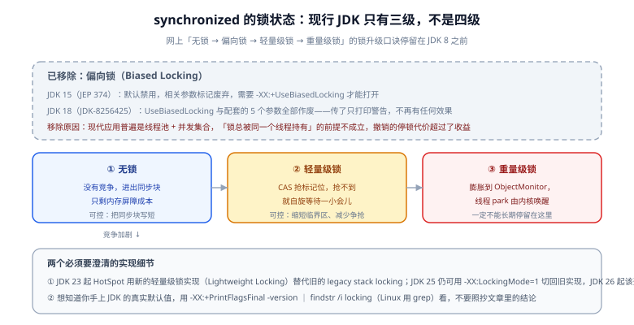

# 锁与并发原语的性能

并发代码的性能问题几乎从不来自「锁太多」，而来自**三类具体的东西**：锁被高频争抢（线程排队 park/unpark）、临界区太长（排队的线程越攒越多）、以及根本不是锁的问题而是缓存行伪共享。这一页先纠正一个到处在传的过期结论，再给出「在同一份数据上，几种同步方式分别贵在哪」的判断表。



## 1. 先纠正：现行 JDK 没有偏向锁

网上流传的「锁升级四阶段：无锁 → 偏向锁 → 轻量级锁 → 重量级锁，偏向锁最快」是 **JDK 8 时代的结论**，今天已经不成立：

| 版本 | 变化 |
| --- | --- |
| **JDK 15** | JEP 374：偏向锁**默认禁用**，`UseBiasedLocking` 与配套的 `BiasedLockingStartupDelay`、`BiasedLockingBulkRebiasThreshold`、`BiasedLockingBulkRevokeThreshold`、`BiasedLockingDecayTime`、`UseOptoBiasInlining` 等参数标记为废弃，需要显式 `-XX:+UseBiasedLocking` 才开启 |
| **JDK 18** | JDK-8256425：上述参数**全部作废（obsoleted）**——命令行里传了只会打印一条 obsolete 警告，不再有任何效果 |
| **JDK 23** | HotSpot 用新的轻量级锁实现（**Lightweight Locking**）替代旧的 legacy stack locking；`-XX:LockingMode=1` 可临时切回旧实现 |
| **JDK 26** | `-XX:LockingMode=1` 已不可用，旧实现彻底退场 |

**移除的理由值得记住**：偏向锁假设「同一个锁总是被同一个线程持有」，而现代应用普遍是线程池 + 并发集合，这个前提在多数服务里不成立；撤销偏向需要**全局安全点停顿**，带来的延迟抖动超过了它省下的几次 CAS。

```shell
# 想知道你手上 JDK 的真实状态，永远用这条命令（不要照抄文章）
java -XX:+PrintFlagsFinal -version 2>&1 | grep -iE "biased|lockingmode"
```

::: danger 因此有三条结论要更新
1. **面试题式的「偏向锁 → 轻量级锁」不是现行 JDK 的路径**，现行是**无锁 → 轻量级锁 → 重量级锁**三级。
2. **不要再去调 `-XX:+UseBiasedLocking`**：在 JDK 18+ 上它毫无作用。
3. **JDK 8 上的锁性能结论不能平移到现在**：C2 对 `synchronized` 的优化、CAS 指令成本的降低，都改变了当年的取舍。
:::

## 2. 几种同步方式的代价模型

| 方式 | 无竞争时 | 有竞争时 | 关键取舍 |
| --- | --- | --- | --- |
| `synchronized` | 极低（仅剩内存屏障） | 膨胀为重量级锁后线程 park，**微秒级起** | **能被 JIT 优化**：锁消除、锁粗化，显式锁享受不到 |
| `ReentrantLock` | 一次 CAS，略高于 `synchronized` | AQS 队列 + `LockSupport.park` | 可中断、可超时、可多条件变量、可选公平 |
| `ReentrantReadWriteLock` | 读写分离 | 非公平模式下**写线程可能饥饿**；公平模式吞吐明显下降 | 只在「读远多于写且临界区不短」时才划算 |
| `StampedLock` | **乐观读无 CAS**（读后校验 stamp） | 悲观模式排队 | 不可重入、不支持条件变量、`tryOptimisticRead` 之后必须校验 |
| `AtomicLong` 等 CAS 原语 | 一条 CAS 指令 | **所有线程抢同一个缓存行**，成为竞争点 | 单点计数在 8 线程以上会显著退化 |
| `LongAdder` | 一次哈希选 cell，再 CAS | 分散到多个 cell，冲突概率大幅降低 | `sum()` **不保证原子**；内存占用更高 |
| 无锁 / 分片 | 视实现 | 取决于冲突模型 | 复杂度与正确性成本最高，最后才考虑 |

::: tip `synchronized` 在现代 JDK 上没有被淘汰
它有两个别人没有的优势：**① JIT 可以做锁消除**（逃逸分析判定对象只在单线程可见时，同步直接被去掉，连一次 CAS 都不剩）；**② 可以锁粗化**（相邻的同一把锁合并成一次加锁）。显式锁是 Java 代码实现的，编译器看不到它的语义，这两条都做不到。

所以正确的默认选择仍然是：**能用一个短临界区的 `synchronized` 解决，就用它**；只有在需要超时、可中断、公平、多条件变量时，才上 `ReentrantLock`。
:::

## 3. `AtomicLong` 与 `LongAdder`：一个具体的竞争模型

```java
// 高并发累加计数：AtomicLong 是所有线程抢同一条缓存行
private final AtomicLong atomic = new AtomicLong();
public void incAtomic() { atomic.incrementAndGet(); }

// LongAdder 把计数分散到多个 cell，各自 CAS，读时才汇总
private final LongAdder adder = new LongAdder();
public void incAdder() { adder.increment(); }
public long current() { return adder.sum(); }   // 不是原子快照
```

| 维度 | `AtomicLong` | `LongAdder` |
| --- | --- | --- |
| 并发写吞吐 | 线程越多退化越明显 | 显著更高（分散竞争） |
| 读成本 | `get()` 一条读 | `sum()` 要遍历所有 cell，**读贵** |
| 语义差异 | 精确读值 | `sum()` 结果是「某个瞬间的近似总和」，并发读时不是线性一致 |
| 内存占用 | 一个对象 | 一个 cell 数组（高并发下会扩容） |
| 适用 | 读多写少、需要精确值、需要返回值（如自增 ID） | 高并发计数、**写多读少**的指标统计 |

::: warning `sum()` 不是精确值，别用它做业务判断
`LongAdder.sum()` 在并发更新期间可能读到「部分已汇总」的结果。用它做**监控指标**没问题，用它做**扣减库存、校验额度、生成序列号**就是缺陷。需要精确值就用 `AtomicLong`，或把这段逻辑放到单点（队列 / 数据库）。
:::

## 4. 锁粒度：细化、粗化与分片

| 手段 | 做什么 | 什么时候用 | 代价 |
| --- | --- | --- | --- |
| **缩小临界区** | 把不共享的计算、IO、日志移到锁外面 | 永远的第一步 | 需要确认移出去的部分确实不需要锁 |
| **降低锁的持有时间** | 避免在锁内做序列化、HTTP 调用、文件写 | 见到就改 | 无 |
| **锁分段 / 分片锁** | 按 key 哈希到 N 个锁，各自独立 | 有天然的 key 维度（用户、商品、会话） | 需要处理跨分片的一致性 |
| **读写分离** | 读用读锁、写用写锁 | 读远多于写且临界区不短 | 写饥饿、公平性下降 |
| **乐观读** | `StampedLock.tryOptimisticRead` + 校验 | 读多写极少、能接受重试 | 校验失败要重试，代码更绕 |
| **单点化** | 把并发更新改成队列串行处理 | 冲突无法通过分片解决（如全局库存） | 引入队列与背压，延迟上升 |

```java
// 按 key 分片锁：把「一把大锁」换成「N 把互不相干的小锁」
public class StripedLocks {
    private static final int N = 64;
    private final Object[] locks = new Object[N];

    public StripedLocks() {
        for (int i = 0; i < N; i++) locks[i] = new Object();
    }

    public void withLock(Object key, Runnable action) {
        Object lock = locks[Math.floorMod(key.hashCode(), N)];
        synchronized (lock) { action.run(); }
    }
}
```

::: danger 三个「看起来在优化、实际在制造长尾」的写法
1. **在锁内做日志与序列化**：日志框架的格式化、JSON 序列化都会分配并在内部加锁，把临界区从几微秒拉到几百微秒。
2. **锁顺序不一致**：两处代码用不同的顺序获取 A、B 两把锁，虽然不一定死锁，但会让线程互相等待，表现为「偶发的秒级长尾」。**约定全局锁顺序**（如按 ID 排序）是唯一可靠的解法。
3. **把 `ConcurrentHashMap` 当万能锁用**：它保证的是单次操作原子，不是「读-改-写」复合操作原子。这种场景要用 `compute` / `merge` 的原子语义，或自建分片锁。
:::

## 5. 与虚拟线程的交互（JDK 24 起）

JDK 21 引入虚拟线程时有一个著名的限制：在 `synchronized` 块里阻塞会**钉住（pin）载体线程**，吞吐因此大打折扣。**JEP 491 在 JDK 24 交付，消除了 `synchronized` 造成的钉住**——虚拟线程在 `synchronized` 中阻塞时会释放其载体平台线程。

这带来两个实务结论：

- **在 JDK 24+ 上，不必为了虚拟线程把 `synchronized` 全改成 `ReentrantLock`**。这条「必须改」的建议属于 JDK 21 时期。
- 钉住并未完全消失：**本地方法（JNI）与部分 JDK 内部实现仍可能导致钉住**。用 JFR 的虚拟线程事件或 `-Djdk.tracePinnedThreads` 观察是否还有钉住（具体参数与能力以目标 JDK 的官方说明为准）。

## 6. 观测：怎么知道瓶颈真的是锁

| 手段 | 命令 / 做法 | 看什么 |
| --- | --- | --- |
| 线程栈采样 | 连续 `jstack <pid>` 若干次，比较同一线程的栈 | 多次都停在 `BLOCKED` / `WAITING` 同一行 → 锁竞争 |
| 锁剖析 | `asprof -e lock -d 30 -f lock.html <pid>` | 锁等待（含原生锁）的热点位置 |
| 墙上时间剖析 | `asprof -e wall -d 30 -f wall.html <pid>` | **等待时间**在整体中的占比 |
| JFR | 录制后看 `jdk.JavaMonitorEnter` / `jdk.JavaMonitorWait` 事件 | 竞争次数、持有时长 |
| 快速对照 | 把并发从 1 调到 8、16，看 P99 变化曲线 | 线性扩展失效的点就是竞争开始的位置 |

```shell
# 先看线程在等什么
jcmd <pid> Thread.print | grep -A 3 "java.lang.Thread.State: BLOCKED" | head -30

# 再用锁剖析定位到具体代码位置
asprof -e lock -d 30 -f lock.html <pid>

# JFR 录制带锁事件
jcmd <pid> JFR.start name=lockprof duration=60s filename=lock.jfr settings=profile
jcmd <pid> JFR.dump name=lockprof filename=lock.jfr
```

::: tip 一个反直觉的判据
**并发数上升而吞吐不再上升（甚至下降），同时 CPU 使用率也没有打满**，几乎可以断定是同步/等待类问题（锁、连接池、缓存行），而不是算力不足。此时加机器不会解决问题，只会让排队更长。
:::

## 7. 验证方式

1. **扩展性曲线**：同一段逻辑在 1 / 2 / 4 / 8 线程下各跑一轮，记录吞吐。**理想是线性、合格是次线性、出现下降就一定有竞争点**。这条曲线比任何单点数字都有说服力。
2. **锁持有时间可测**：在临界区入口与出口打时间戳统计（或用 JFR 的 monitor 事件），确认最长持有时长。经验上超过 1ms 的临界区就应当先拆。
3. **`LongAdder` 的收益可量化**：把 `AtomicLong` 与 `LongAdder` 放进同一个 JMH 基准，`@Threads(8)` + `@State(Scope.Benchmark)`，对比吞吐差异；差异小于噪声就说明当前并发度还不需要它。
4. **锁顺序约定可检查**：搜索代码中同时获取两把锁的位置，确认顺序一致；这一步是「查得到」的检查，不是靠运气。
5. **虚拟线程不再被钉住**：在 JDK 24+ 上用虚拟线程跑一段含 `synchronized` 阻塞的负载，确认吞吐没有出现「虚拟线程数很多但只跑满几个平台线程」的形态。

## 相关文档

- [分配与内存效率](../AllocationOptimize/index.md)：伪共享与缓存行，锁竞争之外的另一半
- [剖析工具链：JFR 与 async-profiler](../Profiling/index.md)：锁剖析的具体用法
- [Java 并发 · synchronized 与 Lock](../../Java/JavaSE/Multithreading/SynchronizedLock/index.md)：并发原语的正确用法
- [Java 并发 · 并发工具类](../../Java/JavaSE/Multithreading/ConcurrentUtils/index.md)：`CountDownLatch`、`Semaphore`、`CompletableFuture`
- [Java 集合 · 并发集合](../../Java/JavaSE/Collection/Concurrent/index.md)：`ConcurrentHashMap` 的分段演进与原子复合操作
- [JVM 基础 · 内存结构](../../Java/JavaSE/JVM/MemoryStructure/index.md)：锁与对象头、线程栈的关系

## 参考资料

- JEP 374: Deprecate and Disable Biased Locking：https://openjdk.org/jeps/374
- JDK 18 发布说明（UseBiasedLocking 等参数作废的官方记录）：https://www.oracle.com/java/technologies/javase/18-relnote-issues.html
- JEP 491: Synchronize Virtual Threads without Pinning：https://openjdk.org/jeps/491
- JEP 519 与对象头中的锁标记位（Compact Object Headers）：https://openjdk.org/jeps/519
- `java.lang.LongAdder`（Parlett 的并发计数思路）：https://docs.oracle.com/en/java/javase/25/docs/api/java.base/java/util/concurrent/atomic/LongAdder.html
- async-profiler 锁剖析与墙上时间剖析：https://github.com/async-profiler/async-profiler/blob/master/docs/ProfilerOptions.md
