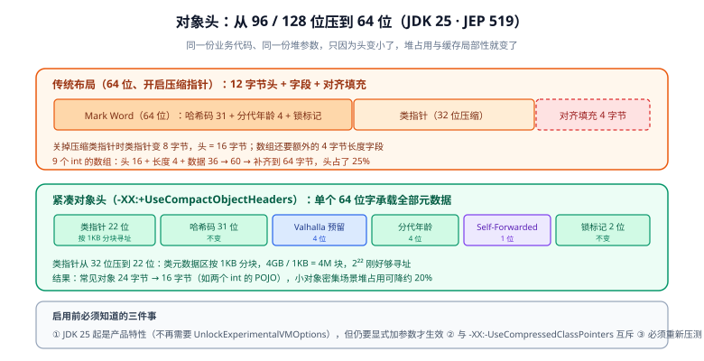

# 对象布局：从对象头到紧凑对象头

「一个 Java 对象占多少内存」这个问题，答案不是「字段加起来」，而是**对象头 + 字段 + 对齐填充**。当你的缓存里躺着一千万个小对象时，头部与填充往往比业务数据本身还大——这就是 JDK 25 要把对象头从 96/128 位压到 64 位的原因（JEP 519，Project Lilliput 的成果）。这一页从布局规则讲到怎么用 JOL 亲眼看到它。



## 1. 一个对象由三部分组成

| 部分 | 内容 | 大小（64 位 HotSpot） |
| --- | --- | --- |
| **对象头（Header）** | Mark Word + 类指针（Klass Pointer） | 压缩指针开启时 12 字节；关闭时 16 字节 |
| **实例字段（Fields）** | 基本类型与实际引用 | 按字段类型累加，受重排与对齐影响 |
| **对齐填充（Padding）** | 让对象总大小成为 8 的倍数 | 0~7 字节 |

数组额外多一个 **4 字节的 length 字段**（所以数组的头是 16 字节）。

### Mark Word：一个「按状态复用」的 64 位字段

Mark Word 的内容**随对象状态变化**，这是它最反直觉的地方：

| 状态 | 内容 |
| --- | --- |
| 未锁定 | 哈希码（31 位，惰性计算）+ 分代年龄（4 位）+ 锁标记（2 位） |
| 被加锁 | 锁记录 / 锁指针 + 锁标记 |
| GC 搬运中 | GC 自转发指针（对象被移动时用它找新地址） |

::: warning 「Mark Word 存的是指向 Lock Record 的指针」这句话已经过期
那套描述属于**旧的 legacy stack locking** 实现：Mark Word 在加锁后变成指向线程栈上 Lock Record 的指针，解锁时用「Displaced Mark Word」副本 CAS 还原。**JDK 23 起 HotSpot 换成了一套新的轻量级锁实现（Lightweight Locking）**，Mark Word 的含义随之变化；旧实现可以用 `-XX:LockingMode=1` 临时切回，但 **JDK 26 起该开关已不可用**。

这也解释了为什么 JDK 25 的紧凑对象头里塞得下那么多东西——它把「锁状态」压缩成 2 个标记位，把复杂的锁数据挪到需要时才分配的辅助结构里。
:::

### 类指针（Klass Pointer）与压缩指针

64 位机器上裸指针是 8 字节，会让每个引用都变大。HotSpot 的做法是**压缩引用（Compressed Oops）**：引用仍然用 4 字节，但只存「字节偏移量 ÷ 8」，寻址时左移 3 位——代价是**对象起始地址必须 8 字节对齐**，这也正是「对象大小总是 8 的倍数」的根本原因。

| 参数 | 作用 | 代价 |
| --- | --- | --- |
| `-XX:+UseCompressedOops` | 压缩对象引用（堆 ≤ 约 32GB 自动开启） | 需要 8 字节对齐 |
| `-XX:+UseCompressedClassPointers` | 压缩类指针（类元数据区限制在 4GB） | **JDK 25 起禁止关闭，JDK 27 起无法关闭** |
| `-XX:ObjectAlignmentInBytes=16` | 把对齐单位提到 16 字节 | 堆上限可提到约 64GB，但每个对象平均多浪费 4 字节 |

## 2. 字段重排：HotSpot 会替你调顺序

**HotSpot 会按字段类型大小重新排列实例字段，把小的放后面，以减少填充浪费。** 重排只发生在**同一个类内部**，父类字段永远排在子类字段之前。

推荐的声明顺序（也是重排后的实际顺序）：

```java
public class WellPacked {
    private long   id;          // 8 字节
    private double amount;      // 8 字节
    private int    status;      // 4 字节
    private char   level;       // 2 字节
    private byte   flag;        // 1 字节
    private boolean active;     // 1 字节
    // 引用在压缩指针下也是 4 字节
    private String name;
}
```

::: tip 一条实用结论
**「按字段大小从大到小声明」在有继承层级时仍然有效**。因为重排不跨父类边界，如果父类以小字段结尾、子类以大字段开头，就会出现填充。把每个类里的大字段放前面，是唯一你自己能控制的动作。
:::

反过来，下面的写法会造成浪费（父类以小字段结尾、子类以长字段开头，或混排小字段）：

```java
class Base {
    byte   flag;     // 1
    boolean active;  // 1 + 6 填充
}
class Sub extends Base {
    long id;         // 又需要 8 字节对齐
    // 实际大小：16（父）+ 8（id）+ 12（头）→ 对齐后 40 字节
    // 把 long 放到父类里或调整声明顺序可以省下数字节
}
```

## 3. 用 JOL 把布局打出来

JOL（Java Object Layout）是 OpenJDK 官方的小工具，用 Unsafe / JVMTI / SA 直接解码真实布局，比按规范推算准确。

```xml [pom.xml]
<dependency>
  <groupId>org.openjdk.jol</groupId>
  <artifactId>jol-core</artifactId>
  <version>0.17</version>
  <scope>provided</scope>
</dependency>
```

```java [LayoutDemo.java]
import org.openjdk.jol.info.ClassLayout;
import org.openjdk.jol.info.GraphLayout;
import org.openjdk.jol.vm.VM;

public class LayoutDemo {
    static class Point { int x; int y; }

    public static void main(String[] args) {
        // 0) 先打印当前 JVM 的指针与对齐情况
        System.out.println(VM.current().details());

        // 1) 单个对象的内部结构
        System.out.println(ClassLayout.parseInstance(new Point()).toPrintable());

        // 2) 一个集合「连同它引用的对象」总共占多少
        var list = new java.util.ArrayList<String>();
        for (int i = 0; i < 1000; i++) list.add(String.valueOf(i));
        System.out.println(GraphLayout.parseInstance(list).toFootprint());
    }
}
```

```text
# 1) 单个对象
com.example.LayoutDemo$Point object internals:
OFFSET  SIZE   TYPE DESCRIPTION      VALUE
     0     4        (object header)   01 00 00 00
     4     4        (object header)   00 00 00 00
     8     4        (object header)   00 00 00 00
    12     4    int Point.x            0
    16     4    int Point.y            0
    20     4        (loss due to the next object alignment)
Instance size: 24 bytes
```

```shell
# 2) 集合连同引用对象的占用（footprint 按类聚合）
java -cp .:jol-core-0.17.jar LayoutDemo
# 期望能看到 java.lang.String / byte[] / Object[] 各自的 COUNT 与 SIZE 占比
```

::: danger JOL 0.17 读不了紧凑对象头
Maven Central 上 `jol-core` 的**最新正式发布版是 0.17（2023-02-27）**，之后长期没有正式发版；仓库主线已到 **0.18-SNAPSHOT**，并在 **2026-01 加入了 JDK 25 兼容修复**（含 Lilliput 布局解析）。

这意味着：**用 0.17 去打印开启了 `-XX:+UseCompactObjectHeaders` 的布局会读错**（它不认识新的头布局）。做紧凑对象头的对照实验时，先确认你用的 JOL 版本支持当前 JDK；不确定就用 `internals-estimates` 命令或按公式手算，并在结论里标注测量工具与版本。
:::

### JOL 命令行工具

```shell
# 打印某一实例的内部结构
java -jar jol-cli.jar internals com.example.LayoutDemo\$Point

# 估算「在开启 / 关闭紧凑对象头时分别多大」
java -jar jol-cli.jar internals-estimates com.example.LayoutDemo\$Point
```

## 4. 紧凑对象头：JDK 25 把 12 字节压成 8 字节

JDK 25 的 JEP 519 把对象头从 **96 位（12 字节）或 128 位（16 字节）压缩到 64 位（8 字节）**。做法是把 Mark Word 与类指针**合并进同一个 64 位字**：

| 位段 | 内容 | 说明 |
| --- | --- | --- |
| 22 位 | 类指针 | 见下方「为什么 22 位够」 |
| 31 位 | 身份哈希码 | 与原来一致（惰性计算） |
| 4 位 | 分代年龄 | 与原来一致 |
| 4 位 | Valhalla 预留 | 为后续的值类型留的空间 |
| 1 位 | Self-Forwarded | GC 搬运时的新自转发标记 |
| 2 位 | 锁标记 | 与原来一致 |

**为什么 22 位够用**：类元数据区上限 4GB，按 **1KB 分块**寻址，于是有 `4GB ÷ 1KB = 4 × 1024 × 1024 = 2²²` 个块——22 位刚好能寻址完。这个 1KB 的选择来自观察：大多数类的大小在 0.5KB 到 1KB 之间。

一个已发表的实测例子：`Point { int x; int y; }`

| 配置 | 布局 | 实例大小 |
| --- | --- | --- |
| 默认（传统头） | 12 字节头 + 4 + 4 + 4 对齐填充 | **24 字节** |
| `-XX:+UseCompactObjectHeaders` | 8 字节头 + 4 + 4 | **16 字节** |

即：**头省下的 4 字节，刚好消掉了一整条对齐填充**。这类「小对象 + 数量巨大」的场景（缓存条目、DTO、事件、集合节点）收益最明显；官方给出的整体口径是小对象密集场景堆占用可降约 20%，并因对象变小而提升缓存局部性。

```shell
# 开启紧凑对象头（JDK 25 起是产品特性，不需要 UnlockExperimentalVMOptions）
java -XX:+UseCompactObjectHeaders -jar app.jar

# 验证是否生效：JOL 输出的头部分会明显变短
java -XX:+UseCompactObjectHeaders -cp .:jol-core-0.18-SNAPSHOT.jar LayoutDemo
```

::: danger 启用紧凑对象头的四条前置检查
1. **它不能与 `-XX:-UseCompressedClassPointers` 同时使用**（后者在 JDK 25 已废弃、JDK 27 起无法关闭）。
2. **它改变的是内存节奏，不是纯赚**：头变小 → 对象变少变小 → GC 行为、缓存局部性都会变。**必须用你自己的基线重新压测**，不要因为「官方说好」就直接上生产（见 [性能工程全景](../Overview/index.md)）。
3. **依赖对象头布局的工具与 agent 要一起验证**：JVMTI agent、堆分析工具、基于 Unsafe 字段偏移的序列化/缓存框架，都可能受影响。
4. 想看当前 JDK 的真实状态：`java -XX:+PrintFlagsFinal -version 2>&1 | grep -i CompactObjectHeaders`。
:::

## 5. 常见类型的大小速查（含公式）

计算公式：**`size = 8 × ceil((header + fields) / 8)`**，其中 `header` 在传统布局下为 12 字节（压缩类指针开启）、紧凑头下为 8 字节。

| 类型 | 传统布局 | 紧凑对象头 | 说明 |
| --- | --- | --- | --- |
| `Object`（无字段） | 16 字节 | 按公式为 8 字节 | 紧凑头下请以 JOL 实测为准 |
| `Integer` | 16 字节 | 16 字节 | 头 12 + int 4 = 16；紧凑头 8 + 4 = 12 → 对齐到 16，**无收益** |
| `Long` / `Double` | 24 字节 | 16 字节 | 传统：12 + 8 = 20 → 24；紧凑头：8 + 8 = 16，**省 8 字节** |
| `int[9]` | 64 字节 | 更小 | 16 位头（含 4 字节 length）+ 36 字节数据 = 52 → 对齐 56 |
| 两个 int 的 POJO | 24 字节 | 16 字节 | 见上一节的 `Point` |

::: tip 从这张表能直接读出的两个优化点
1. **`Integer` 在紧凑头下不会变小**（因为对齐填充顶回来了），所以「用 `Integer` 缓存代替对象」的价值在于减少间接引用，而不在于减少字节；真正的字节收益来自 `Long` / `Double` 这类 8 字节载荷的包装类。
2. **数组的头比对象多 4 字节 length**，且 `int[9]` 要为对齐浪费 4 字节——所以「小数组很多」的场景，用「一个大数组 + 区间划分」通常比「很多小数组」省得多。
:::

## 6. 验证方式

1. **布局可复现**：用第 3 节的 `LayoutDemo` 打出 `VM.current().details()`，确认压缩指针、对齐单位、对象头大小三项与你的启动参数一致。
2. **紧凑对象头确实生效**：分别在**加与不加** `-XX:+UseCompactObjectHeaders` 时打印同一个类，对比实例大小；若两者完全相同，先怀疑 JOL 版本不支持新布局（见第 3 节的警告）。
3. **重排确实存在**：把同一个类的字段顺序随机打乱后重新打印，观察**实例大小是否变化**——若不变，说明重排已生效（HotSpot 替你调好了）；若变小/变大，说明有跨父类的填充问题。
4. **填充损失可见**：JOL 输出里的 `(loss due to the next object alignment)` 一行就是被浪费掉的字节，把它加起来除以总大小，就是这份数据结构的「填充开销占比」。
5. **容器里的头也很重要**：用 `GraphLayout.parseInstance(collection).toFootprint()` 看集合整体占用，通常会发现 `Object[]` 与节点对象的头占比远高于预期。

## 相关文档

- [分配与内存效率](../AllocationOptimize/index.md)：TLAB、逃逸分析、缓存行与伪共享
- [JVM 基础 · 对象创建与内存布局](../../Java/JavaSE/JVM/ObjectLayout/index.md)：本页的前置概念（对象创建过程、内存区域）
- [JMH 基准测试](../JmhBenchmark/index.md)：用 `-prof gc` 量「每次操作分配多少字节」
- [JVM 基础 · 垃圾收集器](../../Java/JavaSE/JVM/GcCollector/index.md)：对象变小之后 GC 行为会怎么变
- [JVM 基础 · 调优参数](../../Java/JavaSE/JVM/Tuning/index.md)：堆与对齐相关参数的完整清单

## 参考资料

- JEP 519: Compact Object Headers：https://openjdk.org/jeps/519
- JEP 450: Compact Object Headers（Experimental，JDK 24）：https://openjdk.org/jeps/450
- JOL：Java Object Layout（官方仓库）：https://github.com/openjdk/jol
- JOL 版本列表（Maven Central）：https://mvnrepository.com/artifact/org.openjdk.jol/jol-core
- 紧凑对象头的布局解析与实战测量：https://javapro.io/2026/02/10/mastering-memory-efficiency-with-compact-object-headers-in-jdk-25/
- JDK 25 重要变更（对象头压缩的官方表述）：https://docs.oracle.com/en/java/javase/25/migrate/
