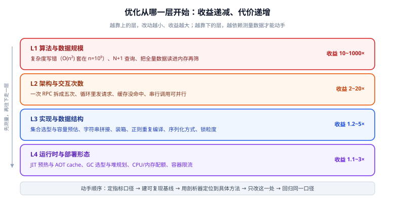

# 性能工程全景：指标口径与优化决策

「性能优化」最常见的失败不是改错代码，而是**改对了代码却没有变快，或者变快了却没人信**。根因通常在动手之前就已经埋下：指标口径没定、基线不可复现、优化的那一层选错了。这一页先把这三件事讲清楚，后面的所有工具才有落点。



## 1. 先把「慢」变成一句可以证伪的话

「这个接口有点慢」不是一个可执行的目标。可执行的目标必须包含四要素：

| 要素 | 反例 | 正例 |
| --- | --- | --- |
| **对象** | 「系统慢」 | `GET /api/v1/posts/{slug}` |
| **口径** | 「响应快一点」 | 100 并发持续 3 分钟下的 **P99** 与错误率 |
| **现状** | 不写 | 当前 P99 = 240 ms，错误率 0 |
| **目标** | 「越快越好」 | P99 ≤ 80 ms，且错误率仍为 0 |

::: tip 为什么必须写 P99 而不是平均值
平均延迟把长尾平均掉了。100 个请求里 99 个用 10 ms、1 个用 2 s，均值只有 30 ms——看起来很好，但那 1 个用户拿到的是 2 秒。**做性能优化时，长尾往往才是被投诉的那部分**，而长尾通常来自 GC 停顿、锁排队、连接池耗尽、冷路径首次执行这四类原因，它们和「平均值」几乎无关。
:::

常用的延迟与吞吐指标：

| 指标 | 含义 | 什么时候用它 |
| --- | --- | --- |
| **P50 / 中位数** | 一半请求比它快 | 判断「大多数用户」的体验 |
| **P95 / P99** | 95% / 99% 的请求比它快 | **SLO 的主口径**；长尾问题的探头 |
| **P999** | 极端长尾 | 交易、支付等对单次体验敏感的场景 |
| **TPS / QPS** | 每秒完成的事务/请求数 | 容量规划、压测结论 |
| **CPU 使用率** | 算力消耗 | 判断「有没有算力余量」 |
| 分配速率（MB/s） | 每秒新建对象的字节数 | **预判 GC 压力的先导指标**，比看堆占用更早发现风险 |

::: warning 三个最常被误用的口径
1. **用并发数当吞吐汇报**：「压到了 500 并发」说明的是负载，不是能力；能力要报 TPS 与对应的 P99。
2. **只报均值**：见上。均值与 P99 的差值本身就是诊断线索——差值大说明有排队或停顿。
3. **拿不同口径的前后对比**：改之前测 50 并发、改之后测 100 并发，然后宣布「变快了」。压测脚本、并发数、数据量、机器规格必须逐项对齐，见下一节。
:::

## 2. 基线三要素：不可复现的对比等于没有对比

任何「优化前 / 优化后」的结论，都要求这三点完全相同，缺一项结论就不成立：

1. **环境**：CPU 核数与频率、内存、JVM 版本与启动参数、容器配额（`--cpus` / `-m` 与宿主机是否一致）、是否与其他服务混部。
2. **数据量**：表行数、索引、缓存状态。数据量差一个数量级，慢查询的执行计划可能完全变样。
3. **脚本版本**：压测脚本本身也在演进。脚本改过一版却拿去比历史基线，比的是脚本不是服务。

::: danger 本机做压测时最容易漏掉的两件事
1. **压测客户端与被测服务在同一台机器上抢 CPU**：客户端的加压线程本身要耗费大量 CPU，机器越忙，测出来的「服务变慢」越可能是客户端饿死。至少给客户端留出独立核算，或把并发降到机器扛得住的水平。
2. **忘了记录 JVM 启动参数**：同一份代码在 `-Xmx512m` 与 `-Xmx4g` 下表现差异巨大，而参数常常只存在于某次命令行里，没有落盘。**把启动参数写进基线记录表**，这是最容易复现的一条。
:::

基线记录建议直接落成一张表（放在压测脚本仓库里，随脚本一起变更）：

```text
指标项        改前        改后        备注
环境          JDK 25.0.x  JDK 25.0.x  同参数 -Xmx2g -XX:+UseG1GC
数据量        文章 50 万篇  文章 50 万篇  未变
脚本版本      k6 v0.2      k6 v0.2     同一文件、git 同 commit
P50 (ms)       38          22
P95 (ms)      120          46
P99 (ms)      240          79
TPS           1120        2600
错误率         0%          0%
CPU 峰值      78%          41%
GC 次数/分      12           3
```

## 3. 四层模型：先问「在哪一层」，再问「怎么改」

同一个「慢」，改动位置不同，收益相差几十倍。按收益从高到低排成四层，**越靠上的层改动越小、收益越大**：

| 层 | 典型问题 | 量级 | 需要什么数据才能动手 |
| --- | --- | --- | --- |
| **L1 算法与数据规模** | 复杂度写错（O(n²) 套在 n=10⁵）、N+1 查询、把全量数据读进内存再筛 | 10~1000× | 代码走查即可，不需要工具 |
| **L2 架构与交互次数** | 一次 RPC 拆成五次、循环里发请求、缓存未命中、本可并行的串行调用 | 2~20× | 链路追踪、下游耗时统计 |
| **L3 实现与数据结构** | 集合选型与容量预估、字符串拼接、装箱、正则重复编译、序列化、锁粒度 | 1.2~5× | 火焰图、分配剖析、JMH |
| **L4 运行时与部署形态** | JIT 预热与 AOT cache、GC 选型与堆规划、CPU/内存配额、容器限流 | 1.1~3× | JFR / GC 日志 / 压测对照 |

::: tip 动手顺序
**L1 → L2 → L3 → L4。** 先把明显的算法与交互问题清掉，再谈实现层微优化。理由很直接：L3 的一次微优化最多拿 2 倍，而它需要 JMH、火焰图、对照实验这一整套成本；L1 的一次修正可能直接让这段代码从关键路径上消失，之后所有 L3 的优化都失去了意义。
:::

## 4. 「等」与「算」：先分流，再选工具

任何一次请求的时间都能拆成两类：

- **算（on-CPU）**：CPU 真的在执行你的代码或 JVM 的代码。表现是 CPU 使用率高、火焰图上栈顶很宽。
- **等（off-CPU）**：线程在等 IO、等锁、等下游、等 GC 停顿结束。表现是 **CPU 不高但延迟很高**——这是最容易被误诊的一类。

| 现象 | 是「等」还是「算」 | 第一件事 |
| --- | --- | --- |
| CPU 打满、TPS 上不去 | 算 | 火焰图找最宽的栈顶 |
| CPU 不高、P99 抖动 | 等 | wall-clock 剖析 + GC 日志 |
| 周期性毛刺（每几十秒一次） | 多半是 GC 或定时任务 | 对齐毛刺时间点与 GC 日志时间戳 |
| 并发一开就崩、单线程正常 | 等（锁或缓存行） | 锁剖析 / wall-clock 对比 |

::: danger 别用「算」的工具查「等」的问题
在 CPU 空闲的进程上跑 `-e cpu` 的火焰图，几乎必然得到一张又平又碎、看不出热点的图，然后得出「没有热点，代码没问题」的错误结论。**CPU 剖析只回答「时间花在哪个方法上」；线程大部分时间不在 CPU 上时，它什么都看不到。** 此时应换 wall-clock（按墙上时间采样，包含等待）或 `-e lock`。
:::

## 5. 什么时候**不该**优化

这一节比前面几节更省钱。

- **没有可复现的基线**：先建基线。测不准的前提下，任何改动都无法归因，后续会陷入「改了很多、不知道哪个有用」。
- **没有 SLO / 目标**：没有目标的优化会无限进行下去（总还能再快一点），无法宣布结束、无法验收。
- **不在关键路径上**：先确认这段代码占端到端时间的比例。占 2% 的代码即使快 10 倍，端到端也只快约 18% 的一部分——不值得引入复杂度和维护成本。
- **瓶颈在外部系统**：下游接口、数据库、第三方 SaaS。此时应用内的优化天花板就是「自己那部分耗时」，先解决外部。
- **以牺牲可读性与正确性为代价**：手写位运算替代清晰代码、为省一次分配而维护对象池——除非数据证明它值得，否则先把写清代码放在前面。

::: warning 提前优化也是性能问题
为了「以后可能有用」而预置的缓存、对象池、异步化，会以三种方式反噬：占用内存（把 GC 压力推高）、引入一致性缺陷（缓存与数据源不一致）、增加排障难度（多了一层看不见的状态）。**性能优化的对象应当是已经发生的问题，而不是想象中的问题。**
:::

## 6. 一次标准流程的六步（本专题的骨架）

后面各页都挂在这六步上：

1. **定指标**：写出一句可证伪的目标（见第 1 节）。
2. **建基线**：环境 / 数据量 / 脚本三要素对齐，落一张基线表（见第 2 节）。
3. **定位**：用剖析工具把问题指到具体方法或对象（见 [剖析工具链](../Profiling/index.md)）。
4. **提假设并做对照实验**：一次只改一处；热代码的差异用 [JMH](../JmhBenchmark/index.md) 量，端到端结论必须来自压测。
5. **回归与守住**：重跑基线脚本出对照表；把结论固化成一条门禁或一个看板指标。
6. **写下来**：一页记录——指标、工具、改动、数据、**失效条件**（什么情况下这个结论不再成立）。

第 6 步里的「失效条件」是区分工程记录与博客的关键：任何性能结论都有前提，写下前提，下一个人才知道该不该照抄。

## 7. 验证方式

本页是方法论页，验证方式是把方法用在一件小事上，确认这条路径走得通：

1. **口径可算**：对任意一个接口连续压测两次，若两次的 P99 相差超过 30%，说明你的测量本身还不稳定，先解决环境噪声（关掉其他占 CPU 的进程、固定并发与时长）。
2. **基线三要素可核对**：把基线表里的「环境」一栏交给同事，他能照着在你机器上跑出接近的数字。
3. **能分清「等」与「算」**：在一次压测中同时看 CPU 使用率与 P99——CPU 低而 P99 高，就必须去查等待，而不是去查 CPU 热点。
4. **知道什么时候停**：当 P99 已经进入目标区间，且继续优化的收益小于它带来的复杂度，就停手并写下记录。

## 相关文档

- [JMH 基准测试](../JmhBenchmark/index.md)：热代码差异的唯一可信来源
- [剖析工具链：JFR 与 async-profiler](../Profiling/index.md)：第 3 步「定位」的执行细节
- [实战：把慢接口的 P99 打下来](../Practice/index.md)：这六步的完整走法
- [JVM 基础](../../Java/JavaSE/JVM/Tuning/index.md)：L4 层的内存与 GC 参数怎么定
- [网络编程 · 性能基准与压测](../../NetworkProgramming/BenchmarkPractice/index.md)：当瓶颈在「等」的网络侧时去的页面

## 参考资料

- JMH 官方样例（先看 `JMHSample_*`，它们逐条演示了本页提到的测量陷阱）：https://github.com/openjdk/jmh/tree/master/jmh-samples/src/main/java/org/openjdk/jmh/samples
- async-profiler 文档（wall-clock 与 CPU 模式的区别）：https://github.com/async-profiler/async-profiler/blob/master/docs/ProfilerOptions.md
- JDK Flight Recorder 官方文档：https://docs.oracle.com/en/java/javase/25/jfapi/
- k6 官方文档（压测脚本与阈值）：https://grafana.com/docs/k6/latest/
