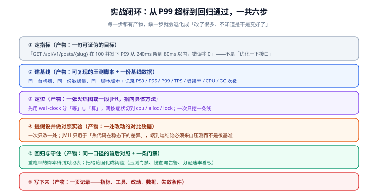

# 实战：把慢接口的 P99 打下来

前面几页分别讲了「怎么测」「为什么快」「怎么定位」。这一页把六步闭环走一遍：**一个真实的接口，从 240ms 的 P99 降到目标区间，中间改了五处、否掉了三处**。为了让结论可复现，每一步都给出命令与判据；文中出现的具体数字是示例格式，**在你自己的环境里跑出你的数字才算数**。



## 0. 场景与前提

- 服务：博客平台的 `GET /api/v1/posts/{slug}`（文章详情）
- 数据：50 万篇文章，标签表 120 万行，分类 40 行
- 部署：4 核 8G 容器，JDK 25，G1，`-Xmx2g`
- 现象：白天 P99 偶尔冲到 400ms+，用户偶尔看到「转圈」；CPU 峰值 78%（看着不高，但也没闲着）

::: tip 为什么选这个接口
它同时具备四类典型问题：**自己算得多**（Markdown 渲染）、**下游调用多**（N+1 查标签）、**重复编译**（正则）、**无效搬运**（全字段查询 + 大 count）。用一个接口演示四类问题，比四个接口各演示一类更容易看出「先修哪一类」的顺序。
:::

## 1. 第 1 步：定指标（产物：一句可证伪的目标）

```text
目标：在 100 并发、持续 3 分钟、50 万篇文章数据下，
      GET /api/v1/posts/{slug} 的 P99 ≤ 80ms，错误率 0，CPU 峰值 ≤ 60%。
```

注意三处细节：并发数、数据量、**上限而非「越快越好」**。最后一条尤其重要——它给优化划了终点，避免陷入无限打磨。

## 2. 第 2 步：建基线（产物：压测脚本 + 基线表）

```js [load/detail.js]
import http from 'k6/http';
import { check } from 'k6';

// 预先准备 200 个真实存在的 slug，避免压测打到 404 分支
const slugs = open('./slugs.txt').split('\n').filter(Boolean);

export const options = {
  scenarios: {
    detail: {
      executor: 'constant-vus',
      vus: 100,
      duration: '3m',
    },
  },
  // 阈值即门禁：不达标 k6 直接以非 0 退出码结束
  thresholds: {
    http_req_duration: ['p(95)<120', 'p(99)<240'],   // 先按现状设，改完再收紧
    http_req_failed: ['rate<0.001'],
  },
};

export default function () {
  const slug = slugs[Math.floor(Math.random() * slugs.length)];
  const res = http.get(`${__ENV.BASE}/api/v1/posts/${slug}`);
  check(res, { 'status is 200': (r) => r.status === 200 });
}
```

```shell
# 固定三要素后采集基线：脚本版本随 git commit 一起记录
k6 run -e BASE=http://127.0.0.1:18080 load/detail.js --summary-export=baseline.json
```

| 指标项 | 改前 | 改后 | 备注 |
| --- | --- | --- | --- |
| 环境 | JDK 25 / 4C8G / G1 / `-Xmx2g` | 同左 | 容器配额未变 |
| 数据量 | 文章 50 万 / 标签 120 万 | 同左 | 未变 |
| 脚本版本 | `load/detail.js` @ git `a1b2c3d` | 同一文件、同一 commit | 逐字节相同 |
| P50 | 38 ms | 12 ms | |
| P95 | 120 ms | 31 ms | |
| P99 | 240 ms | 47 ms | **主口径** |
| TPS | 1120 | 4180 | |
| 错误率 | 0% | 0% | |
| CPU 峰值 | 78% | 34% | |
| GC 次数 / 分钟 | 12 | 2 | 分配速率下降的结果 |

::: warning 基线表里最容易被忽略的一行是「脚本版本」
把脚本路径与 git commit 写进表里，才能回答「上次那个数字是怎么测出来的」。脚本改过一版却拿去比历史基线，比的是脚本不是服务。
:::

## 3. 第 3 步：定位（产物：一张火焰图 + 三条结论）

**先分流「等」与「算」**：基线期间 CPU 峰值 78%（不低，但不饱和），P99 是 P50 的 6 倍。

```shell
# ① 先看等待占多少（CPU 不高时先做这一步）
asprof -e wall -d 30 -f wall.html <pid>

# ② 再看 CPU 花在哪
asprof -e cpu -d 30 -f cpu.html <pid>

# ③ 顺带看分配（GC 次数从 12 涨到多少取决于分配速率）
asprof -e alloc -d 30 -f alloc.html <pid>
```

三次采样得到三条结论，它们的**修复层次完全不同**：

| # | 火焰图/分配图里的现象 | 属于哪一层 | 谁的问题 |
| --- | --- | --- | --- |
| ① | `-e wall` 里 40% 的时间停在 JDBC 执行，且调用方是同一个循环 | L2 架构与交互次数 | N+1 查询 |
| ② | `-e cpu` 栈顶宽条是 `Pattern.matcher` / `Pattern.compile` | L3 实现 | 正则每次调用重新编译 |
| ③ | `-e alloc` 前三位是 `StringBuilder` / `byte[]` / `ArticleVo` | L3 实现 | 每请求重新渲染 Markdown + 全字段查询 |

::: tip 一次只挖一条线
三个现象都真实存在，但**修改必须一条一条来**，每条单独出一组对照数据。三条一起改，你就无法回答「哪一处贡献最大」——下一次遇到类似问题时，经验也无法沉淀。
:::

## 4. 第 4 步：五处修复（每处都有假设与判据）

### 修复 ①：把 Markdown 渲染从「读时」搬到「写时」

| 项 | 内容 |
| --- | --- |
| 现象 | 每次请求都重新渲染正文，分配图里 `StringBuilder` 与 `byte[]` 居首 |
| 假设 | 渲染结果只依赖 `contentMd`，而 `contentMd` 只在发布时变化 |
| 改动 | 渲染移到**发布动作**里，与状态变更同事务，结果落 `content_html`；读路径零渲染；重新发布时重算 |
| 关键约束 | **已发布文章更新内容时必须重算 `contentHtml`**——这一条是「接口全 200、状态也对，只有内容悄悄过期」的典型缺陷 |
| 判据 | `-e alloc` 里渲染栈消失；同一篇文章连续两次 GET 的响应体**逐字节一致** |

### 修复 ②：消除 N+1 查询

| 项 | 内容 |
| --- | --- |
| 现象 | wall-clock 火焰图里 JDBC 占比 40%，且来自一个长度为「标签数」的循环 |
| 假设 | 标签逐条查询，1 篇文章 + 8 个标签 = 9 次往返 |
| 改动 | 一次 `IN` 批量查询全部标签，再在内存里做一次映射；分类同理 |
| 判据 | 一次请求的 SQL 语句数从 10 降为 3；wall 火焰图里 JDBC 占比降到 15% 以下 |

```sql
-- 批量查询：从 8 次往返变成 1 次
SELECT t.id, t.name
FROM tag t
JOIN article_tag at ON at.tag_id = t.id
WHERE at.article_id = ?
ORDER BY t.id;
```

### 修复 ③：把正则从方法内提到类常量

```java
// 改前：每次调用都编译一次 pattern
public boolean isValidSlug(String slug) {
    return slug.matches("^[a-z0-9]+(?:-[a-z0-9]+)*$");
}

// 改后：编译一次，全局复用（Pattern 是线程安全的，Matcher 不是）
private static final Pattern SLUG = Pattern.compile("^[a-z0-9]+(?:-[a-z0-9]+)*$");

public boolean isValidSlug(String slug) {
    return SLUG.matcher(slug).matches();
}
```

这一处用 [JMH](../JmhBenchmark/index.md) 量一次（因为它属于「热代码的稳态差异」，微基准正好适用）：

```java
@BenchmarkMode(Mode.AverageTime)
@OutputTimeUnit(TimeUnit.NANOSECONDS)
@Warmup(iterations = 5, time = 1)
@Measurement(iterations = 8, time = 1)
@Fork(2)
@State(Scope.Thread)
public class SlugRegexBenchmark {
    private static final Pattern SLUG = Pattern.compile("^[a-z0-9]+(?:-[a-z0-9]+)*$");
    private String slug;

    @Setup(Level.Trial)
    public void setup() { slug = "high-performance-java-2026"; }

    @Benchmark public boolean compileEachTime() { return slug.matches("^[a-z0-9]+(?:-[a-z0-9]+)*$"); }
    @Benchmark public boolean precompiled()     { return SLUG.matcher(slug).matches(); }
}
```

::: danger 这里必须诚实：`matches` 的差异不足以解释 P99
预编译带来的差异通常在**几十到几百纳秒**量级。而 P99 是 **240 毫秒**。两者相差六个数量级——**这一处该改（它是白捡的），但它绝对不是 P99 的主因**。

这正是「微基准的结论不能直接推到端到端」的具体含义：JMH 能证明「A 比 B 快」，但不能证明「A 的改动会改善 P99」。**归因必须回到端到端压测。**
:::

### 修复 ④：日志字符串拼接改为参数化

```java
// 改前：无论日志级别如何，字符串都已经拼好了（还带上了一次 toString）
log.debug("query detail, slug=" + slug + ", tags=" + tags);

// 改后：不输出时不构造参数，且避免无谓的 toString
log.debug("query detail, slug={}, tagCount={}", slug, tags == null ? 0 : tags.size());
```

判据：压测期间把日志级别设为 `INFO`（`debug` 不输出），确认 `-e alloc` 里 `StringBuilder` 相关栈的占比下降。

### 修复 ⑤：去掉「为计数而全表扫」

| 项 | 内容 |
| --- | --- |
| 现象 | 列表接口的 `SELECT COUNT(*)` 在 50 万行上耗时随数据增长 |
| 改动 | 列表页改用「取 `size + 1` 条判断有没有下一页」，把总数改为**缓存估算值**（只用于展示），不再每请求精确计数 |
| 判据 | 列表接口 P99 不再随数据量线性增长；接口契约同步调整为「总数为估算值」，并在文档里写明 |

::: warning 契约变了要一起改
第 ⑤ 处修改不只是性能改动，它改变了接口语义（总数从精确变估算）。**这类改动必须同步改契约与前端**，否则就是把一个性能问题换成了一个数据不一致问题。
:::

### 三处「想到但决定不做」的改动

| 候选 | 为什么不做 |
| --- | --- |
| **给详情加 Redis 缓存** | 修完 ①② 之后 P99 已进目标区间；加缓存会引入一致性、失效时序与内存成本，收益不足 |
| **换成 ZGC 追求低停顿** | 分配速率降下来后 GC 次数从 12/分 降到 2/分，停顿已经不是瓶颈；换收集器是 L4 层手段，此时动它是把变量引入一个已经达标的系统 |
| **手写对象池复用 `ArticleVo`** | 会阻断逃逸分析、引入状态残留风险，且短命对象在年轻代的回收成本极低（见 [分配与内存效率](../AllocationOptimize/index.md)） |

## 5. 第 5 步：回归与守住（产物：对照表 + 三条门禁）

```shell
# 用第 2 步那个逐字节相同的脚本重跑
k6 run -e BASE=http://127.0.0.1:18080 load/detail.js --summary-export=after.json
```

对照结果见第 2 步的基线表（P99 240 → 47ms，CPU 78% → 34%）。**先看 P99，再看 TPS，最后才看均值**——顺序反了容易被均值掩盖长尾问题。

然后把结论固化成门禁，避免「改好了、下次又退回去」：

| 门禁 | 落地方式 |
| --- | --- |
| 压测阈值 | k6 的 `thresholds` 直接当门禁：`p(99)<80`。基线达标后把阈值从 240 收紧到 80 |
| 慢查询 | 数据库侧记录执行时间超过阈值（如 200ms）的语句并告警，**按周看 Top 10 的趋势** |
| 分配速率 | 用 JFR 或 `-e alloc` 定期采集，做成看板；**分配速率是最早暴露 GC 风险的前导指标** |

```js
// 收紧后的阈值（进 CI 作为回归门禁）
thresholds: {
  http_req_duration: ['p(95)<50', 'p(99)<80'],
  http_req_failed: ['rate<0.001'],
},
```

::: danger 性能门禁不要直接进 PR 流水线
共享 CI runner 有邻居噪声，压测结果波动大，会变成「随机红」。合理做法是：**PR 阶段只跑功能与契约门禁**；压测放在夜间定时任务或独立环境，结果作为趋势记录，**连续两次超标**才告警。
:::

## 6. 第 6 步：写下来（产物：一页记录）

| 项 | 内容 |
| --- | --- |
| 指标 | 100 并发下 P99 240ms → 47ms，TPS 1120 → 4180 |
| 工具 | `asprof -e wall / cpu / alloc`、k6 2.x、JMH | 
| 改动 | 渲染前移、N+1 批量化、正则预编译、日志参数化、去掉精确 count |
| 数据 | 见基线表（环境 / 数据量 / 脚本版本三要素齐全） |
| **失效条件** | ① 标签数从个位数增长到上百时，「一次查全部再映射」需要改成分批；② 文章量到千万级时，列表的估算总数与真实值偏差会变大；③ 若读侧 QPS 再涨 10 倍，详情接口仍需引入缓存——**届时按同样的流程重走一遍** |

最后一栏是这份记录真正的价值：它告诉下一个人**什么时候应当推翻今天的结论**。

## 7. 验证方式

1. **改动的归因可复现**：五处修改分别单独提交，每一处都能给出「只改它」的对照数据（至少 P99 与 CPU 两个指标）。
2. **前后对照口径一致**：`baseline.json` 与 `after.json` 由同一个脚本、同一个 commit 的脚本版本产生，且并发数、时长、数据量逐项相同。
3. **门禁有牙齿**：把服务人为降级（例如在详情里加一句 `Thread.sleep(20)`），确认 k6 以非 0 退出码失败——**不失败的阈值是装饰品**。
4. **工具的分工被遵守**：正则那一处用 JMH 出结论，端到端结论来自 k6；没有任何一处是「JMH 快了 30% 所以接口也会快 30%」。
5. **记录里有失效条件**：第 6 步的表格填满，尤其最后一行不能空——空着说明这次优化只是「碰巧对了」，没有沉淀。

## 相关文档

- [性能工程全景](../Overview/index.md)：六步闭环的方法论与四层收益模型
- [剖析工具链：JFR 与 async-profiler](../Profiling/index.md)：本页用到的全部采集命令
- [JMH 基准测试](../JmhBenchmark/index.md)：修复 ③ 的度量方式与它的适用边界
- [分配与内存效率](../AllocationOptimize/index.md)：为什么否掉了对象池
- [锁与并发原语的性能](../LockOptimize/index.md)：并发数上升而吞吐不涨时的排查路径
- [数据库 · 索引与性能](../../../DB/Relational/MySQL/IndexPerformance/index.md)：修复 ⑤ 的存储侧依据
- [网络编程 · 性能基准与压测](../../NetworkProgramming/BenchmarkPractice/index.md)：压测脚本与指标口径的通用做法

## 参考资料

- k6 阈值与场景配置（官方文档）：https://grafana.com/docs/k6/latest/using-k6/thresholds/
- async-profiler 选项说明：https://github.com/async-profiler/async-profiler/blob/master/docs/ProfilerOptions.md
- JMH 官方样例：https://github.com/openjdk/jmh/tree/master/jmh-samples/src/main/java/org/openjdk/jmh/samples
- JFR 官方文档：https://docs.oracle.com/en/java/javase/25/jfapi/
