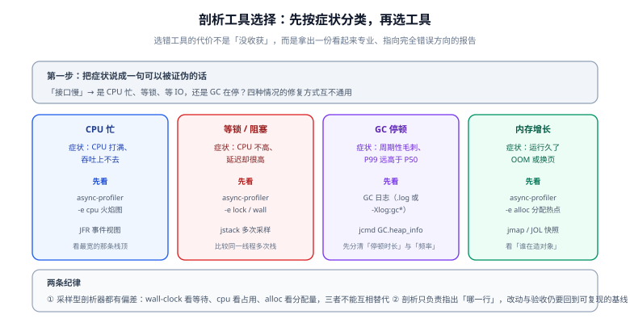

# 剖析工具链：JFR 与 async-profiler

定位阶段只有一句话的目标：**把「慢」指到一个具体的方法、一行代码或一类对象上**。做到这件事需要两个工具：**JFR（JDK Flight Recorder）**——JDK 内置、可长期开着、事件类型的覆盖面最广；**async-profiler**——低开销采样剖析，火焰图的事实标准。这一页讲清它们各自能回答什么问题、命令怎么写、以及火焰图怎么看。



## 1. 第一步：把症状翻译成「要采什么」

| 你要回答的问题 | 采样目标 | 工具与模式 |
| --- | --- | --- |
| CPU 时间花在哪些方法上 | on-CPU 栈 | `asprof -e cpu` |
| 线程大部分时间在**等**什么（IO / 锁 / 下游） | 墙上时间栈 | `asprof -e wall` |
| 谁在大量创建对象 | 分配采样 | `asprof -e alloc` |
| 锁竞争在哪里、持有多久 | 锁事件 | `asprof -e lock`、JFR `jdk.JavaMonitorEnter` |
| GC 停顿多长、多频繁 | GC 事件 | GC 日志 / JFR `jdk.GCPhasePause` |
| 编译与去优化有没有在拖后腿 | 编译事件 | JFR 编译器事件、`-XX:+PrintCompilation` |
| 启动慢 | 类加载与初始化 | JFR 启动事件、`-Xlog:class+load` |

::: danger 用错工具会得到「专业但指向错误」的结论
最常见的一处误用：**在 CPU 空闲的进程上采 CPU 火焰图**。此时采样点大量落在「什么都没干」的地方，火焰图又平又碎、看不出热点，于是得出「代码没有瓶颈」的结论——而真实情况是瓶颈在等待。判据很简单：**同时看 CPU 使用率与延迟**。CPU 低而延迟高 → 先采 wall-clock，不要用 `-e cpu`。
:::

## 2. async-profiler：火焰图的默认工具

要求 JDK 11+；**4.x 版本的启动器叫 `asprof`**（早期版本的脚本名是 `profiler.sh`，老教程里的命令需要按新版改写）。

```shell
# 采 30 秒 CPU，输出交互式火焰图
asprof -e cpu -d 30 -f cpu.html <pid>

# 采墙上时间（包含等待）——查「CPU 不高但很慢」的第一步
asprof -e wall -d 30 -f wall.html <pid>

# 采对象分配——查「谁在造对象 / 为什么 GC 频繁」
asprof -e alloc -d 30 -f alloc.html <pid>

# 采锁（4.3 起支持原生锁剖析）
asprof -e lock -d 30 -f lock.html <pid>

# 输出 JFR 格式，便于用 JMC 或 jfr 工具二次分析
asprof -e cpu -d 60 -o jfr -f cpu.jfr <pid>
```

三种典型输出：

| 输出 | 参数 | 用途 |
| --- | --- | --- |
| 交互式火焰图 | `-f x.html` | 人工分析，首选 |
| 折叠栈（collapsed） | `-o collapsed -f x.txt` | 进脚本做 diff / 归档 / 与上一次对比 |
| JFR | `-o jfr -f x.jfr` | 需要结合 JFR 的其它事件一起看 |

::: tip 容器里的两个必备前置
1. **必须与目标进程同用户执行**（`root` 启动的 JVM 不能用普通用户采集）。
2. **Linux 上要放开 perf 相关权限**，否则 CPU 采样报错或只能退化到精度较低的模式：

```shell
sudo sysctl kernel.perf_event_paranoid=1
sudo sysctl kernel.kptr_restrict=0
```
:::

### 火焰图怎么读

| 维度 | 含义 |
| --- | --- |
| **横向宽度** | 采样占比，**宽 = 时间花得多**（这是唯一重要的维度） |
| **纵向** | 调用栈深度，从下（线程入口）到上（真正执行的方法） |
| **颜色** | 在标准火焰图里**没有意义**（随机着色），不要试图从颜色读出信息 |
| 找热点的动作 | 找**栈顶的宽条**（自顶向下看哪些条直接顶到最上层），再沿着调用链往下追「是谁调起来的」 |

::: warning 两个读图陷阱
1. **只看最宽的整条链**：顶层通常是一个框架方法（Servlet、Netty、Spring），宽是必然的。要**沿着它往下找分支**，看是哪个子分支撑起了宽度。
2. **把窄条当成不重要**：如果是「100 个方法各占 1%」，问题可能不在某个方法，而在**方法数量太多**（过度分层、反射、日志）——这本身就是结论，方向是架构与调用链，而不是逐个优化。
:::

## 3. JFR：覆盖面最广的那一个

JFR 是 JDK 内置的低开销事件记录器（JDK 11 起在 OpenJDK 中开源）。它的优势不是「看得更细」，而是**能长期开着、把多种维度的事件放进同一条时间轴**——这对「周期性毛刺」这类问题几乎是唯一可行的手段。

```shell
# 方式一：启动时开启（推荐的固定配置）
java -XX:StartFlightRecording=filename=app.jfr,settings=profile,duration=300s -jar app.jar

# 方式二：对运行中的进程按需录制
jcmd <pid> JFR.start name=diag duration=120s filename=diag.jfr settings=profile
jcmd <pid> JFR.dump  name=diag filename=diag.jfr
jcmd <pid> JFR.check name=diag

# 方式三：JDK 25 起可单独打开准确的 CPU 时间采样事件（实验性）
java -XX:StartFlightRecording=jdk.CPUTimeSample#enabled=true,filename=profile.jfr -jar app.jar
```

| 关心的问题 | 主要事件（名字以 `jfr summary` 输出为准） |
| --- | --- |
| CPU 热点 | `jdk.ExecutionSample`（栈采样） |
| 分配热点 | `jdk.ObjectAllocationSample`（按采样记录分配） |
| 锁 | `jdk.JavaMonitorEnter` / `jdk.JavaMonitorWait` |
| IO 与网络 | `jdk.FileRead` / `jdk.FileWrite` / `jdk.SocketRead` / `jdk.SocketWrite` |
| GC | `jdk.GCPhasePause` 等 |
| 编译 | 编译与去优化相关事件 |

```shell
# 不做图形界面也能出结论：先看事件总览，再单看某类事件
jfr summary app.jfr
jfr view hot-methods app.jfr        # 视图名以 jfr help view 的输出为准
jfr print --events jdk.JavaMonitorEnter app.jfr | head -40
```

::: info JDK 25 对 JFR 的三处增强
1. **JEP 509: JFR CPU-Time Profiling（实验性）**：在 Linux 上采集**更准确的 CPU 时间**采样事件 `jdk.CPUTimeSample`，默认不开启，需要显式打开；它不需要 `UnlockExperimentalVMOptions`。
2. **JEP 518: JFR Cooperative Sampling**：异步采样线程栈的稳定性改进——只在安全点走栈，同时通过记录程序计数器来削弱安全点偏差。
3. **JEP 520: JFR Method Timing & Tracing**：通过字节码插桩支持**方法计时与追踪**——可以直接回答「这个方法被调了多少次、总共花了多久」，而不只是采样推断。

这三条一起看，JFR 正在从「只能采样」走向「可以定向测量」。
:::

## 4. `jcmd` 与基础命令速查

这些命令不需要额外工具，是**现场第一反应**：

| 命令 | 看什么 |
| --- | --- |
| `jcmd <pid> GC.heap_info` | 堆各区域当前占用、GC 次数 |
| `jcmd <pid> GC.class_histogram` | 类直方图（谁的对象最多）——**注意它会触发一次 STW，生产慎用** |
| `jcmd <pid> Thread.print` | 线程转储（`jstack` 的等价物），查锁与阻塞 |
| `jcmd <pid> VM.native_memory summary` | 本地内存占用（需启动时开 `-XX:NativeMemoryTracking`，有开销） |
| `jcmd <pid> Compiler.queue` | 编译队列积压（启动期 CPU 争抢的信号） |
| `jcmd <pid> VM.flags -all` | 当前生效的全部参数（比回忆命令行可靠） |
| `jstat -gc <pid> 1000 10` | 每秒一次的 GC 与各区变化趋势 |
| `jmap -histo:live <pid>` | 存活对象直方图（**会触发 Full GC，生产禁用**） |
| `jmap -dump:live,format=b,file=heap.hprof <pid>` | 堆转储（配合 MAT 分析泄漏） |

::: danger 三个「会打断服务」的命令
`jmap -histo:live`、`jmap -dump:live`、`jcmd GC.class_histogram` 都会**触发 STW 并可能持续数秒到数十秒**（堆越大越久）。在线上排查时必须：① 先确认有没有更轻的替代（`-e alloc` 采样、JFR 分配事件）；② 选低峰时段；③ 从负载均衡里先摘除该实例；④ 知道 `-XX:+HeapDumpOnOutOfMemoryError` 已经能在 OOM 时自动留证据。
:::

## 5. 生产环境采样的纪律

| 纪律 | 原因 |
| --- | --- |
| **优先用采样型工具**，少用「触发全量统计」的命令 | 采样的开销通常是个位数百分比，全量统计会 STW |
| **先估开销再上生产**：`asprof -e cpu` 一般 1%~5%；`-e alloc` 与 `-e wall` 略高 | 采样频率越高开销越大；`--interval` 可以调稀 |
| **采集有明确起止**：`-d 30` 而不是一直开着 | 长采样的产物巨大且难以分析 |
| **采集物要带上下文**：同时记录 CPU、内存、GC 与请求量 | 单独一张火焰图脱离负载是没有意义的 |
| **不要在容器里只按「进程」判断**：先看 cgroup 的 CPU 配额 | 容器被限流时表现为「CPU 不高但很慢」，与代码无关 |
| **对比要有基线**：`collapsed` 输出做 diff，比「看两次火焰图记忆对比」可靠 | 视觉记忆不可靠，diff 可以精确到栈 |

```shell
# 用 collapsed 输出做「改动前后」的栈级对比
asprof -e cpu -d 30 -o collapsed -f before.txt <pid>
# ... 部署改动 ...
asprof -e cpu -d 30 -o collapsed -f after.txt <pid>
# 两份文件都是 "栈;栈;方法 计数" 的文本，可直接排序对比
sort -k2 -nr before.txt | head -20
sort -k2 -nr after.txt  | head -20
```

## 6. 验证方式

1. **工具链可用**：`asprof --version` 有输出、`jcmd <pid> JFR.start` 能成功启动一次录制并能 dump 出文件（大小 > 0）。
2. **能采到「已知热点」**：写一个故意忙等的方法（例如自旋 30 秒的主循环），采 10 秒 CPU 火焰图，确认它出现在栈顶最宽的位置——**这一步是在验证你的观测手段本身有分辨力**，而不是在验证业务代码。
3. **能采到等待**：让一个方法 `Thread.sleep(30_000)`，用 `-e cpu` 采 10 秒应当**看不到**它（时间不在 CPU 上），换 `-e wall` 应当能看到。做一次这个对照，你以后就不会再用 `-e cpu` 查等待类问题了。
4. **JFR 文件可分析**：`jfr summary app.jfr` 能列出事件与数量；不存在「录了半天打不开」的情况。
5. **对比方法可复现**：用同一段负载采两次 `collapsed`，两次 Top 20 的栈应当基本一致；若差异巨大，说明你的负载本身不稳定，先固定负载再做对比。

## 相关文档

- [性能工程全景](../Overview/index.md)：定位之前要先把指标与基线定下来
- [JMH 基准测试](../JmhBenchmark/index.md)：剖析器负责「找哪一行」，JMH 负责「改完快了多少」
- [实战：把慢接口的 P99 打下来](../Practice/index.md)：本页工具在完整流程里的用法
- [JVM 基础 · 故障排查](../../Java/JavaSE/JVM/Troubleshoot/index.md)：CPU 高、内存高、线程卡死三类现场的处理
- [JVM 基础 · 垃圾收集器](../../Java/JavaSE/JVM/GcCollector/index.md)：GC 日志怎么读、收集器怎么选
- [运维 · 监控告警](../../../Ops/Monitoring/index.md)：把采集做成常态化的看板与告警

## 参考资料

- async-profiler（官方仓库与 `docs/`）：https://github.com/async-profiler/async-profiler
- async-profiler 选项说明（各 `-e` 模式的语义）：https://github.com/async-profiler/async-profiler/blob/master/docs/ProfilerOptions.md
- JEP 509: JFR CPU-Time Profiling（Experimental）：https://openjdk.org/jeps/509
- JEP 518: JFR Cooperative Sampling：https://openjdk.org/jeps/518
- JEP 520: JFR Method Timing & Tracing：https://openjdk.org/jeps/520
- JFR 官方文档（事件与设置文件）：https://docs.oracle.com/en/java/javase/25/jfapi/
- `jfr` 命令行工具：https://docs.oracle.com/en/java/javase/25/docs/specs/man/jfr.html
