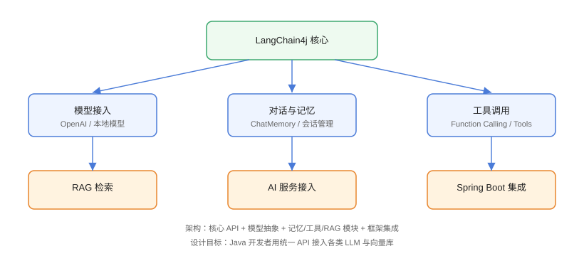

# 核心概念

理解 LangChain4j 的核心抽象是高效使用该框架的基础。本章将详细介绍 LangChain4j 的主要概念和组件。

## 架构概览

LangChain4j 采用模块化设计，主要包含以下核心组件：

<div align="center">
  
</div>

## ChatLanguageModel

`ChatLanguageModel` 是 LangChain4j 最核心的接口之一，它抽象了与大语言模型交互的接口。

### 主要方法

```java
public interface ChatLanguageModel {

    GenerateResponse generate(List<ChatMessage> messages);

    GenerateResponse generate(ChatMessage... messages);
}
```

### 使用示例

```java
ChatLanguageModel model = OpenAiChatModel.builder()
        .apiKey("your-api-key")
        .modelName("gpt-4")
        .build();

UserMessage userMessage = UserMessage.from("请用一句话总结 Java 的特点");
GenerateResponse response = model.generate(userMessage);

System.out.println(response.content().text());
```

### StreamingChatLanguageModel

对于需要流式响应的场景，使用 `StreamingChatLanguageModel`：

```java
StreamingChatLanguageModel model = OpenAiStreamingChatModel.builder()
        .apiKey("your-api-key")
        .modelName("gpt-4")
        .build();

model.generate("写一首关于春天的诗", token -> {
    System.out.print(token.text());
    System.out.flush();
});
```

## 消息模型

LangChain4j 定义了丰富的消息类型来支持不同的对话场景：

### 消息类型

```java
// 用户消息
UserMessage userMessage = UserMessage.from("今天天气怎么样？");

// AI 回复消息
AiMessage aiMessage = AiMessage.from("今天天气晴朗，适合外出。");

// 系统消息（设置 AI 的行为和约束）
SystemMessage systemMessage = SystemMessage.from(
    "你是一个专业的技术顾问，善于解答编程相关问题。"
);

// 工具调用消息
ToolExecutionResultMessage toolMessage = 
    ToolExecutionResultMessage.from(toolName, toolResult);
```

### 消息列表构建

```java
List<ChatMessage> messages = new ArrayList<>();
messages.add(SystemMessage.from("你是一个乐于助人的助手。"));
messages.add(UserMessage.from("请解释什么是面向对象编程。"));

GenerateResponse response = model.generate(messages);
```

## 提示词模板

LangChain4j 提供了强大的提示词模板功能，支持变量替换和条件逻辑：

```java
PromptTemplate template = PromptTemplate.from(
    "请为以下产品写一段描述：\n" +
    "产品名称：{{productName}}\n" +
    "特点：{{features}}\n" +
    "目标用户：{{targetAudience}}"
);

Map<String, Object> variables = Map.of(
    "productName", "智能手表",
    "features", "心率监测、GPS定位、防水",
    "targetAudience", "运动爱好者"
);

Prompt prompt = template.apply(variables);
```

## 内存管理

`ChatMemory` 接口定义了对话内存的抽象，支持在多轮对话中维护上下文：

### MessageWindowChatMemory

固定消息数量的窗口内存：

```java
ChatMemory memory = MessageWindowChatMemory.builder()
        .id("session-1")
        .maxMessages(10)
        .build();

memory.add(UserMessage.from("我叫张三"));
memory.add(AiMessage.from("你好张三，很高兴认识你！"));
memory.add(UserMessage.from("我今年25岁"));

List<ChatMessage> history = memory.messages();
```

### TokenWindowChatMemory

基于 token 数量的窗口内存：

```java
ChatMemory memory = TokenWindowChatMemory.builder()
        .id("session-1")
        .maxTokens(1000)
        .tokenizer(new OpenAiTokenizer("gpt-3.5-turbo"))
        .build();
```

## 链式调用

`Chain` 接口允许将多个处理步骤串联起来：

```java
Chain<UserMessage, String> chain = Chain.builder()
        .step(promptTemplate)
        .step(model)
        .step(outputParser)
        .build();

String result = chain.execute(userMessage);
```

## RAG 组件

LangChain4j 提供了完整的 RAG（检索增强生成）支持：

- **DocumentLoader**：文档加载器
- **DocumentSplitter**：文档分割器
- **EmbeddingModel**：嵌入模型
- **VectorStore**：向量存储
- **Retriever**：检索器

```java
DocumentLoader loader = new TextDocumentLoader("docs/guide.txt");
List<Document> documents = loader.load();

DocumentSplitter splitter = new RecursiveCharacterTextSplitter(1000, 200);
List<TextSegment> segments = splitter.split(documents);

EmbeddingModel embeddingModel = new OpenAiEmbeddingModel("your-api-key");
VectorStore store = new InMemoryVectorStore(embeddingModel);
store.add(segments);

Retriever<TextSegment> retriever = store.asRetriever();
List<TextSegment> relevantSegments = retriever.findRelevant("相关信息", 5);
```

## 服务类

`Service` 类提供了更高级别的抽象，简化常见用例：

```java
OpenAiChatService service = OpenAiChatService.builder()
        .apiKey("your-api-key")
        .modelName("gpt-4")
        .build();

AiMessage response = service.sendUserMessage("你好");
```

## 下一步

- [快速开始](./QuickStart/index.md) - 通过示例快速上手
- [LLM 集成](./LlmIntegration/index.md) - 深入了解 LLM 集成
- [提示词模板](./PromptTemplate/index.md) - 掌握提示词模板的使用
