# Langchain4j 大模型平台

## 阿里百炼平台

官方网站：https://bailian.console.aliyun.com

### 创建API-KEY

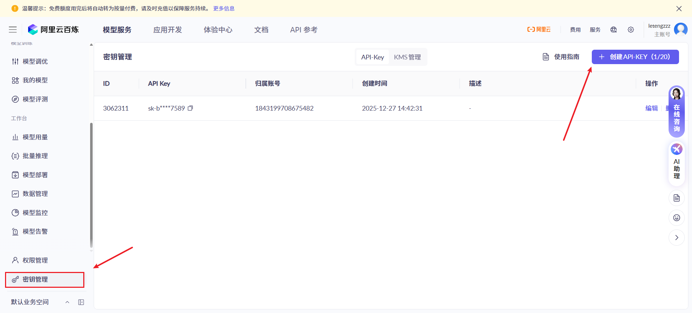

### 获取模型名

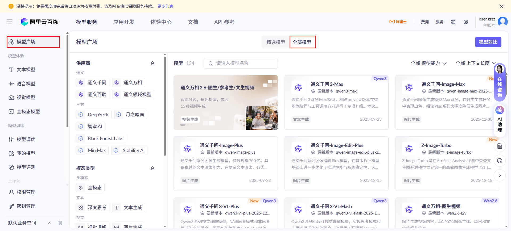

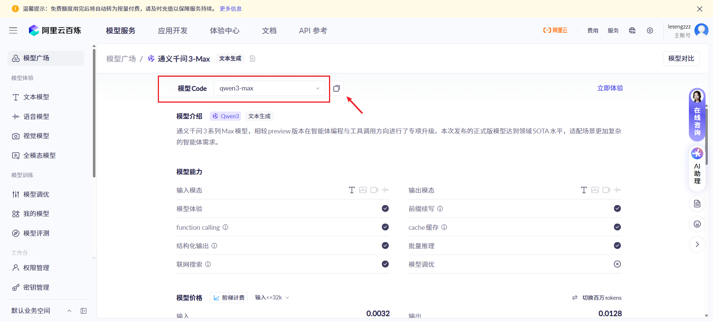

### 调用地址

使用OpenAI兼容协议：

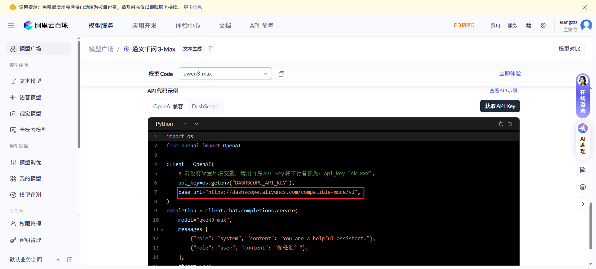

使用DashScope：

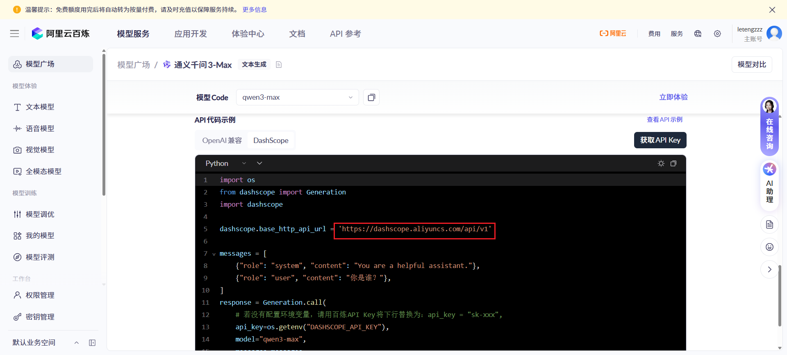

## 百度千帆平台

官方网站：https://console.bce.baidu.com/qianfan/ais/console/applicationConsole/application

### 创建API-KEY

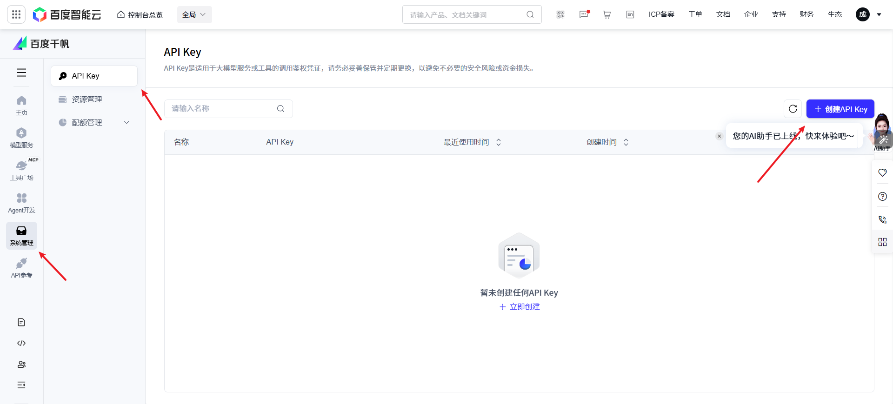

获取secretKey：

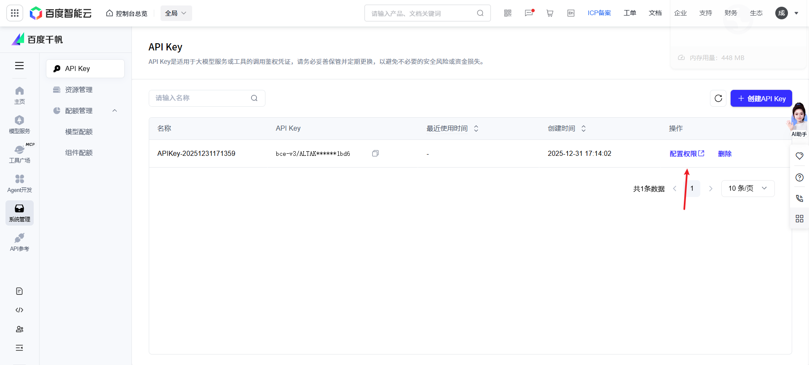

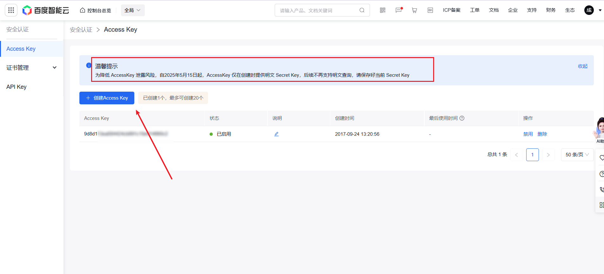

### 获取模型名

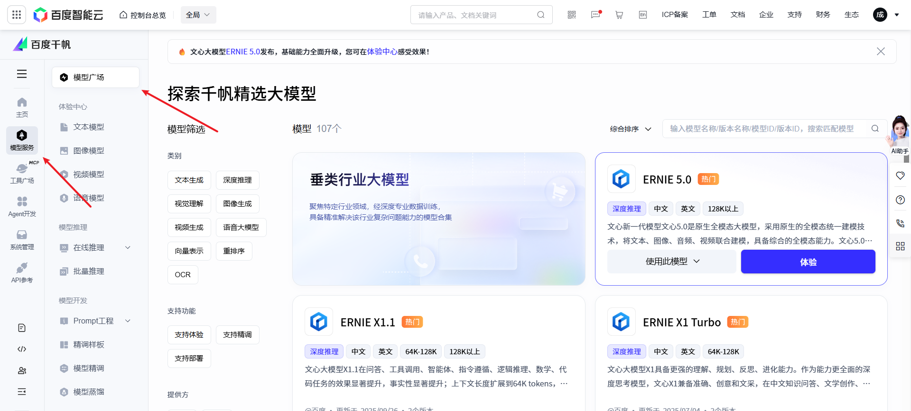

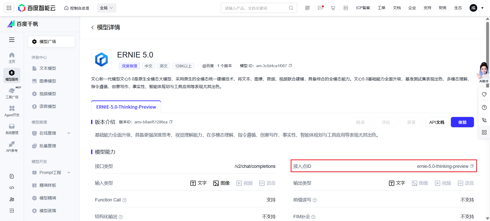

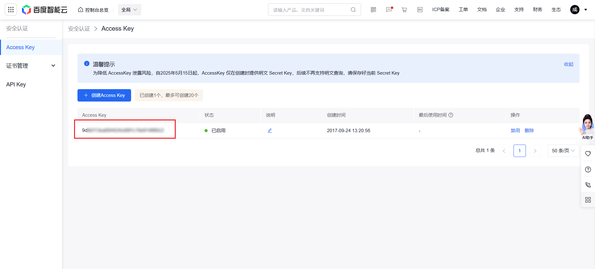

### 调用地址

## 智谱AI开放平台

官方网站：https://open.bigmodel.cn/

### 创建API-KEY

### 获取模型名

### 调用地址

