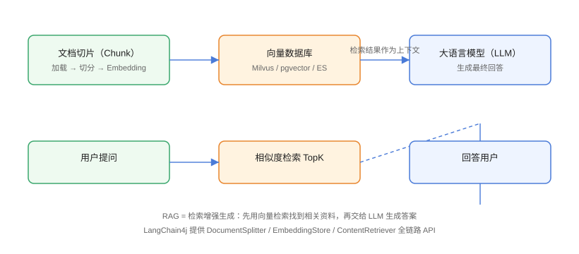

# RAG 检索增强生成

RAG（Retrieval-Augmented Generation，检索增强生成）是一种将外部知识库与大语言模型结合的技术。本章将详细介绍如何在 LangChain4j 中构建完整的 RAG 系统。

## RAG 架构概览

<div align="center">
  
</div>

## 文档加载

### 加载文本文件

```java
import dev.langchain4j.data.document.Document;
import dev.langchain4j.data.document.DocumentSplitter;
import dev.langchain4j.data.document.Metadata;
import dev.langchain4j.data.document.splitter.DocumentSplitters;
import dev.langchain4j.data.segment.TextSegment;

TextDocumentLoader loader = new TextDocumentLoader("docs/guide.txt");
Document document = loader.load();

// 添加元数据
document.metadata().put("source", "user-guide");
document.metadata().put("author", "技术团队");
```

### 加载 PDF 文件

```java
import dev.langchain4j.data.document.pdf.PdfDocumentLoader;

PdfDocumentLoader loader = new PdfDocumentLoader("docs/manual.pdf");
List<Document> documents = loader.load();
```

### 加载 HTML 文件

```java
import dev.langchain4j.data.document.html.HtmlDocumentLoader;

HtmlDocumentLoader loader = new HtmlDocumentLoader(
    "https://example.com/documentation.html",
    "UTF-8"
);
Document document = loader.load();
```

### 加载 Markdown 文件

```java
import dev.langchain4j.data.document.markdown.MarkdownDocumentLoader;

MarkdownDocumentLoader loader = new MarkdownDocumentLoader("docs/api.md");
Document document = loader.load();
```

## 文档分割

### 递归字符分割器

```java
import dev.langchain4j.data.document.splitter.RecursiveCharacterTextSplitter;

DocumentSplitter splitter = RecursiveCharacterTextSplitter.builder()
        .chunkSize(1000)      // 每个块的最大字符数
        .chunkOverlap(200)    // 块之间的重叠字符数
        .build();

List<TextSegment> segments = splitter.split(document);
```

### 按标题分割

```java
import dev.langchain4j.data.document.splitter.TitleHeaderParagraphSplitter;

DocumentSplitter splitter = new TitleHeaderParagraphSplitter(
    "## ",      // 一级标题
    "### "      // 二级标题
);

List<TextSegment> segments = splitter.split(document);
```

### 自定义分割器

```java
public class SentenceSplitter implements DocumentSplitter {

    private final int maxChunkSize;

    @Override
    public List<TextSegment> split(Document document) {
        String text = document.text();
        List<String> sentences = splitIntoSentences(text);
        
        List<TextSegment> chunks = new ArrayList<>();
        StringBuilder currentChunk = new StringBuilder();
        
        for (String sentence : sentences) {
            if (currentChunk.length() + sentence.length() > maxChunkSize) {
                chunks.add(TextSegment.from(currentChunk.toString()));
                currentChunk = new StringBuilder();
            }
            currentChunk.append(sentence).append(" ");
        }
        
        if (currentChunk.length() > 0) {
            chunks.add(TextSegment.from(currentChunk.toString()));
        }
        
        return chunks;
    }
}
```

## 嵌入模型

### OpenAI Embedding

```java
import dev.langchain4j.model.embedding.EmbeddingModel;
import dev.langchain4j.model.openai.OpenAiEmbeddingModel;

EmbeddingModel embeddingModel = OpenAiEmbeddingModel.builder()
        .apiKey("your-api-key")
        .modelName("text-embedding-ada-002")
        .build();

List<Embedding> embeddings = embeddingModel.embedAll(segments);
```

### 本地嵌入模型

```java
import dev.langchain4j.model.embedding.onnx.AllMiniLmL6V2QuantizedEmbeddingModel;

EmbeddingModel embeddingModel = new AllMiniLmL6V2QuantizedEmbeddingModel();

Embedding embedding = embeddingModel.embed(TextSegment.from("Hello world"));
```

## 向量存储

### 内存向量存储

```java
import dev.langchain4j.store.embedding.InMemoryEmbeddingStore;

EmbeddingStore<TextSegment> store = InMemoryEmbeddingStore.builder()
        .dimension(1536)  // OpenAI ada-002 的维度
        .build();

store.add(embeddings, segments);
```

### PostgreSQL 向量存储

```java
import dev.langchain4j.store.embedding.postgresql.PostgresEmbeddingStore;

PostgresEmbeddingStore store = PostgresEmbeddingStore.builder()
        .connectionUrl("jdbc:postgresql://localhost:5432/vector_db")
        .tableName("document_embeddings")
        .dimension(1536)
        .build();
```

### Pinecone 向量存储

```java
import dev.langchain4j.store.embedding.pinecone.PineconeEmbeddingStore;

PineconeEmbeddingStore store = PineconeEmbeddingStore.builder()
        .apiKey("your-api-key")
        .environment("us-east1-gcp")
        .indexName("langchain4j-index")
        .build();
```

### Milvus 向量存储

```java
import dev.langchain4j.store.embedding.milvus.MilvusEmbeddingStore;

MilvusEmbeddingStore store = MilvusEmbeddingStore.builder()
        .host("localhost")
        .port("19530")
        .collectionName("documents")
        .dimension(1536)
        .build();
```

## 检索器

### 基本检索

```java
import dev.langchain4j.retriever.Retriever;

Retriever<TextSegment> retriever = store.asRetriever(5);  // 返回 top 5 结果

List<TextSegment> relevantSegments = retriever.findRelevant(
    "如何配置数据库连接？",
    5
);
```

### 带过滤的检索

```java
import dev.langchain4j.store.embedding.filter.Filter;

Filter filter = MetadataFilter.builder()
        .key("category")
        .is("tutorial")
        .build();

EmbeddingSearchRequest request = EmbeddingSearchRequest.builder()
        .queryEmbedding(queryEmbedding)
        .filter(filter)
        .maxResults(10)
        .build();

EmbeddingSearchResult<TextSegment> result = store.search(request);
```

## RAG 完整实现

### 1. 文档索引构建器

```java
public class DocumentIndexer {

    private final DocumentLoader loader;
    private final DocumentSplitter splitter;
    private final EmbeddingModel embeddingModel;
    private final EmbeddingStore<TextSegment> store;

    public void indexDocument(Path documentPath, String category) {
        // 1. 加载文档
        Document document = loader.load(documentPath);
        document.metadata().put("category", category);

        // 2. 分割文档
        List<TextSegment> segments = splitter.split(document);

        // 3. 生成嵌入
        List<Embedding> embeddings = embeddingModel.embedAll(segments);

        // 4. 存储到向量数据库
        store.add(embeddings, segments);

        System.out.println("索引完成: " + segments.size() + " 个片段");
    }

    public void indexDirectory(Path directory, String category) throws IOException {
        try (Stream<Path> paths = Files.walk(directory)) {
            paths.filter(Files::isRegularFile)
                 .filter(p -> p.toString().endsWith(".txt"))
                 .forEach(p -> indexDocument(p, category));
        }
    }
}
```

### 2. RAG 查询引擎

```java
public class RAGEngine {

    private final EmbeddingModel embeddingModel;
    private final EmbeddingStore<TextSegment> store;
    private final ChatLanguageModel model;
    private final PromptTemplate promptTemplate;

    public RAGEngine(
            EmbeddingModel embeddingModel,
            EmbeddingStore<TextSegment> store,
            ChatLanguageModel model) {
        this.embeddingModel = embeddingModel;
        this.store = store;
        this.model = model;
        
        this.promptTemplate = PromptTemplate.from(
            "根据以下上下文信息回答用户的问题。\n\n" +
            "上下文：\n" +
            "{{context}}\n\n" +
            "用户问题：{{question}}\n\n" +
            "如果上下文中没有相关信息，请说明你无法从给定的上下文中找到答案。"
        );
    }

    public String query(String question) {
        // 1. 将问题转换为向量
        Embedding questionEmbedding = 
            embeddingModel.embed(TextSegment.from(question));

        // 2. 检索相关文档
        EmbeddingSearchResult<TextSegment> searchResult = 
            store.search(EmbeddingSearchRequest.builder()
                .queryEmbedding(questionEmbedding)
                .maxResults(5)
                .build());

        // 3. 构建上下文
        String context = searchResult.matches().stream()
                .map(match -> match.embedded().text())
                .collect(Collectors.joining("\n\n"));

        // 4. 构建提示词
        Map<String, Object> variables = Map.of(
            "context", context,
            "question", question
        );
        Prompt prompt = promptTemplate.apply(variables);

        // 5. 调用 LLM
        GenerateResponse response = model.generate(prompt.toUserMessage());

        return response.content().text();
    }
}
```

### 3. 完整的 RAG 服务

```java
public class RAGService {

    private final DocumentIndexer indexer;
    private final RAGEngine engine;
    private final ChatLanguageModel model;

    public RAGService(ChatLanguageModel model) {
        EmbeddingModel embeddingModel = OpenAiEmbeddingModel.builder()
                .apiKey("your-api-key")
                .build();

        EmbeddingStore<TextSegment> store = InMemoryEmbeddingStore.builder()
                .dimension(1536)
                .build();

        this.indexer = new DocumentIndexer(
            new TextDocumentLoader(),
            DocumentSplitters.recursive(1000, 200),
            embeddingModel,
            store
        );

        this.engine = new RAGEngine(embeddingModel, store, model);
        this.model = model;
    }

    public void indexDocuments(Path directory) throws IOException {
        indexer.indexDirectory(directory, "general");
    }

    public String ask(String question) {
        return engine.query(question);
    }

    public List<DocumentSearchResult> search(String query) {
        Embedding queryEmbedding = embeddingModel.embed(query);
        return store.search(queryEmbedding, 10).stream()
                .map(match -> new DocumentSearchResult(
                    match.embedded().text(),
                    match.score()
                ))
                .collect(Collectors.toList());
    }
}
```

## RAG 优化策略

### 1. 重排序

```java
public class RerankingRetriever implements Retriever<TextSegment> {

    private final Retriever<TextSegment> baseRetriever;
    private final RerankingModel reranker;
    private final int finalTopK;

    @Override
    public List<TextSegment> findRelevant(String query, int maxResults) {
        // 初步检索
        List<TextSegment> initialResults = 
            baseRetriever.findRelevant(query, finalTopK * 3);

        // 重排序
        List<RerankingResult> reranked = reranker.rerank(query, initialResults);

        return reranked.stream()
                .sorted(Comparator.comparingDouble(r -> r.score()).reversed())
                .limit(finalTopK)
                .map(RerankingResult::segment)
                .collect(Collectors.toList());
    }
}
```

### 2. 查询转换

```java
public class QueryTransformationRetriever implements Retriever<TextSegment> {

    private final Retriever<TextSegment> delegate;
    private final ChatLanguageModel model;

    @Override
    public List<TextSegment> findRelevant(String query, int maxResults) {
        // 1. 生成子查询
        String subQueryPrompt = """
            将以下复杂问题分解为多个简单问题：
            原问题：{{query}}
            
            子问题（用换行分隔）：
            """;

        String subQueries = model.generate(subQueryPrompt).content().text();

        // 2. 并行检索
        List<String> queries = parseSubQueries(subQueries);
        List<List<TextSegment>> results = queries.stream()
                .map(q -> delegate.findRelevant(q, maxResults / queries.size()))
                .collect(Collectors.toList());

        // 3. 合并结果
        return results.stream()
                .flatMap(List::stream)
                .distinct()
                .limit(maxResults)
                .collect(Collectors.toList());
    }
}
```

### 3. 混合检索

```java
public class HybridRetriever implements Retriever<TextSegment> {

    private final Retriever<TextSegment> semanticRetriever;
    private final KeywordRetriever keywordRetriever;
    private final float semanticWeight;

    @Override
    public List<TextSegment> findRelevant(String query, int maxResults) {
        // 语义检索
        List<TextSegment> semanticResults = 
            semanticRetriever.findRelevant(query, maxResults);

        // 关键词检索
        List<TextSegment> keywordResults = 
            keywordRetriever.findRelevant(query, maxResults);

        // 融合结果
        Map<TextSegment, Float> scores = new HashMap<>();

        semanticResults.forEach((segment, score) -> 
            scores.merge(segment, score * semanticWeight, Float::max));

        keywordResults.forEach((segment, score) -> 
            scores.merge(segment, score * (1 - semanticWeight), Float::max));

        return scores.entrySet().stream()
                .sorted(Map.Entry.<TextSegment, Float>comparingByValue().reversed())
                .limit(maxResults)
                .map(Map.Entry::getKey)
                .collect(Collectors.toList());
    }
}
```

## 常见问题

### 向量维度不匹配

确保嵌入模型的输出维度与向量存储的维度配置一致。

### 检索结果不相关

尝试调整 chunk size、chunk overlap，或使用重排序模型优化结果。

### 检索速度慢

对于大规模数据，建议使用专业的向量数据库（如 Pinecone、Milvus）替代内存存储。

## 下一步

- [工具调用](./Tools/index.md) - 让 LLM 调用外部工具
- [链式调用](./Chain/index.md) - 构建复杂的处理流程
- [内存管理](./MemoryManagement/index.md) - 管理对话状态
