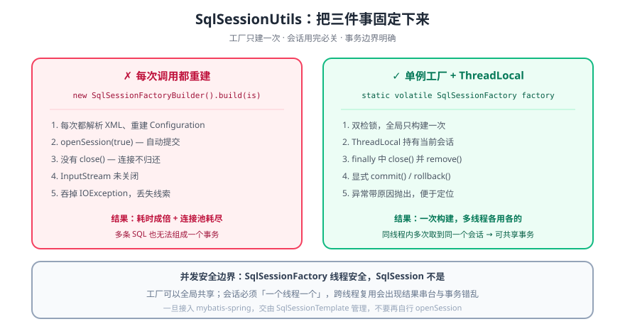

# 封装 SqlSessionUtils 工具类

> 直接 `new SqlSessionFactoryBuilder().build(is)` 再 `openSession(true)` 的写法能跑通，但它把「工厂构建」放进了每一次调用、把「事务边界」交给了自动提交、把「关闭」留给了调用方。本文把这三件事逐个拆开，给出可复用的工具类写法与验证方式。



## 一句话定位

一个合格的 `SqlSessionUtils` 只负责三件事：**保证 `SqlSessionFactory` 全局只构建一次**、**保证 `SqlSession` 用完必关**、**明确事务边界由谁提交/回滚**。除此之外的职责（DAO 调用、参数校验）都不该塞进来。

## 一、先看常见写法的五个问题

```java
public SqlSession SqlSessionUtils()  {
	InputStream is = null;
	try {
		is = Resources.getResourceAsStream("mybatis核心配置文件");
    } catch (IOException e) {
        throw new RuntimeException(e);
	}
    SqlSessionFactory build = new SqlSessionFactoryBuilder().build(is);
    return build.openSession(true);
}
```

这段代码在单机练习里「能用」，但每一条都埋着坑：

| # | 问题 | 后果 |
| --- | --- | --- |
| 1 | 名为 `SqlSessionUtils` 却是**实例方法**，且首字母大写 | 语义混乱，无法作为工具类静态调用 |
| 2 | **每次调用都重新构建 `SqlSessionFactory`** | 解析 XML、装配 `Configuration`、注册 `TypeHandler` 全量跑一遍；开销是 `openSession()` 的几十倍 |
| 3 | `openSession(true)` 自动提交 | 多条 SQL 无法组成一个事务，前一条已提交、后一条失败会造成数据不一致 |
| 4 | **没有 `close()`** | 每次调用借出一条连接却不归还，连接池很快耗尽；`SqlSession` **非线程安全**，也不能缓存复用 |
| 5 | 把 `IOException` 无差别包装 | 丢掉「配置文件路径写错」这个最关键线索，排查时只能靠猜 |

::: danger 最贵的是第 2 条
`SqlSessionFactoryBuilder().build()` 内部要读 XML、解析所有 `<mapper>`、建立 SQL 语句缓存。**它是「应用启动时做一次」的量级**，被搬到「每次查询」里，性能直接掉一个数量级；更糟的是 `is` 从没关闭，文件句柄会一直堆积。真正的规则只有一句：**`SqlSessionFactory` 是重对象且线程安全 → 全局唯一；`SqlSession` 是轻对象且非线程安全 → 一次请求一个。**
:::

## 二、工厂：只构建一次

```java
public final class SqlSessionUtils {

    private static volatile SqlSessionFactory factory;

    private SqlSessionUtils() {   // 工具类不允许实例化
    }

    public static SqlSessionFactory getFactory() {
        if (factory == null) {
            synchronized (SqlSessionUtils.class) {
                if (factory == null) {
                    try (InputStream is = Resources.getResourceAsStream("mybatis-config.xml")) {
                        if (is == null) {
                            throw new IllegalStateException("mybatis-config.xml 未在 classpath 中找到");
                        }
                        factory = new SqlSessionFactoryBuilder().build(is);
                    } catch (IOException e) {
                        throw new IllegalStateException("构建 SqlSessionFactory 失败", e);
                    }
                }
            }
        }
        return factory;
    }
}
```

两点说明：

- `volatile` + 双检锁是必要的。少了 `volatile`，别的线程可能看到一个「已赋值但尚未初始化完成」的引用（指令重排）。
- `try (InputStream is = ...)` 用 try-with-resources 保证流关闭，替换掉原来的 `null` 判断写法。

::: tip 生产环境通常不手写单例
接入 Spring 后，`SqlSessionFactory` 由 `SqlSessionFactoryBean`（或 starter 的自动配置）作为单例 Bean 管理。手写这段代码的价值在于**理解「为什么只能建一次」**，而不是真的要自己维护它。
:::

## 三、会话：一个线程一个

`SqlSession` 不是线程安全的，同时**同一个线程内的多次 DAO 调用需要共享同一个会话**，否则事务无从谈起。`ThreadLocal` 正好同时满足这两点。

```java
    private static final ThreadLocal<SqlSession> HOLDER = new ThreadLocal<>();

    /** 取当前线程的会话；没有就新建（默认手动提交） */
    public static SqlSession openSession() {
        return openSession(false);
    }

    public static SqlSession openSession(boolean autoCommit) {
        SqlSession session = HOLDER.get();
        if (session == null) {
            session = getFactory().openSession(autoCommit);
            HOLDER.set(session);
        }
        return session;
    }
```

```java
    public static <T> T getMapper(Class<T> type) {
        return openSession().getMapper(type);
    }
```

⚠️ 注意 `getMapper` 里调的是 `openSession()` 而**不是** `getFactory().openSession()`——前者复用线程内已有的会话，后者每次都新建并覆盖 `ThreadLocal`，会把事务边界撕成碎片。

## 四、事务与关闭：三个方法划边界

```java
    public static void commit() {
        SqlSession session = HOLDER.get();
        if (session != null) {
            session.commit();
        }
    }

    public static void rollback() {
        SqlSession session = HOLDER.get();
        if (session != null) {
            session.rollback();
        }
    }

    public static void close() {
        SqlSession session = HOLDER.get();
        if (session != null) {
            try {
                session.close();
            } finally {
                HOLDER.remove();   // 关键：不清除会污染线程池
            }
        }
    }
```

::: danger `HOLDER.remove()` 不能省
线程池会复用线程。如果只 `close()` 不 `remove()`，`ThreadLocal` 里残留着一个**已关闭的会话**，下一个请求在同一线程上拿到它——典型症状是「上一个请求的事务莫名其妙提交了」「`SqlSession was not registered for synchronization`」。这类 bug 在本地单线程测试时完全不出现。
:::

标准使用模板：

```java
public void transfer(Long from, Long to, BigDecimal amount) {
    SqlSession session = SqlSessionUtils.openSession();
    try {
        AccountMapper mapper = session.getMapper(AccountMapper.class);
        mapper.decrease(from, amount);
        mapper.increase(to, amount);
        SqlSessionUtils.commit();          // 两句 SQL 一起提交
    } catch (RuntimeException e) {
        SqlSessionUtils.rollback();        // 任一步失败，全部回滚
        throw e;
    } finally {
        SqlSessionUtils.close();           // 无论如何都要归还连接
    }
}
```

::: warning 别用 `openSession(true)` 图省事
自动提交模式下 `commit()` / `rollback()` 形同虚设，上面的异常分支永远回滚不了。**只要业务涉及多写操作，就必须手动提交。**
:::

## 五、接入 Spring 之后还要不要它

| 使用场景 | 应该用什么 |
| --- | --- |
| 手写 `main` 方法、集成测试、命令行工具 | 本文的 `SqlSessionUtils` |
| Spring Boot + `mybatis-spring-boot-starter` | `SqlSessionTemplate`（线程安全，内部已完成绑定与清理） |
| 需要注解式事务 | `@Transactional`，由 Spring 统一管理提交与回滚 |

一旦交给 Spring，**不要再自己 `openSession()` / `close()`**：两套生命周期混在一起，会出现「事务明明开了却不回滚」或「连接被提前关闭」。判断标准很简单——**谁创建，谁负责销毁**。

## 六、验证方式

> 以下命令需要本机具备 **JDK 17+** 与 MyBatis 依赖（`mybatis` + 一个 JDBC 驱动）。

```shell
# ① 工厂只构建一次：连续取两次，应为同一个实例
cat > /tmp/FactoryOnce.java <<'EOF'
public class FactoryOnce {
    public static void main(String[] args) {
        System.out.println(SqlSessionUtils.getFactory() == SqlSessionUtils.getFactory());
    }
}
EOF
javac -cp "lib/*:." -d /tmp /tmp/FactoryOnce.java
java  -cp "lib/*:/tmp" FactoryOnce
# 期望：true
```

```shell
# ② 同线程复用会话、跨线程隔离：应输出 true 与 true
cat > /tmp/SessionScope.java <<'EOF'
public class SessionScope {
    public static void main(String[] args) throws Exception {
        Object s1 = SqlSessionUtils.openSession();
        Object s2 = SqlSessionUtils.openSession();
        System.out.println("同线程复用: " + (s1 == s2));      // true

        final Object[] other = new Object[1];
        Thread t = new Thread(() -> other[0] = SqlSessionUtils.openSession());
        t.start();
        t.join();
        System.out.println("跨线程隔离: " + (s1 != other[0])); // true

        SqlSessionUtils.close();
    }
}
EOF
javac -cp "lib/*:." -d /tmp /tmp/SessionScope.java
java  -cp "lib/*:/tmp" SessionScope
# 期望：同线程复用: true / 跨线程隔离: true
```

```shell
# ③ close() 之后 ThreadLocal 已清空（再取应得到新实例）
# 在 SessionScope 的 close() 之后再调用一次 openSession()，
# 与 s1 比较应为 false —— 说明 remove() 生效、不会拿到已关闭的旧会话
```

::: warning 验证环境的诚实说明
本节给出的是**命令与期望值**，需要在具备 JDK 与 MyBatis 依赖的机器上执行。本文写作环境未安装 JDK，故三条判据均标记为 **⏳ 未在本机实测**，仅给出可直接复制的脚本与预期输出。
:::

## 七、深入阅读

- [SqlSession](SqlSession.md)：`SqlSession` 与四大执行对象（Executor / StatementHandler / ParameterHandler / ResultHandler）的关系
- [MyBatis 原理](SourcePrinciple.md)：从 `Configuration` 到 SQL 执行的完整链路
- [MyBatis 常见错误](Errors.md)：连接未关闭、`Invalid bound statement` 等典型报错的排查
- [MyBatis 概述](Overview.md)：整体能力地图
