# 面向切面：AOP

## 搭建项目

1. 创建项目，声明计算器接口Calculator，包含加减乘除的抽象方法：

   ```java [Calculator]
   public interface Calculator {

       int add(int i, int j);

       int sub(int i, int j);

       int mul(int i, int j);

       int div(int i, int j);

   }
   ```

   

2. 创建实现类：

   ```java [CalculatorImpl]
   @Component
   public class CalculatorImpl implements Calculator {

       @Override
       public int add(int i, int j) {

           int result = i + j;

           System.out.println("方法内部 result = " + result);

           return result;
       }

       @Override
       public int sub(int i, int j) {

           int result = i - j;

           System.out.println("方法内部 result = " + result);

           return result;
       }

       @Override
       public int mul(int i, int j) {

           int result = i * j;

           System.out.println("方法内部 result = " + result);

           return result;
       }

       @Override
       public int div(int i, int j) {

           int result = i / j;

           System.out.println("方法内部 result = " + result);

           return result;
       }
   }
   ```

3. 创建带日志功能的实现类：

   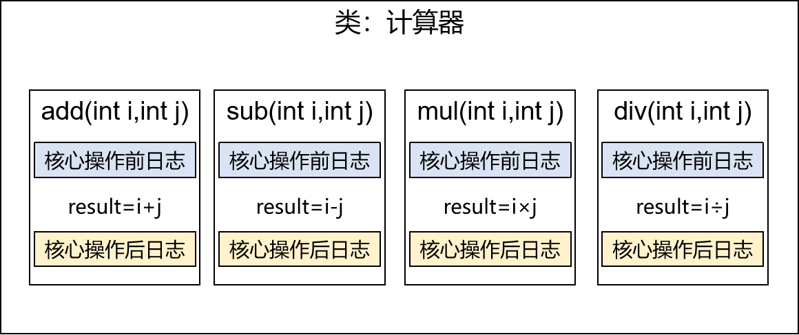

   ```java [CalculatorLogImpl]
   @Component
   public class CalculatorLogImpl implements Calculator {

       @Override
       public int add(int i, int j) {

           System.out.println("[日志] add 方法开始了，参数是：" + i + "," + j);

           int result = i + j;

           System.out.println("方法内部 result = " + result);

           System.out.println("[日志] add 方法结束了，结果是：" + result);

           return result;
       }

       @Override
       public int sub(int i, int j) {

           System.out.println("[日志] sub 方法开始了，参数是：" + i + "," + j);

           int result = i - j;

           System.out.println("方法内部 result = " + result);

           System.out.println("[日志] sub 方法结束了，结果是：" + result);

           return result;
       }

       @Override
       public int mul(int i, int j) {

           System.out.println("[日志] mul 方法开始了，参数是：" + i + "," + j);

           int result = i * j;

           System.out.println("方法内部 result = " + result);

           System.out.println("[日志] mul 方法结束了，结果是：" + result);

           return result;
       }

       @Override
       public int div(int i, int j) {

           System.out.println("[日志] div 方法开始了，参数是：" + i + "," + j);

           int result = i / j;

           System.out.println("方法内部 result = " + result);

           System.out.println("[日志] div 方法结束了，结果是：" + result);

           return result;
       }
   }
   ```

**①现有代码缺陷**

针对带日志功能的实现类，发现有如下缺陷：

- 对核心业务功能有干扰，导致程序员在开发核心业务功能时分散了精力
- 附加功能分散在各个业务功能方法中，不利于统一维护

**②解决思路**

解决这两个问题，核心就是：**解耦**。需要把附加功能从业务功能代码中抽取出来。 将重复的代码统一提取，并且**动态插入**到每个业务方法。

**③困难**

解决问题的困难：要抽取的代码在方法内部，靠以前把子类中的重复代码抽取到父类的方式没法解决。所以需要引入新的技术。

## AOP概念及相关术语

AOP (Aspect Oriented Programming，面向切面编程)是一种设计思想，是软件设计领域中的面向切面编程，它是面向对象编程的一种补充和完善，它以通过预编译方式和运行期动态代理方式实现，**在不修改源代码的情况下，给程序动态统一添加额外功能的一种技术**。利用AOP可以对业务逻辑的各个部分进行隔离，从而使得业务逻辑各部分之间的耦合度降低，提高程序的可重用性，同时提高了开发的效率。

AOP可以说是OOP（Object Oriented Programming，面向对象编程）的补充和完善。OOP引入封装、继承、多态等概念来建立一种对象层次结构，用于模拟公共行为的一个集合。不过OOP允许开发者定义纵向的关系，但并不适合定义横向的关系，例如日志功能。日志代码往往横向地散布在所有对象层次中，而与它对应的对象的核心功能毫无关系对于其他类型的代码，如安全性、异常处理和透明的持续性也都是如此，这种散布在各处的无关的代码被称为横切 (cross cutting)，在OOP设计中，它导致了大量代码的重复，而不利于各个模块的重用。

AOP技术恰恰相反，它利用一种称为"横切"的技术，剖解开封装的对象内部，并将那些影响了多个类的公共行为封装到一个可重用模块，并将其命名为"Aspect"，即切面。所谓"切面"，简单说就是那些与业务无关，却为业务模块所共同调用的逻辑或责任封装起来，便于减少系统的重复代码，降低模块之间的耦合度，并有利于未来的可操作性和可维护性。

### 相关术语

#### 横切关注点

分散在每个各个模块中解决同一样的问题，如用户验证、日志管理、事务处理、数据缓存都属于横切关注点。

这个概念不是语法层面的，而是根据附加功能的逻辑上的需要：有十个附加功能，就有十个横切关注点。

从每个方法中抽取出来的同一类非核心业务。在同一个项目中，可以使用多个横切关注点对相关方法进行多个不同方面的增强。

AOP把软件系统分为两个部分：核心关注点和横切关注点。业务处理的主要流程是核心关注点，与之关系不大的部分是横切关注点。横切关注点的一个特点是，他们经常发生在核心关注点的多处，而各处基本相似，比如权限认证、日志、事务、异常等。AOP的作用在于分离系统中的各种关注点，将核心关注点和横切关注点分离开来。


#### 通知（增强）

**增强，通俗说，就是你想要增强的功能，比如 安全，事务，日志等。**

每一个横切关注点上要做的事情都需要写一个方法来实现，这样的方法就叫通知方法。

- **前置通知**：在被代理的目标方法**前**执行
- **返回通知**：在被代理的目标方法**成功结束**后执行（**寿终正寝**）
- **异常通知**：在被代理的目标方法**异常结束**后执行（**死于非命**）
- **后置通知**：在被代理的目标方法**最终结束**后执行（**盖棺定论**）
- **环绕通知**：使用try...catch...finally结构围绕**整个**被代理的目标方法，包括上面四种通知对应的所有位置


#### 切面 aspect

封装通知方法的类。


#### 目标 target

被代理的目标对象。

#### 代理 proxy

向目标对象应用通知之后创建的代理对象。

#### 连接点 joinpoint

把方法排成一排，每一个横切位置看成x轴方向，把方法从上到下执行的顺序看成y轴，x轴和y轴的交叉点就是连接点。**通俗说，就是spring允许使用通知的地方 (被拦截到的点)**。在 Spring 中，可以被动态代理拦截目标类的方法

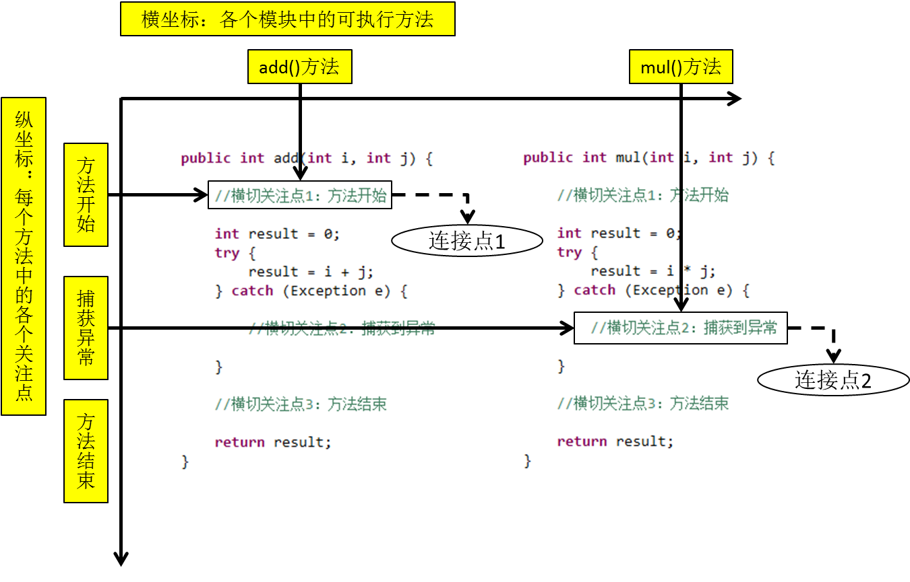


#### 切入点 pointcut

定位连接点的方式 (被选中的连接点)。

每个类的方法中都包含多个连接点，所以连接点是类中客观存在的事物（从逻辑上来说）。

如果把连接点看作数据库中的记录，那么切入点就是查询记录的 SQL 语句。

**Spring 的 AOP 技术可以通过切入点定位到特定的连接点。通俗说，要实际去增强的方法**

切点通过 org.springframework.aop.Pointcut 接口进行描述，它使用类和方法作为连接点的查询条件。

#### 织入 weave

指把通知应用到目标上，生成代理对象的过程。可以在编译期织入，也可以在运行期织入，Spring采用后者。

### 作用

- 简化代码：把方法中固定位置的重复的代码**抽取**出来，让被抽取的方法更专注于自己的核心功能，提高内聚性。

- 代码增强：把特定的功能封装到切面类中，看哪里有需要，就往上套，被**套用**了切面逻辑的方法就被切面给增强了。

### 应用场景

AOP (面向切面编程) 是一种编程范式，它通过将通用的横切关注点 (如日志、事务、权限控制等) 与业务逻辑分离，使得代码更加清晰、简洁、易于维护。AOP可以应用于各种场景。

**常见的AOP应用场景**：

1.  **日志记录**：在系统中记录日志是非常重要的，可以使用AOP来实现日志记录的功能，可以在方法执行前、执行后或异常抛出时记录日志。
2.  **事务处理**：在数据库操作中使用事务可以保证数据的一致性，可以使用AOP来实现事务处理的功能，可以在方法开始前开启事务，在方法执行完毕后提交或回滚事务。
3.  **安全控制**：在系统中包含某些需要安全控制的操作，如登录、修改密码、授权等，可以使用AOP来实现安全控制的功能。可以在方法执行前进行权限判断，如果用户没有权限，则抛出异常或转向到错误页面，以防止未经授权的访问。
4.  **性能监控**：在系统运行过程中，有时需要对某些方法的性能进行监控，以找到系统的瓶颈并进行优化。可以使用AOP来实现性能监控的功能，可以在方法执行前记录时间戳，在方法执行完毕后计算方法执行时间并输出到日志中。
5.  **异常处理**：系统中可能出现各种异常情况，如空指针异常、数据库连接异常等，可以使用AOP来实现异常处理的功能，在方法执行过程中，如果出现异常，则进行异常处理（如记录日志、发送邮件等）。
6.  **缓存控制**：在系统中有些数据可以缓存起来以提高访问速度，可以使用AOP来实现缓存控制的功能，可以在方法执行前查询缓存中是否有数据，如果有则返回，否则执行方法并将方法返回值存入缓存中。
7.  **动态代理**：AOP的实现方式之一是通过动态代理，可以代理某个类的所有方法，用于实现各种功能。

综上所述，AOP可以应用于各种场景，它的作用是将通用的横切关注点与业务逻辑分离，使得代码更加清晰、简洁、易于维护。

## 基于注解的AOP

1. 完全注解方式指的是去掉xml文件，使用配置类 + 注解实现

2. xml文件替换成使用@Configuration注解标记的类

3. 标记IoC注解：@Component,@Service,@Controller,@Repository

4. 标记DI注解：@Autowired @Qualifier @Resource @Value

5. `<context:component-scan>`标签指定注解范围使用`@ComponentScan(basePackages = {"com.hjc.demo.components"})`替代

6. `<context:property-placeholder>`引入外部配置文件使用
7. `@PropertySource({"classpath:application.properties","classpath:jdbc.properties"})`替代

8. `<bean>` 标签使用@Bean注解和方法实现

9. IoC具体容器实现选择AnnotationConfigApplicationContext对象

### 底层技术组成

动态代理(InvocationHandler)：JDK原生的实现方式，需要被代理的目标类必须实现接口。因为这个技术要求**代理对象和目标对象实现同样的接口**。

动态代理分为**JDK动态代理**和**cglib动态代理**

当目标类有接口的情况使用**JDK动态代理**和**cglib动态代理**，没有接口时只能使用**cglib动态代理**：

- JDK动态代理动态生成的代理类会在com.sun.proxy包下，类名为$proxy1，和目标类实现相同的接口。
- cglib动态代理动态生成的代理类会和目标在在相同的包下，会继承目标类。通过**继承被代理的目标类**实现代理，所以不需要目标类实现接口。

动态代理(InvocationHandler)：JDK原生的实现方式，需要被代理的目标类必须实现接口。因为这个技术要求**代理对象和目标对象实现同样的接口**。

AspectJ：是AOP思想的一种实现。本质上是静态代理，**将代理逻辑"织入"被代理的目标类编译得到的字节码文件**，所以最终效果是动态的。weaver就是织入器。Spring只是借用了AspectJ中的注解。


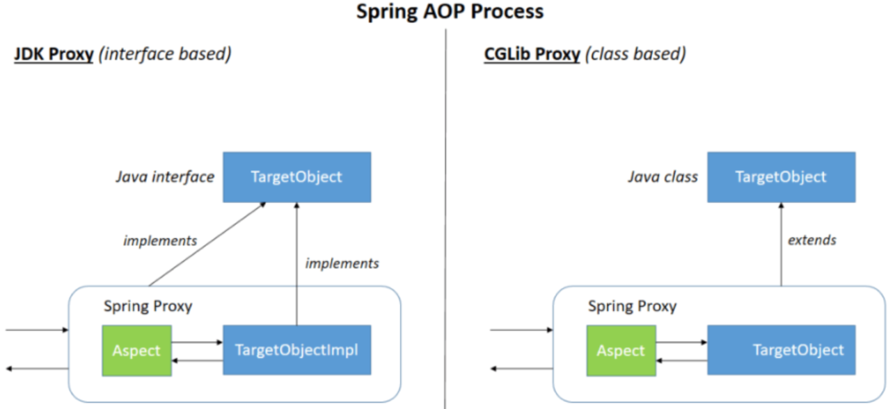

AOP一种区别于OOP的编程思维，用来完善和解决OOP的非核心代码冗余和不方便统一维护问题。

代理技术（动态代理|静态代理）是实现AOP思维编程的具体技术，但是自己使用动态代理实现代码比较繁琐。

Spring AOP框架，基于AOP编程思维，封装动态代理技术，简化动态代理技术实现的框架。SpringAOP内部帮助我们实现动态代理，我们只需写少量的配置，指定生效范围即可,即可完成面向切面思维编程的实现。

### 添加依赖

**添加依赖**：

```xml
<dependencies>
    <!--spring context依赖-->
    <!--当你引入Spring Context依赖之后，表示将Spring的基础依赖引入了-->
    <dependency>
        <groupId>org.springframework</groupId>
        <artifactId>spring-context</artifactId>
        <version>6.0.10</version>
    </dependency>

    <!--spring aop依赖-->
    <dependency>
        <groupId>org.springframework</groupId>
        <artifactId>spring-aop</artifactId>
        <version>6.0.10</version>
    </dependency>
    <!--spring aspects依赖-->
    <dependency>
        <groupId>org.springframework</groupId>
        <artifactId>spring-aspects</artifactId>
        <version>6.0.10</version>
    </dependency>

    <!--junit5测试-->
    <dependency>
        <groupId>org.junit.jupiter</groupId>
        <artifactId>junit-jupiter-api</artifactId>
        <version>5.3.1</version>
    </dependency>

    <!--log4j2的依赖-->
    <dependency>
        <groupId>org.apache.logging.log4j</groupId>
        <artifactId>log4j-core</artifactId>
        <version>2.19.0</version>
    </dependency>
    <dependency>
        <groupId>org.apache.logging.log4j</groupId>
        <artifactId>log4j-slf4j2-impl</artifactId>
        <version>2.19.0</version>
    </dependency>
</dependencies>
```

### 创建切面类并配置

```java
import org.aspectj.lang.annotation.*;
import org.springframework.stereotype.Component;

// @Aspect表示这个类是一个切面类
@Aspect
// @Component注解保证这个切面类能够放入IOC容器
@Component
public class LogAspect {
    //设置切入点和通知类型

    //切入点表达式: execution(访问修饰符 增强方法返回类型 增强方法所在类全路径.方法名称(方法参数))
    @Pointcut("execution(public int com.hjc.demo.CalculatorImpl.*(..))")
    public void pointCut(){}

    /**
     * 前置通知 @Before(value="切入点表达式配置切入点")
     * value属性：指定切入点表达式，由切入点表达式控制当前通知方法要作用在哪一个目标方法上
     * @param joinPoint
     */
//    @Before("execution(public int com.hjc.demo.CalculatorImpl.*(..))")
//    @Before("pointCut()")
    @Order(1)
    @Before("com.hjc.demo.LogAspect.pointCut()")
    public void beforeMethod(JoinPoint joinPoint) {
        String methodName = joinPoint.getSignature().getName();
        String args = Arrays.toString(joinPoint.getArgs());
        System.out.println("Logger-->前置通知，方法名：" + methodName + "，参数：" + args);
    }

    /**
     * 后置通知 @After(value="切入点表达式配置切入点")
     * value属性：指定切入点表达式，由切入点表达式控制当前通知方法要作用在哪一个目标方法上
     * @param joinPoint
     */
    @After("execution(* com.hjc.demo.CalculatorImpl.*(..))")
    public void afterMethod(JoinPoint joinPoint) {
        String methodName = joinPoint.getSignature().getName();
        System.out.println("Logger-->后置通知，方法名：" + methodName);
    }

    /**
     * 返回通知
     * value属性：指定切入点表达式，由切入点表达式控制当前通知方法要作用在哪一个目标方法上
     * @param joinPoint
     * @param result
     */
    @AfterReturning(value = "execution(* com.hjc.demo.CalculatorImpl.*(..))", returning = "result")
    public void afterReturningMethod(JoinPoint joinPoint, Object result) {
        String methodName = joinPoint.getSignature().getName();
        System.out.println("Logger-->返回通知，方法名：" + methodName + "，结果：" + result);
    }

    /**
     * 异常通知
     * 目标方法出现异常，这个通知执行
     * value属性：指定切入点表达式，由切入点表达式控制当前通知方法要作用在哪一个目标方法上
     * @param joinPoint
     * @param ex
     */
    @AfterThrowing(value = "execution(* com.hjc.demo.CalculatorImpl.*(..))", throwing = "ex")
    public void afterThrowingMethod(JoinPoint joinPoint, Throwable ex) {
        String methodName = joinPoint.getSignature().getName();
        System.out.println("Logger-->异常通知，方法名：" + methodName + "，异常：" + ex);
    }

    /**
     * 环绕通知
     *
     * @param joinPoint
     * @return
     */
    @Around("execution(* com.hjc.demo.CalculatorImpl.*(..))")
    public Object aroundMethod(ProceedingJoinPoint joinPoint) {
        String methodName = joinPoint.getSignature().getName();
        String args = Arrays.toString(joinPoint.getArgs());
        Object result = null;
        try {
            System.out.println("环绕通知-->目标对象方法执行之前：" + methodName + "，参数：" + args);
            //目标对象（连接点）方法的执行
            result = joinPoint.proceed();
            System.out.println("环绕通知-->目标对象方法返回值之后：" + methodName + "，参数：" + args);
        } catch (Throwable throwable) {
            throwable.printStackTrace();
            System.out.println("环绕通知-->目标对象方法出现异常时：" + methodName + "，参数：" + args);
        } finally {
            System.out.println("环绕通知-->目标对象方法执行完毕：" + methodName + "，参数：" + args);
        }
        return result;
    }
}
```

开启aspectj注解支持：

- xml方式配置：

  ```xml [beans.xml]
  <?xml version="1.0" encoding="UTF-8"?>
  <beans xmlns="http://www.springframework.org/schema/beans"
         xmlns:xsi="http://www.w3.org/2001/XMLSchema-instance"
         xmlns:context="http://www.springframework.org/schema/context"
         xmlns:aop="http://www.springframework.org/schema/aop"
         xsi:schemaLocation="http://www.springframework.org/schema/beans
         http://www.springframework.org/schema/beans/spring-beans.xsd
         http://www.springframework.org/schema/context
         http://www.springframework.org/schema/context/spring-context.xsd
         http://www.springframework.org/schema/aop
         http://www.springframework.org/schema/aop/spring-aop.xsd">
      <!--
          基于注解的AOP的实现：
          1、将目标对象和切面交给IOC容器管理（注解+扫描）
          2、开启AspectJ的自动代理，为目标对象自动生成代理
          3、将切面类通过注解@Aspect标识
      -->

      <!-- 进行包扫描-->
      <context:component-scan base-package="com.hjc.demo"></context:component-scan>
      <!-- 开启aspectj框架注解支持-->
      <aop:aspectj-autoproxy />
  </beans>
  ```

- 使用全注解方式配置：

  ```java
  @Configuration
  @ComponentScan(basePackages = "com.hjc.demo")
  //作用等于 <aop:aspectj-autoproxy /> 配置类上开启 Aspectj注解支持
  @EnableAspectJAutoProxy
  public class MyConfig {
  }
  ```

执行测试：

```java
//@SpringJUnitConfig(locations = "classpath:beans.xml")
@SpringJUnitConfig(value = {MyConfig.class})
public class CalculatorTest {

    private Logger logger = LoggerFactory.getLogger(CalculatorTest.class);

    @Autowired
    private Calculator calculator;

    @Test
    public void testAdd(){
        int add = calculator.add(1, 1);
        logger.info("执行成功:"+add);
    }

}
```

执行结果：

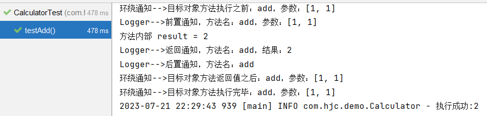

### 各种通知

- **前置通知**：使用`@Before`注解标识，在被代理的目标方法**前**执行
- **返回通知**：使用`@AfterReturning`注解标识，在被代理的目标方法**成功结束**后执行(**寿终正寝**)
- **异常通知**：使用`@AfterThrowing`注解标识，在被代理的目标方法**异常结束**后执行(**死于非命**)
- **后置通知**：使用`@After`注解标识，在被代理的目标方法**最终结束**后执行(**盖棺定论**)
- **环绕通知**：使用`@Around`注解标识，使用try...catch...finally结构围绕**整个**被代理的目标方法，包括上面四种通知对应的所有位置

### 各种通知的执行顺序

Spring版本5.3.x以前：

- 前置通知
- 目标操作
- 后置通知
- 返回通知或异常通知

Spring版本5.3.x以后：

- 前置通知
- 目标操作
- 返回通知或异常通知
- 后置通知

### 切入点表达式语法

AOP切点表达式 (Pointcut Expression) 是一种用于指定切点的语言，它可以通过定义匹配规则，来选择需要被切入的目标对象。

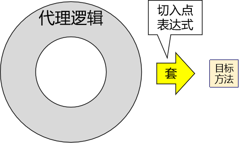

**语法细节**：

- 用`*`号代替"权限修饰符"和"返回值"部分表示"权限修饰符"和"返回值"不限。
- 在包名的部分：一个"`*`"号只能代表包的层次结构中的一层，表示这一层是任意的。
  - `*.Hello`匹配`com.Hello`，不匹配`com.hjc.Hello`
- 在包名的部分：使用"`*..`"表示包名任意、包的层次深度任意
- 在类名的部分：类名部分整体用`*`号代替，表示类名任意
- 在类名的部分：可以使用`*`号代替类名的一部分

  - 例如：`*Service`匹配所有名称以Service结尾的类或接口

- 在方法名部分：可以使用`*`号表示方法名任意
- 在方法名部分：可以使用`*`号代替方法名的一部分

  - 例如：`*Operation`匹配所有方法名以Operation结尾的方法

- 在方法参数列表部分：使用`(..)`表示参数列表任意
- 在方法参数列表部分：使用`(int,..)`表示参数列表以一个int类型的参数开头
- 在方法参数列表部分：基本数据类型和对应的包装类型是不一样的
  - 切入点表达式中使用 int 和实际方法中 Integer 是不匹配的
- 在方法返回值部分：如果想要明确指定一个返回值类型，那么必须同时写明权限修饰符
  - 例如：`execution(public int *..*Service.*(.., int))` 正确
    例如：`execution(* int *..*Service.*(.., int))` 错误

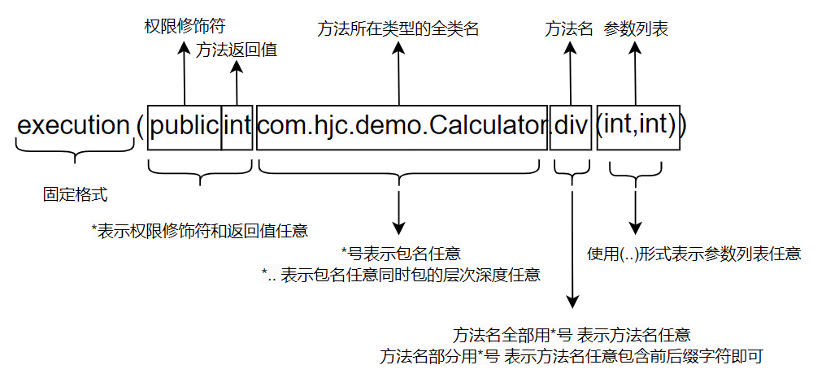

**语法细节**：

- execution( ) 固定开头

- 方法访问修饰符

  ```java
  public private 直接描述对应修饰符即可
  ```

- 方法返回值

  ```java
  int String void 直接描述返回值类型
  ```

  **注意**：

  - 特殊情况 不考虑 访问修饰符和返回值

  - execution(\* \* ) 这是错误语法

  - execution( \*) == 你只要考虑返回值 或者 不考虑访问修饰符 相当于全部不考虑了

- 指定包的地址

  **固定的包**：com.hjc.api | service | dao
  **单层的任意命名**：com.hjc._ = com.hjc.api com.hjc.dao _ = 任意一层的任意命名
  **任意层任意命名**：com.. = com.hjc.api.erdaye com.a.a.a.a.a.a.a ..任意层,任意命名 用在包上

  注意: `..`不能用作包开头 public int .. 错误语法 com..
  找到任何包下: `*..`

- 指定类名称

  ```java
  固定名称: UserService
  任意类名: *
  部分任意: com..service.impl.*Impl
  任意包任意类: *..*
  ```

- 指定方法名称

  ```java
  语法和类名一致
  任意访问修饰符,任意类的任意方法: * *..*.*
  ```

- 方法参数

  ```java
  第七位: 方法的参数描述
         具体值: (String,int) != (int,String) 没有参数 ()
         模糊值: 任意参数 有 或者 没有 (..)  ..任意参数的意识
         部分具体和模糊:
           第一个参数是字符串的方法 (String..)
           最后一个参数是字符串 (..String)
           字符串开头,int结尾 (String..int)
           包含int类型(..int..)
  ```

### 重用切入点表达式

**声明**：

```java
@Pointcut("execution(* com.hjc.demo.annotation.*.*(..))")
public void pointCut(){}
```

**在同一个切面中使用**：

```java
@Before("pointCut()")
public void beforeMethod(JoinPoint joinPoint){
    String methodName = joinPoint.getSignature().getName();
    String args = Arrays.toString(joinPoint.getArgs());
    System.out.println("Logger-->前置通知，方法名："+methodName+"，参数："+args);
}
```

**在不同切面中使用**：

```java
@Before("com.hjc.demo.LogAspect.pointCut()")
public void beforeMethod(JoinPoint joinPoint){
    String methodName = joinPoint.getSignature().getName();
    String args = Arrays.toString(joinPoint.getArgs());
    System.out.println("Logger-->前置通知，方法名："+methodName+"，参数："+args);
}
```

### 获取通知的相关信息

**JointPoint接口**：需要获取方法签名、传入的实参等信息时，可以在通知方法声明JoinPoint类型的形参。

- JoinPoint 接口通过 getSignature() 方法获取目标方法的签名（方法声明时的完整信息）
- 通过目标方法签名对象获取方法名
- 通过 JoinPoint 对象获取外界调用目标方法时传入的实参列表组成的数组

#### 获取连接点信息

获取连接点信息可以在通知方法的参数位置设置 JoinPoint类型的形参：

```java
// @Before注解标记前置通知方法
// value属性：切入点表达式，告诉Spring当前通知方法要套用到哪个目标方法上
// 在前置通知方法形参位置声明一个JoinPoint类型的参数，Spring就会将这个对象传入
// 根据JoinPoint对象就可以获取目标方法名称、实际参数列表
@Before("execution(public int com.hjc.demo.CalculatorImpl.*(..))")
public void beforeMethod(JoinPoint joinPoint){
    // 通过JoinPoint对象获取目标方法签名对象
    // 方法的签名：一个方法的全部声明信息
    Signature signature = joinPoint.getSignature();

    //通过方法的签名对象获取目标方法的详细信息
    String methodName = joinPoint.getSignature().getName();
    //通过JoinPoint对象获取外界调用目标方法时传入的实参列表
    //由于数组直接打印看不到具体数据，所以转换为List集合
    String args = Arrays.toString(joinPoint.getArgs());

    int modifiers = signature.getModifiers();
    System.out.println("modifiers = " + modifiers);

    String declaringTypeName = signature.getDeclaringTypeName();
    System.out.println("declaringTypeName = " + declaringTypeName);
    System.out.println("Logger-->前置通知，方法名："+methodName+"，参数："+args);
}
```

#### 获取目标方法的返回值

在返回通知中，通过`@AfterReturning`中的属性returning，将通知方法的某个形参，接收目标方法的返回值。

```java
// @AfterReturning注解标记返回通知方法
// 在返回通知中获取目标方法返回值分两步：
// 第一步：在@AfterReturning注解中通过returning属性设置一个名称
// 第二步：使用returning属性设置的名称在通知方法中声明一个对应的形参
@AfterReturning(value = "execution(* com.hjc.demo.CalculatorImpl.*(..))", returning = "result")
public void afterReturningMethod(JoinPoint joinPoint, Object result){
    String methodName = joinPoint.getSignature().getName();
    System.out.println("Logger-->返回通知，方法名："+methodName+"，结果："+result);
}
```

#### 获取目标方法的异常

在异常通知中，通过`@AfterThrowing`中的属性throwing，用来将通知方法的某个形参，接收目标方法的异常。

```java
// @AfterThrowing注解标记异常通知方法
// 在异常通知中获取目标方法抛出的异常分两步：
// 第一步：在@AfterThrowing注解中声明一个throwing属性设定形参名称
// 第二步：使用throwing属性指定的名称在通知方法声明形参，Spring会将目标方法抛出的异常对象从这里传给我们
@AfterThrowing(value = "execution(* com.hjc.demo.CalculatorImpl.*(..))", throwing = "ex")
public void afterThrowingMethod(JoinPoint joinPoint, Throwable ex){
    String methodName = joinPoint.getSignature().getName();
    System.out.println("Logger-->异常通知，方法名："+methodName+"，异常："+ex);
}
```

### 环绕通知

环绕通知对应整个 try...catch...finally 结构，包括前面四种通知的所有功能。

```java
// 使用@Around注解标明环绕通知方法
@Around("execution(* com.hjc.demo.CalculatorImpl.*(..))")
// 通过在通知方法形参位置声明ProceedingJoinPoint类型的形参，将这个类型的对象传给我们
public Object aroundMethod(ProceedingJoinPoint joinPoint){
    // 通过签名对象获取目标方法的方法名
    String methodName = joinPoint.getSignature().getName();
    // 通过ProceedingJoinPoint对象获取外界调用目标方法时传入的实参数组
    String args = Arrays.toString(joinPoint.getArgs());

    // 通过ProceedingJoinPoint对象获取目标方法的签名对象
    Signature signature = joinPoint.getSignature();
    // 声明变量用来存储目标方法的返回值
    Object result = null;
    try {
        System.out.println("环绕通知-->目标对象方法执行之前");
        //目标方法的执行，目标方法的返回值一定要返回给外界调用者
        result = joinPoint.proceed();
        System.out.println("环绕通知-->目标对象方法返回值之后");
    } catch (Throwable throwable) {
        // 在目标方法抛异常后：回滚事务
        throwable.printStackTrace();
        System.out.println("环绕通知-->目标对象方法出现异常时");
    } finally {
        // 在目标方法最终结束后：释放数据库连接
        System.out.println("环绕通知-->目标对象方法执行完毕");
    }
    return result;
}
```

### 切面的优先级

相同目标方法上同时存在多个切面时，切面的优先级控制切面的**内外嵌套**顺序。

- 优先级高的切面：外面
- 优先级低的切面：里面

使用`@Order`注解可以控制切面的优先级：

- `@Order(较小的数)`：优先级高
- `@Order(较大的数)`：优先级低


实际开发时，如果有多个切面嵌套的情况，要慎重考虑。例如：如果事务切面优先级高，那么在缓存中命中数据的情况下，事务切面的操作都浪费了。


此时应该将缓存切面的优先级提高，在事务操作之前先检查缓存中是否存在目标数据。


### CGLib动态代理生效

在目标类没有实现任何接口的情况下，Spring会自动使用cglib技术实现代理。

```java
@Service
public class EmployeeService {

    public void getEmpList() {
       System.out.print("方法内部 com.atguigu.aop.imp.EmployeeService.getEmpList");
    }
}
```

测试：

```java
  @Autowired
  private EmployeeService employeeService;

  @Test
  public void testNoInterfaceProxy() {
      employeeService.getEmpList();
  }
```

没有接口：

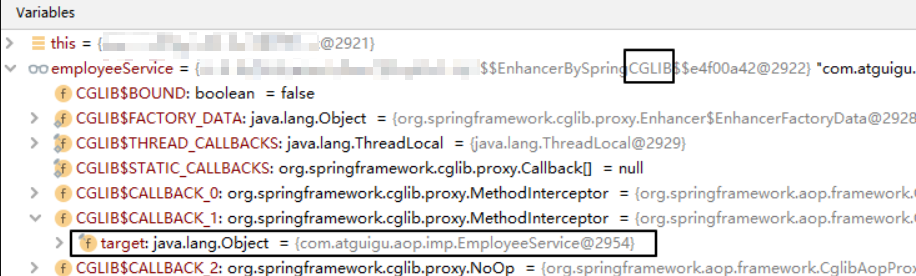

有接口：

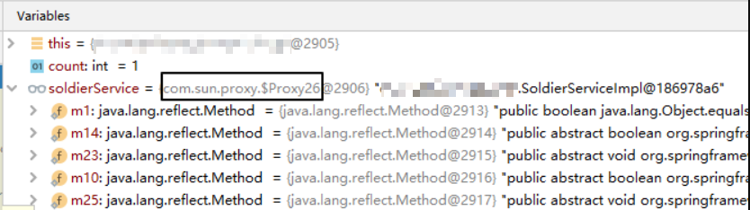

使用总结：

1. 如果目标类有接口，选择使用jdk动态代理
2. 如果目标类没有接口，选择cglib动态代理
3. 如果有接口，接口接值
4. 如果没有接口，类进行接值

## 基于XML的AOP

**XML方式配置**：

1. 所有内容写到xml格式配置文件中

2. 声明bean通过`<bean>`标签

3. `<bean>`标签包含基本信息（id,class）和属性信息 `<property name value / ref>`

4. 引入外部的properties文件可以通过`<context:property-placeholder>`

5. IoC具体容器实现选择ClassPathXmlApplicationContext对象

**XML+注解方式配置**：

1.  注解负责标记IoC的类和进行属性装配
2.  xml文件依然需要，需要通过`<context:component-scan>`标签指定注解范围
3.  标记IoC注解：@Component,@Service,@Controller,@Repository&#x20;
4.  标记DI注解：@Autowired @Qualifier @Resource @Value
5.  IoC具体容器实现选择ClassPathXmlApplicationContext对象

---

创建项目，声明计算器接口Calculator，包含加减乘除的抽象方法：

```java [Calculator]
public interface Calculator {

    int add(int i, int j);

    int sub(int i, int j);

    int mul(int i, int j);

    int div(int i, int j);

}
```

创建实现类：

```java [CalculatorImpl]
@Component
public class CalculatorImpl implements Calculator {

    @Override
    public int add(int i, int j) {

        int result = i + j;

        System.out.println("方法内部 result = " + result);

        return result;
    }

    @Override
    public int sub(int i, int j) {

        int result = i - j;

        System.out.println("方法内部 result = " + result);

        return result;
    }

    @Override
    public int mul(int i, int j) {

        int result = i * j;

        System.out.println("方法内部 result = " + result);

        return result;
    }

    @Override
    public int div(int i, int j) {

        int result = i / j;

        System.out.println("方法内部 result = " + result);

        return result;
    }
}
```

创建切面类：

```java [LogAspect]
// @Component注解保证这个切面类能够放入IOC容器
@Component
public class LogAspect {
    //通知类型

    /**
     * 前置通知 @Before(value="切入点表达式配置切入点")
     *
     * @param joinPoint
     */
//    @Before("execution(public int com.hjc.demo.CalculatorImpl.*(..))")
//    @Before("pointCut()")
    public void beforeMethod(JoinPoint joinPoint) {
        String methodName = joinPoint.getSignature().getName();
        String args = Arrays.toString(joinPoint.getArgs());
        System.out.println("Logger-->前置通知，方法名：" + methodName + "，参数：" + args);
    }

    /**
     * 后置通知 @After(value="切入点表达式配置切入点")
     *
     * @param joinPoint
     */
    public void afterMethod(JoinPoint joinPoint) {
        String methodName = joinPoint.getSignature().getName();
        System.out.println("Logger-->后置通知，方法名：" + methodName);
    }

    /**
     * 返回通知
     *
     * @param joinPoint
     * @param result
     */
    public void afterReturningMethod(JoinPoint joinPoint, Object result) {
        String methodName = joinPoint.getSignature().getName();
        System.out.println("Logger-->返回通知，方法名：" + methodName + "，结果：" + result);
    }

    /**
     * 异常通知
     * 目标方法出现异常，这个通知执行
     * @param joinPoint
     * @param ex
     */
    public void afterThrowingMethod(JoinPoint joinPoint, Throwable ex) {
        String methodName = joinPoint.getSignature().getName();
        System.out.println("Logger-->异常通知，方法名：" + methodName + "，异常：" + ex);
    }

    /**
     * 环绕通知
     *
     * @param joinPoint
     * @return
     */
    public Object aroundMethod(ProceedingJoinPoint joinPoint) {
        String methodName = joinPoint.getSignature().getName();
        String args = Arrays.toString(joinPoint.getArgs());
        Object result = null;
        try {
            System.out.println("环绕通知-->目标对象方法执行之前：" + methodName + "，参数：" + args);
            //目标对象（连接点）方法的执行
            result = joinPoint.proceed();
            System.out.println("环绕通知-->目标对象方法返回值之后：" + methodName + "，参数：" + args);
        } catch (Throwable throwable) {
            throwable.printStackTrace();
            System.out.println("环绕通知-->目标对象方法出现异常时：" + methodName + "，参数：" + args);
        } finally {
            System.out.println("环绕通知-->目标对象方法执行完毕：" + methodName + "，参数：" + args);
        }
        return result;
    }
}
```

在Spring的配置文件中配置：

```xml [beans.xml]
<!--开启注解扫描-->
    <context:component-scan base-package="com.hjc.demo"></context:component-scan>

    <!--配置aop五种通知类型-->
    <aop:config>
        <!--配置切面类-->
        <!-- ref属性：关联切面类的bean -->
        <aop:aspect ref="logAspect">
            <!--配置切入点-->
            <aop:pointcut id="pointCut"
                          expression="execution(public int com.hjc.demo.CalculatorImpl.*(..))"/>
            <!--配置五种通知类型-->

            <!--前置通知-->
            <!-- method属性：指定前置通知的方法名 -->
            <!-- pointcut-ref属性：引用切入点表达式 -->
            <aop:before method="beforeMethod" pointcut-ref="pointCut"></aop:before>
            <!--后置通知-->
            <aop:after method="afterMethod" pointcut-ref="pointCut"></aop:after>
            <!--返回通知-->
            <!-- returning属性：指定通知方法中用来接收目标方法返回值的参数名 -->
            <aop:after-returning method="afterReturningMethod" returning="result" pointcut-ref="pointCut"></aop:after-returning>
            <!--异常通知-->
            <!-- throwing属性：指定通知方法中用来接收目标方法抛出异常的异常对象的参数名 -->
            <aop:after-throwing method="afterThrowingMethod" throwing="ex" pointcut-ref="pointCut"></aop:after-throwing>
            <!--环绕通知-->
            <aop:around method="aroundMethod" pointcut-ref="pointCut"></aop:around>
        </aop:aspect>
    </aop:config>
```

执行测试：

```java
public class CalculatorTest {
    private Logger logger = LoggerFactory.getLogger(Calculator.class);

    @Test
    void testAdd() {
        ApplicationContext context = new ClassPathXmlApplicationContext("beans.xml");
        Calculator calculator = context.getBean(Calculator.class);
        int add = calculator.add(1, 1);
        logger.info("执行成功:" + add);
    }
}
```

执行结果：


## Spring AOP对获取Bean的影响理解

### 根据类型装配 bean

1. 情景一

   - bean 对应的类没有实现任何接口

   - 根据 bean 本身的类型获取 bean

     - 测试：IOC容器中同类型的 bean 只有一个

       正常获取到 IOC 容器中的那个 bean 对象

     - 测试：IOC 容器中同类型的 bean 有多个

       会抛出 NoUniqueBeanDefinitionException 异常，表示 IOC 容器中这个类型的 bean 有多个

2. 情景二

   - bean 对应的类实现了接口，这个接口也只有这一个实现类
     - 测试：根据接口类型获取 bean
     - 测试：根据类获取 bean
     - 结论：上面两种情况其实都能够正常获取到 bean，而且是同一个对象

3. 情景三

   - 声明一个接口

   - 接口有多个实现类

   - 接口所有实现类都放入 IOC 容器

     - 测试：根据接口类型获取 bean

       会抛出 NoUniqueBeanDefinitionException 异常，表示 IOC 容器中这个类型的 bean 有多个

     - 测试：根据类获取bean

       正常

4. 情景四

   - 声明一个接口

   - 接口有一个实现类

   - 创建一个切面类，对上面接口的实现类应用通知

     - 测试：根据接口类型获取bean

       正常

     - 测试：根据类获取bean

       无法获取
       原因分析：

   - 应用了切面后，真正放在IOC容器中的是代理类的对象

   - 目标类并没有被放到IOC容器中，所以根据目标类的类型从IOC容器中是找不到的

     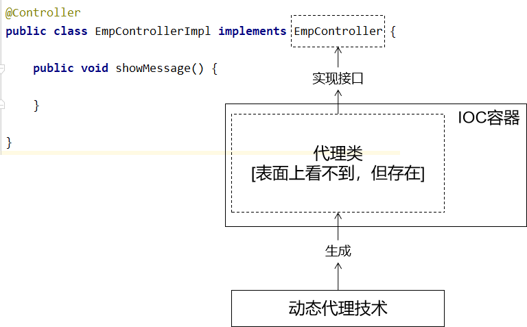

5. 情景五

   - 声明一个类

   - 创建一个切面类，对上面的类应用通知

     - 测试：根据类获取 bean，能获取到
       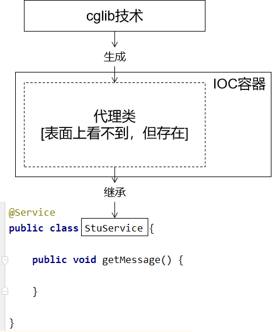
       debug查看实际类型：

     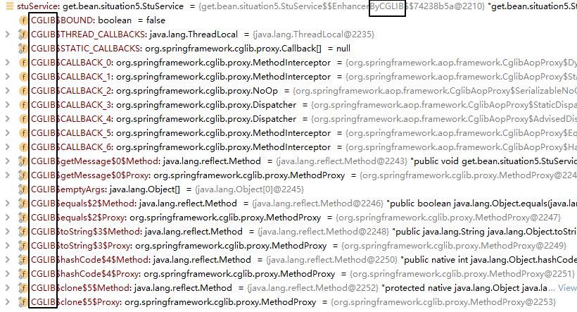

### 使用总结

对实现了接口的类应用切面

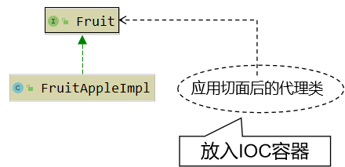

对没实现接口的类应用切面new

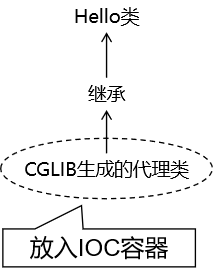

**如果使用AOP技术，目标类有接口，必须使用接口类型接收IoC容器中代理组件**

::: tip 原理延伸
Spring AOP 的底层就是动态代理：有接口时用 JDK 代理，无接口时用 CGLIB 子类代理。完整原理与手写拦截器链见 [动态代理专题](../../../JavaSE/Reflection/DynamicProxy/index.md)。
:::
