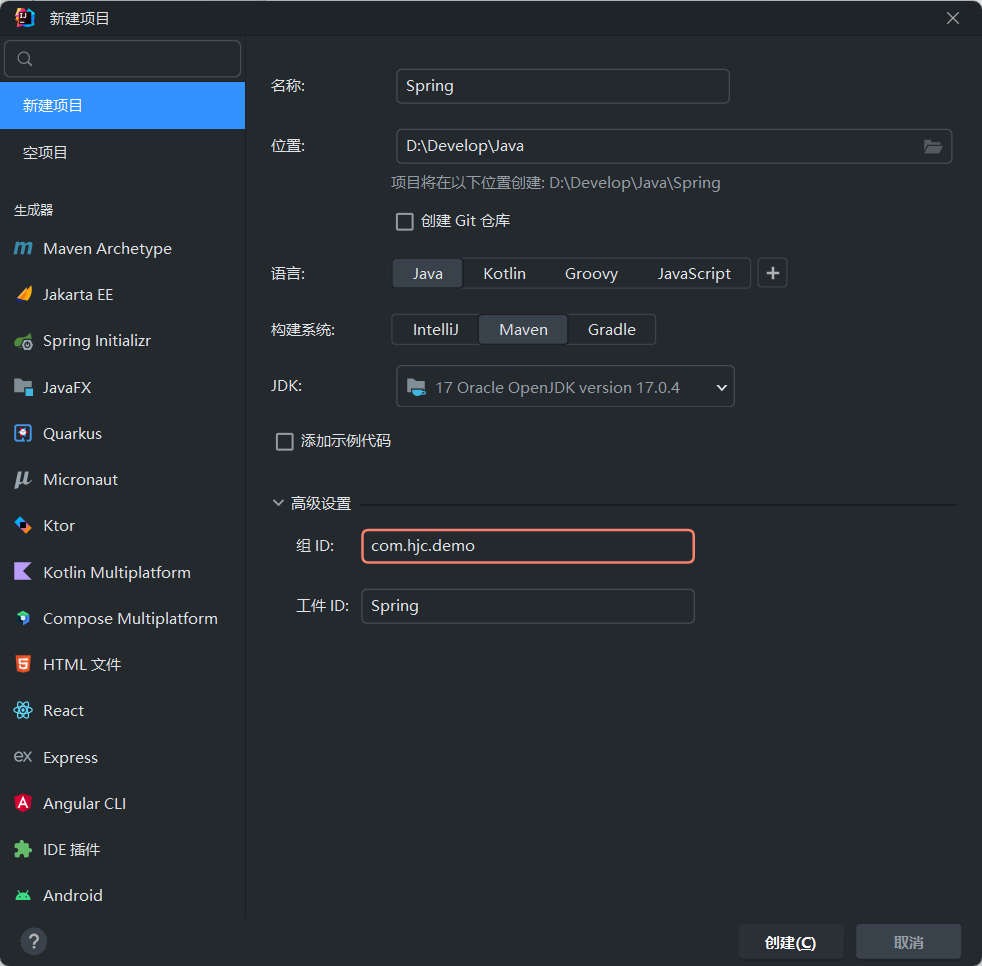
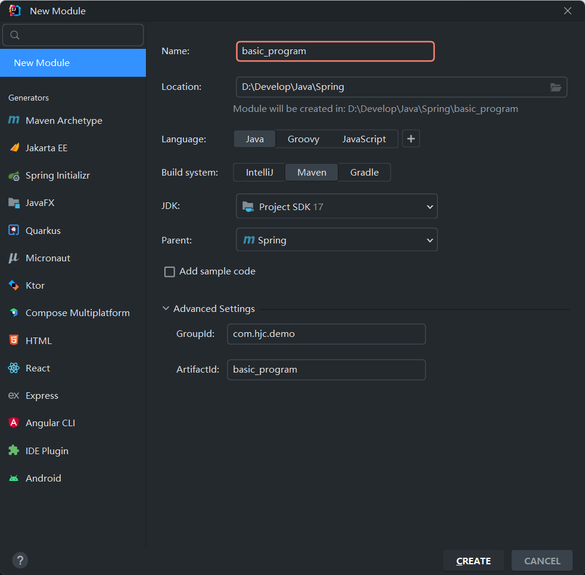
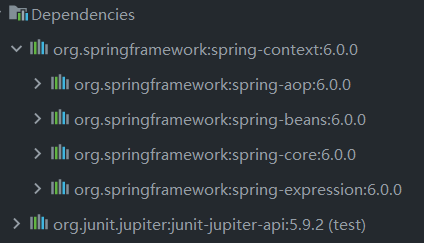
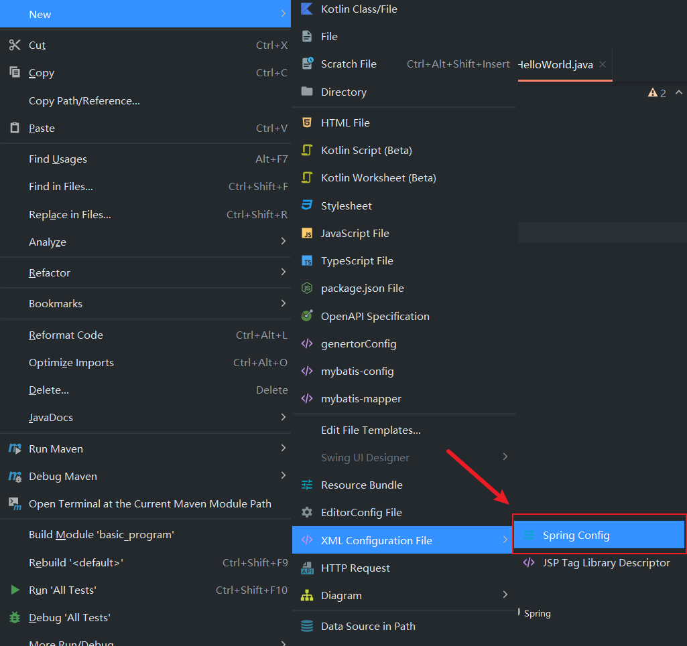
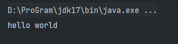
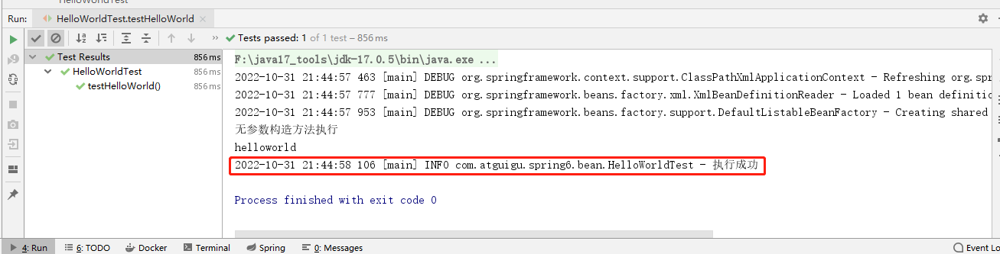
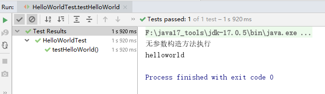

# Spring 构建入门程序

:::tip 环境要求

- JDK：Java17
- Maven：3.6.x
- Spring：6.0.0

:::

**官方教程**：https://docs.spring.io/spring-framework/docs/6.0.0/reference/html/

## 1.构建模块

**创建一个Maven父工程**，将src文件夹删除掉：



**父工程添加依赖**：

```xml
<properties>
    <maven.compiler.source>17</maven.compiler.source>
    <maven.compiler.target>17</maven.compiler.target>
    <spring.version>6.0.0</spring.version>
    <junit5.version>5.9.2</junit5.version>
    <project.build.sourceEncoding>UTF-8</project.build.sourceEncoding>
</properties>

<dependencyManagement>
	<dependencies>
		<!--spring context依赖-->
        <!--当引入Spring Context依赖之后，表示将Spring的基础依赖引入了-->
        <dependency>
            <groupId>org.springframework</groupId>
            <artifactId>spring-context</artifactId>
            <version>${spring.version}</version>
        </dependency>
        <!--junit5测试-->
        <dependency>
            <groupId>org.junit.jupiter</groupId>
            <artifactId>junit-jupiter-api</artifactId>
        	<version>${junit5.version}</version>
        </dependency>
	</dependencies>
</dependencyManagement>
```

**构建子模块basic_program**：



**子工程添加依赖**：

```xml
<dependencies>
    <dependency>
    	<groupId>org.springframework</groupId>
        <artifactId>spring-context</artifactId>
    </dependency>
    <dependency>
        <groupId>org.junit.jupiter</groupId>
        <artifactId>junit-jupiter-api</artifactId>
        <scope>test</scope>
	</dependency>
</dependencies>
```

**查看依赖**：



## 2.创建java类

通过构造函数方法创建一个 bean（组件对象） 时，所有普通类都可以由 Spring 使用并与之兼容。也就是说，正在开发的类不需要实现任何特定的接口或以特定的方式进行编码。只需指定 Bean 类信息就足够了。但是，默认情况下，需要一个默认（空）构造函数。

```java [com.hjc.demo.bean]
public class HelloWorld {
    public HelloWorld() {
        System.out.println("无参数构造方法执行");
    }
    public void sayHello(){
        System.out.println("helloworld");
    }
}
```

## 3.创建配置文件

在resources目录创建一个 Spring 配置文件(配置文件名称可随意命名)：



```xml [beans.xml]
<?xml version="1.0" encoding="UTF-8"?>
<beans xmlns="http://www.springframework.org/schema/beans"
       xmlns:xsi="http://www.w3.org/2001/XMLSchema-instance"
       xsi:schemaLocation="http://www.springframework.org/schema/beans http://www.springframework.org/schema/beans/spring-beans.xsd">
    <!--
     配置HelloWorld所对应的bean，即将HelloWorld的对象交给Spring的IOC容器管理
     通过bean标签配置IOC容器所管理的bean
    属性：
        id：设置bean的唯一标识
        class：设置bean所对应类型的全类名
	-->
    <bean id="helloWorld" class="com.hjc.demo.bean.HelloWorld"/>
</beans>
```

## 4.创建测试类测试

在test/java创建测试类：

```java [HelloWorldTest.java]
import com.hjc.demo.HelloWorld;
import org.junit.jupiter.api.Test;
import org.springframework.context.ApplicationContext;
import org.springframework.context.support.ClassPathXmlApplicationContext;

public class HelloWorldTest {

    @Test
    public void testHelloWorld(){
        ApplicationContext ac = new ClassPathXmlApplicationContext("bean.xml");
        HelloWorld helloworld = (HelloWorld) ac.getBean("helloWorld");
        helloworld.sayHello();
    }
}
```

## 5.运行测试程序



## 6.使用日志

**导入依赖**：

```xml
<!--log4j2的依赖-->
<dependency>
    <groupId>org.apache.logging.log4j</groupId>
    <artifactId>log4j-core</artifactId>
    <version>2.19.0</version>
</dependency>
<dependency>
    <groupId>org.apache.logging.log4j</groupId>
    <artifactId>log4j-slf4j2-impl</artifactId>
    <version>2.19.0</version>
</dependency>
```

**加入日志配置文件**：在类的根路径下提供log4j2.xml配置文件(文件名固定为：`log4j2.xml`，文件必须放到类根路径下)

```xml
<?xml version="1.0" encoding="UTF-8"?>
<configuration>
    <loggers>
        <!--
            level指定日志级别，从低到高的优先级：
                TRACE < DEBUG < INFO < WARN < ERROR < FATAL
                trace：追踪，是最低的日志级别，相当于追踪程序的执行
                debug：调试，一般在开发中，都将其设置为最低的日志级别
                info：信息，输出重要的信息，使用较多
                warn：警告，输出警告的信息
                error：错误，输出错误信息
                fatal：严重错误
        -->
        <root level="DEBUG">
            <appender-ref ref="spring6log"/>
            <appender-ref ref="RollingFile"/>
            <appender-ref ref="log"/>
        </root>
    </loggers>

    <appenders>
        <!--输出日志信息到控制台-->
        <console name="spring6log" target="SYSTEM_OUT">
            <!--控制日志输出的格式-->
            <PatternLayout pattern="%d{yyyy-MM-dd HH:mm:ss SSS} [%t] %-3level %logger{1024} - %msg%n"/>
        </console>

        <!--文件会打印出所有信息，这个log每次运行程序会自动清空，由append属性决定，适合临时测试用-->
        <File name="log" fileName="d:/spring6_log/test.log" append="false">
            <PatternLayout pattern="%d{HH:mm:ss.SSS} %-5level %class{36} %L %M - %msg%xEx%n"/>
        </File>

        <!-- 这个会打印出所有的信息，
            每次大小超过size，
            则这size大小的日志会自动存入按年份-月份建立的文件夹下面并进行压缩，
            作为存档-->
        <RollingFile name="RollingFile" fileName="d:/spring6_log/app.log"
                     filePattern="log/$${date:yyyy-MM}/app-%d{MM-dd-yyyy}-%i.log.gz">
            <PatternLayout pattern="%d{yyyy-MM-dd 'at' HH:mm:ss z} %-5level %class{36} %L %M - %msg%xEx%n"/>
            <SizeBasedTriggeringPolicy size="50MB"/>
            <!-- DefaultRolloverStrategy属性如不设置，
            则默认为最多同一文件夹下7个文件，这里设置了20 -->
            <DefaultRolloverStrategy max="20"/>
        </RollingFile>
    </appenders>
</configuration>
```

**使用日志**：

```java
public class HelloWorldTest {

    private Logger logger = LoggerFactory.getLogger(HelloWorldTest.class);

    @Test
    public void testHelloWorld(){
        ApplicationContext ac = new ClassPathXmlApplicationContext("beans.xml");
        HelloWorld helloworld = (HelloWorld) ac.getBean("helloWorld");
        helloworld.sayHello();
        logger.info("执行成功");
    }
}
```

控制台：



## 程序分析

**1. 底层是怎么创建对象的，是通过反射机制调用无参数构造方法吗？**

修改HelloWorld类：

```java
public class HelloWorld {

    public HelloWorld() {
        System.out.println("无参数构造方法执行");
    }

    public void sayHello(){
        System.out.println("helloworld");
    }
}
```

执行结果：



**测试得知：创建对象时确实调用了无参数构造方法。**

---

**2. Spring是如何创建对象的呢？原理是什么？**

```java
// dom4j解析beans.xml文件，从中获取class属性值，类的全类名
 // 通过反射机制调用无参数构造方法创建对象
 Class clazz = Class.forName("com.hjc.demo.bean.HelloWorld");
 //Object obj = clazz.newInstance();
 Object object = clazz.getDeclaredConstructor().newInstance();
```

---

**3. 把创建好的对象存储到一个什么样的数据结构当中了呢？**

bean对象最终存储在spring容器中，在spring源码底层就是一个map集合，存储bean的map在**DefaultListableBeanFactory**类中：

```java
private final Map<String, BeanDefinition> beanDefinitionMap = new ConcurrentHashMap<>(256);
```

Spring容器加载到Bean类时 , 会把这个类的描述信息, 以包名加类名的方式存到beanDefinitionMap 中,
Map<String,BeanDefinition> , 其中 String是Key , 默认是类名首字母小写 , BeanDefinition , 存的是类的定义(描述信息) , 通常叫BeanDefinition接口为 : bean的定义对象。
