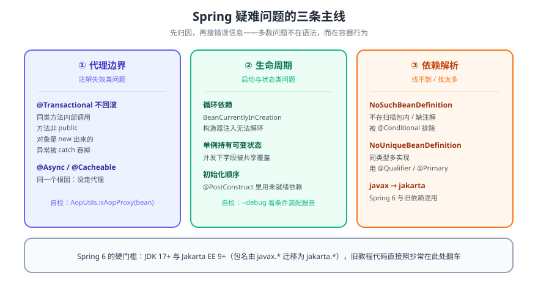

# Spring 常见问题

> 一份按「症状 → 根因 → 处置」组织的排查手册。Spring 的疑难问题里，真正属于语法错误的极少，绝大多数是**代理边界**、**容器生命周期**、**依赖解析**这三条线没对齐。



## 一句话定位

看到 Spring 报错，先别急着搜异常类名。先判断它落在哪条线上：**代理边界**（注解为什么没生效）、**生命周期**（Bean 什么时候创建、是不是单例）、**依赖解析**（容器找不到或找到太多候选）。归对类，答案基本就出来了。

## 一、启动期：容器起不来

### 1. `NoSuchBeanDefinitionException`

容器里根本没有你要的那个 Bean。

| 原因 | 排查动作 |
| --- | --- |
| 类不在组件扫描范围内 | 确认启动类的 `@SpringBootApplication` 所在包是**所有业务包的父包** |
| 没有注解 | 类上应有 `@Component` / `@Service` / `@Repository` / `@Configuration` + `@Bean` |
| 被条件注解排除 | 加 `--debug`，看 `CONDITIONS EVALUATION REPORT` |
| 多模块未引入依赖 | 确认目标模块在 `pom.xml` / `build.gradle` 里已声明 |
| 名字拼错、大小写不符 | 按类型注入（`@Autowired UserService s`）而不是按名字 |

```java
// 最省事的定位方式：把容器里所有 Bean 打出来
ApplicationContext ctx = SpringApplication.run(App.class, args);
Arrays.stream(ctx.getBeanDefinitionNames()).sorted().forEach(System.out::println);
```

### 2. `BeanCurrentlyInCreationException`：循环依赖

```text
A 依赖 B，B 依赖 A
```

| 注入方式 | 能否自动解环 |
| --- | --- |
| 字段注入 / setter 注入 | ✅ 可（靠三级缓存提前暴露半成品） |
| **构造器注入** | ❌ 不可，直接抛异常 |

处置的优先级从高到低：

1. **重构**：把共同依赖抽成第三个 Bean C。这是唯一「真的解决」了问题的方式。
2. **`@Lazy`**：延迟到第一次使用时再解析，打破启动期的环。
3. 换字段注入：能跑，但把问题藏起来了，不推荐（且 Spring 官方明确不建议字段注入）。

::: danger 别把「能跑」当成「解决了」
三级缓存能兜住字段注入的循环依赖，这恰恰是循环依赖长期被忽视的原因。它意味着你的模块边界出了结构性问题——**构造器注入报错反而是好事**，它在编译期就把它暴露了。
:::

### 3. 版本不兼容：`javax` 与 `jakarta` 混用

Spring 6 的硬门槛是 **JDK 17+** 与 **Jakarta EE 9+**，包名从 `javax.*` 迁移到 `jakarta.*`。

```text
java.lang.NoClassDefFoundError: javax/servlet/Servlet
java.lang.ClassNotFoundException: javax.annotation.Resource
```

出现这类报错，先怀疑「照着旧教程抄代码」或「依赖树里混着 Servlet 5 的旧包」。用 `mvn dependency:tree` / `gradle dependencies` 确认版本，别急着改代码。

## 二、运行期：注解为什么没生效

这一类问题**有一个共同根因**：Spring 的 `@Transactional`、`@Async`、`@Cacheable`、`@Retryable` 都是靠 **AOP 代理**实现的，**只有经过代理的调用才会被增强**。

### 1. `@Transactional` 不回滚：六种典型场景

| 场景 | 为什么不生效 |
| --- | --- |
| 同类内部的 `this.otherMethod()` 调用 | 走的是原始对象，**绕过了代理** |
| 方法不是 `public` | Spring AOP 只代理 `public` 方法 |
| 对象是自己 `new` 出来的 | 没经过容器，压根没有代理 |
| 异常被 `catch` 后没有重新抛出 | 默认只对 `RuntimeException` / `Error` 回滚 |
| 抛的是受检异常 | 默认不回滚，需写 `@Transactional(rollbackFor = Exception.class)` |
| 传播行为是 `NOT_SUPPORTED` / `NEVER` | 主动挂起了事务 |

```java
@Service
public class OrderService {

    public void create(Order o) {
        save(o);            // ✗ 直接 this 调用，@Transactional 不生效
    }

    @Transactional
    public void save(Order o) { /* ... */ }
}
```

**三种正规改法**：

```java
// ① 把事务方法拆到另一个 Bean（最推荐，边界清晰）
@Service
public class OrderTxService {
    @Transactional(rollbackFor = Exception.class)
    public void save(Order o) { /* ... */ }
}

// ② 自注入代理后调用（能用，但要注意别写成构造器循环依赖）
@Autowired @Lazy private OrderService self;
public void create(Order o) { self.save(o); }

// ③ 用 TransactionTemplate 显式控制（不依赖代理，最直白）
private final TransactionTemplate tx;
public void create(Order o) {
    tx.execute(status -> { save(o); return null; });
}
```

### 2. `@Async` / `@Cacheable` / `@Retryable` 同样失效

根因完全相同，处置方式也一样。额外注意 `@Async` 的两个细节：方法必须**返回 `void` 或 `Future`/`CompletableFuture`**，且需要在配置类上加 `@EnableAsync`。

### 3. 单例 Bean 里放了可变状态

Spring 默认作用域是**单例**。类里的成员字段会被所有请求共享。

```java
@Service
public class BadService {
    private User currentUser;   // ✗ 并发下互相覆盖，A 的请求可能读到 B 的用户

    public void handle(User u) {
        this.currentUser = u;
        // ... 一段时间后使用 currentUser
    }
}
```

**处置**：把状态变成方法参数或局部变量（无状态化），确实需要请求级状态就改 `@Scope("request")`，但更常见的是「本来就不该有状态」。

```java
@Service
public class GoodService {
    public void handle(User u) {   // 状态随参数走，天然线程安全
        // ...
    }
}
```

### 4. 事务里做远程调用导致连接被长期占用

```java
@Transactional
public void submit(Order o) {
    orderMapper.insert(o);
    remoteClient.notify(o);   // ✗ 慢调用占着数据库连接不放
}
```

`@Transactional` 期间数据库连接被持有，HTTP 调用耗时 3 秒就意味着这条连接 3 秒不可用。**处置：把远程调用移出事务边界**——先 `insert` 并提交，再发通知；或改用事务同步回调 `TransactionSynchronizationManager`（提交成功后才发）。

## 三、错误信息速查表

| 报错关键字 | 最可能的原因 |
| --- | --- |
| `BeanCreationException` | `@PostConstruct` 或初始化方法里抛了异常；或依赖无法解析（看 `Caused by`） |
| `NoSuchBeanDefinitionException` | 扫描不到 / 没注解 / 被条件排除 |
| `NoUniqueBeanDefinitionException` | 同类型多个实现，用 `@Qualifier` 或 `@Primary` |
| `BeanCurrentlyInCreationException` | 循环依赖（构造器注入无法自动解） |
| `TransactionRequiredException` | 调用处没有事务上下文 |
| `LazyInitializationException` | JPA 懒加载时 Session 已关闭，改用 fetch join 或 `@Transactional` 包住 |
| `Circular view path` | 控制器返回的视图名与请求路径同名，改用 `@RestController` 或重命名 |
| 页面 404 但日志无异常 | 请求映射路径、`server.servlet.context-path`、静态资源前缀配置问题 |
| `NoClassDefFoundError: javax/*` | Spring 6 + 旧版依赖，Jakarta 包名迁移未完成 |

## 四、三个通用排查手段

```shell
# ① 开启条件装配报告（定位「为什么这个自动配置没生效」）
java -jar app.jar --debug
# 或 application.yml
# debug: true
```

```java
// ② 确认某个 Bean 到底有没有被代理（@Transactional 失效时的第一反应）
Object bean = ctx.getBean(OrderService.class);
System.out.println(AopUtils.isAopProxy(bean));     // false → 事务一定不生效
System.out.println(AopUtils.isCglibProxy(bean));   // true  → 走的是 CGLIB
System.out.println(bean.getClass().getName());     // 代理类名里带 $$EnhancerBySpringCGLIB
```

```shell
# ③ 检查依赖树里的版本冲突（Jakarta / Servlet 迁移问题专用）
mvn dependency:tree -Dincludes=jakarta.servlet
gradle dependencyInsight --dependency jakarta.servlet
```

::: warning 验证环境的诚实说明
以上命令需要 **JDK 17+** 与 Spring 6 依赖才能执行。本文写作环境未安装 JDK，因此本节仅提供**命令与判据**，未在本机实测，标记为 **⏳ 未验证**。其中「代理自检」是最高性价比的一条——`AopUtils.isAopProxy(bean)` 返回 `false` 时，所有注解式事务都不必再查了。
:::

## 五、深入阅读

- [Spring 容器：IoC](IoC.md)：Bean 定义、作用域与依赖注入方式
- [Spring 面向切面：AOP](AOP.md)：代理机制的原理，理解本文所有「失效」问题的钥匙
- [Spring JDBC 及事务](JdbcTransaction.md)：事务传播行为与回滚规则
- [Spring 数据校验：Validation](Validation.md)：参数校验不生效时的排查
- [Spring 版本目录](../index.md)：Spring 5 与 Spring 6 的差异与版本选择
