# SSM 整合

**微观**：将Spring、SpringMVC、Mybatis框架应用到项目中

- SpringMVC框架负责控制层
- Spring 框架负责整体和业务层的声明式事务管理
- MyBatis框架负责数据库访问层

**宏观**：Spring接管一切（将框架核心组件交给Spring进行IoC管理），代码更加简洁。

- SpringMVC管理表述层、SpringMVC相关组件
- Spring管理业务层、持久层、以及数据库相关 (DataSource,MyBatis)的组件
- 使用IoC的方式管理一切所需组件

**实施**：通过编写配置文件，实现SpringIoC容器接管一切组件。

SSM整合需要2个IoC容器：本质上说，整合就是将三层架构和框架核心API组件交给SpringIoC容器管理。一个容器可能就够了，但是常见的操作是创建两个IoC容器 (web容器和root容器)，组件分类管理。

**好处和目的**：

1. **分离关注点**：通过初始化两个容器，可以将各个层次的关注点进行分离。这种分离使得各个层次的组件能够更好地聚焦于各自的责任和功能。
2. **解耦合**：各个层次组件分离装配不同的IoC容器，这样可以进行解耦。这种解耦合使得各个模块可以独立操作和测试，提高了代码的可维护性和可测试性。
3. **灵活配置**：通过使用两个容器，可以为每个容器提供各自的配置，以满足不同层次和组件的特定需求。每个配置文件也更加清晰和灵活。

总的来说，初始化两个容器在SSM整合中可以实现关注点分离、解耦合、灵活配置等好处。它们各自负责不同的层次和功能，并通过合适的集成方式协同工作，提供一个高效、可维护和可扩展的应用程序架构。

---

**IoC容器对应类型组件**：

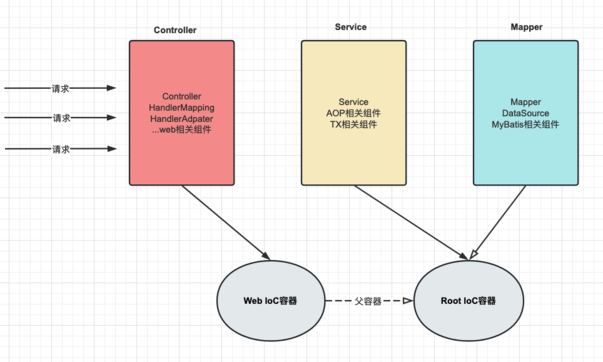

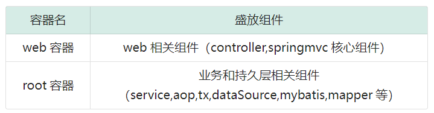

---

**IoC容器关系及调用方向**：

- 两个无关联的IoC容器之间的组件无法注入

  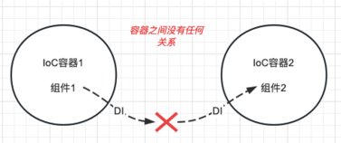

- 子IoC容器可以单向的注入父IoC容器的组件

  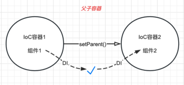

web容器是root容器的子容器，父子容器关系。

- 父容器：root容器，盛放service、mapper、mybatis等相关组件
- 子容器：web容器，盛放controller、web相关组件

源码体现：FrameworkServlet 655行

```Java
protected WebApplicationContext createWebApplicationContext(@Nullable ApplicationContext parent) {
    Class<?> contextClass = getContextClass();
    if (!ConfigurableWebApplicationContext.class.isAssignableFrom(contextClass)) {
      throw new ApplicationContextException(
          "Fatal initialization error in servlet with name '" + getServletName() +
          "': custom WebApplicationContext class [" + contextClass.getName() +
          "] is not of type ConfigurableWebApplicationContext");
    }
    ConfigurableWebApplicationContext wac =
        (ConfigurableWebApplicationContext) BeanUtils.instantiateClass(contextClass);

    wac.setEnvironment(getEnvironment());
    //wac 就是web ioc容器
    //parent 就是root ioc容器
    //web容器设置root容器为父容器，所以web容器可以引用root容器
    wac.setParent(parent);
    String configLocation = getContextConfigLocation();
    if (configLocation != null) {
      wac.setConfigLocation(configLocation);
    }
    configureAndRefreshWebApplicationContext(wac);

    return wac;
  }
```

调用流程图解：

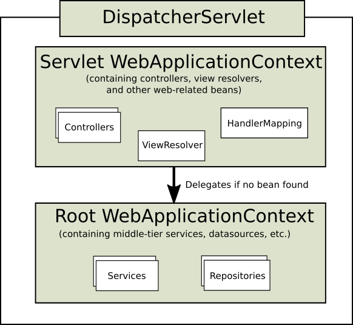

---

**具体配置类以及对应容器的关系**：

配置类的数量不是固定的，但是至少要两个，为了方便编写，可以三层架构每层对应一个配置类，分别指定两个容器加载即可。

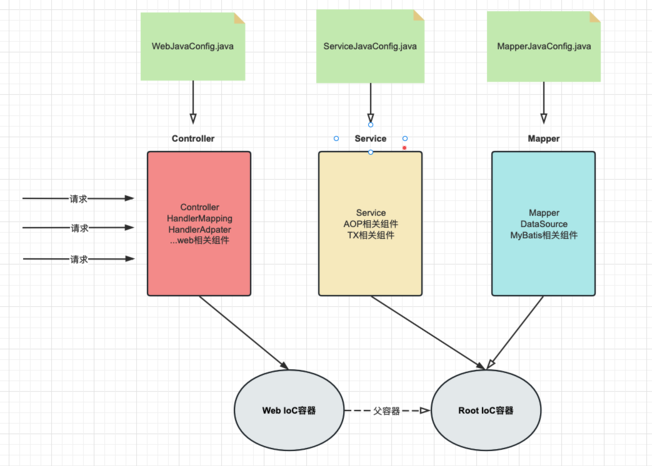

**建议配置文件**：

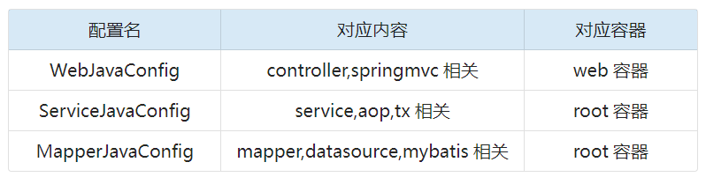

---

**IoC初始化方式及配置位置**：

在web项目下，可以选择web.xml和配置类方式进行ioc配置，**推荐配置类**。

对于使用基于 web 的 Spring 配置的应用程序，建议这样做：

```Java
public class MyWebAppInitializer extends AbstractAnnotationConfigDispatcherServletInitializer {

  //指定root容器对应的配置类
  //root容器的配置类
  @Override
  protected Class<?>[] getRootConfigClasses() {
    return new Class<?>[] { ServiceJavaConfig.class,MapperJavaConfig.class };
  }

  //指定web容器对应的配置类 webioc容器的配置类
  @Override
  protected Class<?>[] getServletConfigClasses() {
    return new Class<?>[] { WebJavaConfig.class };
  }

  //指定dispatcherServlet处理路径，通常为 /
  @Override
  protected String[] getServletMappings() {
    return new String[] { "/" };
  }
}
```

图解配置类和容器配置：

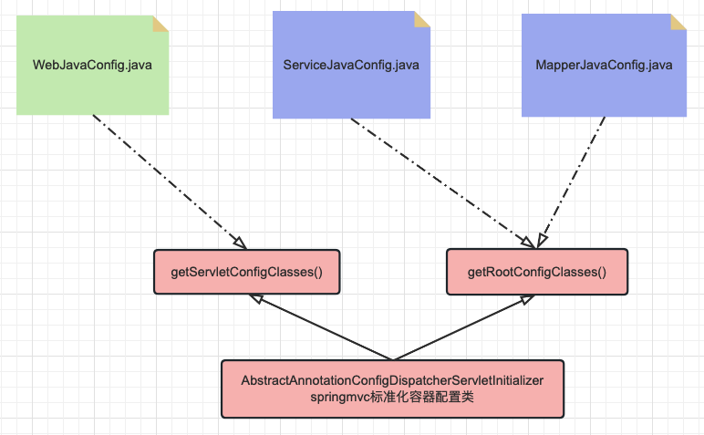

## 操作步骤

### 创建项目

创建一个父工程：

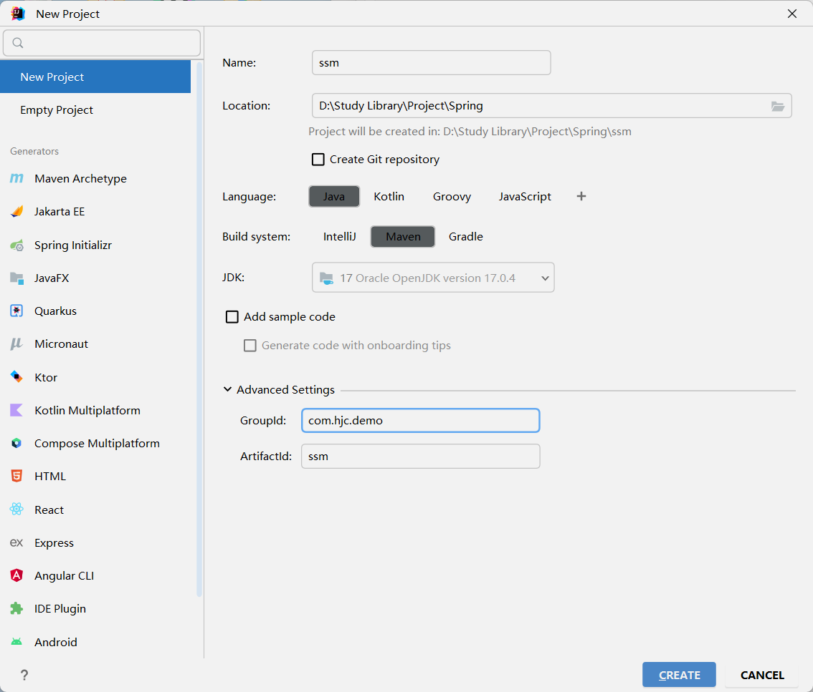

将打包方式修改为pom，只做项目管理：

```xml
<?xml version="1.0" encoding="UTF-8"?>
<project xmlns="http://maven.apache.org/POM/4.0.0"
         xmlns:xsi="http://www.w3.org/2001/XMLSchema-instance"
         xsi:schemaLocation="http://maven.apache.org/POM/4.0.0 http://maven.apache.org/xsd/maven-4.0.0.xsd">
    <modelVersion>4.0.0</modelVersion>

    <groupId>com.hjc.demo</groupId>
    <artifactId>ssm</artifactId>
    <version>1.0-SNAPSHOT</version>
    <packaging>pom</packaging>

    <properties>
        <maven.compiler.source>17</maven.compiler.source>
        <maven.compiler.target>17</maven.compiler.target>
        <project.build.sourceEncoding>UTF-8</project.build.sourceEncoding>
    </properties>

</project>
```

创建子工程并修改为Web工程：

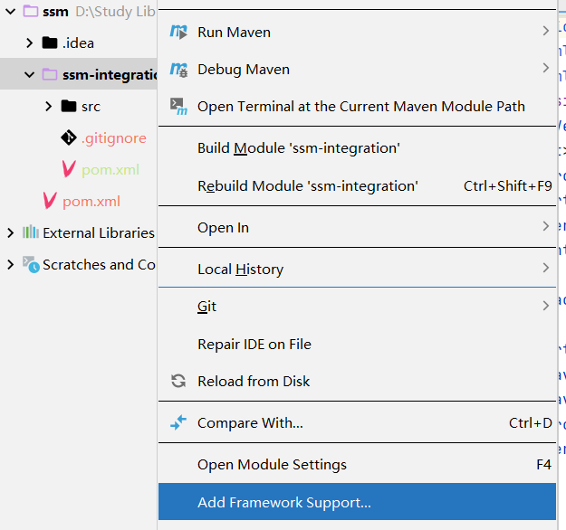

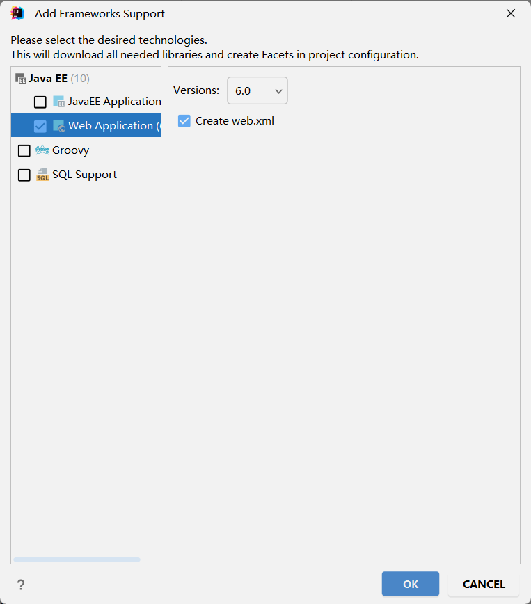

### 依赖整合和添加

导入依赖：

```xml
	<properties>
        <spring.version>6.0.0</spring.version>
        <jakarta.annotation-api.version>2.1.1</jakarta.annotation-api.version>
        <jakarta.jakartaee-web-api.version>9.1.0</jakarta.jakartaee-web-api.version>
        <jackson-databind.version>2.15.0</jackson-databind.version>
        <hibernate-validator.version>8.0.0.Final</hibernate-validator.version>
        <mybatis.version>3.5.11</mybatis.version>
        <mysql.version>8.0.30</mysql.version>
        <pagehelper.version>5.2.0</pagehelper.version>
        <mybatis-spring.version>3.0.2</mybatis-spring.version>
        <jakarta.servlet.jsp.jstl-api.version>3.0.0</jakarta.servlet.jsp.jstl-api.version>
        <logback.version>1.2.3</logback.version>
        <lombok.version>1.18.28</lombok.version>
        <maven.compiler.source>17</maven.compiler.source>
        <maven.compiler.target>17</maven.compiler.target>
        <project.build.sourceEncoding>UTF-8</project.build.sourceEncoding>
    </properties>
    <!--
       需要依赖清单分析:
          spring
            ioc/di
              spring-context / 6.0.0
              jakarta.annotation-api / 2.1.1  jsr250
            aop
              spring-aspects / 6.0.0
            tx
              spring-tx  / 6.0.0
              spring-jdbc / 6.0.0

          springmvc
             spring-webmvc 6.0.0
             jakarta.jakartaee-web-api 9.1.0
             jackson-databind 2.15.0
             hibernate-validator / hibernate-validator-annotation-processor 8.0.0.Final

          mybatis
             mybatis  / 3.5.11
             mysql    / 8.0.30
             pagehelper / 5.2.0

          整合需要
             加载spring容器 spring-web / 6.0.0
             整合mybatis   mybatis-spring x x
             lombok        lombok / 1.18.28
             logback       logback/ 1.2.3
    -->

    <dependencies>
        <!--spring pom.xml依赖-->
        <dependency>
            <groupId>org.springframework</groupId>
            <artifactId>spring-context</artifactId>
            <version>${spring.version}</version>
        </dependency>

        <dependency>
            <groupId>jakarta.annotation</groupId>
            <artifactId>jakarta.annotation-api</artifactId>
            <version>${jakarta.annotation-api.version}</version>
        </dependency>

        <dependency>
            <groupId>org.springframework</groupId>
            <artifactId>spring-aop</artifactId>
            <version>${spring.version}</version>
        </dependency>

        <dependency>
            <groupId>org.springframework</groupId>
            <artifactId>spring-aspects</artifactId>
            <version>${spring.version}</version>
        </dependency>

        <dependency>
            <groupId>org.springframework</groupId>
            <artifactId>spring-tx</artifactId>
            <version>${spring.version}</version>
        </dependency>

        <dependency>
            <groupId>org.springframework</groupId>
            <artifactId>spring-jdbc</artifactId>
            <version>${spring.version}</version>
        </dependency>


        <!--
           springmvc
               spring-webmvc 6.0.0
               jakarta.jakartaee-web-api 9.1.0
               jackson-databind 2.15.0
               hibernate-validator / hibernate-validator-annotation-processor 8.0.0.Final
        -->
        <dependency>
            <groupId>org.springframework</groupId>
            <artifactId>spring-webmvc</artifactId>
            <version>${spring.version}</version>
        </dependency>

        <dependency>
            <groupId>jakarta.platform</groupId>
            <artifactId>jakarta.jakartaee-web-api</artifactId>
            <version>${jakarta.jakartaee-web-api.version}</version>
            <scope>provided</scope>
        </dependency>

        <!-- jsp需要依赖! jstl-->
        <dependency>
            <groupId>jakarta.servlet.jsp.jstl</groupId>
            <artifactId>jakarta.servlet.jsp.jstl-api</artifactId>
            <version>${jakarta.servlet.jsp.jstl-api.version}</version>
        </dependency>

        <dependency>
            <groupId>com.fasterxml.jackson.core</groupId>
            <artifactId>jackson-databind</artifactId>
            <version>${jackson-databind.version}</version>
        </dependency>


        <!-- https://mvnrepository.com/artifact/org.hibernate.validator/hibernate-validator -->
        <dependency>
            <groupId>org.hibernate.validator</groupId>
            <artifactId>hibernate-validator</artifactId>
            <version>${hibernate-validator.version}</version>
        </dependency>
        <!-- https://mvnrepository.com/artifact/org.hibernate.validator/hibernate-validator-annotation-processor -->
        <dependency>
            <groupId>org.hibernate.validator</groupId>
            <artifactId>hibernate-validator-annotation-processor</artifactId>
            <version>${hibernate-validator.version}</version>
        </dependency>


        <!--
          mybatis
               mybatis  / 3.5.11
               mysql    / 8.0.25
               pagehelper / 5.1.11
        -->
        <!-- mybatis依赖 -->
        <dependency>
            <groupId>org.mybatis</groupId>
            <artifactId>mybatis</artifactId>
            <version>${mybatis.version}</version>
        </dependency>

        <!-- MySQL驱动 mybatis底层依赖jdbc驱动实现,本次不需要导入连接池,mybatis自带! -->
        <dependency>
            <groupId>mysql</groupId>
            <artifactId>mysql-connector-java</artifactId>
            <version>${mysql.version}</version>
        </dependency>

        <dependency>
            <groupId>com.github.pagehelper</groupId>
            <artifactId>pagehelper</artifactId>
            <version>${pagehelper.version}</version>
        </dependency>

        <!-- 整合第三方特殊依赖 -->
        <dependency>
            <groupId>org.springframework</groupId>
            <artifactId>spring-web</artifactId>
            <version>${spring.version}</version>
        </dependency>

        <dependency>
            <groupId>org.mybatis</groupId>
            <artifactId>mybatis-spring</artifactId>
            <version>${mybatis-spring.version}</version>
        </dependency>

        <!-- 日志 ， 会自动传递slf4j门面-->
        <dependency>
            <groupId>ch.qos.logback</groupId>
            <artifactId>logback-classic</artifactId>
            <version>${logback.version}</version>
        </dependency>

        <dependency>
            <groupId>org.projectlombok</groupId>
            <artifactId>lombok</artifactId>
            <version>${lombok.version}</version>
        </dependency>
    </dependencies>
```

### 控制层配置(SpringMVC整合)

### 业务层配置(AOP/TX整合)

### 持久层配置(MyBatis整合)

### 容器初始化配置类

### 整合测试
