# 容器：IoC

IoC(控制反转，`Inversion of Control`)，它不是一门技术，而是一种设计思想，是一个重要的面向对象编程法则，能够指导如何设计出松耦合、更优良的程序。

Spring 通过 IoC 容器来管理所有 Java 对象的实例化和初始化，控制对象与对象之间的依赖关系。将由 IoC 容器管理的 Java 对象称为 Spring Bean，它与使用关键字 new 创建的 Java 对象没有任何区别。

**IoC 容器是 Spring 框架中最重要的核心组件之一**，它贯穿了 Spring 从诞生到成长的整个过程。

## Spring对组件进行管理

- [组件相关概念](../../../Others/Component/index.md)

组件可以完全交给Spring 框架进行管理，Spring框架替代了程序员原有的new对象和对象属性赋值动作等。

Spring具体的组件管理动作包含：

- 组件对象实例化

- 组件属性属性赋值

- 组件对象之间引用

- 组件对象存活周期管理

- ......

只需要编写元数据（配置文件）告知Spring 管理哪些类组件和他们的关系即可！

综上所述，Spring 充当一个组件容器，创建、管理、存储组件，减少了编码压力，能更加专注进行业务编写。

**组件交给Spring管理优势**：

1.  **降低了组件之间的耦合性**：Spring IoC容器通过依赖注入机制，将组件之间的依赖关系削弱，减少了程序组件之间的耦合性，使得组件更加松散地耦合。
2.  **提高了代码的可重用性和可维护性**：将组件的实例化过程、依赖关系的管理等功能交给Spring IoC容器处理，使得组件代码更加模块化、可重用、更易于维护。
3.  **方便了配置和管理**：Spring IoC容器通过XML文件或者注解，轻松的对组件进行配置和管理，使得组件的切换、替换等操作更加的方便和快捷。
4.  交给Spring管理的对象 (组件)，方可**享受Spring框架的其他功能** (AOP，声明事务管理)等。

## IoC容器

### IoC 控制反转

控制反转是一种思想。**IoC 主要是针对对象的创建和调用控制而言的**，也就是说，当应用程序需要使用一个对象时，不再是应用程序直接创建该对象，而是由 IoC 容器来创建和管理，即控制权由应用程序转移到 IoC 容器中，也就是"反转"了控制权。这种方式基本上是通过依赖查找的方式来实现的，即 IoC 容器维护着构成应用程序的对象，并负责创建这些对象。

- 控制反转是为了降低程序耦合度，提高程序扩展力。

简单来说：

- 将对象的创建权利交出去，交给第三方容器负责。

- 将对象和对象之间关系的维护权交出去，交给第三方容器负责。

**控制反转思想具体实现**：**依赖注入**(DI，`Dependency Injection`)

### DI 依赖注入

DI(依赖注入，`Dependency Injection`)：依赖注入实现了控制反转的思想。依赖注入DI 是指在组件之间传递依赖关系的过程中，将依赖关系在容器内部进行处理，这样就不必在应用程序代码中硬编码对象之间的依赖关系，实现了对象之间的解耦合。

在 Spring 中，DI 是通过 XML 配置文件或注解的方式实现的。它提供了三种形式的依赖注入：构造函数注入、Setter 方法注入和接口注入。

**依赖注入**：指Spring创建对象的过程中，将对象依赖属性通过配置进行注入。

依赖注入常见的实现方式包括两种：

- 第一种：set注入
- 第二种：构造注入

IOC 就是一种控制反转的思想， 而 DI 是对IoC的一种具体实现。

**Bean管理：Bean对象的创建，以及Bean对象中属性的赋值(或者叫做Bean对象之间关系的维护)**

### IoC容器在Spring的实现

Spring IoC 容器就是 IoC思想的一个落地的产品实现，是负责实例化、配置和组装 组件(**IoC容器中管理的组件也叫做 bean**) 核心容器。容器通过读取配置元数据来获取有关要实例化、配置和组装组件的指令。配置元数据以 XML、Java 注解或 Java 代码形式表现。它允许表达组成应用程序的组件以及这些组件之间丰富的相互依赖关系。

在创建 bean 之前，首先需要创建IoC 容器。

Spring 提供了IoC 容器的两种实现方式：

1. **BeanFactory**：

   这是 IoC 容器的基本实现，是 Spring 内部使用的接口。面向 Spring 本身，是SpringIoC容器标准化超接口，不提供给开发人员使用。

2. **ApplicationContext**：

   BeanFactory 的子接口，提供了更多高级特性。面向 Spring 的使用者，几乎所有场合都使用 ApplicationContext 而不是底层的 BeanFactory。

   扩展了以下功能：

   1. 更容易与 Spring 的 AOP 功能集成
   2. 消息资源处理（用于国际化）
   3. 特定于应用程序给予此接口实现，例如Web 应用程序的 `WebApplicationContext`
      简而言之， `BeanFactory` 提供了配置框架和基本功能，而 `ApplicationContext` 添加了更多特定于企业的功能。 `ApplicationContext` 是 `BeanFactory` 的完整超集！

**ApplicationContext的主要实现类**：

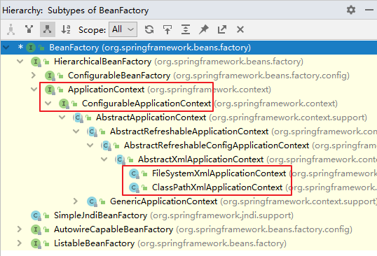

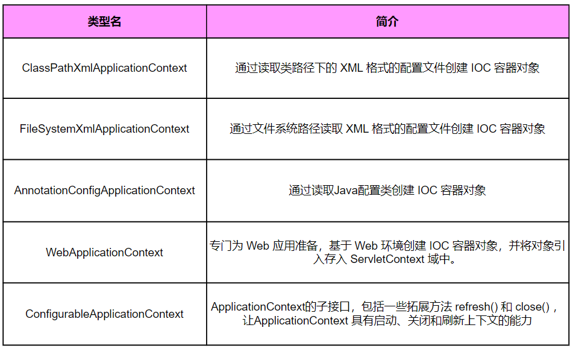

Spring框架提供了多种配置方式：**XML配置方式**、**注解方式**和**Java配置类方式**

1.  **XML配置方式**：是Spring框架最早的配置方式之一，通过在XML文件中定义Bean及其依赖关系、Bean的作用域等信息，让Spring IoC容器来管理Bean之间的依赖关系。该方式从Spring框架的第一版开始提供支持。
2.  **注解方式**：从Spring 2.5版本开始提供支持，可以通过在Bean类上使用注解来代替XML配置文件中的配置信息。通过在Bean类上加上相应的注解（如`@Component`, `@Service`, `@Autowired`等），将Bean注册到Spring IoC容器中，这样Spring IoC容器就可以管理这些Bean之间的依赖关系。
3.  **Java配置类方式**：从Spring 3.0版本开始提供支持，通过Java类来定义Bean、Bean之间的依赖关系和配置信息，从而代替XML配置文件的方式。Java配置类是一种使用Java编写配置信息的方式，通过`@Configuration`、`@Bean`等注解来实现Bean和依赖关系的配置。

## 基于XML管理Bean

构建项目使用[Spring构建入门程序](BasicProgram.md)

**操作步骤**：

1. **配置元数据 (配置)**：

   基于 XML 的配置元数据的**基本结构**：

   ```xml
   <bean id="..." class="..."> ;
      <!-- collaborators and configuration for this bean go here -->
   </bean>
   ```

   Spring IoC 容器管理一个或多个组件。这些 组件是使用提供给容器的配置元数据（例如，以 XML `<bean/>` 定义的形式）创建的。

   ```xml
   <?xml version="1.0" encoding="UTF-8"?>
   <!-- 此处要添加一些约束，配置文件的标签并不是随意命名 -->
   <beans xmlns="http://www.springframework.org/schema/beans"
     xmlns:xsi="http://www.w3.org/2001/XMLSchema-instance"
     xsi:schemaLocation="http://www.springframework.org/schema/beans
       https://www.springframework.org/schema/beans/spring-beans.xsd">

     <bean id="..." [1] class="..." [2]>
       <!-- collaborators and configuration for this bean go here -->
     </bean>

     <bean id="..." class="...">
       <!-- collaborators and configuration for this bean go here -->
     </bean>
     <!-- more bean definitions go here -->
   </beans>
   ```

2. **实例化IoC容器**：

   提供给 `ApplicationContext` 构造函数的位置路径是资源字符串地址，允许容器从各种外部资源（如本地文件系统、Java `CLASSPATH` 等）加载配置元数据。

   选择一个合适的容器实现类，进行IoC容器的实例化工作：

   ```java
   //实例化ioc容器,读取外部配置文件,最终会在容器内进行ioc和di动作
   ApplicationContext context =
              new ClassPathXmlApplicationContext("services.xml", "daos.xml");
   ```

3. **获取Bean (组件)**：

   `ApplicationContext` 是一个高级工厂的接口，能够维护不同 bean 及其依赖项的注册表。通过使用方法 `T getBean(String name, Class<T> requiredType)` ，您可以检索 bean 的实例。

   允许读取 Bean 定义并访问它们：

   ```java
   //创建ioc容器对象，指定配置文件，ioc也开始实例组件对象
   ApplicationContext context = new ClassPathXmlApplicationContext("services.xml", "daos.xml");
   //获取ioc容器的组件对象
   PetStoreService service = context.getBean("petStore", PetStoreService.class);
   //使用组件对象
   List<String> userList = service.getUsernameList();
   ```

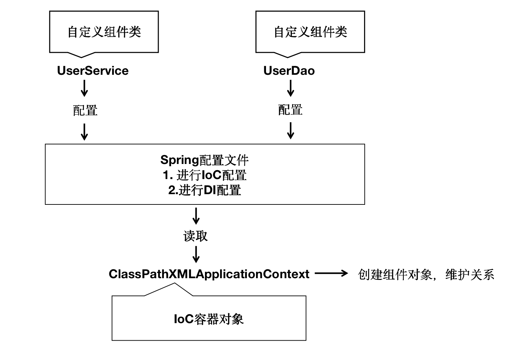

### 声明配置bean

#### 基于无参数构造函数

当通过构造函数方法创建一个 bean (组件对象) 时，所有普通类都可以由 Spring 使用并与之兼容。也就是说，正在开发的类不需要实现任何特定的接口或以特定的方式进行编码。只需指定 Bean 类信息就足够了。但是，默认情况下，需要一个默认 (空) 构造函数。

---

**组件类**：

```java
public class HappyComponent {

	//默认包含无参数构造函数
	//public HappyComponent(){
    //}

	public void doWork() {
	  	System.out.println("HappyComponent.doWork");
    }
}
```

**配置文件**：

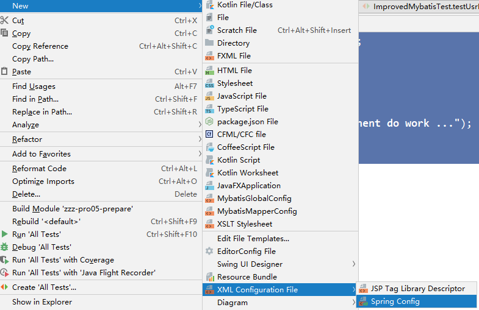

bean标签：通过配置bean标签告诉IOC容器需要创建对象的组件信息

- id属性：bean的唯一标识,方便后期获取Bean
- class属性：组件类的全限定符

**注意**：要求当前组件类必须包含无参数构造函数

```xml [resources/spring-beans.xml]
<!-- 声明bean对象 -->
<bean id="happyComponent" class="com.hjc.demo.HappyComponent"/>
```

#### 基于静态工厂方法实例化

**准备组件类**：

```java
public class ClientService {
	private static ClientService clientService = new ClientService();

    private ClientService() {}

    public static ClientService createInstance() {
    	return clientService;
    }
}
```

**配置文件**：

- class属性：指定工厂类的全限定符

- factory-method：指定静态工厂方法

  **注意**：该方法必须是static方法。

```xml [resources/spring-beans.xml]
<bean id="clientService"
  class="com.hjc.demo.ClientService"
  factory-method="createInstance"/>
```

#### 基于实例工厂方法实例化

**准备组件类**：

```java [DefaultServiceLocator]
public class DefaultServiceLocator {
	private static ClientServiceImpl clientService = new ClientServiceImpl();

  	public ClientServiceImpl createClientServiceInstance() {
    	return clientService;
  	}
}
```

```java [ClientServiceImpl]
public class ClientServiceImpl {
}
```

**配置文件**：

- factory-bean属性：指定当前容器中工厂Bean 的名称

- factory-method：指定实例工厂方法名

  **注意**：实例方法必须是非static的

```xml [resources/spring-beans.xml]
<!-- 将工厂类进行ioc配置 -->
<bean id="serviceLocator" class="com.hjc.demo.DefaultServiceLocator">
</bean>

<!-- 根据工厂对象的实例工厂方法进行实例化组件对象 -->
<bean id="clientService"
  factory-bean="serviceLocator"
  factory-method="createClientServiceInstance"/>
```

**IoC配置流程**：

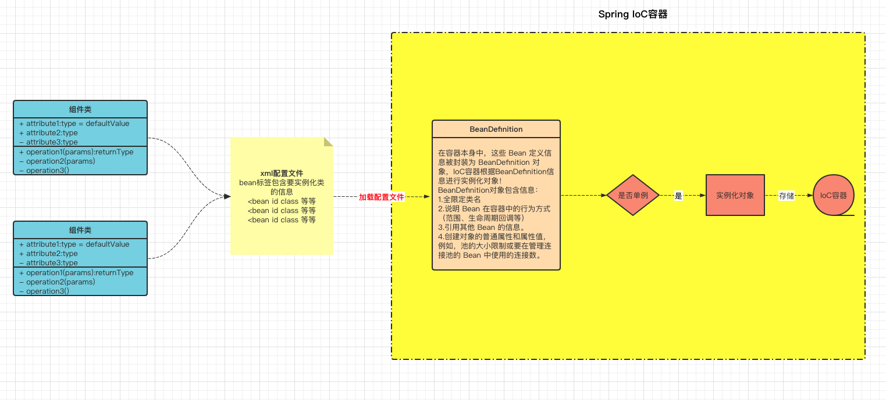

### 容器实例化

想要配置文件中声明组件类信息真正的进行实例化成Bean对象和形成Bean之间的引用关系，需要声明IoC容器对象，读取配置文件，实例化组件和关系维护的过程都是在IoC容器中实现的。

两种实现方式：

- **实例化并且指定配置文件**：

  ```java
  //参数：String...locations 传入一个或者多个配置文件
  ApplicationContext context =
             new ClassPathXmlApplicationContext("services.xml", "daos.xml");
  ```

- **先实例化，再指定配置文件，最后刷新容器触发Bean实例化动作**：

  ```java
  ApplicationContext context =
             new ClassPathXmlApplicationContext();

  //设置配置配置文件,方法参数为可变参数,可以设置一个或者多个配置
  iocContainer1.setConfigLocations("services.xml", "daos.xml");

  //后配置的文件,需要调用refresh方法,触发刷新配置
  iocContainer1.refresh();
  ```

### 获取bean

#### 根据id获取

由于 id 属性指定了 bean 的唯一标识，所以根据 bean 标签的 id 属性可以精确获取到一个组件对象。

```java
@Test
public void testHelloWorld(){
	ApplicationContext ac = new ClassPathXmlApplicationContext("bean.xml");
    //没有指定类型,返回为Object,需要类型转化
    HelloWorld bean = (HelloWorld)ac.getBean("helloWorld");
    //使用组件对象
    bean.sayHello();
}
```

#### 根据类型获取

```java
@Test
public void testHelloWorld1(){
	ApplicationContext ac = new ClassPathXmlApplicationContext("bean.xml");
    HelloWorld bean = ac.getBean(HelloWorld.class);
    bean.sayHello();
}
```

#### 根据id和类型

```java
@Test
public void testHelloWorld2(){
	ApplicationContext ac = new ClassPathXmlApplicationContext("bean.xml");
    HelloWorld bean = ac.getBean("helloworld", HelloWorld.class);
    bean.sayHello();
}
```

**注意**：

当根据类型获取bean时，要求IOC容器中指定类型的bean有且只能有一个

当IOC容器中一共配置了两个：

```xml
<bean id="helloworldOne" class="com.hjc.demo.bean.HelloWorld"></bean>
<bean id="helloworldTwo" class="com.hjc.demo.bean.HelloWorld"></bean>
```

根据类型获取时会抛出异常：

> org.springframework.beans.factory.NoUniqueBeanDefinitionException: No qualifying bean of type 'com.hjc.demo.bean.HelloWorld' available: expected single matching bean but found 2: helloworldOne,helloworldTwo

**扩展**：

如果组件类实现了接口，根据接口类型可以获取 bean 吗？

> 可以，前提是bean唯一

如果一个接口有多个实现类，这些实现类都配置了 bean，根据接口类型可以获取 bean 吗？

> 不行，因为bean不唯一

**结论**

根据类型来获取bean时，在满足bean唯一性的前提下，其实只是看：『对象 **instanceof** 指定的类型』的返回结果，只要返回的是true就可以认定为和类型匹配，能够获取到。

java中，instanceof 运算符用于判断前面的对象是否是后面的类，或其子类、实现类的实例。如果是返回true，否则返回false。也就是说：用 instanceof 关键字做判断时， instanceof 操作符的左右操作必须有继承或实现关系

### 依赖注入

#### setter注入

使用property标签给setter方法对应的属性赋值。

property 标签属性：

- name属性代表**set方法标识**
- ref代表引用bean的标识id
- value属性代表基本属性值

**例**：

构建项目基于[Spring构建入门程序](BasicProgram.md)中的父工程构建的子模块。

**①创建学生类Student**

```java
public class Student {

    private Integer id;

    private String name;

    private Integer age;

    private String sex;

    public Student() {
    }

    public Integer getId() {
        return id;
    }

    public void setId(Integer id) {
        this.id = id;
    }

    public String getName() {
        return name;
    }

    public void setName(String name) {
        this.name = name;
    }

    public Integer getAge() {
        return age;
    }

    public void setAge(Integer age) {
        this.age = age;
    }

    public String getSex() {
        return sex;
    }

    public void setSex(String sex) {
        this.sex = sex;
    }

    @Override
    public String toString() {
        return "Student{" +
                "id=" + id +
                ", name='" + name + '\'' +
                ", age=" + age +
                ", sex='" + sex + '\'' +
                '}';
    }
}
```

**②配置bean时为属性赋值**

```xml [di-setter.xml]
<!-- setter注入 -->
<bean id="stu1" class="com.hjc.demo.Student">
    <!-- property标签：通过组件类的setXxx()方法给组件对象设置属性 -->
    <!-- name属性：指定属性名（这个属性名是getXxx()、setXxx()方法定义的，和成员变量无关） -->
    <!-- value属性：指定属性值 -->
	<property name="id" value="1001"/>
    <property name="name" value="张三"/>
    <property name="age" value="23"/>
    <property name="sex" value="男"/>
</bean>
```

**③测试**

```java [testDiBySet.java]
public class SpringIocTest {
    @Test
    void testDiBySet() {
        ApplicationContext context = new ClassPathXmlApplicationContext("di-setter.xml");
        Student stu1 = context.getBean("stu1", Student.class);
        System.out.println("stu1 = " + stu1);
    }
}
```

#### 基于构造函数的依赖注入

基于构造函数的 DI 是通过容器调用具有多个参数的构造函数来完成的，每个参数表示一个依赖项。

:::danger 注意

constructor-arg标签还有两个属性可以进一步描述构造器参数：

- index属性：指定参数所在位置的索引(从0开始)
- name属性：指定参数名
- value属性：指定普通属性值
- ref属性：引用IOC容器中某个bean的id，将所对应的bean为属性赋值

:::

**①在Student类中添加有参构造**

```java
public Student(Integer id, String name, Integer age, String sex) {
    this.id = id;
    this.name = name;
    this.age = age;
    this.sex = sex;
}
```

**②配置bean**

```xml [spring-di.xml]
<!-- 构造器注入 -->
<bean id="stu2" class="com.hjc.demo.Student">
	<constructor-arg value="1002"/>
    <constructor-arg value="李四"/>
    <constructor-arg value="55"/>
    <constructor-arg value="女"/>
</bean>
```

**③测试**

```java [testDiByConstructor.java]
public class SpringIocTest {
    @Test
    void testDiByConstructor() {
        ApplicationContext context = new ClassPathXmlApplicationContext("di-constructor.xml");
        Student stu2 = context.getBean("stu2", Student.class);
        System.out.println("stu2 = " + stu2);
    }
}
```

#### 特殊值处理

##### 字面量赋值

字面量：int a = 10;

声明一个变量a，初始化为10，此时a就不代表字母a了，而是作为一个变量的名字。当我们引用a的时候，我们实际上拿到的值是10。

而如果a是带引号的：'a'，那么它现在不是一个变量，它就是代表a这个字母本身，这就是字面量。所以字面量没有引申含义，就是我们看到的这个数据本身。

```xml
<!-- 使用value属性给bean的属性赋值时，Spring会把value属性的值看做字面量 -->
<property name="name" value="张三"/>
```

##### null值

```xml
<property name="name">
    <null />
</property>
```

**注意**：

```xml
<!-- name所赋的值是字符串null，并不是null值 -->
<property name="name" value="null"></property>
```

##### xml实体

```xml
<!-- 小于号在XML文档中用来定义标签的开始，不能随便使用 -->
<!-- 解决方案一：使用XML实体来代替 -->
<property name="expression" value="a &lt; b"/>
```

##### CDATA节

```xml
<property name="expression">
    <!-- 解决方案二：使用CDATA节 -->
    <!-- CDATA中的C代表Character，是文本、字符的含义，CDATA就表示纯文本数据 -->
    <!-- XML解析器看到CDATA节就知道这里是纯文本，就不会当作XML标签或属性来解析 -->
    <!-- 所以CDATA节中写什么符号都随意 -->
    <value><![CDATA[a < b]]></value>
</property>
```

#### 为对象类型属性赋值

**①创建班级类Clazz**

```java
public class Clazz {

    private Integer clazzId;

    private String clazzName;

    public Integer getClazzId() {
        return clazzId;
    }

    public void setClazzId(Integer clazzId) {
        this.clazzId = clazzId;
    }

    public String getClazzName() {
        return clazzName;
    }

    public void setClazzName(String clazzName) {
        this.clazzName = clazzName;
    }

    @Override
    public String toString() {
        return "Clazz{" +
                "clazzId=" + clazzId +
                ", clazzName='" + clazzName + '\'' +
                '}';
    }

    public Clazz() {
    }

    public Clazz(Integer clazzId, String clazzName) {
        this.clazzId = clazzId;
        this.clazzName = clazzName;
    }
}
```

**②修改Student类**

在Student类中添加以下代码：

```java
private Clazz clazz;

public Clazz getClazz() {
	return clazz;
}

public void setClazz(Clazz clazz) {
	this.clazz = clazz;
}
```

##### 引用外部bean

配置Clazz类型的bean：

```xml
<!-- 为对象类型属性赋值 -->
<bean id="clazzOne" class="com.hjc.demo.Clazz">
	<property name="clazzId" value="1111"/>
    <property name="clazzName" value="财源滚滚班"/>
</bean>
```

为Student中的clazz属性赋值：

```xml
<bean id="stu1" class="com.hjc.demo.Student">
    <property name="id" value="1004"></property>
    <property name="name" value="赵六"></property>
    <property name="age" value="26"></property>
    <property name="sex" value="女"></property>
    <!-- ref属性：引用IOC容器中某个bean的id，将所对应的bean为属性赋值 -->
    <property name="clazz" ref="clazzOne"></property>
</bean>
```

错误演示：

```xml
<bean id="stu2" class="com.hjc.demo.Student">
    <property name="id" value="1005"></property>
    <property name="name" value="赵六"></property>
    <property name="age" value="26"></property>
    <property name="sex" value="女"></property>
    <!-- ref属性：引用IOC容器中某个bean的id，将所对应的bean为属性赋值 -->
    <property name="clazz" value="clazzOne"></property>
</bean>
```

如果错把ref属性写成了value属性，会抛出异常：

> Caused by: java.lang.IllegalStateException: Cannot convert value of type 'java.lang.String' to required type 'com.hjc.demo.Clazz' for property 'clazz': no matching editors or conversion strategy found

意思是不能把String类型转换成Clazz类型，说明使用value属性时，Spring只把这个属性看做一个普通的字符串，不会认为这是一个bean的id，更不会根据它去找到bean来赋值

##### 内部bean

```xml
<!-- 引用外部Bean -->
<bean id="stu3" class="com.hjc.demo.Student">
    <property name="id" value="1004"></property>
    <property name="name" value="赵六"></property>
    <property name="age" value="26"></property>
    <property name="sex" value="女"></property>
    <!-- 在一个bean中再声明一个bean就是内部bean -->
    <!-- 内部bean只能用于给属性赋值，不能在外部通过IOC容器获取，因此可以省略id属性 -->
    <property name="clazz">
            <bean id="clazzOne" class="com.hjc.demo.Clazz">
                <property name="clazzId" value="2222"/>
                <property name="clazzName" value="财源滚滚班"/>
            </bean>
    </property>
</bean>
```

#### 级联属性赋值

```xml
<bean id="stu4" class="com.hjc.demo.Student">
    <property name="id" value="1004"></property>
    <property name="name" value="赵六"></property>
    <property name="age" value="26"></property>
    <property name="sex" value="女"></property>
    <property name="clazz" ref="clazzOne"></property>
    <property name="clazz.clazzId" value="3333"></property>
    <property name="clazz.clazzName" value="最强王者班"></property>
</bean>
```

#### 为数组类型属性赋值

**①修改Student类**

在Student类中添加：

```java
private String[] hobbies;

public String[] getHobbies() {
    return hobbies;
}

public void setHobbies(String[] hobbies) {
    this.hobbies = hobbies;
}
```

**②配置bean**

```xml
<!-- 为集合类型属性赋值 -->
<bean id="stu7" class="com.hjc.demo.Student">
    <property name="id" value="1004"></property>
    <property name="name" value="赵六"></property>
    <property name="age" value="26"></property>
    <property name="sex" value="女"></property>
    <property name="hobbies">
        <array>
            <value>抽烟</value>
            <value>喝酒</value>
            <value>烫头</value>
        </array>
    </property>
</bean>
```

#### 为集合类型属性赋值

##### 为List集合类型属性赋值

在Clazz类中添加以下代码：

```java
private List<Student> students;

public List<Student> getStudents() {
    return students;
}

public void setStudents(List<Student> students) {
    this.students = students;
}
```

配置bean：

```xml
<!-- 为List集合类型属性赋值 -->
<bean id="clazzTwo" class="com.hjc.demo.Clazz">
    <property name="clazzId" value="1111"/>
    <property name="clazzName" value="财源滚滚班"/>
    <property name="students">
        <list>
            <ref bean="stu1"/>
            <ref bean="stu2"/>
            <ref bean="stu3"/>
        </list>
    </property>
</bean>
```

> 若为Set集合类型属性赋值，只需要将其中的list标签改为set标签即可

##### 为Map集合类型属性赋值

创建教师类Teacher：

```java
public class Teacher {

    private Integer teacherId;

    private String teacherName;

    public Integer getTeacherId() {
        return teacherId;
    }

    public void setTeacherId(Integer teacherId) {
        this.teacherId = teacherId;
    }

    public String getTeacherName() {
        return teacherName;
    }

    public void setTeacherName(String teacherName) {
        this.teacherName = teacherName;
    }

    public Teacher(Integer teacherId, String teacherName) {
        this.teacherId = teacherId;
        this.teacherName = teacherName;
    }

    public Teacher() {

    }

    @Override
    public String toString() {
        return "Teacher{" +
                "teacherId=" + teacherId +
                ", teacherName='" + teacherName + '\'' +
                '}';
    }
}
```

在Student类中添加：

```java
private Map<String, Teacher> teacherMap;

public Map<String, Teacher> getTeacherMap() {
    return teacherMap;
}

public void setTeacherMap(Map<String, Teacher> teacherMap) {
    this.teacherMap = teacherMap;
}
```

配置bean：

```xml
<!-- 为Map集合类型属性赋值 -->
<bean id="teacherOne" class="com.hjc.demo.Teacher">
    <property name="teacherId" value="10010"></property>
    <property name="teacherName" value="大宝"></property>
</bean>
<bean id="teacherTwo" class="com.hjc.demo.Teacher">
	<property name="teacherId" value="10086"></property>
    <property name="teacherName" value="二宝"></property>
</bean>
<bean id="stu8" class="com.hjc.demo.Student">
    <property name="id" value="1004"></property>
    <property name="name" value="赵六"></property>
    <property name="age" value="26"></property>
    <property name="sex" value="女"></property>
    <!-- ref属性：引用IOC容器中某个bean的id，将所对应的bean为属性赋值 -->
    <property name="clazz" ref="clazzOne"></property>
    <property name="hobbies">
    	<array>
        	<value>抽烟</value>
            <value>喝酒</value>
            <value>烫头</value>
        </array>
    </property>
    <property name="teacherMap">
        <map>
            <entry>
                <key>
                    <value>10010</value>
                </key>
                <ref bean="teacherOne"></ref>
            </entry>
            <entry>
                <key>
                    <value>10086</value>
                </key>
                <ref bean="teacherTwo"></ref>
            </entry>
        </map>
    </property>
</bean>
```

##### 用集合类型的bean

使用util:list、util:map标签必须引入相应的命名空间：

```xml
<?xml version="1.0" encoding="UTF-8"?>
<beans xmlns="http://www.springframework.org/schema/beans"
xmlns:xsi="http://www.w3.org/2001/XMLSchema-instance"
xmlns:util="http://www.springframework.org/schema/util"
 xsi:schemaLocation="http://www.springframework.org/schema/util
 http://www.springframework.org/schema/util/spring-util.xsd
 http://www.springframework.org/schema/beans
 http://www.springframework.org/schema/beans/spring-beans.xsd">
```

```xml
<!-- list集合类型的bean-->
<util:list id="stus">
    <ref bean="stu1"/>
    <ref bean="stu2"/>
    <ref bean="stu3"/>
</util:list>
<!--map集合类型的bean-->
<util:map id="teacherMap2">
    <entry>
        <key>
        	<value>10010</value>
        </key>
        <ref bean="teacherOne"/>
    </entry>
    <entry>
        <key>
        	<value>10086</value>
        </key>
        <ref bean="teacherTwo"/>
    </entry>
</util:map>
<bean id="clazzThree" class="com.hjc.demo.Clazz">
    <property name="clazzId" value="4444"></property>
    <property name="clazzName" value="Javaee0222"></property>
    <property name="students" ref="stus"></property>
</bean>
<bean id="stu9" class="com.hjc.demo.Student">
	<property name="id" value="1004"></property>
    <property name="name" value="赵六"></property>
    <property name="age" value="26"></property>
    <property name="sex" value="女"></property>
    <!-- ref属性：引用IOC容器中某个bean的id，将所对应的bean为属性赋值 -->
    <property name="clazz" ref="clazzThree"></property>
    <property name="hobbies">
        <array>
            <value>抽烟</value>
            <value>喝酒</value>
            <value>烫头</value>
        </array>
    </property>
    <property name="teacherMap" ref="teacherMap2"></property>
</bean>
```

### p命名空间

引入p命名空间：

```xml
<?xml version="1.0" encoding="UTF-8"?>
<beans xmlns="http://www.springframework.org/schema/beans"
       xmlns:xsi="http://www.w3.org/2001/XMLSchema-instance"
       xmlns:util="http://www.springframework.org/schema/util"
       xmlns:p="http://www.springframework.org/schema/p"
       xsi:schemaLocation="http://www.springframework.org/schema/util
       http://www.springframework.org/schema/util/spring-util.xsd
       http://www.springframework.org/schema/beans
       http://www.springframework.org/schema/beans/spring-beans.xsd">
```

引入p命名空间后，为bean的各个属性赋值

```xml
<!-- p命名空间-->
<bean id="stu10" class="com.hjc.demo.Student" p:id="1006"  p:name="小明" p:clazz-ref="clazzOne" p:teacherMap-ref="teacherMap2"/>
```

### 引入外部属性文件

**①加入依赖**

```xml
<!-- MySQL驱动 -->
<dependency>
    <groupId>mysql</groupId>
    <artifactId>mysql-connector-java</artifactId>
    <version>8.0.30</version>
</dependency>

<!-- 数据源 -->
<dependency>
    <groupId>com.alibaba</groupId>
    <artifactId>druid</artifactId>
    <version>1.2.15</version>
</dependency>
```

**②创建外部属性文件**

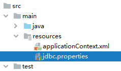

```properties
jdbc.user=root
jdbc.password=123123
jdbc.url=jdbc:mysql://localhost:3306/spring?serverTimezone=UTC
jdbc.driver=com.mysql.cj.jdbc.Driver
```

**③引入属性文件**

引入context 名称空间：

**注意**：在使用 `<context:property-placeholder>` 元素加载外包配置文件功能前，首先需要在 XML 配置的一级标签 `<beans>` 中添加 context 相关的约束。

```xml
<?xml version="1.0" encoding="UTF-8"?>
<beans xmlns="http://www.springframework.org/schema/beans"
       xmlns:xsi="http://www.w3.org/2001/XMLSchema-instance"
       xmlns:context="http://www.springframework.org/schema/context"
       xsi:schemaLocation="http://www.springframework.org/schema/beans
       http://www.springframework.org/schema/beans/spring-beans.xsd
       http://www.springframework.org/schema/context
       http://www.springframework.org/schema/context/spring-context.xsd">

</beans>
```

```xml
<!-- 引入外部属性文件 -->
<context:property-placeholder location="classpath:jdbc.properties"/>
```

**④配置bean**

```xml
<bean id="druidDataSource" class="com.alibaba.druid.pool.DruidDataSource">
    <property name="url" value="${jdbc.url}"/>
    <property name="driverClassName" value="${jdbc.driver}"/>
    <property name="username" value="${jdbc.user}"/>
    <property name="password" value="${jdbc.password}"/>
</bean>
```

**⑤测试**

```java
@Test
public void testDataSource() throws SQLException {
    ApplicationContext ac = new ClassPathXmlApplicationContext("applicationContext.xml");
    DataSource dataSource = ac.getBean(DataSource.class);
    Connection connection = dataSource.getConnection();
    System.out.println(connection);
}
```

### bean的作用域

`<bean>` 标签声明Bean，只是将Bean的信息配置给SpringIoC容器。在IoC容器中，这些`<bean>`标签对应的信息转成Spring内部 `BeanDefinition` 对象，`BeanDefinition` 对象内，包含定义的信息（id,class,属性等等）

这意味着，`BeanDefinition`与`类`概念一样，SpringIoC容器可以可以根据`BeanDefinition`对象反射创建多个Bean对象实例。

具体创建多少个Bean的实例对象，由Bean的作用域Scope属性指定。

在Spring中可以通过配置bean标签的scope属性来指定bean的作用域范围

**作用域可选值**：

| 取值      | 含义                                    | 创建对象的时机  | 默认值 |
| --------- | --------------------------------------- | --------------- | ------ |
| singleton | 在IOC容器中，这个bean的对象始终为单实例 | IOC容器初始化时 | 是     |
| prototype | 这个bean在IOC容器中有多个实例           | 获取bean时      | 否     |

如果是在WebApplicationContext环境下还会有另外几个作用域(但不常用)：

| 取值    | 含义                                      | 创建对象的时机 | 默认值 |
| ------- | ----------------------------------------- | -------------- | ------ |
| request | 请求范围内有效的实例 在一个请求范围内有效 | 每次请求       | 否     |
| session | 会话范围内有效的实例 在一个会话范围内有效 | 每次会话       | 否     |

---

**创建类User**

```java
public class User {

    private Integer id;

    private String username;

    private String password;

    private Integer age;

    public User() {
    }

    public User(Integer id, String username, String password, Integer age) {
        this.id = id;
        this.username = username;
        this.password = password;
        this.age = age;
    }

    public Integer getId() {
        return id;
    }

    public void setId(Integer id) {
        this.id = id;
    }

    public String getUsername() {
        return username;
    }

    public void setUsername(String username) {
        this.username = username;
    }

    public String getPassword() {
        return password;
    }

    public void setPassword(String password) {
        this.password = password;
    }

    public Integer getAge() {
        return age;
    }

    public void setAge(Integer age) {
        this.age = age;
    }

    @Override
    public String toString() {
        return "User{" +
                "id=" + id +
                ", username='" + username + '\'' +
                ", password='" + password + '\'' +
                ", age=" + age +
                '}';
    }
}
```

**配置bean**

scope属性：

- 取值singleton (默认值)，bean在IOC容器中只有一个实例，IOC容器初始化时创建对象
- 取值prototype，bean在IOC容器中可以有多个实例，`getBean()`时创建对象

```xml
<bean class="com.hjc.demo.User" scope="prototype"></bean>
```

**测试**

```java
@Test
public void testBeanScope(){
    ApplicationContext ac = new ClassPathXmlApplicationContext("spring-scope.xml");
    User user1 = ac.getBean(User.class);
    User user2 = ac.getBean(User.class);
    System.out.println(user1==user2);
}
```

> false

### bean生命周期

IoC容器实例化和销毁组件对象的时候会进行调用方法，这两个方法成为**生命周期方法**。

类似于Servlet的init/destroy方法，可以在周期方法完成初始化和释放资源等工作。

**①具体的生命周期过程**

- bean对象创建（调用无参构造器）

- 给bean对象设置属性

- bean的后置处理器（初始化之前）

- bean对象初始化（需在配置bean时指定初始化方法）

- bean的后置处理器（初始化之后）

- bean对象就绪可以使用

- bean对象销毁（需在配置bean时指定销毁方法）

- IOC容器关闭

**②修改类User**

```java
public class User {

    private Integer id;

    private String username;

    private String password;

    private Integer age;

    public User() {
        System.out.println("生命周期：1、创建对象");
    }

    public User(Integer id, String username, String password, Integer age) {
        this.id = id;
        this.username = username;
        this.password = password;
        this.age = age;
    }

    public Integer getId() {
        return id;
    }

    public void setId(Integer id) {
        System.out.println("生命周期：2、依赖注入");
        this.id = id;
    }

    public String getUsername() {
        return username;
    }

    public void setUsername(String username) {
        this.username = username;
    }

    public String getPassword() {
        return password;
    }

    public void setPassword(String password) {
        this.password = password;
    }

    public Integer getAge() {
        return age;
    }

    public void setAge(Integer age) {
        this.age = age;
    }

    //周期方法要求： 方法命名随意，但是要求方法必须是 public void 无形参列表
    public void initMethod(){
        System.out.println("生命周期：3、初始化");
    }

    public void destroyMethod(){
        System.out.println("生命周期：5、销毁");
    }

    @Override
    public String toString() {
        return "User{" +
                "id=" + id +
                ", username='" + username + '\'' +
                ", password='" + password + '\'' +
                ", age=" + age +
                '}';
    }
}
```

> 注意其中的initMethod()和destroyMethod()，可以通过配置bean指定为初始化和销毁的方法

**③配置bean**

使用init-method属性指定初始化方法
使用destroy-method属性指定销毁方法

```xml
<bean class="com.hjc.demo.User" scope="prototype" init-method="initMethod" destroy-method="destroyMethod">
    <property name="id" value="1001"></property>
    <property name="username" value="admin"></property>
    <property name="password" value="123456"></property>
    <property name="age" value="23"></property>
</bean>
```

**④测试**

```java
@Test
public void testLife(){
    ClassPathXmlApplicationContext ac = new ClassPathXmlApplicationContext("spring-lifecycle.xml");
    User bean = ac.getBean(User.class);
    System.out.println("生命周期：4、通过IOC容器获取bean并使用");
    ac.close();
}
```

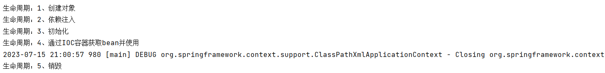

**⑤bean的后置处理器**

bean的后置处理器会在生命周期的初始化前后添加额外的操作，需要实现BeanPostProcessor接口，且配置到IOC容器中。

**注意**：bean后置处理器不是单独针对某一个bean生效，而是针对IOC容器中所有bean都会执行

创建bean的后置处理器：

```java
import org.springframework.beans.BeansException;
import org.springframework.beans.factory.config.BeanPostProcessor;

public class MyBeanProcessor implements BeanPostProcessor {

    @Override
    public Object postProcessBeforeInitialization(Object bean, String beanName) throws BeansException {
        System.out.println("☆☆☆" + beanName + " = " + bean);
        return bean;
    }

    @Override
    public Object postProcessAfterInitialization(Object bean, String beanName) throws BeansException {
        System.out.println("★★★" + beanName + " = " + bean);
        return bean;
    }
}
```

在IOC容器中配置后置处理器：

```xml
<!-- bean的后置处理器要放入IOC容器才能生效 -->
<bean id="myBeanProcessor" class="com.hjc.demo.process.MyBeanProcessor"/>
```

### FactoryBean

FactoryBean是Spring提供的一种整合第三方框架的常用机制。和普通的bean不同，配置一个FactoryBean类型的bean，在获取bean的时候得到的并不是class属性中配置的这个类的对象，而是`getObject()`方法的返回值。通过这种机制，Spring可以把复杂组件创建的详细过程和繁琐细节都屏蔽起来，只把最简洁的使用界面展示给我们。

**FactoryBean使用场景**：

1.  代理类的创建
2.  第三方框架整合
3.  复杂对象实例化等

4.  `FactoryBean<T>` 接口提供三种方法：

    - `T getObject()`:&#x20;

      返回此工厂创建的对象的实例。该返回值会被存储到IoC容器！

    - `boolean isSingleton()`:&#x20;

      如果此 `FactoryBean` 返回单例，则返回 `true` ，否则返回 `false` 。此方法的默认实现返回 `true` （注意，lombok插件使用，可能影响效果）。

    - `Class<?> getObjectType()`: 返回 `getObject()` 方法返回的对象类型，如果事先不知道类型，则返回 `null` 。

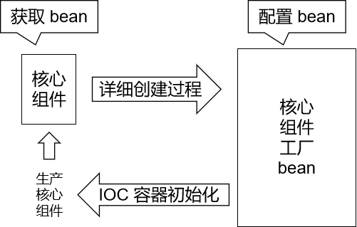

整合Mybatis时，Spring就是通过FactoryBean机制来创建SqlSessionFactory对象的。

```java
/*
 * Copyright 2002-2020 the original author or authors.
 *
 * Licensed under the Apache License, Version 2.0 (the "License");
 * you may not use this file except in compliance with the License.
 * You may obtain a copy of the License at
 *
 *      https://www.apache.org/licenses/LICENSE-2.0
 *
 * Unless required by applicable law or agreed to in writing, software
 * distributed under the License is distributed on an "AS IS" BASIS,
 * WITHOUT WARRANTIES OR CONDITIONS OF ANY KIND, either express or implied.
 * See the License for the specific language governing permissions and
 * limitations under the License.
 */
package org.springframework.beans.factory;

import org.springframework.lang.Nullable;

/**
 * Interface to be implemented by objects used within a {@link BeanFactory} which
 * are themselves factories for individual objects. If a bean implements this
 * interface, it is used as a factory for an object to expose, not directly as a
 * bean instance that will be exposed itself.
 *
 * <p><b>NB: A bean that implements this interface cannot be used as a normal bean.</b>
 * A FactoryBean is defined in a bean style, but the object exposed for bean
 * references ({@link #getObject()}) is always the object that it creates.
 *
 * <p>FactoryBeans can support singletons and prototypes, and can either create
 * objects lazily on demand or eagerly on startup. The {@link SmartFactoryBean}
 * interface allows for exposing more fine-grained behavioral metadata.
 *
 * <p>This interface is heavily used within the framework itself, for example for
 * the AOP {@link org.springframework.aop.framework.ProxyFactoryBean} or the
 * {@link org.springframework.jndi.JndiObjectFactoryBean}. It can be used for
 * custom components as well; however, this is only common for infrastructure code.
 *
 * <p><b>{@code FactoryBean} is a programmatic contract. Implementations are not
 * supposed to rely on annotation-driven injection or other reflective facilities.</b>
 * {@link #getObjectType()} {@link #getObject()} invocations may arrive early in the
 * bootstrap process, even ahead of any post-processor setup. If you need access to
 * other beans, implement {@link BeanFactoryAware} and obtain them programmatically.
 *
 * <p><b>The container is only responsible for managing the lifecycle of the FactoryBean
 * instance, not the lifecycle of the objects created by the FactoryBean.</b> Therefore,
 * a destroy method on an exposed bean object (such as {@link java.io.Closeable#close()}
 * will <i>not</i> be called automatically. Instead, a FactoryBean should implement
 * {@link DisposableBean} and delegate any such close call to the underlying object.
 *
 * <p>Finally, FactoryBean objects participate in the containing BeanFactory's
 * synchronization of bean creation. There is usually no need for internal
 * synchronization other than for purposes of lazy initialization within the
 * FactoryBean itself (or the like).
 *
 * @author Rod Johnson
 * @author Juergen Hoeller
 * @since 08.03.2003
 * @param <T> the bean type
 * @see org.springframework.beans.factory.BeanFactory
 * @see org.springframework.aop.framework.ProxyFactoryBean
 * @see org.springframework.jndi.JndiObjectFactoryBean
 */
public interface FactoryBean<T> {

    /**
     * The name of an attribute that can be
     * {@link org.springframework.core.AttributeAccessor#setAttribute set} on a
     * {@link org.springframework.beans.factory.config.BeanDefinition} so that
     * factory beans can signal their object type when it can't be deduced from
     * the factory bean class.
     * @since 5.2
     */
    String OBJECT_TYPE_ATTRIBUTE = "factoryBeanObjectType";

    /**
     * Return an instance (possibly shared or independent) of the object
     * managed by this factory.
     * <p>As with a {@link BeanFactory}, this allows support for both the
     * Singleton and Prototype design pattern.
     * <p>If this FactoryBean is not fully initialized yet at the time of
     * the call (for example because it is involved in a circular reference),
     * throw a corresponding {@link FactoryBeanNotInitializedException}.
     * <p>As of Spring 2.0, FactoryBeans are allowed to return {@code null}
     * objects. The factory will consider this as normal value to be used; it
     * will not throw a FactoryBeanNotInitializedException in this case anymore.
     * FactoryBean implementations are encouraged to throw
     * FactoryBeanNotInitializedException themselves now, as appropriate.
     * @return an instance of the bean (can be {@code null})
     * @throws Exception in case of creation errors
     * @see FactoryBeanNotInitializedException
     */
    @Nullable
    T getObject() throws Exception;

    /**
     * Return the type of object that this FactoryBean creates,
     * or {@code null} if not known in advance.
     * <p>This allows one to check for specific types of beans without
     * instantiating objects, for example on autowiring.
     * <p>In the case of implementations that are creating a singleton object,
     * this method should try to avoid singleton creation as far as possible;
     * it should rather estimate the type in advance.
     * For prototypes, returning a meaningful type here is advisable too.
     * <p>This method can be called <i>before</i> this FactoryBean has
     * been fully initialized. It must not rely on state created during
     * initialization; of course, it can still use such state if available.
     * <p><b>NOTE:</b> Autowiring will simply ignore FactoryBeans that return
     * {@code null} here. Therefore it is highly recommended to implement
     * this method properly, using the current state of the FactoryBean.
     * @return the type of object that this FactoryBean creates,
     * or {@code null} if not known at the time of the call
     * @see ListableBeanFactory#getBeansOfType
     */
    @Nullable
    Class<?> getObjectType();

    /**
     * Is the object managed by this factory a singleton? That is,
     * will {@link #getObject()} always return the same object
     * (a reference that can be cached)?
     * <p><b>NOTE:</b> If a FactoryBean indicates to hold a singleton object,
     * the object returned from {@code getObject()} might get cached
     * by the owning BeanFactory. Hence, do not return {@code true}
     * unless the FactoryBean always exposes the same reference.
     * <p>The singleton status of the FactoryBean itself will generally
     * be provided by the owning BeanFactory; usually, it has to be
     * defined as singleton there.
     * <p><b>NOTE:</b> This method returning {@code false} does not
     * necessarily indicate that returned objects are independent instances.
     * An implementation of the extended {@link SmartFactoryBean} interface
     * may explicitly indicate independent instances through its
     * {@link SmartFactoryBean#isPrototype()} method. Plain {@link FactoryBean}
     * implementations which do not implement this extended interface are
     * simply assumed to always return independent instances if the
     * {@code isSingleton()} implementation returns {@code false}.
     * <p>The default implementation returns {@code true}, since a
     * {@code FactoryBean} typically manages a singleton instance.
     * @return whether the exposed object is a singleton
     * @see #getObject()
     * @see SmartFactoryBean#isPrototype()
     */
    default boolean isSingleton() {
        return true;
    }
}
```

---

**例**：

**创建类UserFactoryBean**

```java
// 实现FactoryBean接口时需要指定泛型
// 泛型类型就是当前工厂要生产的对象的类型
public class UserFactoryBean implements FactoryBean<User> {

    private String username;

    public String getUsername() {
        return username;
    }

    public void setUsername(String username) {
        this.username = username;
    }

    @Override
    public User getObject() throws Exception {
        // 方法内部模拟创建、设置一个对象的复杂过程
        User user = new User();
        user.setUsername(username);
        return user;
    }

    @Override
    public Class<?> getObjectType() {
        // 返回要生产的对象的类型
        return User.class;
    }
}
```

**配置bean**

```xml
<!-- FactoryBean机制 -->
<!-- 这个bean标签中class属性指定的是HappyFactoryBean，但是将来从这里获取的bean是User对象 -->
<bean id="user" class="com.hjc.demo.factory.UserFactoryBean">
    <!-- property标签仍然可以用来通过setXxx()方法给属性赋值 -->
	<property name="username" value="lisi"></property>
</bean>
```

**测试**

```java
@Test
public void testUserFactoryBean(){
    //获取IOC容器
    ApplicationContext ac = new ClassPathXmlApplicationContext("spring-factorybean.xml");
    User user = (User) ac.getBean("user");
    //注意: 直接根据声明FactoryBean的id,获取的是getObject方法返回的对象
    System.out.println(user);

    //如果想要获取FactoryBean对象, 直接在id前添加&符号即可!  &user 这是一种固定的约束
    Object bean = ac.getBean("&user");
    System.out.println("bean = " + bean);
}
```

**FactoryBean和BeanFactory区别**：

**FactoryBean **是 Spring 中一种特殊的 bean，可以在 getObject() 工厂方法自定义的逻辑创建Bean，是一种能够生产其他 Bean 的 Bean。FactoryBean 在容器启动时被创建，而在实际使用时则是通过调用 `getObject()` 方法来得到其所生产的 Bean。因此，FactoryBean 可以自定义任何所需的初始化逻辑，生产出一些定制化的 bean。

一般情况下，整合第三方框架，都是通过定义FactoryBean实现。

**BeanFactory** 是 Spring 框架的基础，其作为一个顶级接口定义了容器的基本行为，例如管理 bean 的生命周期、配置文件的加载和解析、bean 的装配和依赖注入等。BeanFactory 接口提供了访问 bean 的方式，例如 `getBean()` 方法获取指定的 bean 实例。它可以从不同的来源（例如 Mysql 数据库、XML 文件、Java 配置类等）获取 bean 定义，并将其转换为 bean 实例。同时，BeanFactory 还包含很多子类（例如，ApplicationContext 接口）提供了额外的强大功能。

总的来说，**FactoryBean 和 BeanFactory 的区别主要在于前者是用于创建 bean 的接口，它提供了更加灵活的初始化定制功能，而后者是用于管理 bean 的框架基础接口，提供了基本的容器功能和 bean 生命周期管理。**

### 基于xml自动装配

**自动装配**：根据指定的策略，在IOC容器中匹配某一个bean，自动为指定的bean中所依赖的类类型或接口类型属性赋值

**例**：

```java [UserController]
public class UserController {

    private UserService userService;

    public void setUserService(UserService userService) {
        this.userService = userService;
    }

    public void saveUser(){
        userService.saveUser();
    }
}
```

```java [UserService]
public interface UserService {

    void saveUser();

}
```

```java [UserServiceImpl]
public class UserServiceImpl implements UserService {

    private UserDao userDao;

    public void setUserDao(UserDao userDao) {
        this.userDao = userDao;
    }

    @Override
    public void saveUser() {
        userDao.saveUser();
    }

}
```

```java [UserDao]
public interface UserDao {

    void saveUser();

}
```

```java [UserDaoImpl]
public class UserDaoImpl implements UserDao {

    @Override
    public void saveUser() {
        System.out.println("保存成功");
    }
}
```

**配置bean**

使用bean标签的autowire属性设置自动装配效果

**自动装配方式：byType**

byType：根据类型匹配IOC容器中的某个兼容类型的bean，为属性自动赋值

若在IOC中，没有任何一个兼容类型的bean能够为属性赋值，则该属性不装配，即值为默认值null

若在IOC中，有多个兼容类型的bean能够为属性赋值，则抛出异常NoUniqueBeanDefinitionException

```xml
<bean id="userController" class="com.hjc.demo.controller.UserController" autowire="byType"></bean>
<bean id="userService" class="com.hjc.demo.service.impl.UserServiceImpl" autowire="byType"/>
<bean id="userDao" class="com.hjc.demo.dao.impl.UserDaoImpl" autowire="byType"/>
```

**自动装配方式：byName**

byName：将自动装配的属性的属性名，作为bean的id在IOC容器中匹配相对应的bean进行赋值

```xml
<bean id="userController" class="com.hjc.demo.controller.UserController" autowire="byName"></bean>

<bean id="userService" class="com.hjc.demo.service.impl.UserServiceImpl" autowire="byName"></bean>
<bean id="userServiceImpl" class="com.hjc.demo.service.impl.UserServiceImpl" autowire="byName"></bean>

<bean id="userDao" class="com.hjc.demo.dao.impl.UserDaoImpl"></bean>
<bean id="userDaoImpl" class="com.hjc.demo.dao.impl.UserDaoImpl"></bean>
```

**测试**：

```java
@Test
public void testAutoWireByXML(){
    ApplicationContext ac = new ClassPathXmlApplicationContext("autowire-byType.xml");
    UserController userController = ac.getBean(UserController.class);
    userController.saveUser();
}
```

## 基于注解管理Bean

从 Java 5 开始，Java 增加了对注解(Annotation)的支持，它是代码中的一种特殊标记，可以在编译、类加载和运行时被读取，执行相应的处理。开发人员可以通过注解在不改变原有代码和逻辑的情况下，在源代码中嵌入补充信息。

Spring 从 2.5 版本开始提供了对注解技术的全面支持，可以使用注解来实现自动装配，简化 Spring 的 XML 配置。

Spring 通过注解实现自动装配的步骤：

1. 引入依赖
2. 开启组件扫描
3. 使用注解定义 Bean
4. 依赖注入

#### 搭建子模块

构建项目使用[Spring构建入门程序](BasicProgram.md)。

#### 开启组件扫描

Spring 默认不使用注解装配 Bean，因此需要在 Spring 的 XML 配置中，通过 `<context:component-scan>` 元素开启 Spring Beans的自动扫描功能。开启此功能后，Spring 会自动从扫描指定的包（base-package 属性设置）及其子包下的所有类，如果类上使用了 `@Component` 注解，就将该类装配到容器中。

```xml
<?xml version="1.0" encoding="UTF-8"?>
<beans xmlns="http://www.springframework.org/schema/beans"
       xmlns:xsi="http://www.w3.org/2001/XMLSchema-instance"
       xmlns:context="http://www.springframework.org/schema/context"
       xsi:schemaLocation="http://www.springframework.org/schema/beans
    http://www.springframework.org/schema/beans/spring-beans-3.0.xsd
    http://www.springframework.org/schema/context
            http://www.springframework.org/schema/context/spring-context.xsd">
    <!--开启组件扫描功能-->
    <context:component-scan base-package="com.hjc.demo"></context:component-scan>
</beans>
```

**注意**：在使用 `<context:component-scan>` 元素开启自动扫描功能前，首先需要在 XML 配置的一级标签 `<beans>` 中添加 context 相关的约束。

**情况一：最基本的扫描方式**

```xml
<context:component-scan base-package="com.hjc.demo">
</context:component-scan>
```

**情况二：指定要排除的组件**

```xml
<context:component-scan base-package="com.com.hjc.demo">
    <!-- context:exclude-filter标签：指定排除规则 -->
    <!--
 		type：设置排除或包含的依据
		type="annotation"，根据注解排除，expression中设置要排除的注解的全类名
		type="assignable"，根据类型排除，expression中设置要排除的类型的全类名
	-->
    <context:exclude-filter type="annotation" expression="org.springframework.stereotype.Controller"/>
        <!--<context:exclude-filter type="assignable" expression="com.hjc.demo.controller.UserController"/>-->
</context:component-scan>
```

**情况三：仅扫描指定组件**

```xml
<context:component-scan base-package="com.hjc.demo" use-default-filters="false">
    <!-- context:include-filter标签：指定在原有扫描规则的基础上追加的规则 -->
    <!-- use-default-filters属性：取值false表示关闭默认扫描规则 -->
    <!-- 此时必须设置use-default-filters="false"，因为默认规则即扫描指定包下所有类 -->
    <!--
 		type：设置排除或包含的依据
		type="annotation"，根据注解排除，expression中设置要排除的注解的全类名
		type="assignable"，根据类型排除，expression中设置要排除的类型的全类名
	-->
    <context:include-filter type="annotation" expression="org.springframework.stereotype.Controller"/>
	<!--<context:include-filter type="assignable" expression="com.hjc.demo.controller.UserController"/>-->
</context:component-scan>
```

#### 使用注解定义 Bean

Spring 提供了以下多个注解，这些注解可以直接标注在 Java 类上，将它们定义成 Spring Bean：

| 注解        | 说明                                                                                                                                                                                    |
| ----------- | --------------------------------------------------------------------------------------------------------------------------------------------------------------------------------------- |
| @Component  | 该注解用于描述 Spring 中的 Bean，它是一个泛化的概念，仅仅表示容器中的一个组件（Bean），并且可以作用在应用的任何层次，例如 Service 层、Dao 层等。 使用时只需将该注解标注在相应类上即可。 |
| @Repository | 该注解用于将数据访问层（Dao 层）的类标识为 Spring 中的 Bean，其功能与 @Component 相同。                                                                                                 |
| @Service    | 该注解通常作用在业务层（Service 层），用于将业务层的类标识为 Spring 中的 Bean，其功能与 @Component 相同。                                                                               |
| @Controller | 该注解通常作用在控制层（如SpringMVC 的 Controller），用于将控制层的类标识为 Spring 中的 Bean，其功能与 @Component 相同。                                                                |

通过查看源码得知，@Controller、@Service、@Repository这三个注解只是在@Component注解的基础上起了三个新的名字。

对于Spring使用IOC容器管理这些组件来说没有区别，也就是语法层面没有区别。所以@Controller、@Service、@Repository这三个注解只是给开发人员看的，能够便于分辨组件的作用。

**注意**：虽然它们本质上一样，但是为了代码的可读性、程序结构严谨！肯定不能随便胡乱标记。

**默认情况**：

类名首字母小写就是 bean 的 id。例如：SoldierController 类对应的 bean 的 id 就是 soldierController。

使用value属性指定：

```java
@Controller(value = "tianDog")
public class SoldierController {
}
```

当注解中只设置一个属性时，value属性的属性名可以省略：

```java
@Service("smallDog")
public class SoldierService {
}
```

**使用注解标记**：

- 普通组件：

  ```java
  /**
   * projectName: com.hjc.demo.components
   *
   * description: 普通的组件
   */
  @Component
  public class CommonComponent {
  }
  ```

- Controller组件：

  ```java
  /**
   * projectName: com.hjc.demo.components
   *
   * description: controller类型组件
   */
  @Controller
  public class XxxController {
  }
  ```

- Service组件：

  ```java
  /**
   * projectName: com.hjc.demo.components
   *
   * description: service类型组件
   */
  @Service
  public class XxxService {
  }
  ```

- Dao组件：

  ```java
  /**
   * projectName: com.hjc.demo.components
   *
   * description: dao类型组件
   */
  @Repository
  public class XxxDao {
  }
  ```

#### @Autowired注入

单独使用@Autowired注解，**默认根据类型装配**。【默认是byType】

查看源码：

```java
package org.springframework.beans.factory.annotation;

import java.lang.annotation.Documented;
import java.lang.annotation.ElementType;
import java.lang.annotation.Retention;
import java.lang.annotation.RetentionPolicy;
import java.lang.annotation.Target;

@Target({ElementType.CONSTRUCTOR, ElementType.METHOD, ElementType.PARAMETER, ElementType.FIELD, ElementType.ANNOTATION_TYPE})
@Retention(RetentionPolicy.RUNTIME)
@Documented
public @interface Autowired {
    boolean required() default true;
}
```

**注意**：

- 该注解可以标注在构造方法上、方法上、形参上、属性上、注解上。

- 该注解有一个required属性，默认值是true，表示在注入的时候要求被注入的Bean必须是存在的，如果不存在则报错。如果required属性设置为false，表示注入的Bean存在或者不存在都没关系，存在的话就注入，不存在的话，也不报错。

##### 属性注入

创建UserDao接口

```java
public interface UserDao {

    public void print();
}
```

创建UserDaoImpl实现

```java
@Repository
public class UserDaoImpl implements UserDao {

    @Override
    public void print() {
        System.out.println("Dao层执行结束");
    }
}
```

创建UserService接口

```java
public interface UserService {

    public void out();
}
```

创建UserServiceImpl实现类

```java
@Service
public class UserServiceImpl implements UserService {

    @Autowired
    private UserDao userDao;

    @Override
    public void out() {
        userDao.print();
        System.out.println("Service层执行结束");
    }
}
```

创建UserController类

```java
@Controller
public class UserController {

    @Autowired
    private UserService userService;

    public void out() {
        userService.out();
        System.out.println("Controller层执行结束。");
    }

}
```

**测试**：

```java
public class UserTest {

    private Logger logger = LoggerFactory.getLogger(UserTest.class);

    @Test
    public void testAnnotation(){
        ApplicationContext context = new ClassPathXmlApplicationContext("Beans.xml");
        UserController userController = context.getBean("userController", UserController.class);
        userController.out();
        logger.info("执行成功");
    }
}
```

测试结果：

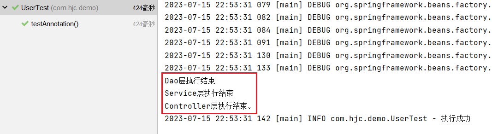

以上构造方法和setter方法都没有提供，经过测试，仍然可以注入成功。

##### set注入

修改UserServiceImpl类

```java
@Service
public class UserServiceImpl implements UserService {

    private UserDao userDao;

    @Autowired
    public void setUserDao(UserDao userDao) {
        this.userDao = userDao;
    }

    @Override
    public void out() {
        userDao.print();
        System.out.println("Service层执行结束");
    }
}
```

修改UserController类

```java
@Controller
public class UserController {

    private UserService userService;

    @Autowired
    public void setUserService(UserService userService) {
        this.userService = userService;
    }

    public void out() {
        userService.out();
        System.out.println("Controller层执行结束。");
    }

}
```

**测试**：


##### 构造方法注入

修改UserServiceImpl类

```java
@Service
public class UserServiceImpl implements UserService {

    private UserDao userDao;

    @Autowired
    public UserServiceImpl(UserDao userDao) {
        this.userDao = userDao;
    }

    @Override
    public void out() {
        userDao.print();
        System.out.println("Service层执行结束");
    }
}
```

修改UserController类

```java
@Controller
public class UserController {

    private UserService userService;

    @Autowired
    public UserController(UserService userService) {
        this.userService = userService;
    }

    public void out() {
        userService.out();
        System.out.println("Controller层执行结束。");
    }

}
```

**测试**：


##### 形参上注入

修改UserServiceImpl类

```java
@Service
public class UserServiceImpl implements UserService {

    private UserDao userDao;

    public UserServiceImpl(@Autowired UserDao userDao) {
        this.userDao = userDao;
    }

    @Override
    public void out() {
        userDao.print();
        System.out.println("Service层执行结束");
    }
}
```

修改UserController类

```java
@Controller
public class UserController {

    private UserService userService;

    public UserController(@Autowired UserService userService) {
        this.userService = userService;
    }

    public void out() {
        userService.out();
        System.out.println("Controller层执行结束。");
    }

}
```

**测试**：

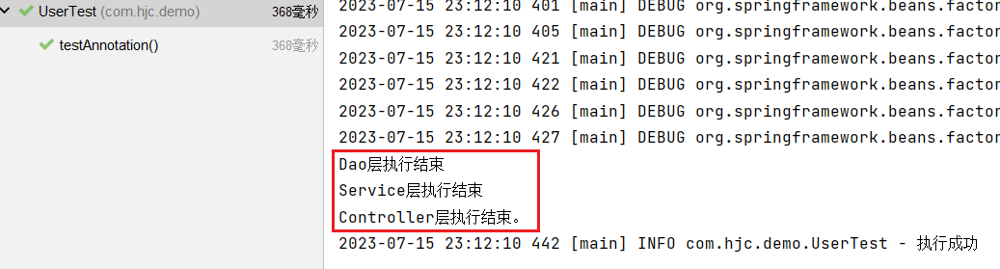

##### 只有一个构造函数，无注解

**当有参数的构造方法只有一个时，@Autowired注解可以省略。**

:::warning 说明

有多个构造方法时，会报错。

:::

修改UserServiceImpl类

```java
@Service
public class UserServiceImpl implements UserService {
    private UserDao userDao;

    public UserServiceImpl(UserDao userDao) {
        this.userDao = userDao;
    }

    @Override
    public void out() {
        userDao.print();
        System.out.println("Service层执行结束");
    }
}
```

测试通过：

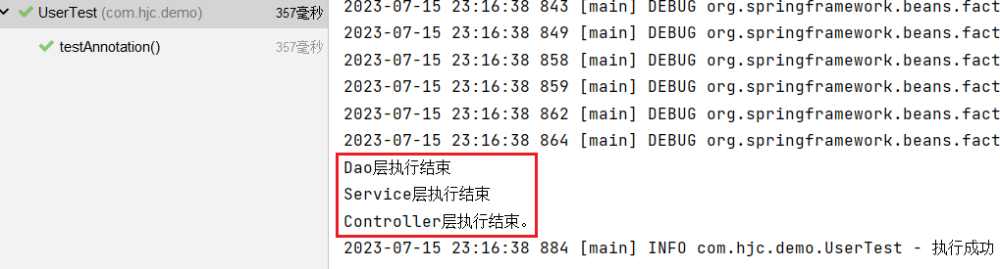

##### @Autowired注解和@Qualifier注解联合

> UserDaoRedisImpl

```java
@Repository
public class UserDaoRedisImpl implements UserDao {

    @Override
    public void print() {
        System.out.println("Redis Dao层执行结束");
    }
}
```

测试：

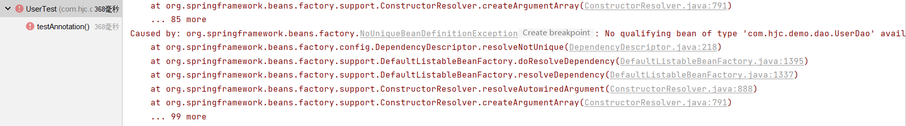

错误信息中说：不能装配，UserDao这个Bean的数量等于2

可以使用byName，根据名称进行装配解决这个问题。

```java [UserServiceImpl]
@Service
public class UserServiceImpl implements UserService {

    @Autowired
    @Qualifier("userDaoImpl") // 指定bean的名字
    private UserDao userDao;

    @Override
    public void out() {
        userDao.print();
        System.out.println("Service层执行结束");
    }
}
```

**测试**：

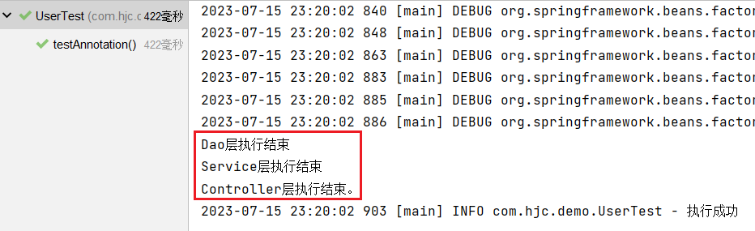

##### 总结

- `@Autowired`注解可以出现在：属性上、构造方法上、构造方法的参数上、setter方法上。
- 当带参数的构造方法只有一个，`@Autowired`注解可以省略。
- `@Autowired`注解默认根据类型注入。如果要根据名称注入的话，需要配合@Qualifier注解一起使用。

#### @Resource注入

`@Resource`注解也可以完成属性注入。

与`@Autowired`注解区别：

- `@Resource`注解是JDK扩展包中的，也就是说属于JDK的一部分。所以该注解是标准注解，更加具有通用性。(JSR-250标准中制定的注解类型。JSR是Java规范提案。)
- `@Autowired`注解是Spring框架自己的。
- **`@Resource`注解默认根据名称装配byName，未指定name时，使用属性名作为name。通过name找不到的话会自动启动通过类型byType装配。**
- **`@Autowired`注解默认根据类型装配byType，如果想根据名称装配，需要配合`@Qualifier`注解一起用。**
- `@Resource`注解用在属性上、setter方法上。
- `@Autowired`注解用在属性上、setter方法上、构造方法上、构造方法参数上。

`@Resource`注解属于JDK扩展包，所以不在JDK当中，需要额外引入以下依赖(如果是JDK8的话不需要额外引入依赖。高于JDK11或低于JDK8需要引入以下依赖)：

```xml
<dependency>
    <groupId>jakarta.annotation</groupId>
    <artifactId>jakarta.annotation-api</artifactId>
    <version>2.1.1</version>
</dependency>
```

源码：

```java
package jakarta.annotation;

import java.lang.annotation.ElementType;
import java.lang.annotation.Repeatable;
import java.lang.annotation.Retention;
import java.lang.annotation.RetentionPolicy;
import java.lang.annotation.Target;

@Target({ElementType.TYPE, ElementType.FIELD, ElementType.METHOD})
@Retention(RetentionPolicy.RUNTIME)
@Repeatable(Resources.class)
public @interface Resource {
    String name() default "";

    String lookup() default "";

    Class<?> type() default Object.class;

    Resource.AuthenticationType authenticationType() default Resource.AuthenticationType.CONTAINER;

    boolean shareable() default true;

    String mappedName() default "";

    String description() default "";

    public static enum AuthenticationType {
        CONTAINER,
        APPLICATION;

        private AuthenticationType() {
        }
    }
}
```

##### 根据name注入

修改UserDaoImpl类

```java
@Repository("myUserDao")
public class UserDaoImpl implements UserDao {

    @Override
    public void print() {
        System.out.println("Dao层执行结束");
    }
}
```

修改UserServiceImpl类

```java
@Service
public class UserServiceImpl implements UserService {

    @Resource(name = "myUserDao")
    private UserDao myUserDao;

    @Override
    public void out() {
        myUserDao.print();
        System.out.println("Service层执行结束");
    }
}
```

**测试**：

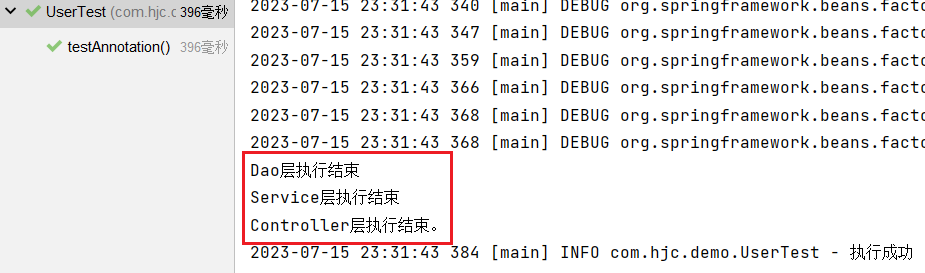

##### name未知注入

修改UserDaoImpl类

```java
@Repository("myUserDao")
public class UserDaoImpl implements UserDao {

    @Override
    public void print() {
        System.out.println("Dao层执行结束");
    }
}
```

修改UserServiceImpl类

```java
@Service
public class UserServiceImpl implements UserService {

    @Resource
    private UserDao myUserDao;

    @Override
    public void out() {
        myUserDao.print();
        System.out.println("Service层执行结束");
    }
}
```

当@Resource注解使用时没有指定name的时候，还是根据name进行查找，这个name是属性名。

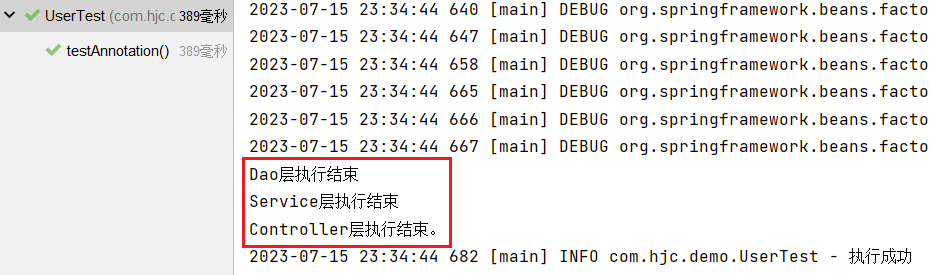

##### set注入

修改UserServiceImpl类

```java
@Service
public class UserServiceImpl implements UserService {

    private UserDao userDao;

    @Resource
    public void setUserDao(UserDao userDao) {
        this.userDao = userDao;
    }

    @Override
    public void out() {
        userDao.print();
        System.out.println("Service层执行结束");
    }
}
```

修改UserController类

```java
@Controller
public class UserController {

    private UserService userService;

    @Resource(name="userServiceImpl")
    public void setUserService(UserService userService) {
        this.userService = userService;
    }

    public void out() {
        userService.out();
        System.out.println("Controller层执行结束。");
    }

}
```

**测试**：

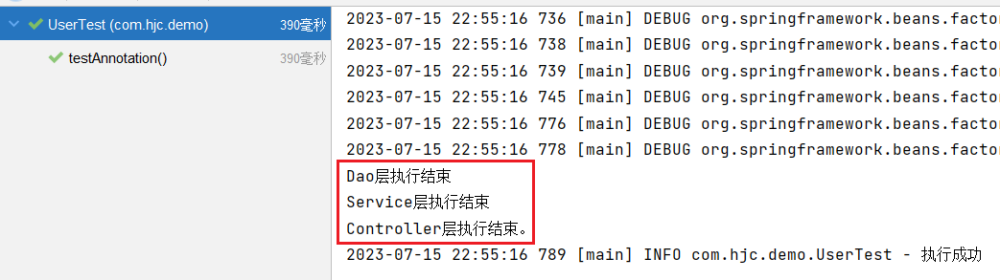

##### 其他情况

修改UserServiceImpl类，userDao1属性名不存在

```java
@Service
public class UserServiceImpl implements UserService {

    @Resource
    private UserDao userDao1;

    @Override
    public void out() {
        userDao1.print();
        System.out.println("Service层执行结束");
    }
}
```

**测试异常**：

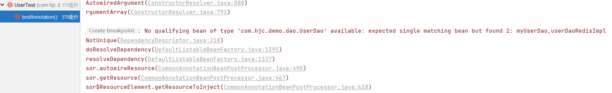

根据异常信息得知：显然当通过name找不到的时候，自然会启动byType进行注入，以上的错误是因为UserDao接口下有两个实现类导致的。所以根据类型注入就会报错。

##### 总结

@Resource注解：默认byName注入，没有指定name时把属性名当做name，根据name找不到时，才会byType注入。byType注入时，某种类型的Bean只能有一个。

## 基于配置类方式管理 Bean

Spring 完全注解配置 (`Fully Annotation-based Configuration`)是指通过 Java配置类 代码来配置 Spring 应用程序，使用注解来替代原本在 XML 配置文件中的配置。相对于 XML 配置，完全注解配置具有更强的类型安全性和更好的可读性。

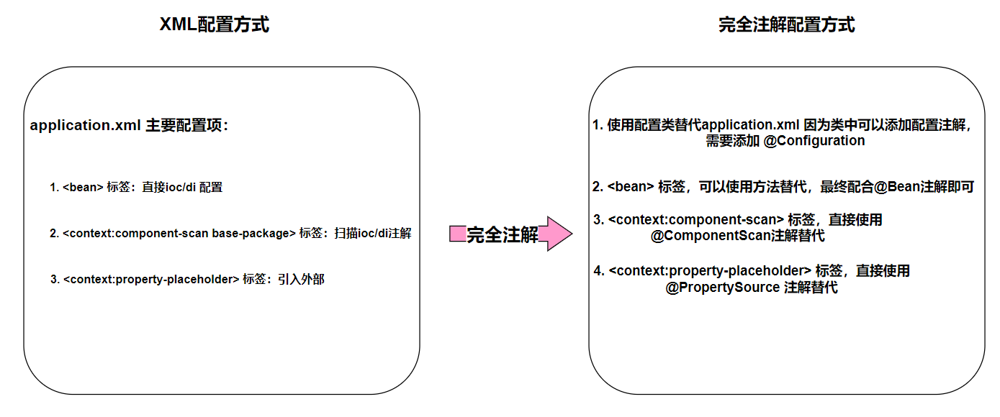

- @Configuration指定一个类为配置类，可以添加配置注解，替代配置xml文件

- @ComponentScan(basePackages = {"包","包"}) 替代\<context:component-scan标签实现注解扫描

- @PropertySource("classpath:配置文件地址") 替代 \<context:property-placeholder标签

配合IoC/DI注解，可以进行完整注解开发。

### 配置类和扫描注解

使用 @Configuration 注解将一个普通的类标记为 Spring 的配置类。

使用配置类来代替配置文件：

```java
//标注当前类是配置类，替代application.xml
@Configuration
//使用注解读取外部配置，替代 <context:property-placeholder标签
@PropertySource("classpath:application.properties")
//使用@ComponentScan注解,可以配置扫描包,替代<context:component-scan标签
//@ComponentScan({"com.hjc.demo.controller", "com.hjc.demo.service","com.hjc.demo.dao"})
@ComponentScan("com.hjc.demo")
public class Spring6Config {
}
```

**测试类**：

```java
@Test
public void testAllAnnotation(){
    ApplicationContext context = new AnnotationConfigApplicationContext(Spring6Config.class);
    UserController userController = context.getBean("userController", UserController.class);
    userController.out();
    logger.info("执行成功");
}
```

可以使用 no-arg 构造函数实例化 `AnnotationConfigApplicationContext` ，然后使用 `register()` 方法对其进行配置。此方法在以编程方式生成 `AnnotationConfigApplicationContext` 时特别有用：

```java
// AnnotationConfigApplicationContext-IOC容器对象
ApplicationContext iocContainerAnnotation =
new AnnotationConfigApplicationContext();
//外部设置配置类
iocContainerAnnotation.register(MyConfiguration.class);
//刷新后方可生效！！
iocContainerAnnotation.refresh();

```

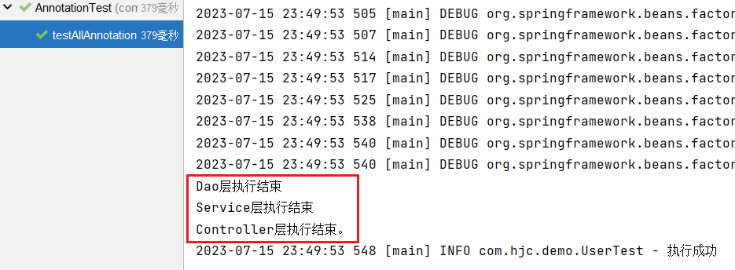

### @Value注解读取配置

`@Value` 通常用于注入外部化属性

```java
import org.springframework.beans.factory.annotation.Value;
import org.springframework.stereotype.Component;

/**
 * projectName: com.atguigu.components
 *
 * description: 普通的组件
 */
@Component
public class CommonComponent {

    /**
     * 情况1: ${key} 取外部配置key对应的值!
     * 情况2: ${key:defaultValue} 没有key,可以给与默认值
     */
    @Value("${catalog:hahaha}")
    private String name;

    public String getName() {
        return name;
    }

    public void setName(String name) {
        this.name = name;
    }
}
```

#### @Bean定义组件

**场景需求**：将Druid连接池对象存储到IoC容器

**需求分析**：第三方jar包的类，添加到ioc容器，无法使用@Component等相关注解！因为源码jar包内容为只读模式！

**xml方式实现**：

```xml
<?xml version="1.0" encoding="UTF-8"?>
<beans xmlns="http://www.springframework.org/schema/beans"
       xmlns:xsi="http://www.w3.org/2001/XMLSchema-instance"
       xmlns:context="http://www.springframework.org/schema/context"
       xsi:schemaLocation="http://www.springframework.org/schema/beans http://www.springframework.org/schema/beans/spring-beans.xsd http://www.springframework.org/schema/context https://www.springframework.org/schema/context/spring-context.xsd">


    <!-- 引入外部属性文件 -->
    <context:property-placeholder location="classpath:jdbc.properties"/>

    <!-- 实验六 [重要]给bean的属性赋值：引入外部属性文件 -->
    <bean id="druidDataSource" class="com.alibaba.druid.pool.DruidDataSource">
        <property name="url" value="${jdbc.url}"/>
        <property name="driverClassName" value="${jdbc.driver}"/>
        <property name="username" value="${jdbc.user}"/>
        <property name="password" value="${jdbc.password}"/>
    </bean>

</beans>
```

**配置类方式实现**：

`@Bean` 注释用于指示方法实例化、配置和初始化要由 Spring IoC 容器管理的新对象。对于那些熟悉 Spring 的 `<beans/>` XML 配置的人来说， `@Bean` 注释与 `<bean/>` 元素起着相同的作用。

```java
//标注当前类是配置类，替代application.xml
@Configuration
//引入jdbc.properties文件
@PropertySource({"classpath:application.properties","classpath:jdbc.properties"})
@ComponentScan(basePackages = {"com.hjc.demo.components"})
public class MyConfiguration {

    //如果第三方类进行IoC管理,无法直接使用@Component相关注解
    //解决方案: xml方式可以使用<bean标签
    //解决方案: 配置类方式,可以使用方法返回值+@Bean注解
    @Bean
    public DataSource createDataSource(@Value("${jdbc.user}") String username,
                                       @Value("${jdbc.password}")String password,
                                       @Value("${jdbc.url}")String url,
                                       @Value("${jdbc.driver}")String driverClassName){
        //使用Java代码实例化
        DruidDataSource dataSource = new DruidDataSource();
        dataSource.setUsername(username);
        dataSource.setPassword(password);
        dataSource.setUrl(url);
        dataSource.setDriverClassName(driverClassName);
        //返回结果即可
        return dataSource;
    }
}
```

**@Bean生成BeanName问题**

@Bean注解源码：

```java
public @interface Bean {
    //前两个注解可以指定Bean的标识
    @AliasFor("name")
    String[] value() default {};
    @AliasFor("value")
    String[] name() default {};

    //autowireCandidate 属性来指示该 Bean 是否候选用于自动装配。
    //autowireCandidate 属性默认值为 true，表示该 Bean 是一个默认的装配目标，
    //可被候选用于自动装配。如果将 autowireCandidate 属性设置为 false，则说明该 Bean 不是默认的装配目标，不会被候选用于自动装配。
    boolean autowireCandidate() default true;

    //指定初始化方法
    String initMethod() default "";
    //指定销毁方法
    String destroyMethod() default "(inferred)";
}

```

指定@Bean的名称：

```java
@Configuration
public class AppConfig {

  @Bean("myThing") //指定名称
  public Thing thing() {
    return new Thing();
  }
}
```

`@Bean` 注释注释方法。使用此方法在指定为方法返回值的类型的 `ApplicationContext` 中注册 Bean 定义。缺省情况下，Bean 名称与方法名称相同。下面的示例演示 `@Bean` 方法声明：

```java
@Configuration
public class AppConfig {

  @Bean
  public TransferServiceImpl transferService() {
    return new TransferServiceImpl();
  }
}
```

前面的配置完全等同于下面的Spring XML：

```java
<beans>
  <bean id="transferService" class="com.acme.TransferServiceImpl"/>
</beans>
```

**@Bean 初始化和销毁方法指定**

`@Bean` 注解支持指定任意初始化和销毁回调方法，非常类似于 Spring XML 在 `bean` 元素上的 `init-method` 和 `destroy-method` 属性，如以下示例所示：

```java
public class BeanOne {

  public void init() {
    // initialization logic
  }
}

public class BeanTwo {

  public void cleanup() {
    // destruction logic
  }
}

@Configuration
public class AppConfig {

  @Bean(initMethod = "init")
  public BeanOne beanOne() {
    return new BeanOne();
  }

  @Bean(destroyMethod = "cleanup")
  public BeanTwo beanTwo() {
    return new BeanTwo();
  }
}
```

**@Bean Scope作用域**

可以指定使用 `@Bean` 注释定义的 bean 应具有特定范围。您可以使用在 Bean 作用域部分中指定的任何标准作用域。

默认作用域为 `singleton` ，但您可以使用 `@Scope` 注释覆盖此范围，如以下示例所示：

```java
@Configuration
public class MyConfiguration {

  @Bean
  @Scope("prototype")
  public Encryptor encryptor() {
    // ...
  }
}
```

**@Bean方法之间依赖**

**准备组件**

```java
public class HappyMachine {

    private String machineName;

    public String getMachineName() {
        return machineName;
    }

    public void setMachineName(String machineName) {
        this.machineName = machineName;
    }
}
```

```java
public class HappyComponent {
    //引用新组件
    private HappyMachine happyMachine;

    public HappyMachine getHappyMachine() {
        return happyMachine;
    }

    public void setHappyMachine(HappyMachine happyMachine) {
        this.happyMachine = happyMachine;
    }

    public void doWork() {
        System.out.println("HappyComponent.doWork");
    }

}
```

**Java配置类实现**：

直接调用方法返回 Bean 实例：在一个 `@Bean` 方法中直接调用其他 `@Bean` 方法来获取 Bean 实例，虽然是方法调用，也是通过IoC容器获取对应的Bean。

```java
@Configuration
public class JavaConfig {

    @Bean
    public HappyMachine happyMachine(){
        return new HappyMachine();
    }

    @Bean
    public HappyComponent happyComponent(){
        HappyComponent happyComponent = new HappyComponent();
        //直接调用方法即可!
        happyComponent.setHappyMachine(happyMachine());
        return happyComponent;
    }

}
```

参数引用法：通过方法参数传递 Bean 实例的引用来解决 Bean 实例之间的依赖关系。

```java
import org.springframework.context.annotation.Bean;
import org.springframework.context.annotation.Configuration;

/**
 * projectName: com.hjc.demo.config
 * description: 配置HappyComponent和HappyMachine关系
 */

@Configuration
public class JavaConfig {

    @Bean
    public HappyMachine happyMachine(){
        return new HappyMachine();
    }

    /**
     * 可以直接在形参列表接收IoC容器中的Bean!
     *    情况1: 直接指定类型即可
     *    情况2: 如果有多个bean,(HappyMachine 名称 ) 形参名称等于要指定的bean名称!
     *           例如:
     *               @Bean
     *               public Foo foo1(){
     *                   return new Foo();
     *               }
     *               @Bean
     *               public Foo foo2(){
     *                   return new Foo()
     *               }
     *               @Bean
     *               public Component component(Foo foo1 / foo2 通过此处指定引入的bean)
     */
    @Bean
    public HappyComponent happyComponent(HappyMachine happyMachine){
        HappyComponent happyComponent = new HappyComponent();
        //赋值
        happyComponent.setHappyMachine(happyMachine);
        return happyComponent;
    }

}
```

#### @Import扩展

`@Import` 注释允许从另一个配置类加载 `@Bean` 定义。

```java
@Configuration
public class ConfigA {

  @Bean
  public A a() {
    return new A();
  }
}

@Configuration
@Import(ConfigA.class)
public class ConfigB {

  @Bean
  public B b() {
    return new B();
  }
}
```

现在，在实例化上下文时不需要同时指定 `ConfigA.class` 和 `ConfigB.class` ，只需显式提供 `ConfigB` ，如以下示例所示：

```java
public static void main(String[] args) {
  ApplicationContext ctx = new AnnotationConfigApplicationContext(ConfigB.class);

  // now both beans A and B will be available...
  A a = ctx.getBean(A.class);
  B b = ctx.getBean(B.class);
}
```

此方法简化了容器实例化，因为只需要处理一个类，而不是要求您在构造期间记住可能大量的 `@Configuration` 类。

## 手写IoC

Spring框架的IOC是基于Java反射机制实现的。

### Java反射

`Java`反射机制是在运行状态中，对于任意一个类，都能够知道这个类的所有属性和方法；对于任意一个对象，都能够调用它的任意方法和属性；这种动态获取信息以及动态调用对象方法的功能称为`Java`语言的反射机制。简单来说，反射机制指的是程序在运行时能够获取自身的信息。

要想解剖一个类，必须先要**获取到该类的Class对象**。而剖析一个类或用反射解决具体的问题就是使用相关API**（1）java.lang.Class（2）java.lang.reflect**，所以，**Class对象是反射的根源**。

**自定义类**：

```java
public class Car {

    //属性
    private String name;
    private int age;
    private String color;

    //无参数构造
    public Car() {
    }

    //有参数构造
    public Car(String name, int age, String color) {
        this.name = name;
        this.age = age;
        this.color = color;
    }

    //普通方法
    private void run() {
        System.out.println("私有方法-run.....");
    }

    //get和set方法
    public String getName() {
        return name;
    }
    public void setName(String name) {
        this.name = name;
    }
    public int getAge() {
        return age;
    }
    public void setAge(int age) {
        this.age = age;
    }
    public String getColor() {
        return color;
    }
    public void setColor(String color) {
        this.color = color;
    }

    @Override
    public String toString() {
        return "Car{" +
                "name='" + name + '\'' +
                ", age=" + age +
                ", color='" + color + '\'' +
                '}';
    }
}
```

**编写测试类**：

```java
public class TestCar {

    //1、获取Class对象多种方式
    @Test
    public void test01() throws Exception {
        //1 类名.class
        Class clazz1 = Car.class;

        //2 对象.getClass()
        Class clazz2 = new Car().getClass();

        //3 Class.forName("全路径")
        Class clazz3 = Class.forName("com.hjc.demo.reflect.Car");

        //实例化
        Car car = (Car)clazz3.getConstructor().newInstance();
        System.out.println(car);
    }

    //2、获取构造方法
    @Test
    public void test02() throws Exception {
        Class clazz = Car.class;
        //获取所有构造
        // getConstructors()获取所有public的构造方法
//        Constructor[] constructors = clazz.getConstructors();
        // getDeclaredConstructors()获取所有的构造方法public  private
        Constructor[] constructors = clazz.getDeclaredConstructors();
        for (Constructor c:constructors) {
            System.out.println("方法名称："+c.getName()+" 参数个数："+c.getParameterCount());
        }

        //指定有参数构造创建对象
        //1 构造public
//        Constructor c1 = clazz.getConstructor(String.class, int.class, String.class);
//        Car car1 = (Car)c1.newInstance("夏利", 10, "红色");
//        System.out.println(car1);

        //2 构造private
        Constructor c2 = clazz.getDeclaredConstructor(String.class, int.class, String.class);
        c2.setAccessible(true);
        Car car2 = (Car)c2.newInstance("捷达", 15, "白色");
        System.out.println(car2);
    }

    //3、获取属性
    @Test
    public void test03() throws Exception {
        Class clazz = Car.class;
        Car car = (Car)clazz.getDeclaredConstructor().newInstance();
        //获取所有public属性
        //Field[] fields = clazz.getFields();
        //获取所有属性（包含私有属性）
        Field[] fields = clazz.getDeclaredFields();
        for (Field field:fields) {
            if(field.getName().equals("name")) {
                //设置允许访问
                field.setAccessible(true);
                field.set(car,"五菱宏光");
                System.out.println(car);
            }
            System.out.println(field.getName());
        }
    }

    //4、获取方法
    @Test
    public void test04() throws Exception {
        Car car = new Car("奔驰",10,"黑色");
        Class clazz = car.getClass();
        //1 public方法
        Method[] methods = clazz.getMethods();
        for (Method m1:methods) {
            //System.out.println(m1.getName());
            //执行方法 toString
            if(m1.getName().equals("toString")) {
                String invoke = (String)m1.invoke(car);
                //System.out.println("toString执行了："+invoke);
            }
        }

        //2 private方法
        Method[] methodsAll = clazz.getDeclaredMethods();
        for (Method m:methodsAll) {
            //执行方法 run
            if(m.getName().equals("run")) {
                m.setAccessible(true);
                m.invoke(car);
            }
        }
    }
}
```

### 实现Spring的IoC

IoC(控制反转)和DI(依赖注入)是Spring里面核心的东西。

#### 搭建子模块

构建项目使用[Spring构建入门程序](BasicProgram.md)。

#### 准备测试需要的bean

添加依赖：

```xml
<dependencies>
    <!--junit5测试-->
    <dependency>
        <groupId>org.junit.jupiter</groupId>
        <artifactId>junit-jupiter-api</artifactId>
        <version>5.3.1</version>
    </dependency>
</dependencies>
```

创建UserDao接口：

```java
public interface UserDao {

    public void print();
}
```

创建UserDaoImpl实现：

```java
public class UserDaoImpl implements UserDao {

    @Override
    public void print() {
        System.out.println("Dao层执行结束");
    }
}
```

创建UserService接口：

```java
public interface UserService {

    public void out();
}
```

创建UserServiceImpl实现类：

```java
@Bean
public class UserServiceImpl implements UserService {

//    private UserDao userDao;

    @Override
    public void out() {
        //userDao.print();
        System.out.println("Service层执行结束");
    }
}

```

#### 定义注解

通过注解的形式加载bean与实现依赖注入

bean注解：

```java
@Target(ElementType.TYPE)
@Retention(RetentionPolicy.RUNTIME)
public @interface Bean {
}
```

依赖注入注解：

```java
import java.lang.annotation.ElementType;
import java.lang.annotation.Retention;
import java.lang.annotation.RetentionPolicy;
import java.lang.annotation.Target;

@Target({ElementType.FIELD})
@Retention(RetentionPolicy.RUNTIME)
public @interface Di {
}
```

#### 定义bean容器接口

```java
public interface ApplicationContext {

    Object getBean(Class clazz);
}
```

#### 编写注解bean容器接口实现

AnnotationApplicationContext基于注解扫描bean

```java
public class AnnotationApplicationContext implements ApplicationContext {

    //存储bean的容器
    private HashMap<Class, Object> beanFactory = new HashMap<>();

    @Override
    public Object getBean(Class clazz) {
        return beanFactory.get(clazz);
    }

    /**
     * 根据包扫描加载bean
     * @param basePackage
     */
    public AnnotationApplicationContext(String basePackage) {

    }
}
```

#### 编写扫描bean逻辑

通过构造方法传入包的base路径，扫描被`@Bean`注解的java对象，完整代码如下：

```java
public class AnnotationApplicationContext implements ApplicationContext {

    //存储bean的容器
    private HashMap<Class,Object> beanFactory = new HashMap<>();

    private static String rootPath;

    /**
     * 返回对象
     * @param clazz
     * @return
     */
    @Override
    public Object getBean(Class clazz) {
        return beanFactory.get(clazz);
    }

    /**
     * 创建有参数构造，传递包路径，设置包扫描规则 根据包扫描加载bean
     * 当前包及其子包，哪个类有@Bean注解，把这个类通过反射实例化
     * @param basePackage
     */
    public AnnotationApplicationContext(String basePackage) {
        try {
            //todo 把包名中的.替换成 \
            String packageDirName = basePackage.replaceAll("\\.", "\\\\");
            //todo 通过线程获取包的绝对路径
            Enumeration<URL> dirs = Thread.currentThread().getContextClassLoader().getResources(packageDirName);

            while(dirs.hasMoreElements()){
                URL url = dirs.nextElement();

                String filePath = URLDecoder.decode(url.getFile(),"utf-8");
                //获取包前面路径部分，字符串截取
                rootPath = filePath.substring(0, filePath.length()-packageDirName.length());
                //包扫描
                loadBean(new File(filePath));
            }
        } catch (Exception e) {
            e.printStackTrace();
        }
    }

    /**
     * 包扫描过程，实例化
     * @param fileParent
     */
    private  void loadBean(File fileParent) throws Exception {
        //todo 判断当前是否文件夹
        if (fileParent.isDirectory()){
            //todo 获取文件夹里面所有内容
            File[] childrenFiles = fileParent.listFiles();
            //todo 判断文件夹里面为空，直接返回
            if (childrenFiles == null || childrenFiles.length == 0){
                return;
            }
            //todo 如果文件夹里面不为空，遍历文件夹所有内容
            for (File child : childrenFiles) {
                //todo 遍历得到每个File对象，继续判断，如果还是文件夹，递归
                if (child.isDirectory()){
                    //todo 递归
                    loadBean(child);
                }else {
                    //遍历得到File对象不是文件夹，是文件，
                    //todo 得到包路径+类名称部分-字符串截取
                    String pathWithClass = child.getAbsolutePath().substring(rootPath.length()-1);
                    //todo 判断当前文件类型是否为.class
                    if (pathWithClass.contains(".class")){
                        //todo 如果是.class类型，把路径\替换成.  把.class去掉
                        String allName = pathWithClass.replaceAll("\\\\", ".")
                                .replace(".class", "");
                        //todo 判断类上面是否有注解 @Bean，如果有实例化过程
                        //todo 获取类的Class
                        Class<?> clazz = Class.forName(allName);
                        //todo 判断是否为接口
                        if (!clazz.isInterface()){
                            //todo 判断类上面是否有注解 @Bean
                            Bean annotation = clazz.getAnnotation(Bean.class);
                            if(annotation != null) {
                                //todo 实例化
                                Object instance = clazz.getConstructor().newInstance();
                                //todo 把对象实例化之后，放到map集合beanFactory
                                //todo 判断当前类如果有接口，让接口class作为map的key
                                if(clazz.getInterfaces().length>0) {
                                    beanFactory.put(clazz.getInterfaces()[0],instance);
                                } else {
                                    beanFactory.put(clazz,instance);
                                }
                            }
                        }
                    }

                }
            }

        }
    }
}
```

#### java类标识Bean注解

```java
@Bean
public class UserServiceImpl implements UserService
```

```java
@Bean
public class UserDaoImpl implements UserDao
```

#### 测试Bean加载

```java
public class SpringIocTest {

    @Test
    public void testIoc() {
        ApplicationContext context = new AnnotationApplicationContext("com.hjc.demo");
        UserService userService = (UserService) context.getBean(UserService.class);
        userService.out();
        System.out.println("run success");
    }
}
```

控制台打印测试

#### 依赖注入

只要`userDao.print();`调用成功，说明就注入成功

```java
@Bean
public class UserServiceImpl implements UserService {

    @Di
    private UserDao userDao;

    @Override
    public void out() {
        userDao.print();
        System.out.println("Service层执行结束");
    }
}
```

执行第八步：报错了，说明当前userDao是个空对象

#### 依赖注入实现

```java
public class AnnotationApplicationContext implements ApplicationContext {

    //存储bean的容器
    private HashMap<Class,Object> beanFactory = new HashMap<>();

    private static String rootPath;

    /**
     * 返回对象
     * @param clazz
     * @return
     */
    @Override
    public Object getBean(Class clazz) {
        return beanFactory.get(clazz);
    }

    /**
     * 创建有参数构造，传递包路径，设置包扫描规则 根据包扫描加载bean
     * 当前包及其子包，哪个类有@Bean注解，把这个类通过反射实例化
     * @param basePackage
     */
    public AnnotationApplicationContext(String basePackage) {
        try {
            //todo 把包名中的.替换成 \
            String packageDirName = basePackage.replaceAll("\\.", "\\\\");
            //todo 通过线程获取包的绝对路径
            Enumeration<URL> dirs = Thread.currentThread().getContextClassLoader().getResources(packageDirName);

            while(dirs.hasMoreElements()){
                URL url = dirs.nextElement();

                String filePath = URLDecoder.decode(url.getFile(),"utf-8");
                //获取包前面路径部分，字符串截取
                rootPath = filePath.substring(0, filePath.length()-packageDirName.length());
                //包扫描
                loadBean(new File(filePath));
            }
        } catch (Exception e) {
            e.printStackTrace();
        }
        //属性注入
        loadDi();
    }

    /**
     * 包扫描过程，实例化
     * @param fileParent
     */
    private  void loadBean(File fileParent) throws Exception {
        //todo 判断当前是否文件夹
        if (fileParent.isDirectory()){
            //todo 获取文件夹里面所有内容
            File[] childrenFiles = fileParent.listFiles();
            //todo 判断文件夹里面为空，直接返回
            if (childrenFiles == null || childrenFiles.length == 0){
                return;
            }
            //todo 如果文件夹里面不为空，遍历文件夹所有内容
            for (File child : childrenFiles) {
                //todo 遍历得到每个File对象，继续判断，如果还是文件夹，递归
                if (child.isDirectory()){
                    //todo 递归
                    loadBean(child);
                }else {
                    //遍历得到File对象不是文件夹，是文件，
                    //todo 得到包路径+类名称部分-字符串截取
                    String pathWithClass = child.getAbsolutePath().substring(rootPath.length()-1);
                    //todo 判断当前文件类型是否为.class
                    if (pathWithClass.contains(".class")){
                        //todo 如果是.class类型，把路径\替换成.  把.class去掉
                        String allName = pathWithClass.replaceAll("\\\\", ".")
                                .replace(".class", "");
                        //todo 判断类上面是否有注解 @Bean，如果有实例化过程
                        //todo 获取类的Class
                        Class<?> clazz = Class.forName(allName);
                        //todo 判断是否为接口
                        if (!clazz.isInterface()){
                            //todo 判断类上面是否有注解 @Bean
                            Bean annotation = clazz.getAnnotation(Bean.class);
                            if(annotation != null) {
                                //todo 实例化
                                Object instance = clazz.getConstructor().newInstance();
                                //todo 把对象实例化之后，放到map集合beanFactory
                                //todo 判断当前类如果有接口，让接口class作为map的key
                                if(clazz.getInterfaces().length>0) {
                                    beanFactory.put(clazz.getInterfaces()[0],instance);
                                } else {
                                    beanFactory.put(clazz,instance);
                                }
                            }
                        }
                    }

                }
            }

        }
    }

    /**
     * 属性注入
     */
    private void loadDi() {
        //TODO 实例化对象在beanFactory的map集合里面
        Set<Map.Entry<Class, Object>> entries = beanFactory.entrySet();
        //todo 遍历beanFactory的map集合
        for (Map.Entry<Class, Object> entry:entries) {
            //todo 获取map集合每个对象（value），每个对象属性获取到
            Object obj = entry.getValue();

            //todo 获取对象Class
            Class<?> clazz = obj.getClass();

            //todo 获取每个对象属性获取到
            Field[] declaredFields = clazz.getDeclaredFields();

            //todo 遍历得到每个对象属性数组，得到每个属性
            for(Field field:declaredFields) {
                //todo 判断属性上面是否有@Di注解
                Di annotation = field.getAnnotation(Di.class);
                if(annotation != null) {
                    //todo 如果私有属性，设置可以设置值
                    field.setAccessible(true);

                    //todo 如果有@Di注解，把对象进行设置（注入）
                    try {
                        field.set(obj,beanFactory.get(field.getType()));
                    } catch (IllegalAccessException e) {
                        throw new RuntimeException(e);
                    }
                }
            }
        }
    }
}
```

执行第八步：执行成功，依赖注入成功

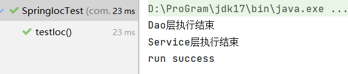

::: tip 原理延伸
Spring IoC 实例化 Bean 的核心手段之一就是**构造器反射**：运行时通过 `Constructor.newInstance` 创建对象并注入依赖。见 [构造器与对象创建](../../../JavaSE/Reflection/Constructor/index.md)。
:::
