# JdbcTemplate


Spring 框架对 JDBC 进行封装，使用 JdbcTemplate 方便实现对数据库操作。

## 准备工作

1. 搭建子模块并引入依赖：

   ```xml
   <dependencies>
   	<dependency>
           <groupId>org.springframework</groupId>
           <artifactId>spring-context</artifactId>
       </dependency>
       <!-- MySQL驱动 -->
       <dependency>
           <groupId>mysql</groupId>
           <artifactId>mysql-connector-java</artifactId>
       </dependency>
       <!--spring jdbc  Spring 持久化层支持jar包-->
       <dependency>
           <groupId>org.springframework</groupId>
           <artifactId>spring-jdbc</artifactId>
       </dependency>
       <dependency>
           <groupId>org.junit.jupiter</groupId>
           <artifactId>junit-jupiter-api</artifactId>
           <scope>test</scope>
       </dependency>
       <!--spring对junit的支持相关依赖-->
       <dependency>
           <groupId>org.springframework</groupId>
           <artifactId>spring-test</artifactId>
       </dependency>
   </dependencies>
   ```

2. 创建jdbc.properties：

   ```properties [jdbc.properties]
   jdbc.user=root
   jdbc.password=123123
   jdbc.url=jdbc:mysql://localhost:3306/spring?characterEncoding=utf8&useSSL=false
   jdbc.driver=com.mysql.cj.jdbc.Driver
   ```

3. 配置Spring的配置文件：

   ```xml [beans.xml]
   <?xml version="1.0" encoding="UTF-8"?>
   <beans xmlns="http://www.springframework.org/schema/beans"
          xmlns:xsi="http://www.w3.org/2001/XMLSchema-instance"
          xmlns:context="http://www.springframework.org/schema/context"
          xsi:schemaLocation="http://www.springframework.org/schema/beans
          http://www.springframework.org/schema/beans/spring-beans.xsd
          http://www.springframework.org/schema/context
          http://www.springframework.org/schema/context/spring-context.xsd">

       <!-- 导入外部属性文件 -->
       <context:property-placeholder location="classpath:jdbc.properties" />

       <!-- 配置数据源 -->
       <bean id="dataSource" class="org.springframework.jdbc.datasource.DriverManagerDataSource">
           <!-- 连接数据库的url -->
           <property name="url" value="${jdbc.url}"/>
           <!-- 数据库驱动 -->
           <property name="driverClassName" value="${jdbc.driver}"/>
           <!-- 连接数据库的用户名 -->
           <property name="username" value="${jdbc.user}"/>
           <!-- 连接数据库的密码 -->
           <property name="password" value="${jdbc.password}"/>
       </bean>

       <!-- 配置 JdbcTemplate -->
       <bean id="jdbcTemplate" class="org.springframework.jdbc.core.JdbcTemplate">
           <!-- 装配数据源 -->
           <property name="dataSource" ref="dataSource"/>
       </bean>

   </beans>
   ```

4. 数据库与测试表：

   ```sql
   CREATE DATABASE `spring`;

   use `spring`;

   CREATE TABLE `t_emp` (
     `id` int(11) NOT NULL AUTO_INCREMENT,
     `name` varchar(20) DEFAULT NULL COMMENT '姓名',
     `age` int(11) DEFAULT NULL COMMENT '年龄',
     `sex` varchar(2) DEFAULT NULL COMMENT '性别',
     PRIMARY KEY (`id`)
   ) ENGINE=InnoDB DEFAULT CHARSET=utf8mb4;
   ```

## 实现CURD

### 装配 JdbcTemplate

创建测试类，[整合JUnit](Integration/Junit/index.md)，注入JdbcTemplate：

```java
import org.springframework.beans.factory.annotation.Autowired;
import org.springframework.jdbc.core.JdbcTemplate;
import org.springframework.test.context.junit.jupiter.SpringJUnitConfig;

@SpringJUnitConfig(locations = "classpath:beans.xml")
public class JDBCTemplateTest {

    @Autowired
    private JdbcTemplate jdbcTemplate;

}
```

### 测试增删改功能

增加操作：

```java
@SpringJUnitConfig(locations = "classpath:beans.xml")
public class JDBCTemplateTest {

    @Autowired
    private JdbcTemplate jdbcTemplate;

    /**
     * JDBCTemplate 增加操作
     */
    @Test
    void testInsert() {
        String sql = "insert into t_emp values(null,?,?,?)";
        int result = jdbcTemplate.update(sql, "张三", 23, "男");
        System.out.println("result = " + result);
    }
}
```

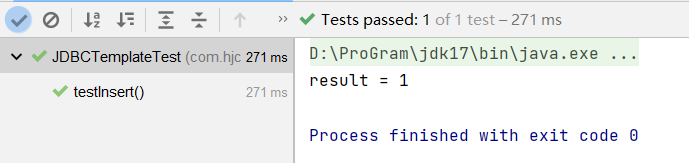

删除操作：

```java
@SpringJUnitConfig(locations = "classpath:beans.xml")
public class JDBCTemplateTest {

    @Autowired
    private JdbcTemplate jdbcTemplate;

    /**
     * JDBCTemplate 删除操作
     */
    @Test
    void testDelete() {
        String sql = "delete from t_emp where id = ?";
        int result = jdbcTemplate.update(sql, 1);
        System.out.println("result = " + result);
    }
}
```

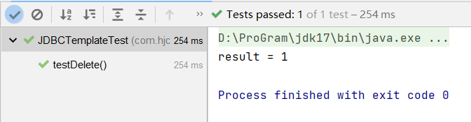

修改操作：

```java
@SpringJUnitConfig(locations = "classpath:beans.xml")
public class JDBCTemplateTest {

    @Autowired
    private JdbcTemplate jdbcTemplate;

    /**
     * JDBCTemplate 更改操作
     */
    @Test
    void testUpdate() {
        String sql = "update t_emp set name=? where id=?";
        int result = jdbcTemplate.update(sql, "李四",2);
        System.out.println("result = " + result);
    }
}
```

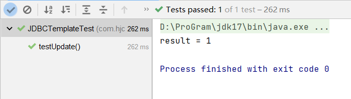

### 查询数据返回对象

```java
public class Emp {

    private Integer id;
    private String name;
    private Integer age;
    private String sex;

    //生成get和set方法
    //......

    @Override
    public String toString() {
        return "Emp{" +
                "id=" + id +
                ", name='" + name + '\'' +
                ", age=" + age +
                ", sex='" + sex + '\'' +
                '}';
    }
}
```

```java
@SpringJUnitConfig(locations = "classpath:beans.xml")
public class JDBCTemplateTest {

    @Autowired
    private JdbcTemplate jdbcTemplate;

    @Test
    void testSelectObj() {
        String sql = "select * from t_emp where id=?";
        //todo 写法一
        Emp emp1 = jdbcTemplate.queryForObject(sql, (rs, rowNum) -> {
            Emp emp = new Emp();
            emp.setId(rs.getInt("id"));
            emp.setName(rs.getString("name"));
            emp.setAge(rs.getInt("age"));
            emp.setSex(rs.getString("sex"));
            return emp;
        }, 2);
        System.out.println("emp1 = " + emp1);
        //todo 写法二
        Emp emp = jdbcTemplate.queryForObject(sql, new BeanPropertyRowMapper<>(Emp.class), 2);
        System.out.println("emp = " + emp);
    }
}
```

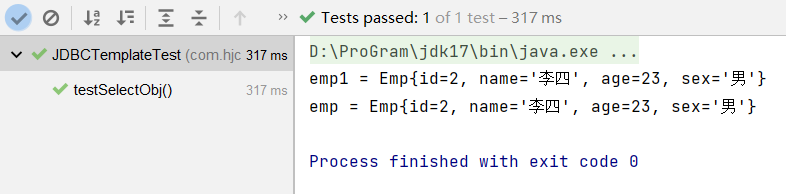

### 查询数据返回list集合

```java
@SpringJUnitConfig(locations = "classpath:beans.xml")
public class JDBCTemplateTest {

    @Autowired
    private JdbcTemplate jdbcTemplate;

    /**
     * 查询返回list
     */
    @Test
    void testSelectList() {
        String sql = "select * from t_emp";
        List<Emp> list = jdbcTemplate.query(sql, new BeanPropertyRowMapper<>(Emp.class));
        System.out.println(list);
    }
}
```

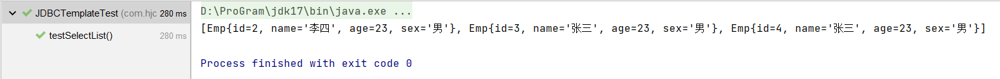

### 查询返回单个的值

```java
@SpringJUnitConfig(locations = "classpath:beans.xml")
public class JDBCTemplateTest {

    @Autowired
    private JdbcTemplate jdbcTemplate;
    /**
     * 查询单行单列的值
     */
    @Test
    public void selectCount(){
        String sql = "select count(id) from t_emp";
        Integer count = jdbcTemplate.queryForObject(sql, Integer.class);
        System.out.println(count);
    }
}
```

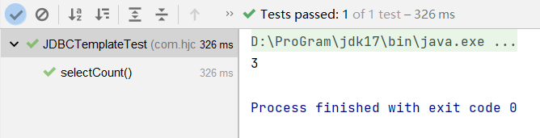

# 声明式事务概念

## 事务基本概念

### 什么是事务

数据库事务(transaction)是访问并可能操作各种数据项的一个数据库操作序列，这些操作要么全部执行要么全部不执行，是一个不可分割的工作单位。事务由事务开始与事务结束之间执行的全部数据库操作组成。

### 事务的特性

**A：原子性(Atomicity)**：

一个事务(transaction)中的所有操作，要么全部完成，要么全部不完成，不会结束在中间某个环节。事务在执行过程中发生错误，会被回滚（Rollback）到事务开始前的状态，就像这个事务从来没有执行过一样。

**C：一致性(Consistency)**：

事务的一致性指的是在一个事务执行之前和执行之后数据库都必须处于一致性状态。

如果事务成功地完成，那么系统中所有变化将正确地应用，系统处于有效状态。

如果在事务中出现错误，那么系统中的所有变化将自动地回滚，系统返回到原始状态。

**I：隔离性(Isolation)**：

指的是在并发环境中，当不同的事务同时操纵相同的数据时，每个事务都有各自的完整数据空间。由并发事务所做的修改必须与任何其他并发事务所做的修改隔离。事务查看数据更新时，数据所处的状态要么是另一事务修改它之前的状态，要么是另一事务修改它之后的状态，事务不会查看到中间状态的数据。

**D：持久性(Durability)**：

指的是只要事务成功结束，它对数据库所做的更新就必须保存下来。即使发生系统崩溃，重新启动数据库系统后，数据库还能恢复到事务成功结束时的状态。

## 编程式事务

编程式事务是指手动编写程序来管理事务，即通过编写代码的方式直接控制事务的提交和回滚。在 Java 中，通常使用事务管理器(如 Spring 中的 `PlatformTransactionManager`)来实现编程式事务。

编程式事务的主要优点是灵活性高，可以按照自己的需求来控制事务的粒度、模式等等。但是，编写大量的事务控制代码容易出现问题，对代码的可读性和可维护性有一定影响。

事务功能的相关操作全部通过自己编写代码来实现：

```java
Connection conn = ...;

try {

    // 开启事务：关闭事务的自动提交
    conn.setAutoCommit(false);

    // 核心操作

    // 提交事务
    conn.commit();

}catch(Exception e){

    // 回滚事务
    conn.rollBack();

}finally{

    // 释放数据库连接
    conn.close();

}
```

编程式的实现方式存在缺陷：

- 细节没有被屏蔽：具体操作过程中，所有细节都需要程序员自己来完成，比较繁琐。
- 代码复用性不高：如果没有有效抽取出来，每次实现功能都需要自己编写代码，代码就没有得到复用。

## 声明式事务

既然事务控制的代码有规律可循，代码的结构基本是确定的，所以框架就可以将固定模式的代码抽取出来，进行相关的封装。封装起来后，只需要在配置文件中进行简单的配置即可完成操作。

声明式事务是指使用注解或 XML 配置的方式来控制事务的提交和回滚。

开发者只需要添加配置即可， 具体事务的实现由第三方框架实现，避免直接进行事务操作。

使用声明式事务可以将事务的控制和业务逻辑分离开来，提高代码的可读性和可维护性。

**区别**：

- **编程式事务需要手动编写代码来管理事务**
- **声明式事务可以通过配置文件或注解来控制事务**

**优点**：

- 提高开发效率
- 消除了冗余的代码
- 框架会综合考虑相关领域中在实际开发环境下有可能遇到的各种问题，进行了健壮性、性能等各个方面的优化

**总结**：

- **编程式**：**自己写代码**实现功能
- **声明式**：通过**配置**让**框架**实现功能

## Spring事务管理器

1. Spring声明式事务对应依赖：

   - spring-tx：包含声明式事务实现的基本规范（事务管理器规范接口和事务增强等等）
   - spring-jdbc：包含DataSource方式事务管理器实现类DataSourceTransactionManager
   - spring-orm：包含其他持久层框架的事务管理器实现类例如：Hibernate/Jpa等

2. Spring声明式事务对应事务管理器接口：

   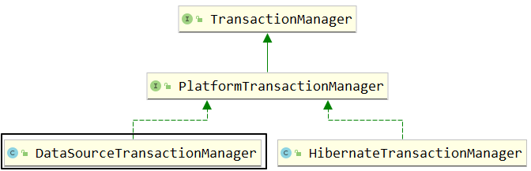

   现在使用的事务管理器是org.springframework.jdbc.datasource.DataSourceTransactionManager，将来整合 JDBC方式、JdbcTemplate方式、Mybatis方式的事务实现。

   DataSourceTransactionManager类中的主要方法：

   - `doBegin()`：开启事务
   - `doSuspend()`：挂起事务
   - `doResume()`：恢复挂起的事务
   - `doCommit()`：提交事务
   - `doRollback()`：回滚事务

# 基于注解的声明式事务

## 准备工作

1. 搭建子模块并引入依赖：

   ```xml
   <dependencies>
       <!--spring jdbc  Spring 持久化层支持jar包-->
       <dependency>
           <groupId>org.springframework</groupId>
           <artifactId>spring-jdbc</artifactId>
           <version>6.0.2</version>
       </dependency>
       <!-- MySQL驱动 -->
       <dependency>
           <groupId>mysql</groupId>
           <artifactId>mysql-connector-java</artifactId>
           <version>8.0.30</version>
       </dependency>
   </dependencies>
   ```

2. **添加配置**：在beans.xml添加配置

   ```xml [beans.xml]
   <!--扫描组件-->
   <context:component-scan base-package="com.hjc.demo"></context:component-scan>
   ```

3. **创建表**：

   ```sql
   CREATE TABLE `t_book` (
     `book_id` int(11) NOT NULL AUTO_INCREMENT COMMENT '主键',
     `book_name` varchar(20) DEFAULT NULL COMMENT '图书名称',
     `price` int(11) DEFAULT NULL COMMENT '价格',
     `stock` int(10) unsigned DEFAULT NULL COMMENT '库存（无符号）',
     PRIMARY KEY (`book_id`)
   ) ENGINE=InnoDB AUTO_INCREMENT=3 DEFAULT CHARSET=utf8;
   insert  into `t_book`(`book_id`,`book_name`,`price`,`stock`) values (1,'斗破苍穹',80,100),(2,'斗罗大陆',50,100);
   CREATE TABLE `t_user` (
     `user_id` int(11) NOT NULL AUTO_INCREMENT COMMENT '主键',
     `username` varchar(20) DEFAULT NULL COMMENT '用户名',
     `balance` int(10) unsigned DEFAULT NULL COMMENT '余额（无符号）',
     PRIMARY KEY (`user_id`)
   ) ENGINE=InnoDB AUTO_INCREMENT=2 DEFAULT CHARSET=utf8;
   insert  into `t_user`(`user_id`,`username`,`balance`) values (1,'admin',50);
   ```

4. **创建组件**：

   ```java [BookController]
   @Controller
   public class BookController {

       @Autowired
       private BookService bookService;

       public void buyBook(Integer bookId, Integer userId){
           bookService.buyBook(bookId, userId);
       }
   }
   ```

   ```java [BookService]
   public interface BookService {
       void buyBook(Integer bookId, Integer userId);
   }
   ```

   ```java [BookServiceImpl]
   @Service
   public class BookServiceImpl implements BookService {

       @Autowired
       private BookDao bookDao;

       @Override
       public void buyBook(Integer bookId, Integer userId) {
           //查询图书的价格
           Integer price = bookDao.getPriceByBookId(bookId);
           //更新图书的库存
           bookDao.updateStock(bookId);
           //更新用户的余额
           bookDao.updateBalance(userId, price);
       }
   }
   ```

   ```java [BookDao]
   public interface BookDao {
       Integer getPriceByBookId(Integer bookId);

       void updateStock(Integer bookId);

       void updateBalance(Integer userId, Integer price);
   }
   ```

   ```java [BookDaoImpl]
   @Repository
   public class BookDaoImpl implements BookDao {

       @Autowired
       private JdbcTemplate jdbcTemplate;

       @Override
       public Integer getPriceByBookId(Integer bookId) {
           String sql = "select price from t_book where book_id = ?";
           return jdbcTemplate.queryForObject(sql, Integer.class, bookId);
       }

       @Override
       public void updateStock(Integer bookId) {
           String sql = "update t_book set stock = stock - 1 where book_id = ?";
           jdbcTemplate.update(sql, bookId);
       }

       @Override
       public void updateBalance(Integer userId, Integer price) {
           String sql = "update t_user set balance = balance - ? where user_id = ?";
           jdbcTemplate.update(sql, price, userId);
       }
   }
   ```

## 测试无事务情况

用户购买图书，先查询图书的价格，再更新图书的库存和用户的余额。

```java
import org.junit.jupiter.api.Test;
import org.springframework.beans.factory.annotation.Autowired;
import org.springframework.jdbc.core.JdbcTemplate;
import org.springframework.test.context.junit.jupiter.SpringJUnitConfig;

@SpringJUnitConfig(locations = "classpath:beans.xml")
public class TxByAnnotationTest {

    @Autowired
    private BookController bookController;

    @Test
    public void testBuyBook(){
        bookController.buyBook(1, 1);
    }

}
```

因为没有添加事务，图书的库存更新了，但是用户的余额没有更新

显然这样的结果是错误的，购买图书是一个完整的功能，更新库存和更新余额要么都成功要么都失败。

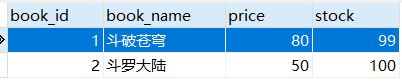

---

假设用户id为1的用户，购买id为1的图书

用户余额为50，而图书价格为80

购买图书之后，用户的余额为-30，数据库中余额字段设置了无符号，因此无法将-30插入到余额字段

此时执行sql语句会抛出SQLException

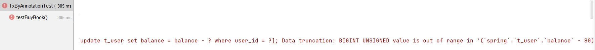

## 加入事务

### 添加事务配置

在spring配置文件中引入tx命名空间

```xml
<?xml version="1.0" encoding="UTF-8"?>
<beans xmlns="http://www.springframework.org/schema/beans"
       xmlns:xsi="http://www.w3.org/2001/XMLSchema-instance"
       xmlns:context="http://www.springframework.org/schema/context"
       xmlns:tx="http://www.springframework.org/schema/tx"
       xsi:schemaLocation="http://www.springframework.org/schema/beans
       http://www.springframework.org/schema/beans/spring-beans.xsd
       http://www.springframework.org/schema/context
       http://www.springframework.org/schema/context/spring-context.xsd
       http://www.springframework.org/schema/tx
       http://www.springframework.org/schema/tx/spring-tx.xsd">
```

在Spring的配置文件中添加配置：

```xml
<bean id="transactionManager" class="org.springframework.jdbc.datasource.DataSourceTransactionManager">
    <property name="dataSource" ref="dataSource"></property>
</bean>

<!--
    开启事务的注解驱动
    通过注解@Transactional所标识的方法或标识的类中所有的方法，都会被事务管理器管理事务
-->
<!-- transaction-manager属性的默认值是transactionManager，如果事务管理器bean的id正好就是这个默认值，则可以省略这个属性 -->
<tx:annotation-driven transaction-manager="transactionManager" />
```

### 添加事务注解

因为service层表示业务逻辑层，一个方法表示一个完成的功能，因此处理事务一般在service层处理。

**在BookServiceImpl的buybook()添加注解`@Transactional`**：

```java
@Service
public class BookServiceImpl implements BookService {

    @Autowired
    private BookDao bookDao;

    //添加注解@Transactional
    @Transactional
    @Override
    public void buyBook(Integer bookId, Integer userId) {
        //查询图书的价格
        Integer price = bookDao.getPriceByBookId(bookId);
        //更新图书的库存
        bookDao.updateStock(bookId);
        //更新用户的余额
        bookDao.updateBalance(userId, price);
    }
}
```

### 观察结果

由于使用了Spring的声明式事务，更新库存和更新余额都没有执行

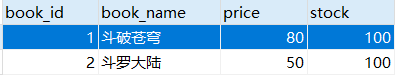

## @Transactional注解标识的位置

`@Transactional`标识在方法上，则只会影响该方法。

`@Transactional`标识的类上，则会影响类中所有的方法。

## 事务属性：只读

对一个查询操作来说，如果把它设置成只读，就能够明确告诉数据库，这个操作不涉及写操作。这样数据库就**能够针对查询操作来进行优化**。

```java
// readOnly = true把当前事务设置为只读 默认是false!
@Transactional(readOnly = true)
public void buyBook(Integer bookId, Integer userId) {
    //查询图书的价格
    Integer price = bookDao.getPriceByBookId(bookId);
    //更新图书的库存
    bookDao.updateStock(bookId);
    //更新用户的余额
    bookDao.updateBalance(userId, price);
}
```

@Transactional注解放在类上：

1. **生效原则**：

   如果一个类中每一个方法上都使用了 @Transactional 注解，那么就可以将 @Transactional 注解提取到类上。反过来说：@Transactional 注解在类级别标记，会影响到类中的每一个方法。同时，类级别标记的 @Transactional 注解中设置的事务属性也会延续影响到方法执行时的事务属性。除非在方法上又设置了 @Transactional 注解。

   对一个方法来说，离它最近的 @Transactional 注解中的事务属性设置生效。

2. **用法举例**：

   在类级别@Transactional注解中设置只读，这样类中所有的查询方法都不需要设置@Transactional注解了。因为对查询操作来说，其他属性通常不需要设置，所以使用公共设置即可。

   然后在这个基础上，对增删改方法设置@Transactional注解 readOnly 属性为 false。

   ```java
   @Service
   @Transactional(readOnly = true)
   public class BookServiceImpl {

       // 为了便于核对数据库操作结果，不要修改同一条记录
       @Transactional(readOnly = false)
       public void buyBook(Integer bookId, Integer userId) {
         ……
       }

       // readOnly = true把当前事务设置为只读
       // @Transactional(readOnly = true)
       public String getName(Integer bookId) {
         ……
       }

   }
   ```

**注意**：

对增删改操作设置只读会抛出下面异常：

> Caused by: java.sql.SQLException: Connection is read-only. Queries leading to data modification are not allowed

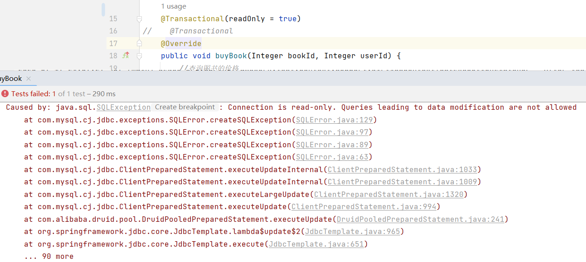

## 事务属性：超时

事务在执行过程中，有可能因为遇到某些问题，导致程序卡住，从而长时间占用数据库资源。而长时间占用资源，大概率是因为程序运行出现了问题（可能是Java程序或MySQL数据库或网络连接等等）。

此时这个很可能出问题的程序应该被回滚，撤销它已做的操作，事务结束，把资源让出来，让其他正常程序可以执行(**超时回滚，释放资源**)。

```java
//超时时间单位秒 默认为-1，永不超时,不限制事务时间
@Transactional(timeout = 3)
public void buyBook(Integer bookId, Integer userId) {
    try {
        TimeUnit.SECONDS.sleep(5);
    } catch (InterruptedException e) {
        e.printStackTrace();
    }
    //查询图书的价格
    Integer price = bookDao.getPriceByBookId(bookId);
    //更新图书的库存
    bookDao.updateStock(bookId);
    //更新用户的余额
    bookDao.updateBalance(userId, price);
    //System.out.println(1/0);
}
```

执行过程中抛出异常：

> org.springframework.transaction.TransactionTimedOutException: Transaction timed out: deadline was Mon Jul 17 22:07:38 CST 2023

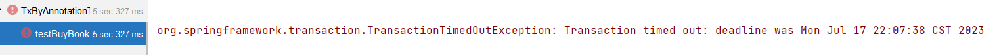

## 事务属性：回滚策略

声明式事务默认只针对运行时异常回滚，编译时异常不回滚。

可以通过`@Transactional`中相关属性设置回滚策略：

- **rollbackFor属性：**需要设置一个Class类型的对象，指定哪些异常才会回滚，默认是 RuntimeException and Error 异常方可回滚
- **rollbackForClassName属性**：需要设置一个字符串类型的全类名

- **noRollbackFor属性**：需要设置一个Class类型的对象，指定哪些异常不会回滚，默认没有指定，如果指定，应该在rollbackFor的范围内
- **rollbackFor属性**：需要设置一个字符串类型的全类名

```java
@Transactional(noRollbackFor = ArithmeticException.class)
//@Transactional(noRollbackForClassName = "java.lang.ArithmeticException")
public void buyBook(Integer bookId, Integer userId) {
    //查询图书的价格
    Integer price = bookDao.getPriceByBookId(bookId);
    //更新图书的库存
    bookDao.updateStock(bookId);
    //更新用户的余额
    bookDao.updateBalance(userId, price);
    System.out.println(1/0);
}
```

虽然购买图书功能中出现了数学运算异常(ArithmeticException)，但是设置的回滚策略是，当出现ArithmeticException不发生回滚，因此购买图书的操作正常执行。

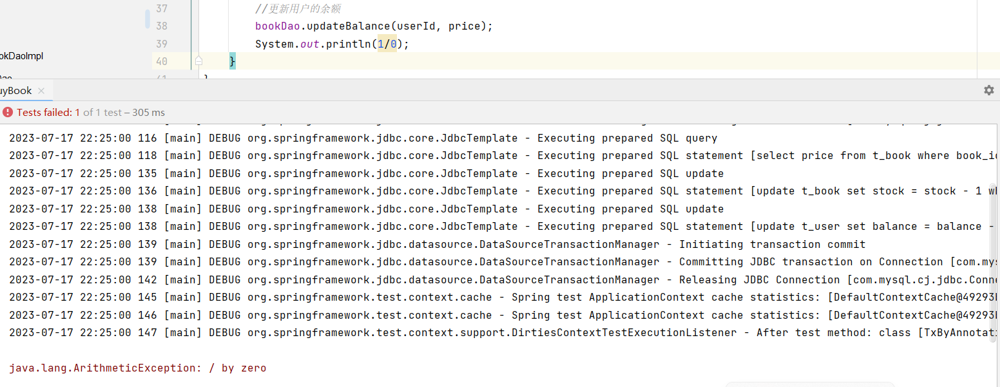

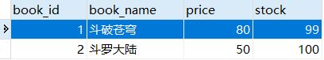

## 事务属性：隔离级别

数据库系统必须具有隔离并发运行各个事务的能力，使它们不会相互影响，避免各种并发问题。一个事务与其他事务隔离的程度称为隔离级别。SQL标准中规定了多种事务隔离级别，不同隔离级别对应不同的干扰程度，隔离级别越高，数据一致性就越好，但并发性越弱。

不同的隔离级别适用于不同的场景，需要根据实际业务需求进行选择和调整。

**隔离级别**：

- **读未提交**：READ UNCOMMITTED

  允许Transaction01读取Transaction02未提交的修改。

- **读已提交**：READ COMMITTED、

  要求Transaction01只能读取Transaction02已提交的修改。

- **可重复读**：REPEATABLE READ

  确保Transaction01可以多次从一个字段中读取到相同的值，即Transaction01执行期间禁止其它事务对这个字段进行更新。

- **串行化**：SERIALIZABLE

  确保Transaction01可以多次从一个表中读取到相同的行，在Transaction01执行期间，禁止其它事务对这个表进行添加、更新、删除操作。可以避免任何并发问题，但性能十分低下。

**各个隔离级别解决并发问题的能力**：

| 隔离级别         | 脏读 | 不可重复读 | 幻读 |
| ---------------- | ---- | ---------- | ---- |
| READ UNCOMMITTED | 有   | 有         | 有   |
| READ COMMITTED   | 无   | 有         | 有   |
| REPEATABLE READ  | 无   | 无         | 有   |
| SERIALIZABLE     | 无   | 无         | 无   |

**各种数据库产品对事务隔离级别的支持程度**：

| 隔离级别         | Oracle  | MySQL   |
| ---------------- | ------- | ------- |
| READ UNCOMMITTED | ×       | √       |
| READ COMMITTED   | √(默认) | √       |
| REPEATABLE READ  | ×       | √(默认) |
| SERIALIZABLE     | √       | √       |

**使用方式**：

```java
@Transactional(isolation = Isolation.DEFAULT)//使用数据库默认的隔离级别
@Transactional(isolation = Isolation.READ_UNCOMMITTED)//读未提交
@Transactional(isolation = Isolation.READ_COMMITTED)//读已提交
@Transactional(isolation = Isolation.REPEATABLE_READ)//可重复读 mysql默认是repeatable read
@Transactional(isolation = Isolation.SERIALIZABLE)//串行化
```

## 事务属性：传播行为

在service类中有a()方法和b()方法，a()方法上有事务，b()方法上也有事务，当a()方法执行过程中调用了b()方法，事务的传递方式就是**事务传播行为**。

**传播行为**：

- **REQUIRED**：支持当前事务，如果不存在就新建一个 (默认)，**没有就新建，有就加入**。
- **SUPPORTS**：支持当前事务，如果当前没有事务，就以非事务方式执行，**有就加入，没有就不管了**。
- **MANDATORY**：必须运行在一个事务中，如果当前没有事务正在发生，将抛出一个异常，**有就加入，没有就抛异常**。
- **REQUIRES_NEW**：开启一个新的事务，如果一个事务已经存在，则将这个存在的事务挂起，**不管有没有，直接开启一个新事务，开启的新事务和之前的事务不存在嵌套关系，之前事务被挂起**。
- **NOT_SUPPORTED**：以非事务方式运行，如果有事务存在，挂起当前事务，**不支持事务，存在就挂起**
- **NEVER**：以非事务方式运行，如果有事务存在，抛出异常，**不支持事务，存在就抛异常**
- **NESTED**：如果当前正有一个事务在进行中，则该方法应当运行在一个嵌套式事务中。被嵌套的事务可以独立于外层事务进行提交或回滚。如果外层事务不存在，行为就像REQUIRED一样。**有事务的话，就在这个事务里再嵌套一个完全独立的事务，嵌套的事务可以独立的提交和回滚。没有事务就和REQUIRED一样**。

@Transactional 注解通过 propagation 属性设置事务的传播行为。它的默认值是：`REQUIRED`

```java
Propagation propagation() default Propagation.REQUIRED;
```

propagation 属性的可选值由 org.springframework.transaction.annotation.Propagation 枚举类提供。

**注意**：

在同一个类中，对于@Transactional注解的方法调用，事务传播行为不会生效。这是因为Spring框架中使用代理模式实现了事务机制，在同一个类中的方法调用并不经过代理，而是通过对象的方法调用，因此@Transactional注解的设置不会被代理捕获，也就不会产生任何事务传播行为的效果。

```java [CheckoutService]
public interface CheckoutService {
    void checkout(Integer[] bookIds, Integer userId);
}
```

```java [CheckoutServiceImpl]
@Service
public class CheckoutServiceImpl implements CheckoutService {

    @Autowired
    private BookService bookService;

    @Override
    @Transactional
    //一次购买多本图书
    public void checkout(Integer[] bookIds, Integer userId) {
        for (Integer bookId : bookIds) {
            bookService.buyBook(bookId, userId);
        }
    }
}
```

```java [BookController]
@Controller
public class BookController {

    @Autowired
    private CheckoutService checkoutService;

    public void checkout(Integer[] bookIds, Integer userId){
        checkoutService.checkout(bookIds, userId);
    }
}

```

在数据库中将用户的余额修改为100元。

```sql
UPDATE t_user SET balance = 100 WHERE user_id = 1;
```

可以通过`@Transactional`中的propagation属性设置事务传播行为。

修改BookServiceImpl中`buyBook()`上，注解`@Transactional`的propagation属性：

```java
@Service
public class BookServiceImpl implements BookService {

    @Autowired
    private BookDao bookDao;

    //TODO 支持当前事务，如果不存在就新建一个
	@Transactional(propagation = Propagation.REQUIRED)
    @Override
    public void buyBook(Integer bookId, Integer userId) {
        //查询图书的价格
        Integer price = bookDao.getPriceByBookId(bookId);
        //更新图书的库存
        bookDao.updateStock(bookId);
        //更新用户的余额
        bookDao.updateBalance(userId, price);
    }
}
```

`@Transactional(propagation = Propagation.REQUIRED)`，默认情况，表示如果当前线程上有已经开启的事务可用，那么就在这个事务中运行。经过观察，购买图书的方法`buyBook()`在`checkout()`中被调用，`checkout()`上有事务注解，因此在此事务中执行。所购买的两本图书的价格为80和50，而用户的余额为100，因此在购买第二本图书时余额不足失败，导致整个`checkout()`回滚，即只要有一本书买不了，就都买不了

```java
@Service
public class BookServiceImpl implements BookService {

    @Autowired
    private BookDao bookDao;

    //TODO 开启一个新的事务，如果一个事务已经存在，则将这个存在的事务挂起
	@Transactional(propagation = Propagation.REQUIRES_NEW)
    @Override
    public void buyBook(Integer bookId, Integer userId) {
        //查询图书的价格
        Integer price = bookDao.getPriceByBookId(bookId);
        //更新图书的库存
        bookDao.updateStock(bookId);
        //更新用户的余额
        bookDao.updateBalance(userId, price);
    }
}
```

`@Transactional(propagation = Propagation.REQUIRES_NEW)`，表示不管当前线程上是否有已经开启的事务，都要开启新事务。同样的场景，每次购买图书都是在`buyBook()`的事务中执行，因此第一本图书购买成功，事务结束，第二本图书购买失败，只在第二次的`buyBook()`中回滚，购买第一本图书不受影响，即能买几本就买几本。

## 全注解配置事务

**添加配置类**：

```java
@Configuration  //配置类
@ComponentScan("com.hjc.demo")
@EnableTransactionManagement  //开启事务管理
@PropertySource("classpath:jdbc.properties")
public class SpringConfig {

    //连接数据库的url
    @Value("${jdbc.url}")
    private String url;

    //数据库驱动
    @Value("${jdbc.driver}")
    private String driver;

    //连接数据库的用户名
    @Value("${jdbc.user}")
    private String username;

    //连接数据库的密码
    @Value("${jdbc.password}")
    private String password;

    /**
     * 实例化dataSource加入到ioc容器
     * @return
     */
    @Bean
    public DataSource dataSource(){
        DriverManagerDataSource dataSource = new DriverManagerDataSource();
        dataSource.setDriverClassName(driver);
        dataSource.setUrl(url);
        dataSource.setUsername(username);
        dataSource.setPassword(password);
        return dataSource;
    }

    /**
     * 实例化JdbcTemplate对象,需要使用ioc中的DataSource
     * @param dataSource
     * @return
     */
    @Bean(name = "jdbcTemplate")
    public JdbcTemplate jdbcTemplate(DataSource dataSource){
        JdbcTemplate jdbcTemplate = new JdbcTemplate();
        jdbcTemplate.setDataSource(dataSource);
        return jdbcTemplate;
    }

    @Bean
    public DataSourceTransactionManager dataSourceTransactionManager(DataSource dataSource){
        DataSourceTransactionManager dataSourceTransactionManager = new DataSourceTransactionManager();
        dataSourceTransactionManager.setDataSource(dataSource);
        return dataSourceTransactionManager;
    }
}
```

**测试**：

```java
import org.junit.jupiter.api.Test;
import org.springframework.beans.factory.annotation.Autowired;
import org.springframework.context.ApplicationContext;
import org.springframework.context.annotation.AnnotationConfigApplicationContext;
import org.springframework.test.context.junit.jupiter.SpringJUnitConfig;

public class TxByAllAnnotationTest {

    @Test
    public void testTxAllAnnotation(){
        ApplicationContext applicationContext = new AnnotationConfigApplicationContext(SpringConfig.class);
        BookController accountService = applicationContext.getBean("bookController", BookController.class);
        accountService.buyBook(1, 1);
    }
}
```

# 基于XML的声明式事务

## 修改Spring配置文件

将Spring配置文件中去掉`<tx:annotation-driven>` 标签，并添加配置：

```xml
<?xml version="1.0" encoding="UTF-8"?>
<beans xmlns="http://www.springframework.org/schema/beans"
       xmlns:xsi="http://www.w3.org/2001/XMLSchema-instance"
       xmlns:context="http://www.springframework.org/schema/context" xmlns:tx="http://www.springframework.org/schema/tx"
       xmlns:aop="http://www.springframework.org/schema/aop"
       xsi:schemaLocation="http://www.springframework.org/schema/beans http://www.springframework.org/schema/beans/spring-beans.xsd http://www.springframework.org/schema/context https://www.springframework.org/schema/context/spring-context.xsd http://www.springframework.org/schema/tx http://www.springframework.org/schema/tx/spring-tx.xsd http://www.springframework.org/schema/aop https://www.springframework.org/schema/aop/spring-aop.xsd">

    <!-- 导入外部属性文件 -->
    <context:property-placeholder location="classpath:jdbc.properties" />

    <!--扫描组件-->
    <context:component-scan base-package="com.hjc.demo"></context:component-scan>

    <!-- 配置数据源 -->
    <bean id="dataSource" class="org.springframework.jdbc.datasource.DriverManagerDataSource">
        <property name="url" value="${jdbc.url}"/>
        <property name="driverClassName" value="${jdbc.driver}"/>
        <property name="username" value="${jdbc.user}"/>
        <property name="password" value="${jdbc.password}"/>
    </bean>

    <!-- 配置 JdbcTemplate -->
    <bean id="jdbcTemplate" class="org.springframework.jdbc.core.JdbcTemplate">
        <!-- 装配数据源 -->
        <property name="dataSource" ref="dataSource"/>
    </bean>

    <bean id="transactionManager" class="org.springframework.jdbc.datasource.DataSourceTransactionManager">
        <property name="dataSource" ref="dataSource"></property>
    </bean>

    <aop:config>
        <!-- 配置事务通知和切入点表达式 -->
        <aop:advisor advice-ref="txAdvice" pointcut="execution(* com.hjc.demo.service.impl.*.*(..))"></aop:advisor>
    </aop:config>
    <!-- tx:advice标签：配置事务通知 -->
    <!-- id属性：给事务通知标签设置唯一标识，便于引用 -->
    <!-- transaction-manager属性：关联事务管理器 -->
    <tx:advice id="txAdvice" transaction-manager="transactionManager">
        <tx:attributes>
            <!-- tx:method标签：配置具体的事务方法 -->
            <!-- name属性：指定方法名，可以使用星号代表多个字符 -->
            <tx:method name="get*" read-only="true"/>
            <tx:method name="query*" read-only="true"/>
            <tx:method name="find*" read-only="true"/>

            <!-- read-only属性：设置只读属性 -->
            <!-- rollback-for属性：设置回滚的异常 -->
            <!-- no-rollback-for属性：设置不回滚的异常 -->
            <!-- isolation属性：设置事务的隔离级别 -->
            <!-- timeout属性：设置事务的超时属性 -->
            <!-- propagation属性：设置事务的传播行为 -->
            <tx:method name="save*" read-only="false" rollback-for="java.lang.Exception" propagation="REQUIRES_NEW"/>
            <tx:method name="update*" read-only="false" rollback-for="java.lang.Exception" propagation="REQUIRES_NEW"/>
            <tx:method name="delete*" read-only="false" rollback-for="java.lang.Exception" propagation="REQUIRES_NEW"/>
            <tx:method name="buy*" read-only="false" rollback-for="java.lang.Exception" propagation="REQUIRES_NEW"/>
        </tx:attributes>
    </tx:advice>
</beans>
```

**注意**：基于xml实现的声明式事务，必须引入aspectJ的依赖

```xml
<dependency>
	<groupId>org.springframework</groupId>
 	<artifactId>spring-aspects</artifactId>
   	<version>6.0.10</version>
</dependency>
```
