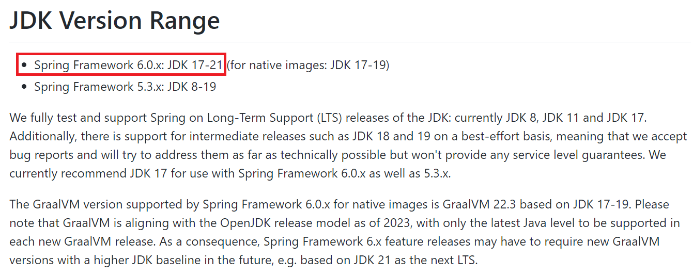

# Spring Framework 6 概述

::: info 版本与维护状态
本组文档面向 **Spring Framework 6.x（6.0 ~ 6.2，JDK 17 基线）**。6.x 线的 OSS 维护已按 Spring 官方支持日历陆续结束（6.0 于 2024-08、6.1 于 2025-06、**6.2 于 2026-06-30**），企业支持最长延伸至 2032 年；**2025-11 起的主线是 Spring Framework 7.0**。6.x 内容仍适用于绝大多数现网项目，新立项项目可直接评估 7.0（要求 JDK 17+、Jakarta EE 11）。
:::

Spring Framework 6 是 Spring 技术栈在 5.x 之后的一次**基线升级**：它没有改变 IoC 与 AOP 的使用方式，而是把运行环境的下限抬高（JDK 17）、把命名空间整体迁移（`javax.*` → `jakarta.*`），并把原生可执行与可观测性变成框架内建能力。本页讲 6.x 相对 5.3 的差异与迁移要点；框架本身的模块划分、IoC / AOP 概念与 5.3 一致，完整介绍见 [Spring 5 文档](../Spring5/index.md)。

## 一、JDK 基线：17 起步



| 版本 | JDK 范围 | 说明 |
| --- | --- | --- |
| Spring Framework 6.0.x | **JDK 17-21**（native image：JDK 17-19） | 官方推荐 JDK 17 LTS 起步 |
| Spring Framework 5.3.x | JDK 8-19 | 唯一还在 8 上运行的 Spring 大版本 |

三个推论：

1. **升级 Spring 6 之前先升级 JDK**——这是硬前置，不是建议；
2. 依赖 Spring 内部 API 的老库（如旧版字节码增强、`cglib` 深度耦合的组件）在 JDK 17 下会被强封装模块系统拦下，需要 `--add-opens` 或升级依赖；
3. 构建工具链（Lombok、MapStruct、旧版 maven-compiler-plugin）都要同步升到支持 JDK 17 的版本。

## 二、命名空间迁移：`javax.*` → `jakarta.*`

Spring 6 基于 **Jakarta EE 9**，所有 JavaEE 规范注解与接口换包名：

```java
// Spring 5.3（javax 命名空间）—— 6.0 起不再可用
import javax.annotation.PostConstruct;
import javax.servlet.http.HttpServletRequest;
import javax.validation.constraints.NotNull;

// Spring 6（jakarta 命名空间）
import jakarta.annotation.PostConstruct;
import jakarta.servlet.http.HttpServletRequest;
import jakarta.validation.constraints.NotNull;
```

这是迁移工作量最大的一步：**业务代码、公司内框架、第三方依赖三处都要换**。判据很简单——编译能过只是第一步，运行时反射相关的注解（校验、持久化、Servlet 过滤器）漏改一个就是一个线上问题，所以迁移完成后必须全量回归，不能只看编译绿。

## 三、6.x 的四个新能力

| 能力 | 一句话说明 | 典型用法 |
| --- | --- | --- |
| **AOT 与 GraalVM Native Image** | 启动前完成 Bean 定义的静态化，产物可编译为原生可执行文件 | 云原生场景冷启动从秒级降到毫秒级（详见本目录 [AOT](AOT.md)） |
| **Micrometer Observation** | 统一的可观测性门面，一次埋点同时产出指标与链路 | 服务方法上的计时、追踪自动导出到 Prometheus / Tracing |
| **HTTP 接口客户端** | 声明式 HTTP 客户端，写接口就行，实现由框架生成 | `@HttpExchange` 定义远程服务接口，替代手写 RestTemplate |
| **RFC 7807 问题细节** | 标准化错误响应结构（`application/problem+json`） | 全局异常处理返回统一的 `ProblemDetail` |

## 四、从 5.3 迁移的最小清单

1. JDK 升到 17+（见第一节）；
2. 全局替换 `javax.` 规范包到 `jakarta.`（依赖里有旧 Servlet/Validation/持久化规范的都要同步升）；
3. 逐个核对第三方 starter 与 Spring 6 的兼容矩阵（Spring Boot 3 起才适配 6.x，**Spring Boot 2.7 + Spring 6 不可组合**）；
4. 跑全量回归，重点覆盖校验、过滤器、AOP 代理、序列化四处反射敏感区。

::: danger Spring Boot 版本与 Framework 版本是绑定的
不要在 Spring Boot 2.7 项目里手工把 Framework 提到 6.x——Boot 2.7 的自动装配、依赖管理都按 5.3 设计，强升会以难以定位的方式坏掉。正确路径是 **Boot 2.7 → 3.x（连带 Framework 6）**，按官方迁移指南走。
:::

## 五、验证方式

升级完成后，用三条命令确认基线：

```shell
java -version        # 期望 17+，输出里确认是运行时实际版本而非 JAVA_HOME 猜测
mvn dependency:tree | grep -E "spring-(core|web)"   # 期望 spring-core 6.x
mvn clean verify     # 期望全量测试通过；校验与过滤器相关用例必须包含在内
```

## 参考资料

- Spring Framework 6.0 What's New（官方 wiki）：https://github.com/spring-projects/spring-framework/wiki/What%27s-New-in-Spring-Framework-6.0
- Spring 官方支持日历：https://spring.io/support
- 迁移指南（Spring Boot 3.0 Migration Guide）：https://github.com/spring-projects/spring-boot/wiki/Spring-Boot-3.0-Migration-Guide
- [Spring 5 文档（5.3 线，仅存量维护）](../Spring5/index.md)
