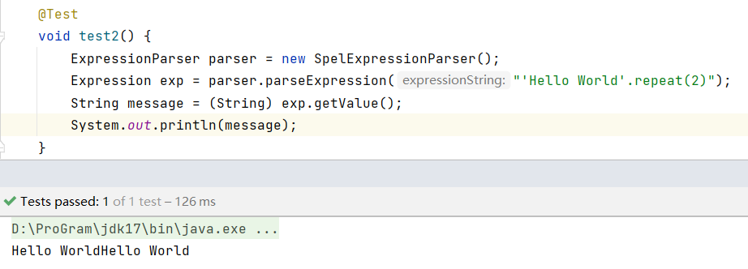
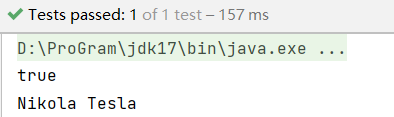
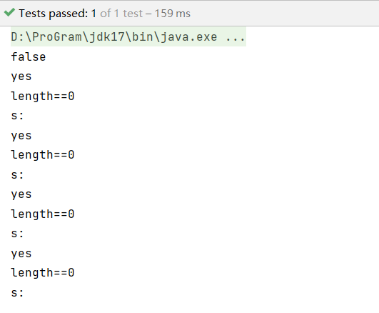
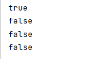

# SPEL

Spring 表达式语言 (SpEL)是一种强大的表达式语言， 支持在运行时查询和操作对象图。 语言语法是 类似于 Unified EL，但提供了额外的功能，最显着的是方法调用和基本的字符串模板功能。

**SPEL的诞生原因**：提供Spring社区拥有单一的受支持的表达语言以更好的使用整个系列

**特性**：

1. 可以集成其他表达语言 (是个与技术无关的API)
2. 不直接与Spring绑定，可以独立使用

**用途**：

1. 文字表达
2. 布尔和关系运算符
3. 常用表达
4. 类表达式
5. 访问属性、数组、列表和映射
6. 方法调用
7. 关系运算符
8. 任务
9. 调用构造函数
10. Bean 引用
11. 数组构造
12. 内联列表
13. 内联地图
14. 三元运算符
15. 变量
16. 用户自定义函数
17. 收藏投影
18. 收藏选择
19. 模板化表达式

## 简单字符串实例

```java
//创建SPEL表达式解析器对象
ExpressionParser parser = new SpelExpressionParser();
//解析表达式Hello World
//注意：表达式若是需要以字符串形式设置需要使用单引号扩充
Expression exp = parser.parseExpression("'Hello World'");
//获取表达式中的值
String message = (String) exp.getValue();
System.out.println(message);
```

## 接口

可能使用的 SpEL 类和接口位于 `org.springframework.expression` 包及其子包中，例如 `spel.support`。

### ExpressionParser 接口

负责解析表达式字符串
Expression 接口负责计算先前定义的表达式字符串。 分别调用 `parser.parseExpression` 和 `exp.getValue` 时会抛出两个异常，ParseException 和 EvaluationException。

## 简单调用方法实例

在这里调用了`repeat()`方法使得Hello World复制2次，当然还可以调用其他任意方法，但是需要注意的是，当调用的方法最后返回的类型变化时，在后续获取值`getbvalue()`时也要相应转换类型，不然会导致类型转化异常

```java
        ExpressionParser parser = new SpelExpressionParser();
        Expression exp = parser.parseExpression("'Hello World'.repeat(2)");
        String message = (String) exp.getValue();
        System.out.println(message);
```



## 创建实例实例

可以通过使用new关键字进行创建：

```java
        ExpressionParser parser = new SpelExpressionParser();
        Expression exp = parser.parseExpression("new String('zhansan')");
        final Object value = exp.getValue();
        System.out.println(value);
```

## 字段获取

```java
public class Inventor {
    public String name;
    public Date time;
    public String city;

    public Inventor(String name, Date time, String city) {
        this.name = name;
        this.time = time;
        this.city = city;
    }
}
```

**测试**：

```java
GregorianCalendar c = new GregorianCalendar();
c.set(1856, 7, 9);
Inventor tesla = new Inventor("Nikola Tesla", c.getTime(), "Serbian");
ExpressionParser parser = new SpelExpressionParser();
Expression exp = parser.parseExpression("name"); // Parse name as an expression
String name = (String) exp.getValue(tesla);
exp = parser.parseExpression("name == 'Nikola Tesla'");
boolean result = exp.getValue(tesla, Boolean.class);
System.out.println(result);
System.out.println(name);
```



## EvaluationContext

`EvaluationContext`以解析属性、方法或字段并帮助执行类型转换时，使用 `EvaluationContext` 接口。 Spring 提供了两种实现。

1. `SimpleEvaluationContext`：为不需要完整范围的 SpEL 语言语法且应受到有意义限制的表达式类别公开基本 SpEL 语言功能和配置选项的子集。 示例包括但不限于数据绑定表达式和基于属性的过滤器。
2. `StandardEvaluationContext`：公开全套 SpEL 语言功能和配置选项。 您可以使用它来指定默认根对象并配置每个可用的评估相关策略。

SimpleEvaluationContext 旨在仅支持 SpEL 语言语法的子集。 它不包括 Java 类型引用、构造函数和 bean 引用。 它还要求您明确选择对表达式中的属性和方法的支持级别。 默认情况下，create() 静态工厂方法只允许对属性进行读取访问。 您还可以获得构建器来配置所需的确切支持级别，针对以下一项或某种组合：

1. 仅自定义 PropertyAccessor（无反射）
2. 只读访问的数据绑定属性
3. 用于读取和写入的数据绑定属性

## 类型转换

- 默认使用`org.springframework.core.convert.ConversionService`的转换服务（具有常见的转换的内置转换器）
- 默认的转换服务也可以进行扩展（可自定义转换逻辑）
- 泛型敏感

在实际应用中，可以方便的进行类型转换，比如存储容器`List<Boolean>`其中类型为Boolean，但是依然可以插入String类型的`"false"`，而这个false会自动转化为Boolean类型

```java
class SimpleList{
    public ArrayList<Boolean> list = new ArrayList<>();
}

@Test
void contextLoads() {
    final SimpleList simpleList = new SimpleList();
    simpleList.list.add(true);
    final SimpleEvaluationContext context = SimpleEvaluationContext.forReadOnlyDataBinding().build();
    final SpelExpressionParser parser = new SpelExpressionParser();

    parser.parseExpression("list[0]").setValue(context, simpleList, "false");

    Boolean b = simpleList.list.get(0);
    System.out.println(b);
}
```

这里记住一定要先赋值再替换，否则会导致`org.springframework.expression.spel.SpelEvaluationException: EL1025E: The collection has '0' elements, index '0' is invalid `的异常（即无法访问到0的索引位）

## 解析器配置

可以使用解析器配置对象 (`org.springframework.expression.spel.SpelParserConfiguration`) 来配置 SpEL 表达式解析器。 配置对象控制一些表达式组件的行为。

如：可以用来创建具有初始化实体的列表或集合，这样的集合或列表创建出来后索引位为一个真实的实体（官网上称会创建null，按照理论来说其实意思是一个空的实体，但是确实会有一定的误导）

```java
    class Demo {
        public List<String> list;
    }

    @Test
    void test() {
        SpelParserConfiguration config = new SpelParserConfiguration(true, true);

        ExpressionParser parser = new SpelExpressionParser(config);

        Expression expression = parser.parseExpression("list[3]");

        Demo demo = new Demo();

        Object o = expression.getValue(demo);


        System.out.println(demo.list == null ? true : false);
        for (String s : demo.list) {
            if (StringUtils.isBlank(s)) {
                System.out.println("yes");
            }
            if (s == null) {
                System.out.println("null");
            }
            if (s == "") {
                System.out.println("empty");
            }

            if (s.trim() == "") {
                System.out.println("trim");
            }

            if (s == " ") {
                System.out.println("clean");
            }

            if (s.length() == 0) {
                System.out.println("length==0");
            }
            System.out.println("s:" + s);
        }

    }
```

由最终的打印结果排查，数组中添加的索引位置上实际为一个真实的实体，String的实体长度为0，即不为`null`，不是`""或“ ”`！

这与日常使用`new String()`产生的实体是一样的

```java
final String s = new String();
System.out.println(s.length() == 0);
System.out.println(s==null?true:false);
System.out.println(s=="");
System.out.println(s==" ");
```

结果相符合



## SpEL 编译

自Spring 4.1开始，包含了一个基本的表达式编译器，对于偶尔的表达式使用，这很好，但是，当被其他组件（例如 Spring Integration）使用时，性能可能非常重要，并且不需要动态。

> 通常会解释表达式，这在评估期间提供了很大的动态灵活性，但不能提供最佳性能

SpEL 编译器旨在满足这一需求。 在评估期间，编译器生成一个体现表达式运行时行为的 Java 类，并使用该类来实现更快的表达式评估。 由于没有围绕表达式键入，编译器在执行编译时使用在表达式的解释评估期间收集的信息。 例如，它不能仅从表达式中知道属性引用的类型，但在第一次解释评估期间，它会找出它是什么。 当然，如果各种表达式元素的类型随着时间的推移而变化，那么基于这些派生信息进行编译可能会在以后造成麻烦。 出于这个原因，编译最适合那些类型信息不会在重复计算中改变的表达式。

### 编译器配置

编译器默认不打开，以下是打开方式：

1. 通过使用解析器配置过程
2. 在 SpEL 使用嵌入到另一个组件中时使用 Spring 属性来打开它
   编译器可以在 `org.springframework.expression.spel.SpelCompilerMode` 枚举中捕获的三种模式之一运行。

### 三种模式

1. OFF (默认)：编译器关闭。
2. IMMEDIATE：在立即模式下，表达式会尽快编译。 这通常是在第一次解释评估之后。 如果编译表达式失败（通常是由于类型更改），则表达式求值的调用者会收到异常。
3. MIXED：在混合模式下，表达式会随着时间在解释模式和编译模式之间静默切换。 在经过一定次数的解释运行后，它们会切换到编译形式，如果编译形式出现问题（例如类型更改），表达式会自动再次切换回解释形式。 一段时间后，它可能会生成另一个已编译的表单并切换到它。 基本上，用户在 IMMEDIATE 模式下获得的异常是在内部处理的。

存在 IMMEDIATE 模式是因为 MIXED 模式可能会导致具有副作用的表达式出现问题。 如果编译的表达式在部分成功后崩溃，它可能已经做了一些影响系统状态的事情。 如果发生这种情况，调用者可能不希望它在解释模式下静默重新运行，因为部分表达式可能会运行两次。

选择模式后，使用 SpelParserConfiguration 配置解析器。 以下示例显示了如何执行此操作：

```java
public class MyMessage {
    public String payload;


    public MyMessage() {
    }
}


        //SPEL解析器配置使用SPEL编译器模式为立即模式，指定当前类获取当前类的类加载器
        SpelParserConfiguration config = new SpelParserConfiguration(SpelCompilerMode.IMMEDIATE,
                this.getClass().getClassLoader());
        //SPEL表达式解析中添加配置
        SpelExpressionParser parser = new SpelExpressionParser(config);

        Expression expr = parser.parseExpression("payload");

        MyMessage message = new MyMessage();

        Object payload = expr.getValue(message);

        System.out.println(payload);
```

已编译的表达式在任何提供的子类加载器下创建的子类加载器中定义。如果指定了类加载器，它可以看到表达式评估过程中涉及的所有类型。 如果您不指定类加载器，则使用默认类加载器（通常是在表达式评估期间运行的线程的上下文类加载器）

### 编译器限制

从 Spring Framework 4.1 开始，基本的编译框架就到位了。 但是，该框架还不支持编译所有类型的表达式。 最初的重点是可能在性能关键的上下文中使用的常用表达式。 目前无法编译以下类型的表达式：

1. 涉及赋值的表达式
2. 依赖于转换服务的表达式
3. 使用自定义解析器或访问器的表达式
4. 使用选择或投影的表达式
5. 将来会编译更多类型的表达式
