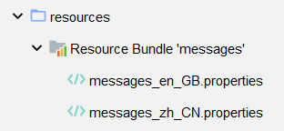
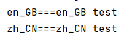
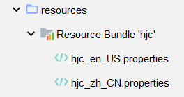

## 国际化：i18n


### i18n概述

国际化也称作i18n，其来源是英文单词 internationalization的首末字符i和n，18为中间的字符数。由于软件发行可能面向多个国家，对于不同国家的用户，软件显示不同语言的过程就是国际化。通常来讲，软件中的国际化是通过配置文件来实现的，假设要支撑两种语言，那么就需要两个版本的配置文件。

### Java国际化

Java自身是支持国际化的，java.util.Locale用于指定当前用户所属的语言环境等信息，java.util.ResourceBundle用于查找绑定对应的资源文件。Locale包含了language信息和country信息，Locale创建默认locale对象时使用的静态方法：

```java
/**
* This method must be called only for creating the Locale.*
* constants due to making shortcuts.
*/
private static Locale createConstant(String lang, String country) {
	BaseLocale base = BaseLocale.createInstance(lang, country);
    return getInstance(base, null);
}
```

**配置文件命名规则**(必须遵循以上的命名规则，java才会识别)：

`basename_language_country.properties`

:::warning 说明

- basename是必须的，语言和国家是可选的。
- 如果同时提供了messages.properties和messages_zh_CN.propertes两个配置文件，如果提供的locale符合zh_CN，那么优先查找messages_zh_CN.propertes配置文件，如果没查找到，再查找messages.properties配置文件。
- 所有的配置文件必须放在classpath中，一般放在resources目录下。

:::

**例**：

1. 创建子模块`i18n-java`

2. 在resource目录下创建两个配置文件：

   ```properties [messages_zh_CN.properties]
   test=zh_CN test
   ```

   ```properties [messages_en_GB.properties]
   test=en_GB test
   ```

   

3. 测试：

   ```java
   public class Main {
       public static void main(String[] args) {
           System.out.println("en_GB===" + ResourceBundle.getBundle("messages",
                   new Locale("en","GB")).getString("test"));
           System.out.println("zh_CN===" + ResourceBundle.getBundle("messages",
                   new Locale("zh","CN")).getString("test"));
       }
   }
   ```

   

### Spring6国际化

#### MessageSource接口

Spring中国际化是通过MessageSource这个接口来支持的

**常见实现类**：

- ResourceBundleMessageSource：

  这个是基于Java的ResourceBundle基础类实现，允许仅通过资源名加载国际化资源

- ReloadableResourceBundleMessageSource：

  这个功能和第一个类的功能类似，多了定时刷新功能，允许在不重启系统的情况下，更新资源的信息

- StaticMessageSource：

  它允许通过编程的方式提供国际化信息，可以通过这个来实现db中存储国际化信息的功能。

#### 使用Spring6国际化

##### 创建资源文件

1. **国际化文件命名格式**：基本名称 _ 语言 _ 国家.properties

   

2. **动态参数**：{0},{1}

   ```properties [hjc_zh_CN.properties]
   www.hjc.com=欢迎 {0},时间:{1}
   ```

   ```properties [hjc_en_US.properties]
   www.hjc.com=welcome {0},time:{1}
   ```

##### 创建spring配置文件

```xml [bean.xml]
<?xml version="1.0" encoding="UTF-8"?>
<beans xmlns="http://www.springframework.org/schema/beans"
       xmlns:xsi="http://www.w3.org/2001/XMLSchema-instance"
       xsi:schemaLocation="http://www.springframework.org/schema/beans http://www.springframework.org/schema/beans/spring-beans.xsd">
    <bean id="messageSource"
          class="org.springframework.context.support.ResourceBundleMessageSource">
        <property name="basenames">
            <list>
                <value>hjc</value>
            </list>
        </property>
        <property name="defaultEncoding">
            <value>utf-8</value>
        </property>
    </bean>
</beans>
```

##### 创建测试类

```java
public class Main {
    public static void main(String[] args) {

        ApplicationContext context = new ClassPathXmlApplicationContext("bean.xml");

        //传递动态参数，使用数组形式对应{0} {1}顺序
        SimpleDateFormat sdf = new SimpleDateFormat("yyyy-MM-dd HH:mm:ss");
        String dateStr = sdf.format(new Date());
        Object[] objs = new Object[]{"hjc",dateStr};

        //www.hjc.com为资源文件的key值,
        //objs为资源文件value值所需要的参数,Local.CHINA为国际化为语言
        String strCN=context.getMessage("www.hjc.com", objs, Locale.CHINA);
        String strUS=context.getMessage("www.hjc.com", objs, Locale.US);
        System.out.println("zh_CN===" + strCN);
        System.out.println("en_US===" + strUS);
    }
}
```
