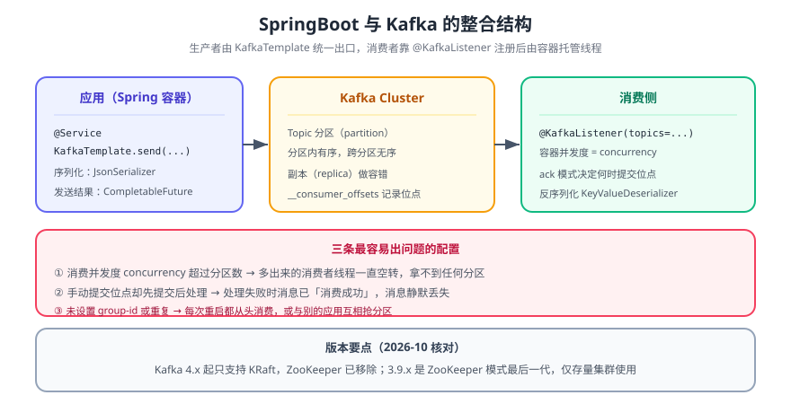

# SpringBoot 整合 Kafka

> SpringBoot 3.x 通过 **spring-kafka** 把 `KafkaTemplate`（发）与 `@KafkaListener`（收）交给容器管理。本页讲连接配置、生产者与消费者的最小可用写法，以及**三个只在压测/生产才暴露的坑**：偏移量提交方式、重试与死信、分区键与顺序。



## 一句话定位

整合的复杂度不在「能不能收发」，而在**收到了怎么算处理成功**。Spring 帮你把 `poll → 反序列化 → 调用方法 → 提交偏移量` 串起来，但「先提交还是后提交」「失败了重试几次」「重试完去哪」这三件事默认值是**不安全的**，必须显式改。

## 一、依赖与版本

| 组件 | 版本 | 说明 |
| --- | --- | --- |
| Spring Boot | 3.x / 4.x | 由 parent 仲裁 `spring-kafka` 版本，**不要手写版本号** |
| Spring for Apache Kafka | 随 Boot 版本 | 3.x 对应 3.x 线 |
| Kafka Broker | 4.x（KRaft 主线） | 3.9.x 起 ZooKeeper 仅存量集群使用；版本演进见 [Kafka 深入专题](../../../../../../MessageQueue/Kafka/index.md) |

```xml
<dependency>
  <groupId>org.springframework.kafka</groupId>
  <artifactId>spring-kafka</artifactId>
</dependency>
```

## 二、最小配置

```yaml
# src/main/resources/application.yml
spring:
  kafka:
    bootstrap-servers: localhost:9092
    producer:
      key-serializer: org.apache.kafka.common.serialization.StringSerializer
      value-serializer: org.springframework.kafka.support.serializer.JsonSerializer
      acks: all                  # 关键：等全部 ISR 落盘，而不是 leader 落盘
      retries: 3
      properties:
        enable.idempotence: true # 幂等生产者，防重试导致重复写入
    consumer:
      group-id: blog-comment
      auto-offset-reset: earliest
      key-deserializer: org.apache.kafka.common.serialization.StringDeserializer
      value-deserializer: org.springframework.kafka.support.serializer.JsonDeserializer
      enable-auto-commit: false  # 关键：手动提交，见第三节
      properties:
        spring.json.trusted.packages: "com.example.blog.event"
    listener:
      ack-mode: manual_immediate # 关键：由业务代码决定何时提交
```

::: danger 三个默认值必须改
1. **`enable-auto-commit: true`（默认）**：偏移量按时间自动提交，与业务处理**无关**——处理失败也会被标记为已消费，消息就永久丢了。正确做法是手动提交（本节配置 + 业务成功后 `ack.acknowledge()`）。
2. **`acks=0/1`**：`0` 不等确认，`1` 只等 leader。都不是「写入成功」的证据。生产写关键事件用 `acks=all` 并开 `enable.idempotence`。
3. **`spring.json.trusted.packages` 不配**：反序列化会被安全策略拒绝，报错指向 `JsonDeserializer`，看起来像序列化问题，实际是信任包未声明。
:::

## 三、生产者

```java
// src/main/java/com/example/blog/mq/CommentEventPublisher.java
@Service
public class CommentEventPublisher {

  private final KafkaTemplate<String, CommentCreated> template;
  public CommentEventPublisher(KafkaTemplate<String, CommentCreated> template) {
    this.template = template;
  }

  public void publish(CommentCreated event) {
    // 分区键用 postId：同一篇文章的事件进同一分区 → 分区内有序
    template.send("blog.comment.created", String.valueOf(event.postId()), event)
        .whenComplete((r, ex) -> {
          if (ex != null) {                       // 发送失败必须显式处理
            log.error("publish failed, postId={}", event.postId(), ex);
          } else {
            log.info("published offset={} partition={}",
                r.getRecordMetadata().offset(), r.getRecordMetadata().partition());
          }
        });
  }
}
```

::: warning 分区键决定顺序，不是决定负载
Kafka **只保证分区内有序**。「同一篇文章的评论事件必须按序处理」→ 用 `postId` 当键；如果键用随机的，顺序就没了。反过来，键的基数太低（比如全用同一个常量）会把压力压到单个分区上——**键的选择是「顺序」与「并行度」的交换**。
:::

## 四、消费者

```java
// src/main/java/com/example/blog/mq/CommentEventConsumer.java
@Component
public class CommentEventConsumer {

  @KafkaListener(topics = "blog.comment.created", concurrency = "3")
  public void onCreated(CommentCreated event, Acknowledgment ack) {
    try {
      // 业务：写审计表 + 推送通知（幂等：用 event.eventId 做唯一键）
      auditService.recordOnce(event);
      ack.acknowledge();                      // 只有业务成功才提交偏移量
    } catch (Exception e) {
      log.error("consume failed, eventId={}", event.eventId(), e);
      throw e;                                // 交给容器按重试策略处理，不要吞掉
    }
  }
}
```

| 配置项 | 作用 | 本项目取值 |
| --- | --- | --- |
| `concurrency` | 消费者线程数（不能超过分区数，多了会空转） | 3（对应 3 个分区） |
| `ack-mode` | 偏移量提交时机 | `manual_immediate`（业务成功后立即提交） |
| `error-handler` | 重试与死信 | `DefaultErrorHandler` + `DeadLetterPublishingRecoverer` |

```java
// 重试 + 死信：重试 3 次仍失败的记录转到 xxx.DLT，而不是无限重试堵住分区
@Bean
DefaultErrorHandler errorHandler(KafkaTemplate<String, Object> template) {
  var recoverer = new DeadLetterPublishingRecoverer(template);
  var handler = new DefaultErrorHandler(recoverer, new FixedBackOff(1000L, 3));
  handler.addNotRetryableExceptions(IllegalArgumentException.class);  // 参数错重试无意义
  return handler;
}
```

::: tip 死信队列不是垃圾桶
进 `DLT` 的消息**必须有人看**——它代表一条处理不了的真实业务事件。落一份到数据库或告警渠道，否则「重试完就没了」等价于静默丢数据。
:::

## 五、验证方式

```shell
# ① 应用起来后，消费组已被注册（说明 @KafkaListener 生效）
docker compose exec -T kafka kafka-consumer-groups.sh \
  --bootstrap-server localhost:9092 --list
# 期望：blog-comment

# ② 调用一次写接口触发发送
curl -s -X POST http://127.0.0.1:18080/api/v1/posts/1/comments \
  -H 'Content-Type: application/json' -d '{"content":"整合验证"}'
# 期望：201

# ③ 看消费进度：LAG 最终应为 0（不是持续增长）
docker compose exec -T kafka kafka-consumer-groups.sh \
  --bootstrap-server localhost:9092 --describe --group blog-comment
# 期望：blog.comment.created 各分区 LAG = 0

# ④ 制造一次失败，验证死信口径（把业务改成抛异常后重跑）
# 期望：日志出现 3 次重试，随后写入 blog.comment.created.DLT
docker compose exec -T kafka kafka-console-consumer.sh \
  --bootstrap-server localhost:9092 --topic blog.comment.created.DLT --from-beginning --max-messages 1
```

**④ 是这套验证里最重要的一条**：不制造失败，你无法知道重试与死信是否真的接上了——而「以为接上了」正是消息中间件最贵的一类误解。

## 六、问题排查

| 现象 | 原因 | 处置 |
| --- | --- | --- |
| 启动时报 `Connection to node -1 could not be established` | `bootstrap-servers` 不可达或端口未暴露 | 确认 broker 在跑；容器内用**服务名**而不是 `localhost` |
| 反序列化失败 | `trusted.packages` 未配，或生产者/消费者类不一致 | 配信任包；事件类放在共享模块 |
| 消息发出但消费不到 | 消费组已提交过偏移量 | `auto-offset-reset: earliest` 只对**新**消费组生效；换 group-id 或重置偏移量 |
| LAG 持续增长 | 消费慢于生产 | 提高 `concurrency`（≤ 分区数）、加分区、优化单条处理耗时 |
| 重复消费 | 手动提交前的处理不幂等 | 用业务唯一键（`eventId`）做幂等写；见[可靠投递](../../../../../../MessageQueue/Reliability/index.md) |

## 七、深入阅读

- [消息队列 · Kafka 深入专题（架构、分区副本、Exactly-Once、集群运维）](../../../../../../MessageQueue/Kafka/index.md)
- [消息队列 · 可靠投递与幂等](../../../../../../MessageQueue/Reliability/index.md)
- [SpringBoot 整合 RocketMQ](RocketMQ/index.md) ｜ [SpringBoot 整合 RabbitMQ](RabbitMQ/index.md)
- Spring for Apache Kafka 官方文档：[docs.spring.io/spring-kafka/reference](https://docs.spring.io/spring-kafka/reference/)
