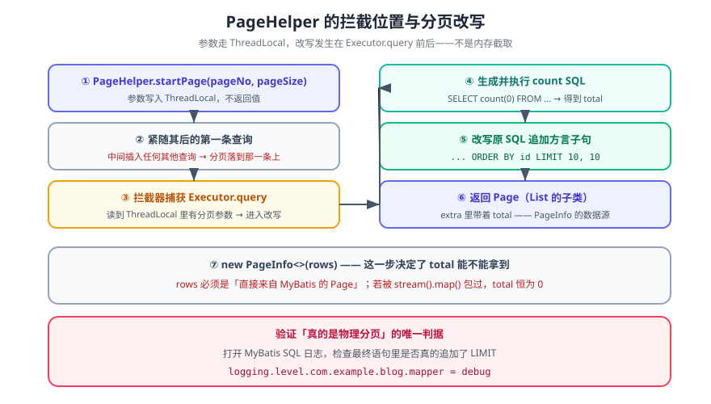

# SpringBoot 整合 PageHelper

> PageHelper 是 MyBatis 生态里最常用的**物理分页插件**：它在 SQL 执行前改写语句，追加数据库方言对应的 `LIMIT`（或 `ROWNUM` / `OFFSET FETCH`），而不是把全表数据查出来再在内存里截取。整合本身只有一步，**难点全在「它什么时候生效」**。



## 一句话定位

PageHelper 解决「MyBatis 自己不带分页」这件事。它通过 MyBatis 的**拦截器**在 `Executor.query` 前后切入：读取你设置的页码参数 → 自动查一次 `count` → 改写原 SQL 追加方言分页子句。

## 一、依赖与版本

```xml
<!-- pom.xml -->
<dependency>
  <groupId>com.github.pagehelper</groupId>
  <artifactId>pagehelper-spring-boot-starter</artifactId>
  <version>2.1.0</version>
</dependency>
```

| 项 | 说明 |
| --- | --- |
| 官方站点 | [pagehelper.github.io](https://pagehelper.github.io/)（版本以官方文档与 Maven Central 为准） |
| 起步依赖 | `pagehelper-spring-boot-starter` 已包含自动配置，**不要再单独引 `pagehelper`**，否则会出现两套拦截器 |
| 与 MyBatis-Plus 的关系 | MP 自带分页插件（`MybatisPlusInterceptor`），**两者不要同时启用**——双拦截器会二次改写 SQL |

## 二、必配项

```yaml
# src/main/resources/application.yml
pagehelper:
  helper-dialect: mysql      # 必配：方言。不配会尝试自动识别，多数据源下会识别错
  reasonable: false          # false=页码越界返回空；true=自动钳到首页/末页
  support-methods-arguments: true   # 允许从方法参数里读 pageNum/pageSize
  params: count=countSql     # 允许用 countSql 参数控制是否查总数
  page-size-zero: false      # false：pageSize=0 时查全部（危险，建议保持 false 但别传 0）
```

::: danger `helper-dialect` 不配的后果
不配时 PageHelper 会尝试通过 JDBC 连接**自动识别方言**。单数据源通常能识别对；一旦工程里配了多个数据源（读写分离、多库），可能识别成另一个库的方言，生成的 SQL 在该库上语法错误——**报错点在 SQL 解析，不在分页插件**，排查方向很容易被带偏。正确做法是显式写死。
:::

## 三、两种用法

### 用法一：`startPage`（最常用）

```java
// src/main/java/com/example/blog/controller/VipController.java
@RestController
@RequiredArgsConstructor
public class VipController {

  private final VipService vipService;

  @GetMapping("/api/v1/vips")
  public PageInfo<Vip> list(@RequestParam(defaultValue = "1") int pageNo,
                            @RequestParam(defaultValue = "10") int pageSize) {
    // ① 设置分页参数 —— 必须紧邻查询，中间不要插入别的查询
    PageHelper.startPage(pageNo, pageSize);
    // ② 紧随其后的第一条查询会被改写并自动 count
    List<Vip> rows = vipService.findAll();
    // ③ 包装成 PageInfo（携带 total / pages / hasNextPage 等）
    return new PageInfo<>(rows);
  }
}
```

### 用法二：不带 count 的分页（"无限滚动"场景）

```java
// 只查一页，不查总数（前端用"还有更多"而不是"共 N 页"时更省一次 count）
PageHelper.startPage(pageNo, pageSize, false);   // 第三个参数 false = 不查 count
List<Vip> rows = vipService.findAll();
```

## 四、`PageInfo` 的字段

| 字段 | 含义 | 前端用途 |
| --- | --- | --- |
| `total` | 总记录数（来自自动 count） | 显示「共 N 条」 |
| `pages` | 总页数 | 页码条 |
| `pageNum` / `pageSize` | 当前页 / 每页条数 | 回显 |
| `hasNextPage` / `hasPreviousPage` | 是否有上/下一页 | 翻页按钮禁用状态 |
| `isFirstPage` / `isLastPage` | 是否首页/末页 | 同上 |
| `list` | 当前页数据 | 表格渲染 |

::: tip `total` 从哪来
`PageInfo` 只有在**被包装的 List 实际是 `Page` 类型**时才能拿到 `total`。所以 `vipService.findAll()` 的返回值必须**直接**来自 MyBatis（中间不能用 `stream().filter()` 之类再包一层），否则 `total` 恒为 0——这是「分页数据对、总数不对」的唯一原因。
:::

## 五、验证方式

```shell
# ① 分页参数生效：返回 total 与 list 长度都正确
curl -s 'http://127.0.0.1:18080/api/v1/vips?pageNo=2&pageSize=10' | jq '{total, pages, pageNum, size:(.list|length)}'
# 期望：total 为真实总行数；size = 10（末页可能更少）；pageNum = 2

# ② 越界页返回空列表而不是报错（reasonable=false 时）
curl -s 'http://127.0.0.1:18080/api/v1/vips?pageNo=99999&pageSize=10' | jq '.list|length'
# 期望：0

# ③ 确认真的是"物理分页"：开 MyBatis 的 SQL 日志，检查最后的 LIMIT
#    在 application.yml 里临时加：
#      logging.level.com.example.blog.mapper: debug
# 期望日志里能看到：... LIMIT 10, 10（而不是把全表查出来）
```

**③ 是唯一能证明「没有退化成内存分页」的判据**。只验证前两条，可能得到一个「结果对但全表扫描」的实现——数据量一上来就会崩。

## 六、高频陷阱

::: danger 五条
1. **`startPage` 之后插入了别的查询**：分页参数只对**紧随其后的第一条查询**生效。写成「先 `startPage`，再查一次用户信息，再查列表」会让分页落到用户信息那次查询上。正确做法是让 `startPage` 紧贴目标查询。
2. **`ThreadLocal` 未清理**：PageHelper 用 `ThreadLocal` 传参，异常路径下可能残留。正确做法是靠**紧邻**的写法规避，并在切面里保证异常时不复用同一线程继续查询（线程池场景尤其注意）。
3. **同时启用 MyBatis-Plus 分页插件**：SQL 被改两次，报错信息很难读。二选一。
4. **与 `stream().map()` 组合**：包一层之后 `PageInfo` 拿不到 `Page`，`total` 变 0。要转换就在**取到 `PageInfo` 之后**再转 DTO。
5. **`pageSize` 不做上限校验**：前端传 `pageSize=1000000` 等于关掉了分页。正确做法是在 Controller 层钳制（如最大 100）。
:::

## 七、深入阅读

- [SpringBoot 整合 MyBatis](MyBatis/index.md) ｜ [SpringBoot 数据访问](../../DataAccess/index.md)
- [MyBatis-Plus 专题](../../../../MyBatisPlus/index.md)（自带分页插件的另一种做法）
- [SQL 优化 · 深分页的代价与 keyset 改造](../../../../../../../DB/Relational/SQLOptimization/index.md)
- PageHelper 官方文档：[pagehelper.github.io](https://pagehelper.github.io/)
