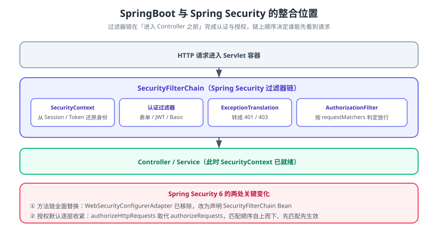

# SpringBoot 整合 Spring Security

> SpringBoot 3.x 与 Spring Security 6.x 的整合页。**框架本身的原理与完整能力（认证、授权、OAuth2、方法级安全）见 [Spring Security 专题](../../../../SpringSecurity/index.md)**——本页只讲「在 SpringBoot 工程里怎么把它接起来、接的时候哪几个地方必须改」。



## 一句话定位

整合动作只有三件事：**加依赖 → 写一个 `SecurityFilterChain` 配置类 → 提供 `UserDetailsService` 与 `PasswordEncoder` 两个 Bean**。剩下 90% 的复杂度都来自「默认行为和你想要的不一样」，所以本页把默认值逐条列出来。

## 一、版本对应关系

| Spring Boot | Spring Security | 说明 |
| --- | --- | --- |
| 4.x | **7.x** | 当前主线；配置写法与 6.x 一致（lambda DSL） |
| 3.x | **6.x** | 本页的基线；JDK 17 起 |
| 2.x | 5.x | **仅存量项目使用**；`WebSecurityConfigurerAdapter` 写法 |

::: danger 两代写法不能混
6.x 起 `WebSecurityConfigurerAdapter` 已移除。把它抄进 6.x 工程会编译不过——正确写法是**声明 `SecurityFilterChain` Bean**（见下一节）。版本目录与迁移路径见 [Spring Security 专题](../../../../SpringSecurity/index.md)。
:::

```xml
<!-- pom.xml：Boot 3.x 只需这一个 starter，版本由 parent 仲裁 -->
<dependency>
  <groupId>org.springframework.boot</groupId>
  <artifactId>spring-boot-starter-security</artifactId>
</dependency>
```

## 二、最小可用配置类

```java
// src/main/java/com/example/blog/config/SecurityConfig.java
@Configuration
@EnableWebSecurity
public class SecurityConfig {

  @Bean
  SecurityFilterChain chain(HttpSecurity http) throws Exception {
    http
      // ① 关闭 CSRF：仅当接口是无状态令牌认证时才可以关
      .csrf(AbstractHttpConfigurer::disable)
      // ② 会话策略：前后端分离要 STATELESS，不能用默认的 IF_REQUIRED
      .sessionManagement(s -> s.sessionCreationPolicy(SessionCreationPolicy.STATELESS))
      // ③ 授权规则：从上到下匹配，顺序即优先级（先具体后通配）
      .authorizeHttpRequests(auth -> auth
          .requestMatchers("/api/v1/auth/**", "/actuator/health").permitAll()
          .requestMatchers("/api/v1/admin/**").hasRole("ADMIN")
          .requestMatchers(HttpMethod.GET, "/api/v1/posts/**").permitAll()
          .anyRequest().authenticated())
      // ④ 前后端分离要 JSON 401/403，而不是跳登录页
      .exceptionHandling(e -> e
          .authenticationEntryPoint((req, res, ex) -> send(res, 401, "UNAUTHENTICATED"))
          .accessDeniedHandler((req, res, ex) -> send(res, 403, "FORBIDDEN")))
      .httpBasic(AbstractHttpConfigurer::disable)
      .formLogin(AbstractHttpConfigurer::disable);
    return http.build();
  }

  private static void send(HttpServletResponse res, int code, String msg) throws IOException {
    res.setStatus(code);
    res.setContentType("application/json;charset=UTF-8");
    res.getWriter().write("{\"code\":" + code + ",\"message\":\"" + msg + "\"}");
  }
}
```

::: warning 顺序就是优先级
`authorizeHttpRequests` 是**有序**的：先写 `anyRequest()` 会让后面所有规则失效。写规则时永远「具体在前、通配在后」，并且把 `@Order` 用于多条 `SecurityFilterChain` 时也一样。
:::

## 三、密码与用户：两个必须自己写的 Bean

```java
// src/main/java/com/example/blog/config/SecurityBeans.java
@Bean
public PasswordEncoder passwordEncoder() {
  // 用 DelegatingPasswordEncoder：密文带 {bcrypt} 前缀，将来换算法不用改数据
  return PasswordEncoderFactories.createDelegatingPasswordEncoder();
}

@Bean
public UserDetailsService userDetailsService(UserMapper mapper) {
  return username -> {
    UserPO u = mapper.findByEmail(username);
    if (u == null) throw new UsernameNotFoundException(username);
    return org.springframework.security.core.userdetails.User
        .withUsername(u.getEmail())
        .password(u.getPasswordHash())          // 库里存的是 {bcrypt}$2a$10$...
        .authorities("ROLE_" + u.getRole())     // 注意 ROLE_ 前缀
        .disabled(u.getStatus() != 1)
        .build();
  };
}
```

::: danger 三个高频错
1. **`hasRole("ADMIN")` 与 `"ROLE_ADMIN"` 的关系**：`hasRole` 会自动补 `ROLE_` 前缀，所以授予时必须是 `ROLE_ADMIN`；写成 `hasAuthority("ADMIN")` 则要求权限串恰好是 `ADMIN`——两者混用会得到「永远 403」。
2. **明文密码**：`PasswordEncoder` 一旦声明，`password` 字段必须是**已编码**的；把明文塞进去会得到 `Encoded password does not look like BCrypt`，而这不是登录失败，是**配置错误**，日志里很明显但常被当成密码错。
3. **`UserDetailsService` 抛 `UsernameNotFoundException` 与返回 `disabled` 的区别**：前者是 401，后者是 401 + `DisabledException`。审计场景两者要能区分。
:::

## 四、过滤链：请求到底经过了什么

| 顺序 | 过滤器 | 作用 | 整合时要不要动 |
| --- | --- | --- | --- |
| 1 | `SecurityContextHolderFilter` | 恢复/持有安全上下文 | 不动 |
| 2 | `UsernamePasswordAuthenticationFilter` | 表单登录 | 关闭（分离架构） |
| 3 | **你的自定义 JWT 过滤器** | 解析令牌并写入上下文 | **要自己加**，位置通常 `addFilterBefore(..., UsernamePasswordAuthenticationFilter.class)` |
| 4 | `ExceptionTranslationFilter` | 把认证/授权异常转成 401/403 | 要配 `EntryPoint` 与 `AccessDeniedHandler` |
| 5 | `AuthorizationFilter` | 执行 `authorizeHttpRequests` 规则 | 不动 |

```java
// 自定义 JWT 过滤器的接入位置（关键一行）
http.addFilterBefore(new JwtAuthenticationFilter(jwtService), UsernamePasswordAuthenticationFilter.class);
```

## 五、权限模型：RBAC 与 ACL

整合期最常见的建模选择是这两种，**选错会在需求变复杂时付出重构代价**：

| 模型 | 结构 | 适用 | 代价 |
| --- | --- | --- | --- |
| **RBAC**（Role-Based Access Control） | 用户 → 角色 → 权限；`t_user`、`t_role`、`t_user_role`、`t_permission`、`t_role_perm` | 角色稳定的后台系统 | 需要中间表；角色的加授权是数据配置，不用发版 |
| **ACL**（Access Control List） | 用户 → 权限，直接挂钩；`t_user`、`t_user_perm`、`t_permission` | 主体少、权限粒度细且互不相同的场景 | 主体一多，关系表行数爆炸，无法批量授权 |

::: tip 本库项目的选择
博客平台选的是**极简 RBAC**：一张 `users` 表 + 一个 `role` 枚举列，因为它只有「读者 / 管理员」两个角色。**不要为两个角色建五张表**——这是「按当前需求建模、把扩展点写清楚」的取舍，扩展路径在上表里。
:::

## 六、验证方式

```shell
# ① 未带令牌 → 必须是 401，且响应体是 JSON（不是登录页 HTML）
curl -s -o /dev/null -w '%{http_code}\n' http://127.0.0.1:18080/api/v1/admin/posts
# 期望：401
curl -s http://127.0.0.1:18080/api/v1/admin/posts | head -c 80
# 期望：{"code":401,...}（JSON，且不含 <html>）

# ② 读者令牌打管理接口 → 必须是 403（而不是 401，也不是 200）
curl -s -o /dev/null -w '%{http_code}\n' \
  -H "Authorization: Bearer $READER_TOKEN" http://127.0.0.1:18080/api/v1/admin/posts
# 期望：403

# ③ 放行路径真的不需要令牌
curl -s -o /dev/null -w '%{http_code}\n' http://127.0.0.1:18080/actuator/health
# 期望：200

# ④ 密码编码器生效：库里的密文必须带算法前缀
docker compose exec -T mysql mysql -uroot -p"$DB_ROOT_PASSWORD" "$DB_NAME" \
  -e "SELECT LEFT(password_hash,8) FROM users LIMIT 1;"
# 期望：{bcrypt}
```

四条里 ② 最容易出问题：**401 与 403 的顺序**（先认证、后授权）在多配置类共存时会被打乱，详见[读者账号与权限](../../../../../../../../project/Complete/BlogPlatform/ReaderAccount/index.md)的「401 先于 403」判据。

## 七、深入阅读

- [Spring Security 专题（版本目录 + 原理与完整能力）](../../../../SpringSecurity/index.md)
- [认证与授权：会话 / JWT / 权限模型](../../../../../../Auth/index.md)
- [Spring Boot 3 · Web 开发](../../Web/index.md) ｜ [SpringBoot 整合 MyBatis](../../../../MyBatis/index.md)
- [Spring Security 6 · 基于 SpringBoot](../../../../SpringSecurity/v6/SpringBoot/index.md)
