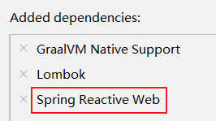

# WebClient

非阻塞、响应式HTTP客户端

:::danger 注意

使用Spring initailizr构建响应式web项目：



:::

导入依赖：

```xml
<dependency>
	<groupId>org.springframework.boot</groupId>
	<artifactId>spring-boot-starter-webflux</artifactId>
</dependency>
```

## 创建与配置

发请求：

- 请求方式： GET\POST\DELETE\xxxx
- 请求路径： /xxx
- 请求参数：aa=bb&cc=dd&xxx
- 请求头： aa=bb,cc=ddd
- 请求体

**创建 WebClient**：

- `WebClient.create()`

- `WebClient.create(String baseUrl)`

使用 `WebClient.builder()` 配置更多参数项：

- uriBuilderFactory：自定义UriBuilderFactory ，定义 baseurl

- defaultUriVariables：默认 uri 变量

- defaultHeader：每个请求默认头

- defaultCookie：每个请求默认 cookie

- defaultRequest：Consumer 自定义每个请求
- filter：过滤 client 发送的每个请求
- exchangeStrategies：HTTP 消息 reader/writer 自定义
- clientConnector：HTTP client 库设置

```java
//获取响应完整信息
WebClient client = WebClient.create("https://example.org");
```

## 获取响应

`retrieve()`方法用来声明如何提取响应数据。

获取响应完整信息：

```java
WebClient client = WebClient.create("https://example.org");

Mono<ResponseEntity<Person>> result = client
        //定义请求方式
        .get()
        //定义请求路径
        .uri("/persons/{id}", id)
        //接收的数据类型
        .accept(MediaType.APPLICATION_JSON)
        //查询
        .retrieve()
        .toEntity(Person.class);
```

只获取body：

```java
WebClient client = WebClient.create("https://example.org");

Mono<Person> result = client.get()
        .uri("/persons/{id}", id).accept(MediaType.APPLICATION_JSON)
        .retrieve()
        .bodyToMono(Person.class);
```

stream数据：

```java
Flux<Quote> result = client.get()
        .uri("/quotes").accept(MediaType.TEXT_EVENT_STREAM)
        .retrieve()
        .bodyToFlux(Quote.class);
```

定义错误处理：

```java
Mono<Person> result = client.get()
        .uri("/persons/{id}", id).accept(MediaType.APPLICATION_JSON)
        .retrieve()
        .onStatus(HttpStatus::is4xxClientError, response -> ...)
        .onStatus(HttpStatus::is5xxServerError, response -> ...)
        .bodyToMono(Person.class);
```

## 定义请求体

响应式-单个数据：

```java
Mono<Person> personMono = ... ;

Mono<Void> result = client.post()
        .uri("/persons/{id}", id)
        .contentType(MediaType.APPLICATION_JSON)
    //查询请求体
        .body(personMono, Person.class)
        .retrieve()
        .bodyToMono(Void.class);
```

响应式-多个数据：

```java
Flux<Person> personFlux = ... ;

Mono<Void> result = client.post()
        .uri("/persons/{id}", id)
        .contentType(MediaType.APPLICATION_STREAM_JSON)
        .body(personFlux, Person.class)
        .retrieve()
        .bodyToMono(Void.class);
```

普通对象：

```java
Person person = ... ;

Mono<Void> result = client.post()
        .uri("/persons/{id}", id)
        .contentType(MediaType.APPLICATION_JSON)
        .bodyValue(person)
        .retrieve()
        .bodyToMono(Void.class);
```

## 与响应式编程专题的分工

本页讲的是**客户端这一层怎么用**（建连、编码、获取响应、错误处理），属于「接入层」；[响应式编程](../../../../../ReactiveProgramming/index.md) 讲的是**多个调用怎么组合成一条链路**（并行聚合、超时预算、背压、线程模型）。

| 问题 | 看哪一页 |
| --- | --- |
| `WebClient` 怎么配超时、怎么设连接池、怎么读响应体 | **本页** |
| 三个下游怎么并行调用、单次与总超时怎么分配、失败怎么降级 | 响应式编程 · [实战：一次聚合查询的改造](../../../../../ReactiveProgramming/Practice/index.md) |
| `timeout` 到底该放在哪一层、重试与超时怎么相乘 | 响应式编程 · [Reactor 核心](../../../../../ReactiveProgramming/Reactor/index.md) |
| 客户端本身是阻塞的（`RestTemplate`）会造成什么后果 | 响应式编程 · [响应式数据访问](../../../../../ReactiveProgramming/DataAccess/index.md) |

::: warning 一条硬边界
**`WebClient` 只是客户端，不是「链路无阻塞」的证明。** 如果链路下游还有 JDBC 调用，压测照样会表现为「并发上不去、CPU 很低」。判断标准是把整条链路的外部依赖逐个过一遍，而不是只看 HTTP 这一层。
:::
