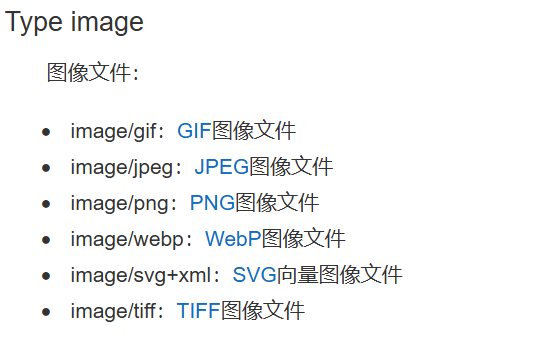

# 文件上传

## 上传文件

:::warning

文件上传要求form表单的请求方式必须为post，并且添加属性`enctype="multipart/form-data"`。

:::

SpringBoot中将上传的文件封装到MultipartFile对象中，通过此对象可以获取文件相关信息。

```html [index.html]
<form th:action="@{/upload}" method="post" enctype="multipart/form-data">
  <!-- 单文件上传 -->
  <input type="file" name="file" /><br />
  <!-- 多文件上传 -->
  <input type="file" name="photos" multiple /><br />
  <input type="submit" value="提交" />
</form>
```

```java [FileController.java]
@Slf4j
@Controller
public class FileController {

    @PostMapping("/upload")
    public String upload(HttpSession session, @RequestPart("file")MultipartFile file,
                         @RequestPart("photos")MultipartFile[] photos) throws IOException {
        log.info("上传的信息:file={},photos={}",file.getSize(),photos.length);
        if (!file.isEmpty()){
            //保存到文件服务器，OSS服务器
            String originalFilename = file.getOriginalFilename();
            //获取上传的文件的后缀名
            assert originalFilename != null;
            String suffixName = originalFilename.substring(originalFilename.lastIndexOf("."));
            //使用UUID防止重名 将UUID作为文件名
            String uuid = UUID.randomUUID().toString().replaceAll("-", "");
            //将uuid和后缀名拼接后的结果作为最终的文件名
            String fileName = uuid + suffixName;
            ServletContext servletContext = session.getServletContext();
            String path = servletContext.getRealPath("/");
            File filePath = new File(path,"img\\");
            if (!filePath.exists()){
                filePath.mkdirs();
            }
            file.transferTo(new File(filePath+fileName));
        }
        //上传多个文件
        if (photos.length>0){
            for (MultipartFile photo :
                    photos) {
                String originalFilename = photo.getOriginalFilename();
                //获取上传的文件的后缀名
                assert originalFilename != null;
                String suffixName = originalFilename.substring(originalFilename.lastIndexOf("."));
                //使用UUID防止重名 将UUID作为文件名
                String uuid = UUID.randomUUID().toString().replaceAll("-", "");
                //将uuid和后缀名拼接后的结果作为最终的文件名
                String fileName = uuid + suffixName;

                ServletContext servletContext = session.getServletContext();
                String path = servletContext.getRealPath("/");
                File filePath = new File(path,"img\\");
                if (!filePath.exists()){
                    filePath.mkdirs();
                }
                System.out.println(filePath+fileName);
                photo.transferTo(new File(filePath,fileName));
            }
        }
        return "index";
    }
}
```

## 文件类型校验

MIME (Multipurpose Internet Mail Extensions，多用途互联网邮件扩展)是一种互联网标准，**用字符串标记文件的「类型 + 格式」** ：

- JPEG 格式的图片：`image/jpeg`
- MP4 格式的视频：`video/mp4` 
- PDF 文档：`application/pdf`

核心作用是**让系统（浏览器、服务器、应用）快速识别文件本质内容** ，避免「后缀名造假」等问题(比如把 `.exe` 改成 `.jpg` ，但 MIME 仍会暴露其真实类型)。



```java
//获取文件的mimetype类型
String contentType = file.getContentType();
if (ObjectUtils.isEmpty(contentType) || !contentType.startsWith("image")) {
	//配合全局异常处理，快速返回失败结果！！
	throw new RuntimeException("只能上传图片文件！");
}
```

## 默认上传文件限制

默认servlet限制上传数据大小为10MB, 测试大图片会出现：

```json
{
  "code": 500,
  "message": "Maximum upload size exceeded",
  "data": null
}
```

修改添加如何配置：

```yaml
spring:      
  servlet:
    multipart:
      max-file-size: 100MB
      max-request-size: 150MB    
```

