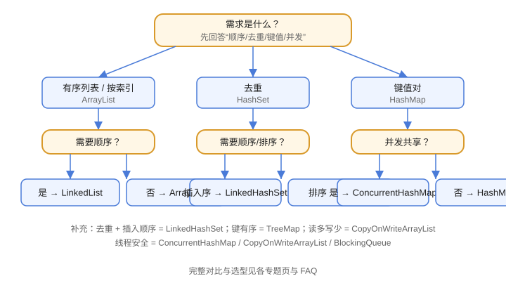

# 常见问题与最佳实践

这一篇汇总 Java 集合最高频的 10 个问题和一套工程实践，覆盖选型、去重、排序、并发、内存等日常场景。



## 常见问题

### 1. ArrayList 和 LinkedList 怎么选

默认选 ArrayList。随机访问、遍历、尾部追加都更快，内存更紧凑。LinkedList 只在“明确需要频繁头尾增删且当作队列/栈”时使用。

### 2. HashMap、Hashtable、ConcurrentHashMap 区别

| 维度 | HashMap | Hashtable | ConcurrentHashMap |
| --- | --- | --- | --- |
| 线程安全 | 否 | 是（全方法加锁） | 是（细粒度） |
| null 键值 | 允许 | 不允许 | 不允许 |
| 性能 | 最高 | 低 | 高 |
| 推荐度 | 单线程首选 | 不推荐 | 并发首选 |

### 3. Set 去重为什么失效

最常见原因是只重写 `equals` 没重写 `hashCode`。HashSet 先按 hashCode 定位桶，再在桶内用 equals 比较；hashCode 不同就永远不会比较 equals。

### 4. 遍历时删除元素抛 ConcurrentModificationException

用 `Iterator.remove()`、`removeIf()` 或“先收集再 `removeAll`”。不要在增强 for 或 `forEach` 里直接删除。

### 5. TreeSet 报 ClassCastException

元素没有实现 `Comparable`，且创建 TreeSet 时没传 `Comparator`。给自定义对象二选一：实现 `Comparable` 或传比较器。

### 6. 自定义对象做 Map key 要注意什么

对象要**不可变**或至少保证 hashCode/equals 依赖的字段不被修改；同时正确重写 `hashCode` 和 `equals`。业务对象不满足时，用 ID 字段做 key。

### 7. Arrays.asList 为什么不能 add

`Arrays.asList` 返回定长数组视图，不是 ArrayList。要可变列表：

```java
List<String> list = new ArrayList<>(Arrays.asList("a", "b"));
```

### 8. subList 修改会怎样

`subList` 是原列表的**视图**：对子列表的修改会反映到原列表；对原列表做结构性修改后，子列表再访问会抛 `ConcurrentModificationException`。

### 9. Collections.emptyList / singletonList 能 add 吗

不能。它们返回不可变集合，调用 `add` 抛 `UnsupportedOperationException`。它们适合“返回空结果”等场景，省内存且语义明确。

### 10. 多线程共享 List/Map 怎么做

按读写比例选择：读多写少用 `CopyOnWriteArrayList`；Map 用 `ConcurrentHashMap`；需要队列用 `BlockingQueue`。避免直接对 HashMap 手动 synchronized（容易漏锁）。

## 最佳实践清单

::: tip 可直接落地的清单
1. 声明类型用接口：`List<String>`、`Map<String, String>`，便于换实现。
2. 预估容量：`new ArrayList<>(1000)`、`new HashMap<>(initialCapacity)`，减少扩容。
3. 遍历 Map 用 `entrySet()` 或 `forEach`，不要 `keySet + get`。
4. 更新统计用 `merge` / `computeIfAbsent`，避免“先查后写”。
5. 常量数据用 `List.of` / `Set.of` / `Map.of` 表达不可变语义。
6. 去重/排序用 Set 的语义，不要手写 contains 循环。
7. 自定义对象进集合前，统一用 IDE 生成 `equals` + `hashCode`。
8. 并发场景禁止裸用 HashMap/ArrayList，直接选并发集合。
9. 返回集合尽量返回不可变或空集合，避免外部篡改。
10. 大数据量排序考虑 `parallelStream` 或数据库端排序，别在内存里硬扛。
:::

## 验证方式

1. 把本 FAQ 的 10 个问题各写成最小 demo，逐个跑一遍，记录异常与输出。
2. 用 JMH 或简单循环对比 ArrayList/LinkedList 的随机访问和头插性能。
3. 在 IDEA 中安装 Java Stream Debugger，观察集合遍历与 Stream 执行过程。

## 参考资料

- Oracle 集合教程：https://docs.oracle.com/javase/tutorial/collections/
- 集合接口 API：https://docs.oracle.com/en/java/javase/25/docs/api/java.base/java/util/package-summary.html
- 并发集合包：https://docs.oracle.com/en/java/javase/25/docs/api/java.base/java/util/concurrent/package-summary.html
