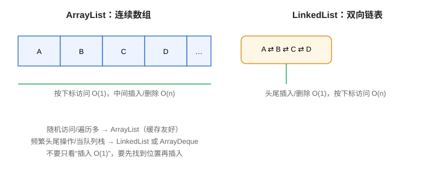

# List 接口与实现

`List` 是有序、可重复、可按索引访问的集合体系。它解决“动态数组 + 灵活增删 + 队列/栈”一类需求，最常用的实现是 **ArrayList**。

## List 的特点

1. **有序**：元素按插入顺序排列（除非排序）。
2. **可重复**：同一个对象可以出现多次。
3. **可索引**：通过 `get(index)` 随机访问。

```text
List
├── ArrayList      动态数组，随机访问快
├── LinkedList     双向链表，头尾增删快
└── Vector         线程安全的动态数组（遗留类，不推荐）
```

## 常用方法



| 方法 | 作用 |
| --- | --- |
| `add(E)` / `add(int, E)` | 追加 / 指定位置插入 |
| `get(int)` | 按索引取值 |
| `set(int, E)` | 修改指定位置 |
| `remove(int)` / `remove(Object)` | 按索引 / 按对象删除 |
| `indexOf(Object)` / `contains(Object)` | 查找 |
| `subList(int, int)` | 子列表视图 |
| `sort(Comparator)` | 排序（Java 8+） |
| `replaceAll(UnaryOperator)` | 批量替换（Java 8+） |

## ArrayList：随机访问王者

ArrayList 底层是**动态数组**：容量不够时自动扩容（约为原来的 1.5 倍），随机访问 `O(1)`，中间插入/删除是 `O(n)`。

```java [Collection/List/ArrayListDemo.java]
import java.util.ArrayList;
import java.util.List;

public class ArrayListDemo {
    public static void main(String[] args) {
        List<String> list = new ArrayList<>();
        list.add("苹果");
        list.add("香蕉");
        list.add(1, "葡萄");          // 指定位置插入
        System.out.println(list);     // [苹果, 葡萄, 香蕉]

        System.out.println(list.get(0));
        list.set(0, "芒果");
        System.out.println(list);

        list.remove(0);               // 按索引删除
        list.remove("香蕉");           // 按对象删除
        System.out.println(list);     // [葡萄]

        System.out.println("大小: " + list.size());
        System.out.println("是否为空: " + list.isEmpty());
    }
}
```

输出：

```text
[苹果, 葡萄, 香蕉]
苹果
[芒果, 葡萄, 香蕉]
[葡萄]
大小: 1
是否为空: false
```

## LinkedList：头尾操作快

LinkedList 底层是**双向链表**，头尾插入删除 `O(1)`，按索引访问 `O(n)`。它同时实现了 `List` 和 `Deque`，可以直接当栈、队列用。

```java [Collection/List/LinkedListDemo.java]
import java.util.LinkedList;

public class LinkedListDemo {
    public static void main(String[] args) {
        LinkedList<String> list = new LinkedList<>();
        list.addFirst("A");
        list.addLast("C");
        list.add(1, "B");
        System.out.println(list);     // [A, B, C]

        // 当队列用：FIFO
        list.offer("D");
        System.out.println(list.poll());   // A

        // 当栈用：LIFO
        LinkedList<Integer> stack = new LinkedList<>();
        stack.push(1);
        stack.push(2);
        System.out.println(stack.pop());   // 2
    }
}
```

输出：

```text
[A, B, C]
A
2
```

## Vector 与 Stack：遗留类

- `Vector`：方法带 `synchronized`，线程安全但性能差；需要线程安全列表时优先 `CopyOnWriteArrayList` 或 `Collections.synchronizedList`。
- `Stack`：继承 Vector，已不推荐；栈用 `ArrayDeque` 代替。

```java [Collection/List/DequeAsStack.java]
import java.util.ArrayDeque;
import java.util.Deque;

public class DequeAsStack {
    public static void main(String[] args) {
        Deque<String> stack = new ArrayDeque<>();
        stack.push("a");
        stack.push("b");
        System.out.println(stack.pop());  // b
    }
}
```

## 性能对比

| 操作 | ArrayList | LinkedList |
| --- | --- | --- |
| 尾部追加 | `O(1)`（均摊） | `O(1)` |
| 头部插入 | `O(n)` | `O(1)` |
| 中间插入 | `O(n)` | `O(n)`（先找到位置） |
| 按下标访问 | `O(1)` | `O(n)` |
| 内存占用 | 连续数组，较紧凑 | 每个元素多两个指针 |

::: tip 选择建议
绝大多数场景选 **ArrayList**：缓存友好、随机访问快、遍历快。LinkedList 只有在“明确需要频繁头尾操作且用做队列/栈”时才更有优势。
:::

## 易错点

::: danger 常见错误
1. `remove(int)` 与 `remove(Object)` 混淆：`list.remove(1)` 删除索引 1；想删除“值为 1 的对象”要写 `list.remove(Integer.valueOf(1))`。
2. `Arrays.asList(...)` 返回的是**定长视图**，`add` 会抛异常；要可变列表就 `new ArrayList<>(Arrays.asList(...))`。
3. `subList` 返回的是**视图**，对子列表的修改会影响原列表；对原列表结构性修改后，子列表会失效并抛 `ConcurrentModificationException`。
4. 频繁在 ArrayList 头部插入：每次都要搬移元素，改头尾操作多时换 LinkedList 或 ArrayDeque。
5. 用 `==` 比较字符串元素：必须用 `equals`。
:::

## 验证方式

1. 编译运行 `ArrayListDemo`、`LinkedListDemo`，对照输出确认。
2. 写一段代码在遍历时 `list.remove(...)`，观察 `ConcurrentModificationException`；再用「迭代与遍历」篇的正确写法修正。
3. 用 `new ArrayList<>(Arrays.asList(1, 2, 3))` 和 `Arrays.asList(1, 2, 3)` 各执行一次 `add`，对比异常差异。

## 参考资料

- List 接口文档：https://docs.oracle.com/en/java/javase/25/docs/api/java.base/java/util/List.html
- ArrayList 文档：https://docs.oracle.com/en/java/javase/25/docs/api/java.base/java/util/ArrayList.html
- LinkedList 文档：https://docs.oracle.com/en/java/javase/25/docs/api/java.base/java/util/LinkedList.html
