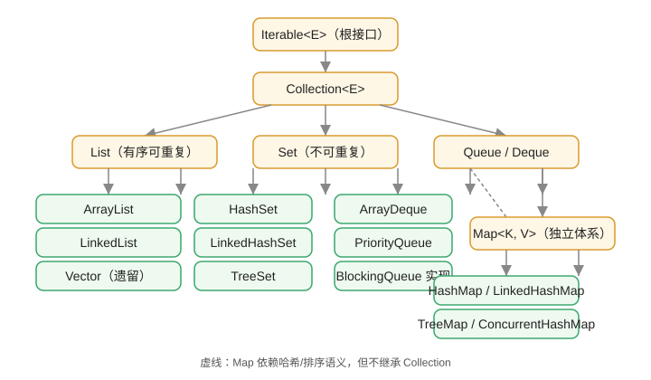

# 集合框架总览

Java 集合框架（Java Collections Framework，JCF）是 JDK 提供的“数据结构和算法”标准库：用统一的接口描述 List、Set、Map、Queue，并提供 ArrayList、HashMap 等可直接使用的实现。它解决的问题是：**数组不够灵活、Object 数组不够安全、自己写链表太费劲**。

::: info 版本现状（2026-08 核对）
本文基于 **Java 25 LTS** 编写，大部分示例兼容 Java 8+；`List.of`、`Set.of`、`Map.of` 等不可变集合 API 从 Java 9 起可用，使用 `record` 等新特性时会单独标注版本要求。
:::

## 集合与数组的区别

| 维度 | 数组 | 集合 |
| --- | --- | --- |
| 长度 | 创建后固定 | 动态增长 |
| 类型 | 支持基本类型和对象 | 只能存对象（基本类型自动装箱） |
| API | 只有 `length` 和下标 | 增删改查、遍历、转换等方法齐全 |
| 算法支持 | 无 | 排序、查找、线程安全包装等 |

## 两大体系

```text
Iterable（根接口）
└── Collection
    ├── List     有序、可重复、可按索引访问
    ├── Set      无序（或按规则排序）、不可重复
    └── Queue    队列，先进先出（FIFO）

Map（独立体系）  键值对，key 唯一
```



关键点：**Map 不属于 Collection**，它自成一个体系；`Collection` 存储单个元素，`Map` 存储键值对。

## 核心接口

| 接口 | 特点 | 常用实现 |
| --- | --- | --- |
| `List` | 有序、可重复、按索引访问 | ArrayList、LinkedList、Vector |
| `Set` | 不可重复 | HashSet、LinkedHashSet、TreeSet |
| `Queue` / `Deque` | 队列/双端队列 | ArrayDeque、LinkedList、PriorityQueue |
| `Map` | 键值对，key 唯一 | HashMap、LinkedHashMap、TreeMap、ConcurrentHashMap |

## 常用实现类对比

| 实现 | 底层结构 | 顺序 | 线程安全 | 适用场景 |
| --- | --- | --- | --- | --- |
| ArrayList | 动态数组 | 插入顺序 | 否 | 随机访问多、追加为主 |
| LinkedList | 双向链表 | 插入顺序 | 否 | 频繁头尾增删、实现队列/栈 |
| HashSet | HashMap | 不保证顺序 | 否 | 去重 |
| LinkedHashSet | 哈希 + 链表 | 插入顺序 | 否 | 去重且要顺序 |
| TreeSet | 红黑树 | 按比较器排序 | 否 | 有序去重、范围查询 |
| HashMap | 数组 + 链表/红黑树 | 不保证顺序 | 否 | 通用键值存储 |
| LinkedHashMap | 哈希 + 链表 | 插入/访问顺序 | 否 | 保持顺序、LRU 缓存 |
| TreeMap | 红黑树 | 按键排序 | 否 | 有序键值、范围查询 |
| ConcurrentHashMap | 分段/CAS + 同步 | 不保证顺序 | 是 | 高并发共享 Map |
| CopyOnWriteArrayList | 写时复制数组 | 插入顺序 | 是 | 读多写少 |

## 泛型与类型安全

集合使用泛型限定元素类型，编译期即可发现类型错误：

```java [Collection/GenericDemo.java]
import java.util.ArrayList;
import java.util.List;

public class GenericDemo {
    public static void main(String[] args) {
        List<String> names = new ArrayList<>();
        names.add("Java");
        // names.add(123); // 编译报错，类型安全

        for (String name : names) {
            System.out.println(name);
        }
    }
}
```

输出：

```text
Java
```

## 不可变集合（Java 9+）

```java [Collection/ImmutableDemo.java]
import java.util.List;
import java.util.Map;
import java.util.Set;

public class ImmutableDemo {
    public static void main(String[] args) {
        List<String> list = List.of("a", "b", "c");
        Set<Integer> set = Set.of(1, 2, 3);
        Map<String, Integer> map = Map.of("k1", 1, "k2", 2);

        System.out.println(list);
        System.out.println(set);
        System.out.println(map);
    }
}
```

`List.of` 创建的集合**不可增删改**，适合常量配置和不可变数据。注意 `Set.of` 不允许重复元素，`Map.of` 最多 10 对键值（更多用 `Map.ofEntries`）。

## 选择指南

::: tip 一句话选择
- 要“排好队的列表”用 `ArrayList`。
- 要“去重”用 `HashSet`，去重且要顺序用 `LinkedHashSet`，去重且要排序用 `TreeSet`。
- 要“按键取值”用 `HashMap`，键要排序用 `TreeMap`，多线程共享用 `ConcurrentHashMap`。
- 要“队列/栈”用 `ArrayDeque` 或 `LinkedList`。
:::

## 易错点

::: danger 常见错误
1. 把 `Map` 当成 `Collection`：两者是并列体系，不能互相赋值。
2. 用基本类型做泛型参数：`List<int>` 编译不过，必须用 `List<Integer>`（自动装箱）。
3. 直接对 `Arrays.asList` 的结果调用 `add`：它是定长视图，会抛 `UnsupportedOperationException`。
4. `List.of` 创建后调用 `add` 同样抛 `UnsupportedOperationException`，它不是“普通的 ArrayList”。
5. 遍历集合时直接 `remove`：抛出 `ConcurrentModificationException`，正确做法见「迭代与遍历」篇。
:::

## 验证方式

1. 编译并运行 `GenericDemo` 与 `ImmutableDemo`，确认输出正常。
2. 尝试给 `List.of("a")` 调用 `add`，确认抛出 `UnsupportedOperationException`。
3. 在 IDEA 中用 `Ctrl + H` 查看 `Collection` 的继承结构，对照本页的接口图。

## 参考资料

- Oracle 集合教程：https://docs.oracle.com/javase/tutorial/collections/
- Collection 接口文档：https://docs.oracle.com/en/java/javase/25/docs/api/java.base/java/util/Collection.html
- Map 接口文档：https://docs.oracle.com/en/java/javase/25/docs/api/java.base/java/util/Map.html
