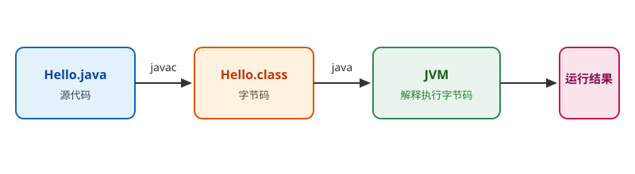

# Java 环境搭建

## 安装 JDK

### Windows

1. 打开 [Adoptium 官网](https://adoptium.net/temurin/releases/?version=25)，下载 Temurin JDK（推荐 25 LTS，或 21 LTS）。
2. 下载 `.msi` 安装包，一路下一步；安装时勾选 **Set JAVA_HOME variable**。
3. 重新打开命令行，验证安装：

```shell
java -version
javac -version
```

输出示例：

```text
java version "25.0.x" ...
javac 25.0.x
```

也可以直接用 winget 安装：

```shell
winget install EclipseAdoptium.Temurin.25.JDK
```

::: info 版本补充
想体验最新功能版本可以安装 Temurin 26（2026-03 发布，非 LTS）；学习与生产建议使用 25 LTS，社区资源与框架兼容性更好。
:::

### macOS / Linux

推荐使用 SDKMAN 管理多个 JDK 版本：

```shell
# 安装 SDKMAN
curl -s "https://get.sdkman.io" | bash

# 查看可用版本
sdk list java

# 安装 Temurin 25 LTS
sdk install java 25-tem
```

::: tip
SDKMAN 类似前端的 nvm，可以随时切换 JDK 版本，多项目开发强烈推荐。
:::

## 手动配置 JAVA_HOME（Windows）

如果安装时没有自动配置：

1. 打开「系统属性 → 高级 → 环境变量」。
2. 新建系统变量：变量名 `JAVA_HOME`，变量值为 JDK 安装目录（如 `C:\Program Files\Eclipse Adoptium\jdk-25.0.4`）。
3. 编辑 `Path`，新增 `%JAVA_HOME%\bin`。
4. 重新打开命令行，执行 `java -version` 验证。

::: danger 注意
1. `JAVA_HOME` 要配到 JDK 根目录，不要配到 `bin` 目录。
2. 修改环境变量后必须重新打开终端才会生效。
3. 如果安装了多个 JDK，先确认 `Path` 中生效的是想要的版本。
:::

## 安装 IDE

推荐 **IntelliJ IDEA**。注意：自 **2025.3** 起 IDEA 已改为**统一发行版**，不再分别下载 Community / Ultimate——

- 核心 Java / Kotlin 开发功能（编辑、导航、重构、调试、构建工具集成）**免费**，学习 Java SE 完全够用；
- Spring 支持、数据库工具、Web 框架支持等高级能力需要 **Ultimate 订阅**解锁；
- 新安装默认带 30 天 Ultimate 试用，试用结束不订阅也能继续用核心功能。

使用 VS Code 也可以，安装扩展 **Extension Pack for Java** 即可获得语言支持、调试与测试能力。

::: warning 别被旧教程误导
网上大量「Community 还是 Ultimate」的对比文章写于 2025.3 之前，已不适用。要确认某项能力是否免费，直接看官方当前的功能与订阅页。
:::

完整的环境配置（内存与 JVM 参数、索引卡顿治理、与 Maven toolchain 对齐、`.idea/` 提交策略）见 [IDE 配置](../../../../Tools/IDE/index.md)。

## 第一个 Java 程序

创建 `Hello.java`：

```java [Hello.java]
public class Hello {
    public static void main(String[] args) {
        System.out.println("Hello, World!");
    }
}
```

::: danger 注意
1. 类名必须和文件名一致：`Hello` 对应 `Hello.java`。
2. `main` 方法的写法是固定的：`public static void main(String[] args)`。
:::

编译并运行：

```shell
javac Hello.java
java Hello
```

输出：

```text
Hello, World!
```



## 安装构建工具（可选）

### Maven

```shell
# 下载解压后配置 MAVEN_HOME 和 PATH
mvn -v
```

### Gradle

```shell
# 通过 SDKMAN 安装
sdk install gradle
gradle -v
```

::: tip
初学阶段用 `javac` / `java` 直接运行即可；开始写项目后再引入 Maven / Gradle。
:::

## 相关专题

- [JVM 基础](../JVM/index.md)
