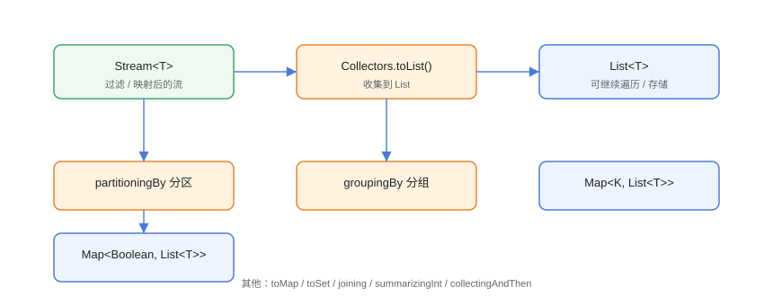

# Collectors 收集器详解

`Collectors` 是 `java.util.stream` 提供的**收集器工厂类**，把流中的元素聚合为 List、Set、Map、字符串或统计结果。`groupingBy`（分组）与 `toMap`（转 Map）是日常数据处理的利器。

## 收集器总览



| 分类 | 方法 | 结果 |
| --- | --- | --- |
| 转集合 | `toList()` / `toSet()` / `toCollection()` | List / Set / 指定集合 |
| 转 Map | `toMap()` / `toUnmodifiableMap()` | Map |
| 分组 | `groupingBy()` / `partitioningBy()` | Map&lt;K, List&gt; / Map&lt;Boolean, List&gt; |
| 拼接 | `joining()` | String |
| 统计 | `counting()` / `summingInt()` / `averagingInt()` / `summarizingInt()` | 数值统计 |
| 复合 | `mapping()` / `reducing()` / `collectingAndThen()` | 自定义聚合 |

## 转集合

```java
// Collectors/ToListDemo.java
import java.util.ArrayList;
import java.util.List;
import java.util.Set;
import java.util.stream.Collectors;

public class ToListDemo {
    public static void main(String[] args) {
        List<String> names = List.of("Tom", "Alice", "Bob", "Tom");

        // Java 16+：直接 toList()，不可变
        List<String> immutable = names.stream().distinct().toList();

        // 经典写法：可变 ArrayList
        List<String> mutable = names.stream()
                .collect(Collectors.toList());

        // 指定集合类型
        List<String> linked = names.stream()
                .collect(Collectors.toCollection(ArrayList::new));

        // 去重转 Set
        Set<String> set = names.stream().collect(Collectors.toSet());

        System.out.println("toList(不可变): " + immutable);
        System.out.println("toSet: " + set);
    }
}
```

::: danger toList() 与 Collectors.toList() 的区别
`Stream.toList()`（Java 16+）返回**不可变** List；`Collectors.toList()` 返回可变 ArrayList。需要后续增删改时用后者，或 `toCollection(ArrayList::new)`。
:::

## 转 Map 与处理冲突

```java
// Collectors/ToMapDemo.java
import java.util.List;
import java.util.Map;
import java.util.function.Function;
import java.util.stream.Collectors;

record Product(Long id, String name, double price) { }

public class ToMapDemo {
    public static void main(String[] args) {
        List<Product> products = List.of(
                new Product(1L, "手机", 1999),
                new Product(2L, "电脑", 6999),
                new Product(3L, "耳机", 299));

        // id -> 商品
        Map<Long, Product> byId = products.stream()
                .collect(Collectors.toMap(Product::id, Function.identity()));

        // 名称 -> 价格
        Map<String, Double> nameToPrice = products.stream()
                .collect(Collectors.toMap(Product::name, Product::price));

        System.out.println("byId: " + byId.keySet());
        System.out.println("手机价格: " + nameToPrice.get("手机"));

        // 键冲突：保留后者
        Map<String, String> merge = List.of("a", "b", "a").stream()
                .collect(Collectors.toMap(
                        s -> s,
                        s -> s.toUpperCase(),
                        (oldV, newV) -> newV));
        System.out.println("冲突合并: " + merge);
    }
}
```

::: danger toMap 键冲突
重复键不提供合并函数会抛 `IllegalStateException: Duplicate key`。必须传第三个参数 `(old, new) -> ...` 决定保留策略。
:::

## 分组 groupingBy

```java
// Collectors/GroupingDemo.java
import java.util.List;
import java.util.Map;
import java.util.stream.Collectors;

record Order(String status, double amount) { }

public class GroupingDemo {
    public static void main(String[] args) {
        List<Order> orders = List.of(
                new Order("PAID", 100),
                new Order("PAID", 200),
                new Order("UNPAID", 50),
                new Order("CANCELLED", 30),
                new Order("UNPAID", 80));

        // 按状态分组
        Map<String, List<Order>> byStatus = orders.stream()
                .collect(Collectors.groupingBy(Order::status));

        // 分组 + 计数
        Map<String, Long> countByStatus = orders.stream()
                .collect(Collectors.groupingBy(
                        Order::status, Collectors.counting()));

        // 分组 + 求和
        Map<String, Double> sumByStatus = orders.stream()
                .collect(Collectors.groupingBy(
                        Order::status,
                        Collectors.summingDouble(Order::amount)));

        // 布尔分区：true/false 两组
        Map<Boolean, List<Order>> paid = orders.stream()
                .collect(Collectors.partitioningBy(
                        o -> "PAID".equals(o.status())));

        System.out.println("分组: " + byStatus.keySet());
        System.out.println("计数: " + countByStatus);
        System.out.println("金额: " + sumByStatus);
        System.out.println("已支付数: " + paid.get(true).size());
    }
}
```

预期输出：

```text
分组: [PAID, UNPAID, CANCELLED]
计数: {PAID=2, UNPAID=2, CANCELLED=1}
金额: {PAID=300.0, UNPAID=130.0, CANCELLED=30.0}
已支付数: 2
```

### 多级分组

```java
// Collectors/NestedGroupingDemo.java
import java.util.List;
import java.util.Map;
import java.util.stream.Collectors;

record Student(String grade, String city, int score) { }

public class NestedGroupingDemo {
    public static void main(String[] args) {
        List<Student> students = List.of(
                new Student("一班", "北京", 90),
                new Student("一班", "上海", 80),
                new Student("二班", "北京", 85),
                new Student("二班", "上海", 95));

        // 年级 → 城市 → 人数
        Map<String, Map<String, Long>> nested = students.stream()
                .collect(Collectors.groupingBy(
                        Student::grade,
                        Collectors.groupingBy(
                                Student::city, Collectors.counting())));

        System.out.println(nested);
    }
}
```

预期输出：

```text
{一班={上海=1, 北京=1}, 二班={上海=1, 北京=1}}
```

## joining 与统计

```java
// Collectors/JoiningStatsDemo.java
import java.util.IntSummaryStatistics;
import java.util.List;
import java.util.stream.Collectors;

public class JoiningStatsDemo {
    public static void main(String[] args) {
        List<String> words = List.of("Java", "Stream", "Collector");

        // 拼接
        String joined = words.stream().collect(Collectors.joining(", ", "[", "]"));
        System.out.println(joined);

        // 数值统计
        List<Integer> scores = List.of(85, 92, 78, 96);
        IntSummaryStatistics stats = scores.stream()
                .collect(Collectors.summarizingInt(Integer::intValue));
        System.out.println("平均分: " + stats.getAverage());
        System.out.println("最高分: " + stats.getMax());
        System.out.println("人数: " + stats.getCount());
    }
}
```

## 复合收集器

```java
// Collectors/CompoundDemo.java
import java.util.List;
import java.util.Map;
import java.util.stream.Collectors;

record Employee(String dept, String name, int salary) { }

public class CompoundDemo {
    public static void main(String[] args) {
        List<Employee> employees = List.of(
                new Employee("研发", "张三", 20000),
                new Employee("研发", "李四", 25000),
                new Employee("运营", "王五", 15000),
                new Employee("运营", "赵六", 18000));

        // 分组后取每组最高薪员工姓名（mapping + maxBy 复合）
        Map<String, String> topByDept = employees.stream()
                .collect(Collectors.groupingBy(
                        Employee::dept,
                        Collectors.collectingAndThen(
                                Collectors.maxBy(
                                        java.util.Comparator
                                                .comparingInt(Employee::salary)),
                                opt -> opt.map(Employee::name).orElse("无"))));

        System.out.println("各部门最高薪: " + topByDept);

        // 分组后提取姓名列表
        Map<String, List<String>> namesByDept = employees.stream()
                .collect(Collectors.groupingBy(
                        Employee::dept,
                        Collectors.mapping(Employee::name, Collectors.toList())));
        System.out.println("各部门人员: " + namesByDept);
    }
}
```

## 易错点与最佳实践

::: danger 常见坑
1. **`toMap` 键冲突抛异常**：必须提供合并函数。
2. **`groupingBy` 默认不保证顺序**：需要有序用 `groupingBy(key, LinkedHashMap::new, downstream)`。
3. **`toList()` 与 `Collectors.toList()` 可变性差异**：按需选择。
4. **`summingInt` 与 `reduce` 混用**：统计类优先 `summarizingInt` 一次拿全。
5. **null 键值**：`toMap`/`groupingBy` 不允许 null 键（`Collectors.toMap` 用 `HashMap` 允许 null 值但不允许 null 键）。
:::

::: tip 最佳实践
- 分组统计是报表、看板类需求的标准答案：`groupingBy + counting/summingDouble`。
- 需要有序 Map 时显式传 `LinkedHashMap::new`。
- 复杂聚合先用简单组合实现，再考虑自定义 `Collector`。
:::

## 验证方式

```shell
javac GroupingDemo.java ToMapDemo.java NestedGroupingDemo.java
java GroupingDemo
java ToMapDemo
java NestedGroupingDemo
```

预期：分组/计数/金额输出与文中一致；`ToMapDemo` 输出 id 集合与冲突合并结果。构造重复键不传合并函数再跑，确认 `IllegalStateException`。

## 参考资料

- [Collectors API 文档](https://docs.oracle.com/en/java/javase/25/docs/api/java.base/java/util/stream/Collectors.html)
- [Oracle Stream 教程](https://docs.oracle.com/javase/tutorial/collections/streams/reduction.html)
- [Stream.toList API 文档](https://docs.oracle.com/en/java/javase/25/docs/api/java.base/java/util/stream/Stream.html#toList())
