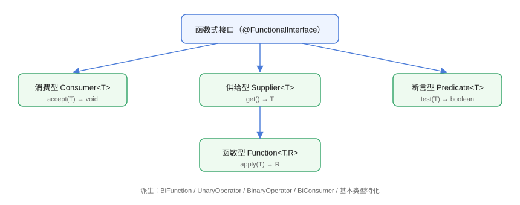

# 函数式接口与方法引用

函数式接口（Functional Interface）是**只有一个抽象方法**的接口，是 Lambda 与方法引用的「目标类型」。JDK 在 `java.util.function` 中提供了一组通用函数式接口，理解它们是读懂 Stream API 的前提。

## 四大基础接口



| 接口 | 抽象方法 | 用途 |
| --- | --- | --- |
| `Consumer<T>` | `accept(T)` → void | 消费一个值，不返回（如 forEach） |
| `Supplier<T>` | `get()` → T | 供给一个值（惰性取值） |
| `Predicate<T>` | `test(T)` → boolean | 条件判断（如 filter） |
| `Function<T,R>` | `apply(T)` → R | 转换（如 map） |

## 使用示例

```java
// FunctionalInterface/FourKindsDemo.java
import java.util.function.Consumer;
import java.util.function.Function;
import java.util.function.Predicate;
import java.util.function.Supplier;

public class FourKindsDemo {
    public static void main(String[] args) {
        // 消费型：打印
        Consumer<String> printer = System.out::println;
        printer.accept("Hello Consumer");

        // 供给型：延迟生成
        Supplier<Double> random = Math::random;
        System.out.println("随机数：" + random.get());

        // 断言型：判断
        Predicate<String> notEmpty = s -> s != null && !s.isBlank();
        System.out.println("判断空串：" + notEmpty.test(""));

        // 函数型：转换
        Function<String, Integer> length = String::length;
        System.out.println("长度：" + length.apply("hello"));
    }
}
```

## 常用变体

### 双参版本

```java
// FunctionalInterface/TwoArgDemo.java
import java.util.function.BiConsumer;
import java.util.function.BiFunction;
import java.util.function.BiPredicate;

public class TwoArgDemo {
    public static void main(String[] args) {
        BiFunction<Integer, Integer, Integer> add = Integer::sum;
        System.out.println("求和：" + add.apply(3, 4));

        BiPredicate<String, String> equalsIgnoreCase = String::equalsIgnoreCase;
        System.out.println("忽略大小写相等：" + equalsIgnoreCase.test("Java", "JAVA"));

        BiConsumer<String, Integer> printKV = (k, v) ->
                System.out.println(k + "=" + v);
        printKV.accept("age", 25);
    }
}
```

### 运算符与一元/二元

```java
// FunctionalInterface/OperatorDemo.java
import java.util.function.UnaryOperator;
import java.util.function.BinaryOperator;

public class OperatorDemo {
    public static void main(String[] args) {
        // 一元运算符：同类型转换
        UnaryOperator<String> upper = String::toUpperCase;
        System.out.println(upper.apply("java"));

        // 二元运算符：同类型合并
        BinaryOperator<String> concat = (a, b) -> a + " " + b;
        System.out.println(concat.apply("Hello", "World"));
    }
}
```

### 基本类型特化

`IntFunction`、`IntConsumer`、`IntPredicate`、`IntUnaryOperator` 等避免装箱拆箱开销：

```java
// FunctionalInterface/PrimitiveDemo.java
import java.util.function.IntPredicate;
import java.util.stream.IntStream;

public class PrimitiveDemo {
    public static void main(String[] args) {
        IntPredicate isPrime = n -> {
            if (n < 2) return false;
            for (int i = 2; i * i <= n; i++) {
                if (n % i == 0) return false;
            }
            return true;
        };

        IntStream.rangeClosed(1, 20)
                .filter(isPrime)
                .forEach(n -> System.out.print(n + " "));
    }
}
```

预期输出：

```text
2 3 5 7 11 13 17 19 
```

## 方法引用

方法引用是 Lambda 的简化写法，共四种：

| 类型 | 语法 | 等价 Lambda | 示例 |
| --- | --- | --- | --- |
| 静态方法 | `Class::staticMethod` | `(args) -> Class.staticMethod(args)` | `Integer::sum` |
| 实例方法（特定对象） | `obj::instanceMethod` | `(args) -> obj.method(args)` | `System.out::println` |
| 实例方法（任意对象） | `Class::instanceMethod` | `(obj, args) -> obj.method(args)` | `String::length` |
| 构造器 | `Class::new` | `(args) -> new Class(args)` | `ArrayList::new` |

```java
// FunctionalInterface/MethodRefDemo.java
import java.util.ArrayList;
import java.util.List;
import java.util.function.Function;
import java.util.function.Supplier;

public class MethodRefDemo {
    public static void main(String[] args) {
        // 静态方法引用
        Function<String, Integer> parseInt = Integer::parseInt;
        System.out.println(parseInt.apply("42") + 1);

        // 特定对象实例方法
        Runnable print = System.out::println;

        // 任意对象实例方法
        Function<String, Integer> len = String::length;
        System.out.println(len.apply("hello"));

        // 构造器引用
        Supplier<List<String>> listFactory = ArrayList::new;
        List<String> list = listFactory.get();
        list.add("A");
        System.out.println(list);
    }
}
```

## 自定义函数式接口

```java
// FunctionalInterface/CustomDemo.java
@FunctionalInterface
interface Formatter {
    String format(String input);

    // 只允许一个抽象方法；default/static 方法不限
    default String wrap(String input) {
        return "[" + input + "]";
    }
}

public class CustomDemo {
    public static void main(String[] args) {
        Formatter upper = String::toUpperCase;
        Formatter trim = String::trim;

        System.out.println(upper.format("java"));
        System.out.println(trim.wrap("  hi  "));
    }
}
```

::: warning @FunctionalInterface 的作用
`@FunctionalInterface` 是**编译期校验**注解：接口出现第二个抽象方法时编译报错。它不是必须的，但强烈建议加上，防止后续误加方法破坏函数式语义。
:::

## 易错点与最佳实践

::: danger 常见坑
1. **函数式接口里加了第二个抽象方法**：Lambda 无法匹配，编译报错。
2. **方法引用写错类型**：`String::length` 与 `String::toUpperCase` 签名不同，与目标 `Function` 不匹配时报错。
3. **`Supplier` 与 `Consumer` 混淆**：一个「给」，一个「取」，方向别弄反。
4. **基本类型流忘记 `boxed()`**：`IntStream` 想转 `List<Integer>` 需 `.boxed().toList()`。
5. **默认方法不被视为抽象方法**：接口可以同时有抽象方法与多个 default 方法。
:::

::: tip 最佳实践
- 优先使用 JDK 内置函数式接口，少自定义；自定义时加上 `@FunctionalInterface`。
- 能用方法引用就用方法引用，代码更短且语义更清晰。
- 性能敏感场景用基本类型特化接口（`IntFunction` 等）减少装箱。
:::

## 验证方式

```shell
javac FourKindsDemo.java MethodRefDemo.java CustomDemo.java
java FourKindsDemo
java MethodRefDemo
java CustomDemo
```

预期：各示例按注释输出正确结果。尝试给 `Formatter` 添加第二个抽象方法，确认 `@FunctionalInterface` 编译报错。

## 参考资料

- [java.util.function 包 API 文档](https://docs.oracle.com/en/java/javase/25/docs/api/java.base/java/util/function/package-summary.html)
- [Oracle 方法引用教程](https://docs.oracle.com/javase/tutorial/java/javaOO/methodreferences.html)
- [@FunctionalInterface API 文档](https://docs.oracle.com/en/java/javase/25/docs/api/java.base/java/lang/FunctionalInterface.html)
