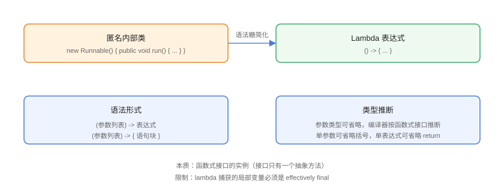

# Lambda 表达式

Lambda 表达式（λ）是 Java 8 引入的匿名函数：把「一个函数」当作参数传递或当作值使用。它让集合遍历、回调、排序等代码从冗长的匿名内部类简化为一行，是函数式编程的入口。

## 语法与演进



```java
// Lambda/LambdaBasics.java
import java.util.Arrays;
import java.util.List;

public class LambdaBasics {
    public static void main(String[] args) {
        List<String> names = Arrays.asList("Tom", "Alice", "Bob");

        // 匿名内部类写法（Java 8 之前）
        names.sort(new java.util.Comparator<String>() {
            @Override
            public int compare(String a, String b) {
                return a.compareTo(b);
            }
        });

        // Lambda 写法：类型可省略
        names.sort((a, b) -> a.compareTo(b));

        // 方法引用写法：最简
        names.sort(String::compareTo);

        // forEach 遍历
        names.forEach(name -> System.out.println(name));

        // 多行语句块
        names.forEach(name -> {
            String upper = name.toUpperCase();
            System.out.println(upper);
        });
    }
}
```

预期输出（排序后）：

```text
Alice
Bob
Tom
ALICE
BOB
TOM
```

## 语法规则速查

| 场景 | 写法 | 说明 |
| --- | --- | --- |
| 无参数 | `() -> 表达式` | 括号不可省 |
| 单参数 | `x -> x * 2` | 括号可省 |
| 多参数 | `(a, b) -> a + b` | 类型可省略，由编译器推断 |
| 语句块 | `(a, b) -> { return a + b; }` | 需要 `return` 与分号 |
| 单表达式 | `(a, b) -> a + b` | 隐含 return，无分号 |
| 方法引用 | `Integer::sum` | 见 [函数式接口与方法引用](../FunctionalInterface/index.md) |

## 变量捕获

```java
// Lambda/VariableCapture.java
import java.util.ArrayList;
import java.util.List;

public class VariableCapture {
    public static void main(String[] args) {
        int base = 10;            // effectively final（初始化后未再修改）
        List<Integer> results = new ArrayList<>();

        // 正确：捕获 effectively final 变量
        Runnable r = () -> results.add(base + 1);
        r.run();

        // 错误：lambda 内给局部变量重新赋值 → 编译错误
        // int count = 0;
        // Runnable bad = () -> count++;   // 不允许

        System.out.println(results);
    }
}
```

::: danger 变量捕获的规则
Lambda 捕获的局部变量必须是 **effectively final**（初始化后不再赋值），成员变量/静态变量无此限制。原因：局部变量在栈上，Lambda 捕获的是**值的拷贝**，不允许修改以避免歧义。
:::

## Lambda 与匿名内部类的区别

| 维度 | Lambda | 匿名内部类 |
| --- | --- | --- |
| 必须有函数式接口 | 是（只有一个抽象方法） | 否 |
| `this` 指向 | 外部类实例 | 匿名类自身 |
| 生成类文件 | 运行时动态生成（invokedynamic） | 编译期生成 class 文件 |
| 变量捕获 | 只能 effectively final | 同样限制 |
| 可读性 | 简洁 | 冗长 |

::: tip this 的差异
Lambda 里的 `this` 是**外部类对象**，匿名内部类里的 `this` 是**匿名类对象**。在回调中区分线程归属时容易踩坑。
:::

## 常见应用场景

```java
// Lambda/LambdaScenarios.java
import java.util.Arrays;
import java.util.List;
import java.util.function.Consumer;
import java.util.function.Function;
import java.util.function.Predicate;

public class LambdaScenarios {
    public static void main(String[] args) {
        List<Integer> numbers = Arrays.asList(1, 2, 3, 4, 5, 6);

        // 1. 条件过滤（Predicate）
        Predicate<Integer> isEven = n -> n % 2 == 0;
        numbers.stream().filter(isEven).forEach(n -> System.out.print(n + " "));
        System.out.println();

        // 2. 数据转换（Function）
        Function<Integer, String> toStr = n -> "num-" + n;
        System.out.println(toStr.apply(42));

        // 3. 消费处理（Consumer）
        Consumer<String> log = msg -> System.out.println("[日志] " + msg);
        log.accept("lambda 场景");

        // 4. 线程与排序
        new Thread(() -> System.out.println("线程运行")).start();
        List<String> words = Arrays.asList("banana", "apple", "cherry");
        words.sort((a, b) -> Integer.compare(a.length(), b.length()));
        System.out.println(words);
    }
}
```

预期输出：

```text
2 4 6 
num-42
[日志] lambda 场景
线程运行
[apple, banana, cherry]
```

## 易错点与最佳实践

::: danger 常见坑
1. **捕获非 effectively final 变量**：编译错误，改用数组/Atomic 或成员变量（但要注意线程安全）。
2. **`this` 指错对象**：Lambda 中 `this` 是外部类，别和匿名内部类混淆。
3. **表达式省略 return 的坑**：`(a, b) -> a + b` 没问题，但语句块版必须写 `return`。
4. **Lambda 不是对象**：不能 `new` 一个 Lambda，它只是函数式接口的实例。
5. **方法引用串号**：`String::compareTo` 与 `String::length` 语义不同，注意实例方法/静态方法/构造器引用的写法。
:::

::: tip 最佳实践
- 优先用**方法引用**，其次单表达式 Lambda，语句块 Lambda 尽量保持简短。
- 复杂逻辑不要硬塞进 Lambda，拆成方法再引用，可读性更高。
- 集合处理优先 Stream + Lambda，避免「匿名内部类 + 手动循环」混搭。
:::

## 验证方式

```shell
javac LambdaBasics.java
java LambdaBasics
```

预期：排序后的名字按顺序输出，第二组为全大写。修改 `VariableCapture` 中 `base` 的值再编译，确认 effectively final 报错。

## 参考资料

- [Oracle Lambda 教程](https://docs.oracle.com/javase/tutorial/java/javaOO/lambdaexpressions.html)
- [Java Lambda 规范](https://docs.oracle.com/javase/specs/jls/se25/html/jls-15.html#jls-15.27)
- [java.util.function 包 API 文档](https://docs.oracle.com/en/java/javase/25/docs/api/java.base/java/util/function/package-summary.html)
