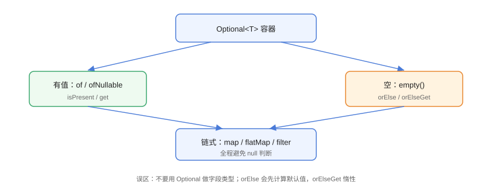

# Optional：优雅处理空值

`Optional<T>` 是一个**容器对象**，可能包含值也可能为空，用类型系统显式表达「可能没有值」，配合链式 `map`/`orElse` 把分散的 `if (x != null)` 判断收敛为声明式处理，显著降低空指针异常（NPE）风险。

## 基本流程



## 创建 Optional

```java
// Optional/CreateOptionalDemo.java
import java.util.Optional;

public class CreateOptionalDemo {
    public static void main(String[] args) {
        // 有值
        Optional<String> hasValue = Optional.of("hello");

        // 允许 null（推荐用于不确定场景）
        Optional<String> maybe = Optional.ofNullable(null);

        // 空
        Optional<String> empty = Optional.empty();

        System.out.println("of 有值: " + hasValue.isPresent());
        System.out.println("ofNullable(null) 为空: " + maybe.isEmpty());
        System.out.println("empty 为空: " + empty.isEmpty());
    }
}
```

::: danger Optional.of(null) 会抛 NPE
`Optional.of` 不允许 null，传 null 直接抛 `NullPointerException`；不确定是否有值请用 `Optional.ofNullable`。
:::

## 取值方式

```java
// Optional/GetValueDemo.java
import java.util.Optional;

public class GetValueDemo {
    public static void main(String[] args) {
        Optional<String> maybe = Optional.ofNullable(lookup("key1"));

        // orElse：有值返回值，否则返回默认值（会立即计算）
        String v1 = maybe.orElse("默认值");

        // orElseGet：惰性生成默认值（推荐）
        String v2 = maybe.orElseGet(() -> createDefault());

        // orElseThrow：为空抛自定义异常
        String v3 = maybe.orElseThrow(() ->
                new IllegalStateException("key1 不存在"));

        // 有值才消费
        maybe.ifPresent(System.out::println);

        // 有值消费 + 为空时的兜底动作
        maybe.ifPresentOrElse(
                value -> System.out.println("值: " + value),
                () -> System.out.println("无值"));

        System.out.println(v1 + " / " + v2 + " / " + v3);
    }

    private static String createDefault() {
        System.out.println("（生成默认值）");
        return "default";
    }

    private static String lookup(String key) {
        return null;   // 模拟查询无结果
    }
}
```

::: warning orElse 与 orElseGet 的区别
`orElse(default)` 的 `default` **先求值**（即使有值也执行）；`orElseGet(supplier)` 只在为空时才调用。默认值计算昂贵或带副作用时务必用 `orElseGet`。
:::

## 链式操作

```java
// Optional/ChainDemo.java
import java.util.Optional;

class Address {
    String city;
    Address(String city) { this.city = city; }
    String getCity() { return city; }
}

class User {
    String name;
    Address address;
    User(String name, Address address) {
        this.name = name;
        this.address = address;
    }
    String getName() { return name; }
    Address getAddress() { return address; }
}

public class ChainDemo {
    public static void main(String[] args) {
        User user = new User("张三", new Address("北京"));
        User noAddress = new User("李四", null);

        // 传统写法
        String cityOld = "未知";
        if (user != null && user.getAddress() != null
                && user.getAddress().getCity() != null) {
            cityOld = user.getAddress().getCity();
        }

        // Optional 链式写法
        String cityNew = Optional.ofNullable(user)
                .map(User::getAddress)
                .map(Address::getCity)
                .orElse("未知");

        System.out.println("传统: " + cityOld);
        System.out.println("Optional: " + cityNew);
        System.out.println("无地址: " +
                Optional.ofNullable(noAddress)
                        .map(User::getAddress)
                        .map(Address::getCity)
                        .orElse("未知"));
    }
}
```

预期输出：

```text
传统: 北京
Optional: 北京
无地址: 未知
```

### filter 与 flatMap

```java
// Optional/FilterFlatMapDemo.java
import java.util.Optional;

public class FilterFlatMapDemo {
    public static void main(String[] args) {
        Optional<String> value = Optional.of("hello-world");

        // filter：不满足条件 → 空
        Optional<String> filtered = value.filter(s -> s.contains("-"));
        System.out.println("filter 后: " + filtered.orElse("空"));

        // flatMap：嵌套 Optional 打平
        Optional<String> result = value.flatMap(FilterFlatMapDemo::toOptional);
        System.out.println("flatMap 后: " + result.orElse("空"));
    }

    // 返回 Optional 的转换方法
    private static Optional<String> toOptional(String s) {
        return Optional.of(s.toUpperCase());
    }
}
```

::: tip map 与 flatMap 的区别
`map` 的转换函数返回普通值，结果自动包成 `Optional`；`flatMap` 的转换函数**自己返回 `Optional`**，避免「Optional 套 Optional」。
:::

## Optional 与 Stream 结合

```java
// Optional/OptionalStreamDemo.java
import java.util.List;
import java.util.Optional;

public class OptionalStreamDemo {
    public static void main(String[] args) {
        List<Optional<Integer>> list = List.of(
                Optional.of(1), Optional.empty(), Optional.of(3));

        // 过滤出有值的
        List<Integer> values = list.stream()
                .flatMap(Optional::stream)      // Java 9+
                .toList();
        System.out.println("有值元素: " + values);

        // findFirst + Optional
        Optional<Integer> first = values.stream()
                .filter(n -> n > 2)
                .findFirst();
        System.out.println("第一个 >2: " + first.orElse(-1));
    }
}
```

## 易错点与最佳实践

::: danger 常见坑
1. **Optional 做字段/方法参数**：官方不推荐（序列化、可空语义混乱），字段用 null 或默认值，返回值才用 Optional。
2. **滥用 `get()`**：为空直接抛 `NoSuchElementException`，除非 `isPresent` 已判断，否则用 `orElse`/`orElseThrow`。
3. **`orElse` 传昂贵的默认值**：会先执行，用 `orElseGet`。
4. **Optional 不能序列化**：作为 DTO 字段会遇到框架兼容问题。
5. **判断链混乱**：`isPresent` + `get` 仍是命令式，链式 `map`/`orElse` 更清晰。
:::

::: tip 最佳实践
- 返回值用 `Optional<T>` 表达「可能没有」；参数与字段不用。
- 空集合返回 `List.of()`，不要 `Optional<List>`。
- 用 `stream()`（Java 9+）把 Optional 转流参与流水线。
:::

## 验证方式

```shell
javac CreateOptionalDemo.java ChainDemo.java OptionalStreamDemo.java
java CreateOptionalDemo
java ChainDemo
java OptionalStreamDemo
```

预期：`ChainDemo` 传统与 Optional 两种写法输出一致；`OptionalStreamDemo` 只保留有值元素。把 `Optional.of(null)` 跑一遍，确认 NPE。

## 参考资料

- [Optional API 文档](https://docs.oracle.com/en/java/javase/25/docs/api/java.base/java/util/Optional.html)
- [Stuart Marks：Optional 使用建议（Devoxx）](https://www.youtube.com/watch?v=Ej0sss6cq14)
- [Oracle Optional 教程](https://docs.oracle.com/javase/tutorial/java/javaOO/optional.html)
