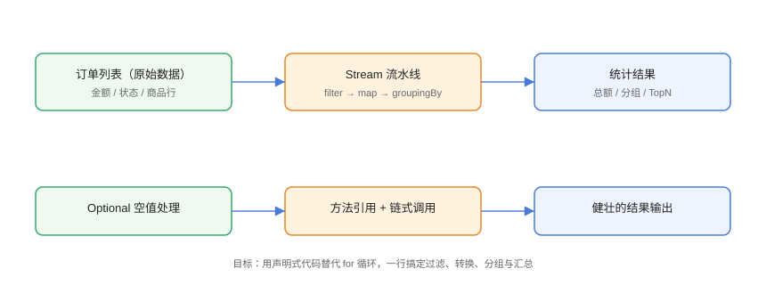

# 实战：订单统计与数据处理

用函数式编程完成一个完整的**订单统计服务**：从订单列表出发，完成过滤、转换、分组、TopN、空值兜底等真实业务需求，对比命令式写法体会函数式的可读性优势。

## 需求与设计



需求清单：

1. 筛选出已支付订单；
2. 按商品汇总销量与销售额；
3. 统计每个用户的订单数与总金额；
4. 找出销售额 Top 3 商品；
5. 用户信息可能缺失，用 Optional 兜底；
6. 输出报表字符串。

## 数据模型

```java
// Practice/OrderModel.java
import java.time.LocalDateTime;
import java.util.List;

record User(Long id, String name, String city) { }

record OrderItem(Long productId, String productName, int quantity, double price) {
    double amount() { return quantity * price; }
}

record Order(Long id, Long userId, String status,
             LocalDateTime createTime, List<OrderItem> items) {

    double totalAmount() {
        return items.stream().mapToDouble(OrderItem::amount).sum();
    }
}
```

## 准备测试数据

```java
// Practice/OrderData.java
import java.time.LocalDateTime;
import java.util.List;

public class OrderData {
    static final List<User> USERS = List.of(
            new User(1L, "张三", "北京"),
            new User(2L, "李四", "上海"),
            new User(3L, "王五", "广州"));

    static final List<Order> ORDERS = List.of(
            new Order(101L, 1L, "PAID",
                    LocalDateTime.of(2026, 8, 1, 10, 0),
                    List.of(new OrderItem(1L, "手机", 1, 1999))),
            new Order(102L, 1L, "PAID",
                    LocalDateTime.of(2026, 8, 3, 14, 30),
                    List.of(new OrderItem(2L, "耳机", 2, 299))),
            new Order(103L, 2L, "UNPAID",
                    LocalDateTime.of(2026, 8, 5, 9, 0),
                    List.of(new OrderItem(1L, "手机", 1, 1999))),
            new Order(104L, 2L, "PAID",
                    LocalDateTime.of(2026, 8, 6, 20, 0),
                    List.of(new OrderItem(3L, "键盘", 1, 499),
                            new OrderItem(2L, "耳机", 1, 299))),
            new Order(105L, 3L, "PAID",
                    LocalDateTime.of(2026, 8, 8, 11, 0),
                    List.of(new OrderItem(3L, "键盘", 2, 499),
                            new OrderItem(1L, "手机", 1, 1999))));
}
```

## 报表引擎（函数式实现）

```java
// Practice/OrderReport.java
import java.util.Comparator;
import java.util.LinkedHashMap;
import java.util.List;
import java.util.Map;
import java.util.Optional;
import java.util.stream.Collectors;

public class OrderReport {

    /** 1. 已支付订单 */
    static List<Order> paidOrders() {
        return OrderData.ORDERS.stream()
                .filter(o -> "PAID".equals(o.status()))
                .toList();
    }

    /** 2. 商品销量与销售额汇总 */
    static Map<String, long[]> productSummary() {
        return OrderData.ORDERS.stream()
                .filter(o -> "PAID".equals(o.status()))
                .flatMap(o -> o.items().stream())
                .collect(Collectors.groupingBy(
                        OrderItem::productName,
                        LinkedHashMap::new,
                        Collectors.collectingAndThen(
                                Collectors.toList(),
                                items -> new long[]{
                                        items.stream()
                                                .mapToLong(OrderItem::quantity).sum(),
                                        (long) items.stream()
                                                .mapToDouble(OrderItem::amount).sum()})));
    }

    /** 3. 用户订单数与总金额 */
    static Map<String, long[]> userSummary() {
        return OrderData.ORDERS.stream()
                .filter(o -> "PAID".equals(o.status()))
                .collect(Collectors.groupingBy(
                        o -> Optional.ofNullable(
                                        findUser(o.userId()))
                                .map(User::name).orElse("未知用户"),
                        Collectors.collectingAndThen(
                                Collectors.toList(),
                                orders -> new long[]{
                                        orders.size(),
                                        (long) orders.stream()
                                                .mapToDouble(Order::totalAmount).sum()})));
    }

    /** 4. 销售额 Top3 商品 */
    static List<String> topProducts(int n) {
        return productSummary().entrySet().stream()
                .sorted(Map.Entry.<String, long[]>
                        comparingByValue(
                                Comparator.comparingLong(v -> v[1]))
                        .reversed())
                .limit(n)
                .map(Map.Entry::getKey)
                .toList();
    }

    /** 5. Optional 兜底查用户 */
    static User findUser(Long id) {
        return OrderData.USERS.stream()
                .filter(u -> u.id().equals(id))
                .findFirst()
                .orElse(null);
    }

    public static void main(String[] args) {
        System.out.println("=== 已支付订单数 ===");
        System.out.println(paidOrders().size());

        System.out.println("\n=== 商品汇总（销量/销售额）===");
        productSummary().forEach((name, v) ->
                System.out.println(name + ": " + v[0] + " 件 / " + v[1] + " 元"));

        System.out.println("\n=== 用户汇总（单数/金额）===");
        userSummary().forEach((name, v) ->
                System.out.println(name + ": " + v[0] + " 单 / " + v[1] + " 元"));

        System.out.println("\n=== 销售额 Top 3 ===");
        topProducts(3).forEach(System.out::println);
    }
}
```

预期输出：

```text
=== 已支付订单数 ===
4

=== 商品汇总（销量/销售额）===
手机: 3 件 / 5997 元
耳机: 3 件 / 897 元
键盘: 3 件 / 1497 元

=== 用户汇总（单数/金额）===
张三: 2 单 / 2597 元
李四: 1 单 / 798 元
王五: 2 单 / 2997 元

=== 销售额 Top 3 ===
手机
键盘
耳机
```

## 对比命令式写法

以「已支付订单 + 商品汇总」为例，命令式版本：

```java
// Practice/ImperativeVersion.java
import java.util.LinkedHashMap;
import java.util.Map;

public class ImperativeVersion {
    public static Map<String, long[]> productSummary() {
        Map<String, long[]> result = new LinkedHashMap<>();
        for (Order order : OrderData.ORDERS) {
            if (!"PAID".equals(order.status())) continue;
            for (OrderItem item : order.items()) {
                long[] stat = result.computeIfAbsent(
                        item.productName(), k -> new long[2]);
                stat[0] += item.quantity();
                stat[1] += (long) item.amount();
            }
        }
        return result;
    }
}
```

对比结论：

| 维度 | 函数式 | 命令式 |
| --- | --- | --- |
| 意图表达 | 流水线直述「过滤→打平→分组→汇总」 | 循环 + 中间变量 |
| 可变状态 | 无显式可变累加器（收集器内部处理） | 显式 `Map` 累加 |
| 并行化 | 改 `parallelStream` 即可 | 需重写 |
| 可测试性 | 纯函数组合，易单测 | 依赖外部状态 |

::: tip 何时用函数式
数据转换、聚合、报表、DTO 映射等「读多写少」场景优先函数式；涉及复杂状态流转、性能极端敏感的底层循环仍可用命令式。
:::

## 易错点与最佳实践

::: danger 常见坑
1. **分组 Map 顺序不确定**：报表需要稳定顺序时传 `LinkedHashMap::new`。
2. **double 精度**：金额用 `BigDecimal` 更严谨，示例简化用 double。
3. **`flatMap` 忘过滤**：统计含 UNPAID 会污染结果，先 filter 再 flatMap。
4. **Optional 返回值与 null 混用**：`findUser` 返回 null 后用 Optional 包装，链条上保持一致。
5. **TopN 用错排序**：`comparingByValue` 默认升序，取前 N 要 `reversed()`。
:::

::: tip 最佳实践
- 报表类逻辑拆成「纯函数」：输入数据 → 输出统计，便于单测。
- 金额计算生产环境用 `BigDecimal`，配合 `Collectors` 自定义收集器。
- 结果集合优先不可变（`toList()`），避免后续误改。
:::

## 验证方式

```shell
javac OrderModel.java OrderData.java OrderReport.java
java OrderReport
```

预期：输出与文中一致。修改 `OrderData` 增加一笔新订单，重新运行确认统计自动更新；将 `topProducts(3)` 改为 `topProducts(1)` 验证 Top 1。

## 参考资料

- [Collectors API 文档](https://docs.oracle.com/en/java/javase/25/docs/api/java.base/java/util/stream/Collectors.html)
- [Optional API 文档](https://docs.oracle.com/en/java/javase/25/docs/api/java.base/java/util/Optional.html)
- [Java record 规范（JEP 395）](https://openjdk.org/jeps/395)
