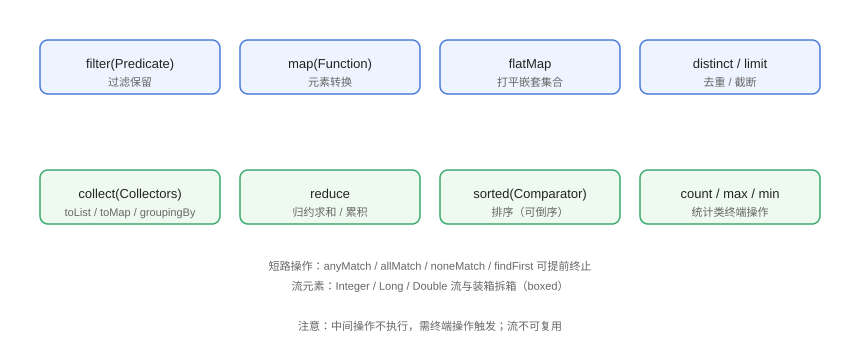

# Stream 进阶：映射、归约与并行

基础篇掌握了「过滤 + 转换 + 收集」；进阶篇深入 **reduce 归约**、**数值流**、**并行流**与 **Gatherers**，理解 Stream 的惰性求值、短路与线程模型，才能在真实项目中写出高效且正确的流水线。

## 操作全景



## reduce 归约

`reduce` 把流中所有元素按二元运算累积成一个值，是 `sum`、`max` 等的通用底层。

```java
// StreamAdvanced/ReduceDemo.java
import java.util.List;
import java.util.Optional;

public class ReduceDemo {
    public static void main(String[] args) {
        List<Integer> nums = List.of(1, 2, 3, 4, 5);

        // 有初始值：1 + 2 + 3 + 4 + 5
        int sumWithIdentity = nums.stream()
                .reduce(0, Integer::sum);
        System.out.println("带初始值求和: " + sumWithIdentity);

        // 无初始值：空流时返回 Optional
        Optional<Integer> sumOptional = nums.stream()
                .reduce(Integer::sum);
        System.out.println("无初始值求和: " + sumOptional.orElse(0));

        // 求最大值
        Optional<Integer> max = nums.stream()
                .reduce(Integer::max);
        System.out.println("最大值: " + max.orElse(-1));

        // 字符串连接
        String joined = nums.stream()
                .reduce("", (acc, n) -> acc + n, (a, b) -> a + b);
        System.out.println("连接: " + joined);
    }
}
```

预期输出：

```text
带初始值求和: 15
无初始值求和: 15
最大值: 5
连接: 12345
```

::: warning 三个参数的 reduce
并行流中第三个参数 `combiner` 负责合并各分片的中间结果；串行流不要求但建议写对，否则并行时会出错。
:::

## 数值流与统计

```java
// StreamAdvanced/NumberStreamDemo.java
import java.util.IntSummaryStatistics;
import java.util.List;

public class NumberStreamDemo {
    public static void main(String[] args) {
        List<Integer> prices = List.of(199, 899, 2999, 4599, 1299);

        // mapToInt 避免装箱
        int sum = prices.stream().mapToInt(Integer::intValue).sum();
        double avg = prices.stream().mapToInt(Integer::intValue).average().orElse(0);
        int max = prices.stream().mapToInt(Integer::intValue).max().orElse(0);

        // 一次遍历拿全部统计
        IntSummaryStatistics stats = prices.stream()
                .mapToInt(Integer::intValue)
                .summaryStatistics();

        System.out.println("sum=" + sum + " avg=" + avg + " max=" + max);
        System.out.println("统计: " + stats);
    }
}
```

## 并行流 parallelStream

```java
// StreamAdvanced/ParallelDemo.java
import java.util.List;
import java.util.concurrent.ForkJoinPool;

public class ParallelDemo {
    public static void main(String[] args) {
        List<Integer> nums = java.util.stream.IntStream
                .rangeClosed(1, 10).boxed().toList();

        long start = System.nanoTime();
        long sum1 = nums.stream().mapToInt(Integer::intValue).sum();
        long seqTime = System.nanoTime() - start;

        start = System.nanoTime();
        long sum2 = nums.parallelStream().mapToInt(Integer::intValue).sum();
        long parTime = System.nanoTime() - start;

        System.out.println("串行 sum=" + sum1 + " 耗时=" + seqTime / 1_000_000 + "ms");
        System.out.println("并行 sum=" + sum2 + " 耗时=" + parTime / 1_000_000 + "ms");

        // 自定义线程池（生产建议显式控制）
        try (ForkJoinPool pool = new ForkJoinPool(4)) {
            long sum3 = pool.submit(() ->
                    nums.parallelStream().mapToInt(Integer::intValue).sum()
            ).get();
            System.out.println("自定义池 sum=" + sum3);
        } catch (Exception e) {
            e.printStackTrace();
        }
    }
}
```

::: danger 并行流的坑
1. **小数据量并行反而慢**：线程调度开销超过收益，经验阈值约为上万元素以上再考虑。
2. **共享可变状态**：`parallelStream().forEach(list::add)` 会数据竞争，必须用线程安全收集器。
3. **顺序依赖操作**：`limit`、`findFirst` 在并行下语义仍正确但可能降低性能；`findAny` 更合适并行。
4. **默认使用公共 ForkJoinPool**：多个并行流共享线程池可能互相影响，重任务用自定义池。
:::

::: tip 并行流适用性检查
元素量足够大 + 每个元素处理独立 + 收集无副作用 + 结果顺序不重要 → 才考虑并行流。多数业务场景串行就够。
:::

## 惰性求值与短路

```java
// StreamAdvanced/LazyDemo.java
import java.util.List;
import java.util.Optional;

public class LazyDemo {
    public static void main(String[] args) {
        List<Integer> nums = List.of(1, 2, 3, 4, 5, 6, 7, 8, 9, 10);

        // 中间操作不执行：无终端操作时 map 里的打印不会触发
        nums.stream()
                .filter(n -> {
                    System.out.println("filter " + n);
                    return n % 2 == 0;
                })
                .map(n -> {
                    System.out.println("map " + n);
                    return n * 10;
                })
                .limit(2)              // 短路：只处理前两个偶数
                .forEach(n -> System.out.println("消费 " + n));
    }
}
```

预期输出：

```text
filter 1
filter 2
map 2
消费 20
filter 3
filter 4
map 4
消费 40
```

注意：`filter` 逐个尝试直到找到 2 个偶数，`limit(2)` 之后不再处理剩余元素——这就是**短路**，能显著节省大流处理开销。

## 短路终端操作

| 操作 | 行为 |
| --- | --- |
| `anyMatch(Predicate)` | 任一满足即返回 true，立即停止 |
| `allMatch(Predicate)` | 全部满足才 true，遇反例立即停 |
| `noneMatch(Predicate)` | 全部不满足才 true，遇满足立即停 |
| `findFirst()` | 返回第一个元素（保持顺序） |
| `findAny()` | 返回任意元素（并行友好） |

```java
// StreamAdvanced/ShortCircuitDemo.java
import java.util.List;

public class ShortCircuitDemo {
    public static void main(String[] args) {
        List<Integer> nums = List.of(2, 4, 6, 8, 10);

        boolean hasOdd = nums.stream().anyMatch(n -> n % 2 == 1);
        boolean allEven = nums.stream().allMatch(n -> n % 2 == 0);
        boolean noneOdd = nums.stream().noneMatch(n -> n % 2 == 1);

        System.out.println("有奇数: " + hasOdd);
        System.out.println("全是偶数: " + allEven);
        System.out.println("没有奇数: " + noneOdd);
    }
}
```

## Stream Gatherers（Java 24 预览）

Java 24 引入 Gatherers，为 Stream 增加可组合的**自定义中间操作**（如滑动窗口、去重后取 n 个、分组相邻元素），弥补了 Stream 内置操作的不足：

```java
// StreamAdvanced/GathererDemo.java（Java 24+ 预览特性示例）
import java.util.stream.Gatherers;

public class GathererDemo {
    public static void main(String[] args) {
        // 滑动窗口：每次 3 个元素
        var windows = java.util.stream.Stream.of(1, 2, 3, 4, 5)
                .gather(Gatherers.windowFixed(3))
                .toList();
        System.out.println("固定窗口: " + windows);

        // 相邻去重
        var dedup = java.util.stream.Stream.of("a", "a", "b", "b", "c")
                .gather(Gatherers.distinctBy(String::length))
                .toList();
        System.out.println("按长度去重: " + dedup);
    }
}
```

::: warning Gatherers 是预览特性
`Stream Gatherers` 在 Java 24 以**预览**形式引入，Java 25 仍在完善中；生产环境使用需要 `--enable-preview` 并关注版本进度。
:::

## 易错点与最佳实践

::: danger 常见坑
1. **reduce 的初始值选错**：求和用 0、求积用 1、拼接用 ""，用错初始值结果全错。
2. **并行 + 有状态操作**：`sorted`、`distinct` 并行有额外合并开销，未必更快。
3. **`findFirst` 与 `findAny` 混用**：顺序敏感用 `findFirst`，并行优化用 `findAny`。
4. **`limit` 放错位置**：先 `sorted` 再 `limit` 才取 TopN；先 `limit` 再 `sorted` 只排前几个。
5. **`summaryStatistics` 被忽略**：多次 `sum`/`avg` 各遍历一次流，一次 `summaryStatistics` 更高效。
:::

::: tip 最佳实践
- 数值统计一次 `summaryStatistics` 搞定，别重复遍历。
- 明确需要「前 N 个最大/最小」时：`sorted(Comparator.reverseOrder()).limit(n)`。
- 并行前先 benchmark，不要默认 `parallelStream()`。
:::

## 验证方式

```shell
javac ReduceDemo.java LazyDemo.java ParallelDemo.java
java ReduceDemo
java LazyDemo
java ParallelDemo
```

预期：`ReduceDemo` 输出 15/15/5/12345；`LazyDemo` 打印顺序体现短路；`ParallelDemo` 两种方式求和一致。用大数据（百万级）对比串并行耗时，验证并行收益阈值。

## 参考资料

- [Stream 接口 API 文档](https://docs.oracle.com/en/java/javase/25/docs/api/java.base/java/util/stream/Stream.html)
- [JEP 461：Stream Gatherers](https://openjdk.org/jeps/461)
- [ForkJoinPool API 文档](https://docs.oracle.com/en/java/javase/25/docs/api/java.base/java/util/concurrent/ForkJoinPool.html)
