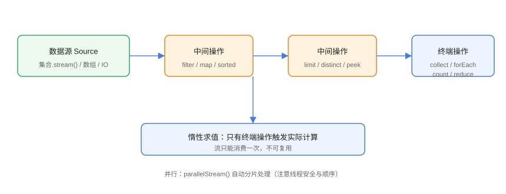

# Stream 基础：创建与流水线

Stream（流）是对集合/数组/IO 等数据源的一种**声明式处理视图**：把「过滤、转换、排序、汇总」等操作串成一条流水线（pipeline），代码关注「要什么」而不是「怎么做」。它不存储数据，只在终端操作触发时惰性计算。

## 流水线结构



```text
数据源（source）→ 0..n 个中间操作 → 1 个终端操作
```

- **数据源**：`Collection.stream()`、数组、`Stream.of`、文件行、随机数等；
- **中间操作**：`filter`、`map`、`sorted`、`limit`、`distinct` 等，惰性、可链式；
- **终端操作**：`collect`、`forEach`、`count`、`reduce` 等，触发计算并结束流。

## 创建 Stream

```java
// StreamBasic/CreateStreamDemo.java
import java.util.Arrays;
import java.util.List;
import java.util.stream.IntStream;
import java.util.stream.Stream;

public class CreateStreamDemo {
    public static void main(String[] args) {
        // 1. 集合
        List<String> list = List.of("a", "b", "c");
        Stream<String> fromList = list.stream();

        // 2. 数组
        String[] array = {"x", "y", "z"};
        Stream<String> fromArray = Arrays.stream(array);

        // 3. 直接构造
        Stream<Integer> of = Stream.of(1, 2, 3);

        // 4. 基本类型流
        IntStream ints = IntStream.range(1, 5);        // 1..4
        IntStream closed = IntStream.rangeClosed(1, 5); // 1..5

        // 5. 无限流 + 截断
        Stream<Double> random = Stream.generate(Math::random).limit(3);
        Stream<Integer> evens = Stream.iterate(0, n -> n + 2).limit(5);

        System.out.println("range: " + ints.sum());
        System.out.println("rangeClosed count: " + closed.count());
        evens.forEach(n -> System.out.print(n + " "));
    }
}
```

预期输出：

```text
range: 10
rangeClosed count: 5
0 2 4 6 8 
```

::: danger 无限流必须截断
`Stream.generate` / `Stream.iterate` 是无界流，**必须配合 `limit()` 再取终端操作**，否则程序不会终止。
:::

## 中间操作

### filter：过滤

```java
// StreamBasic/FilterMapDemo.java
import java.util.List;

public class FilterMapDemo {
    public static void main(String[] args) {
        List<String> names = List.of("Alice", "Bob", "Charlie", "David");

        List<String> longNames = names.stream()
                .filter(name -> name.length() > 4)
                .toList();                    // Java 16+ 简洁写法

        List<String> upper = names.stream()
                .map(String::toUpperCase)
                .toList();

        System.out.println("长度>4: " + longNames);
        System.out.println("大写: " + upper);
    }
}
```

预期输出：

```text
长度>4: [Alice, Charlie, David]
大写: [ALICE, BOB, CHARLIE, DAVID]
```

### map 与 flatMap

```java
// StreamBasic/FlatMapDemo.java
import java.util.List;
import java.util.stream.Stream;

public class FlatMapDemo {
    public static void main(String[] args) {
        List<List<String>> nested = List.of(
                List.of("a", "b"),
                List.of("c", "d"));

        // map 保持嵌套
        Stream<List<String>> mapped = nested.stream().map(list -> list);

        // flatMap 打平为一层
        List<String> flat = nested.stream()
                .flatMap(List::stream)
                .toList();
        System.out.println("flatMap 结果: " + flat);

        // 应用：单词拆字母
        List<String> words = List.of("hello", "world");
        List<String> chars = words.stream()
                .flatMap(w -> w.chars().mapToObj(c -> (char) c + ""))
                .distinct()
                .toList();
        System.out.println("去重字符: " + chars);
    }
}
```

::: tip flatMap 什么时候用
当 `map` 的结果是一个**集合/流**，而你又想要其中每个元素继续处理时，用 `flatMap` 打平，避免「流的流的流」。
:::

### distinct / sorted / limit / skip / peek

```java
// StreamBasic/IntermediateOpsDemo.java
import java.util.List;

public class IntermediateOpsDemo {
    public static void main(String[] args) {
        List<Integer> numbers = List.of(3, 1, 4, 1, 5, 9, 2, 6);

        List<Integer> result = numbers.stream()
                .distinct()                    // 去重
                .sorted()                      // 升序
                .skip(1)                       // 跳过第一个
                .limit(4)                      // 保留 4 个
                .toList();
        System.out.println("处理结果: " + result);

        // peek 用于调试（不改变元素）
        List<Integer> traced = numbers.stream()
                .peek(n -> System.out.print(n + "→"))
                .filter(n -> n % 2 == 0)
                .toList();
        System.out.println("\n偶数: " + traced);
    }
}
```

预期输出：

```text
处理结果: [2, 3, 4, 5]
3→1→4→1→5→9→2→6→
偶数: [4, 2]
```

::: warning peek 不要用于副作用
`peek` 主要用于调试观察，官方文档不鼓励在其中做业务副作用；需要处理副作用用 `forEach`（终端操作）。
:::

## 终端操作

```java
// StreamBasic/TerminalOpsDemo.java
import java.util.List;
import java.util.Optional;

public class TerminalOpsDemo {
    public static void main(String[] args) {
        List<Integer> nums = List.of(3, 7, 2, 9, 5);

        long count = nums.stream().count();
        int sum = nums.stream().mapToInt(Integer::intValue).sum();
        Optional<Integer> max = nums.stream().max(Integer::compareTo);
        Optional<Integer> first = nums.stream().filter(n -> n > 4).findFirst();
        boolean anyBig = nums.stream().anyMatch(n -> n > 8);

        System.out.println("count=" + count + " sum=" + sum);
        System.out.println("max=" + max.orElse(-1));
        System.out.println("first>4=" + first.orElse(-1));
        System.out.println("any>8=" + anyBig);

        // forEach 遍历
        nums.forEach(System.out::print);
    }
}
```

预期输出：

```text
count=5 sum=26
max=9
first>4=7
any>8=true
37529
```

## 易错点与最佳实践

::: danger 常见坑
1. **没有终端操作流不执行**：只有 `collect`/`forEach` 等才触发计算，只写中间操作等于没写。
2. **流不可复用**：一个 Stream 终端操作后即关闭，再次使用抛 `IllegalStateException`。
3. **无限流不 `limit`**：程序死循环。
4. **`toList()` 返回不可变 List**（Java 16+）：需要可变集合用 `collect(Collectors.toList())` 或 `toCollection(ArrayList::new)`。
5. **并行流的副作用**：在 `peek`/`forEach` 中修改共享状态可能出问题，见进阶篇。
:::

::: tip 最佳实践
- 优先 `Stream.toList()`（Java 16+），语义清晰且不可变安全。
- 用 `mapToInt` / `mapToLong` / `mapToDouble` 做数值统计，避免装箱。
- 链式操作保持单一职责：filter → map → 终端，避免一行写十几个操作。
:::

## 验证方式

```shell
javac CreateStreamDemo.java FilterMapDemo.java IntermediateOpsDemo.java
java CreateStreamDemo
java FilterMapDemo
java IntermediateOpsDemo
```

预期：各示例输出与文中一致。尝试对同一个 `Stream` 调用两次 `count()`，确认 `IllegalStateException`。

## 参考资料

- [Stream API 文档](https://docs.oracle.com/en/java/javase/25/docs/api/java.base/java/util/stream/Stream.html)
- [Oracle Stream 教程](https://docs.oracle.com/javase/tutorial/collections/streams/index.html)
- [JEP 461：Stream Gatherers（预览）](https://openjdk.org/jeps/461)
