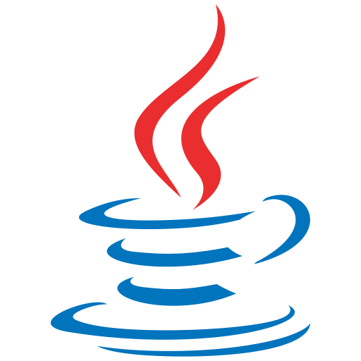

# Java 函数式编程

函数式编程（Functional Programming）强调**用表达式描述计算**而不是用语句描述步骤。Java 8 引入 Lambda、Stream、Optional 与方法引用后，Java 具备了完整的函数式编程能力，让集合处理、空值处理与并行计算代码更简洁、更易读。

本专题默认基于 **Java 25 LTS**，涉及版本差异（如 `Stream.toList` 自 Java 16、Gatherers 自 Java 24 预览）时在文中标注。

- [Lambda 表达式](Lambda/index.md)
- [函数式接口与方法引用](FunctionalInterface/index.md)
- [Stream 基础：创建与流水线](StreamBasic/index.md)
- [Stream 进阶：映射、归约与并行](StreamAdvanced/index.md)
- [Optional：优雅处理空值](Optional/index.md)
- [Collectors 收集器详解](Collectors/index.md)
- [实战：订单统计与数据处理](Practice/index.md)
- [常见问题与最佳实践](FAQ/index.md)
