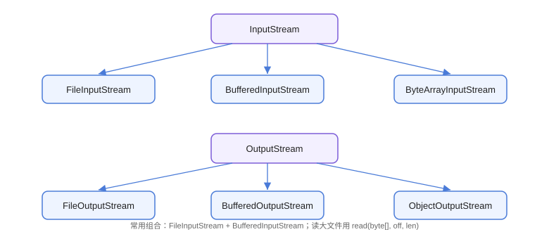

# 字节流：InputStream 与 OutputStream

字节流是 Java IO 的最底层抽象，以**字节（byte）**为单位读写数据，适合处理图片、音视频、压缩包等二进制文件，也可以读写文本（需自行处理编码）。所有字节流都继承自 `InputStream`（输入）和 `OutputStream`（输出）。

## 类层次



| 分类 | 类 | 用途 |
| --- | --- | --- |
| 文件 | `FileInputStream` / `FileOutputStream` | 读写文件字节 |
| 缓冲 | `BufferedInputStream` / `BufferedOutputStream` | 为流增加缓冲，减少系统调用 |
| 内存 | `ByteArrayInputStream` / `ByteArrayOutputStream` | 以字节数组为数据源/目标 |
| 对象 | `ObjectInputStream` / `ObjectOutputStream` | 对象序列化与反序列化 |
| 管道 | `PipedInputStream` / `PipedOutputStream` | 线程间传输字节 |

## 基础读写

### 逐字节读取（不推荐）

```java
// ByteStream/ReadSingleByte.java
import java.io.FileInputStream;
import java.io.IOException;
import java.io.InputStream;

public class ReadSingleByte {
    public static void main(String[] args) {
        try (InputStream is = new FileInputStream("a.txt")) {
            int data;
            while ((data = is.read()) != -1) {
                System.out.print((char) data);
            }
        } catch (IOException e) {
            e.printStackTrace();
        }
    }
}
```

::: danger 性能陷阱
`read()` 每次只读 1 个字节，会产生海量系统调用，性能极差。**生产代码必须使用 `read(byte[], off, len)` 批量读取**或 `BufferedInputStream`。
:::

### 批量读取与写入（推荐）

```java
// ByteStream/CopyFile.java
import java.io.FileInputStream;
import java.io.FileOutputStream;
import java.io.IOException;
import java.io.InputStream;
import java.io.OutputStream;

public class CopyFile {
    public static void main(String[] args) {
        String src = "source.dat";
        String dst = "dest.dat";

        try (InputStream is = new FileInputStream(src);
             OutputStream os = new FileOutputStream(dst)) {
            byte[] buffer = new byte[8192];   // 8KB 缓冲区
            int len;
            while ((len = is.read(buffer)) != -1) {
                os.write(buffer, 0, len);
            }
            System.out.println("复制完成：" + src + " → " + dst);
        } catch (IOException e) {
            e.printStackTrace();
        }
    }
}
```

预期输出：`复制完成：source.dat → dest.dat`，且 `dest.dat` 与源文件字节数一致。

## 缓冲流

`BufferedInputStream` / `BufferedOutputStream` 内部维护一个缓冲区（默认 8KB），把多次小读写合并为批量系统调用。

```java
// ByteStream/BufferedCopy.java
import java.io.BufferedInputStream;
import java.io.BufferedOutputStream;
import java.io.FileInputStream;
import java.io.FileOutputStream;
import java.io.IOException;

public class BufferedCopy {
    public static void main(String[] args) throws IOException {
        long start = System.currentTimeMillis();

        try (BufferedInputStream bis =
                 new BufferedInputStream(new FileInputStream("big.dat"), 64 * 1024);
             BufferedOutputStream bos =
                 new BufferedOutputStream(new FileOutputStream("big_copy.dat"), 64 * 1024)) {

            byte[] buffer = new byte[64 * 1024];
            int len;
            while ((len = bis.read(buffer)) != -1) {
                bos.write(buffer, 0, len);
            }
        }

        System.out.println("耗时：" + (System.currentTimeMillis() - start) + " ms");
    }
}
```

::: tip 缓冲大小
缓冲区常用 8KB～64KB，过小（如 1KB）性能差，过大（如 10MB）收益不再明显。也可以依赖默认 8KB，代码更简洁。
:::

## 对象序列化

`ObjectOutputStream` 可以把实现了 `Serializable` 接口的对象写入文件，`ObjectInputStream` 再读回来。

```java
// ByteStream/ObjectStreamDemo.java
import java.io.FileInputStream;
import java.io.FileOutputStream;
import java.io.IOException;
import java.io.ObjectInputStream;
import java.io.ObjectOutputStream;
import java.io.Serializable;

public class ObjectStreamDemo {
    public static void main(String[] args) {
        String file = "user.dat";

        User user = new User("张三", 25, "zhangsan@example.com");
        try (ObjectOutputStream oos =
                 new ObjectOutputStream(new FileOutputStream(file))) {
            oos.writeObject(user);
            System.out.println("序列化完成");
        } catch (IOException e) {
            e.printStackTrace();
        }

        try (ObjectInputStream ois =
                 new ObjectInputStream(new FileInputStream(file))) {
            User restored = (User) ois.readObject();
            System.out.println("反序列化：" + restored);
        } catch (IOException | ClassNotFoundException e) {
            e.printStackTrace();
        }
    }
}

class User implements Serializable {
    private static final long serialVersionUID = 1L;

    private String name;
    private transient int age;   // transient 字段不参与序列化
    private String email;

    public User(String name, int age, String email) {
        this.name = name;
        this.age = age;
        this.email = email;
    }

    @Override
    public String toString() {
        return "User{name='" + name + "', age=" + age + ", email='" + email + "'}";
    }
}
```

预期输出：

```text
序列化完成
反序列化：User{name='张三', age=0, email='zhangsan@example.com'}
```

注意 `age` 因为 `transient` 没有序列化，读回来是默认值 0。

::: danger 序列化安全
1. `serialVersionUID` 不写会导致类结构变化后反序列化抛 `InvalidClassException`，务必显式声明。
2. `readObject` 可能触发任意代码执行（反序列化漏洞），**不要反序列化不可信数据**；现代应用优先用 JSON（Jackson/Gson）替代 Java 原生序列化。
3. 序列化敏感字段（密码、Token）要加 `transient`，防止落盘泄露。
:::

## 易错点与最佳实践

::: danger 常见坑
1. **用完不关流**：忘记关闭会泄漏文件句柄；用 try-with-resources 自动关闭。
2. **字节流读文本乱码**：字节流不处理编码，读中文必须转 `String` 时指定 `Charset`，或用字符流。
3. **`write` 后不 `flush`**：`BufferedOutputStream` 的数据在缓冲区，不 flush 可能导致数据未落盘（close 会自动 flush，但中途需要即时可见时要手动 flush）。
4. **`available()` 不等于文件大小**：它只表示「不阻塞可读的字节数」，不要用它当缓冲区大小依据。
:::

::: tip 最佳实践
- 复制文件首选 `Files.copy` 或 NIO `transferTo`，性能优于手写循环。
- 需要「边读边处理」时用 `read(byte[], off, len)` 循环；需要全量小数据时用 `readAllBytes()`。
- 字节流和字符流之间用 `InputStreamReader` / `OutputStreamWriter` 桥接并显式指定编码。
:::

## 验证方式

```shell
echo "hello" > source.dat
javac CopyFile.java
java CopyFile
fc /b source.dat dest.dat    # Windows 比对字节，输出一致无差异
```

运行 `BufferedCopy` 与 `ObjectStreamDemo`，确认耗时输出正常、对象字段按预期还原（`transient` 字段为默认值）。

## 参考资料

- [Java InputStream API 文档](https://docs.oracle.com/en/java/javase/25/docs/api/java.base/java/io/InputStream.html)
- [Java OutputStream API 文档](https://docs.oracle.com/en/java/javase/25/docs/api/java.base/java/io/OutputStream.html)
- [Oracle Java 教程：字节流](https://docs.oracle.com/javase/tutorial/essential/io/bytestreams.html)
