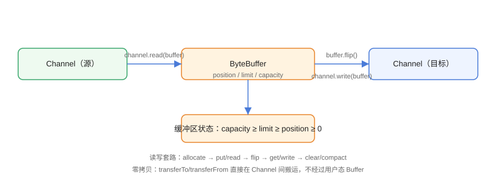

# Channel 与 Buffer 详解

Channel（通道）与 Buffer（缓冲区）是 NIO 的两块基石：通道负责与数据源（文件、网络）交互，缓冲区负责暂存数据。理解 Buffer 的 `position / limit / capacity` 状态机与通道的读写套路，是掌握 NIO 的关键。

## 读写数据流



标准流程：

1. `ByteBuffer.allocate(size)` 分配缓冲区；
2. `put(...)` 或 `channel.read(buffer)` 向缓冲区填数据；
3. `flip()` 把写模式切换为读模式（`limit = position`，`position = 0`）；
4. `get(...)` 或 `channel.write(buffer)` 消费数据；
5. `clear()` 或 `compact()` 复位，准备下一轮。

## Buffer 状态模型

三个游标的关系：`0 ≤ position ≤ limit ≤ capacity`

| 操作 | position | limit | 说明 |
| --- | --- | --- | --- |
| `allocate(100)` | 0 | 100 | 初始化 |
| `put` 写入 20 字节 | 20 | 100 | 写模式 |
| `flip()` | 0 | 20 | 切到读模式，limit 锁住有效数据 |
| `get` 读取 20 字节 | 20 | 20 | 读模式 |
| `clear()` | 0 | 100 | 复位，准备重新写 |
| `compact()` | 20 | 100 | 保留未读数据，移到头部 |

::: danger flip 之前先理解模式
`flip()` 只在「写 → 读」切换时调用一次；读完想再次写入必须 `clear()` 或 `compact()`。**少一次 flip 读空数据，少一次 clear 读脏数据**。
:::

## FileChannel 实战

### 零拷贝传输

```java
// ChannelBuffer/ZeroCopyDemo.java
import java.io.IOException;
import java.nio.channels.FileChannel;
import java.nio.file.Path;
import java.nio.file.StandardOpenOption;

public class ZeroCopyDemo {
    public static void main(String[] args) throws IOException {
        Path src = Path.of("src.bin");
        Path dst = Path.of("dst.bin");

        // 生成 100MB 测试文件
        try (FileChannel out = FileChannel.open(src,
                StandardOpenOption.CREATE, StandardOpenOption.WRITE)) {
            java.nio.ByteBuffer buf = java.nio.ByteBuffer.allocate(1024 * 1024);
            for (int i = 0; i < 100; i++) {
                buf.clear();
                while (buf.hasRemaining()) out.write(buf);
            }
        }

        // 零拷贝：内核态直接搬运，不经过用户内存
        long start = System.currentTimeMillis();
        try (FileChannel in = FileChannel.open(src, StandardOpenOption.READ);
             FileChannel out = FileChannel.open(dst,
                     StandardOpenOption.CREATE, StandardOpenOption.WRITE)) {
            in.transferTo(0, in.size(), out);
        }
        System.out.println("transferTo 复制 100MB 耗时：" +
                (System.currentTimeMillis() - start) + " ms");

        System.out.println("大小一致：" +
                (java.nio.file.Files.size(src) == java.nio.file.Files.size(dst)));

        java.nio.file.Files.deleteIfExists(src);
        java.nio.file.Files.deleteIfExists(dst);
    }
}
```

`transferTo` / `transferFrom` 在 Linux 上基于 `sendfile` 系统调用，数据在内核态直接拷贝，不经过用户态 Buffer，是文件复制性能上限最高的方案。

### 堆内缓冲区与直接缓冲区

```java
// ChannelBuffer/BufferTypeDemo.java
import java.nio.ByteBuffer;

public class BufferTypeDemo {
    public static void main(String[] args) {
        // 堆内缓冲区：JVM 管理，分配快，读写需要拷贝到内核
        ByteBuffer heap = ByteBuffer.allocate(1024);

        // 直接缓冲区：堆外内存，分配慢，但 IO 时少一次拷贝
        ByteBuffer direct = ByteBuffer.allocateDirect(1024);

        System.out.println("heap 是否直接：" + heap.isDirect());
        System.out.println("direct 是否直接：" + direct.isDirect());
    }
}
```

::: tip 直接缓冲区怎么选
直接缓冲区减少一次「用户态 → 内核态」拷贝，适合**长生命周期、频繁 IO 的缓冲**（如网络框架的读写缓冲池）；短生命周期的临时缓冲用堆内即可，因为 `allocateDirect` 本身分配成本高。
:::

## SocketChannel 基础

```java
// ChannelBuffer/EchoClient.java
import java.io.IOException;
import java.net.InetSocketAddress;
import java.nio.ByteBuffer;
import java.nio.channels.SocketChannel;

public class EchoClient {
    public static void main(String[] args) throws IOException {
        try (SocketChannel channel = SocketChannel.open()) {
            channel.connect(new InetSocketAddress("127.0.0.1", 8888));

            ByteBuffer buffer = ByteBuffer.allocate(1024);
            buffer.put("hello echo server".getBytes());
            buffer.flip();
            channel.write(buffer);

            buffer.clear();
            channel.read(buffer);
            buffer.flip();
            byte[] bytes = new byte[buffer.remaining()];
            buffer.get(bytes);
            System.out.println("服务端回显：" + new String(bytes));
        }
    }
}
```

配套服务端在 [实战：NIO 文件传输服务器](../Practice/index.md) 中给出完整实现。

::: danger 网络通道读不完整
`channel.read(buffer)` 一次未必读满一个「消息」，网络 IO 必须循环读取并处理**半包/粘包**问题，见 [网络 IO 模型](../NetworkIO/index.md) 与 FAQ。
:::

## 易错点与最佳实践

::: danger 常见坑
1. **Buffer 复用不重置**：复用前必须 `clear()` 或 `compact()`，否则 position 停在原地，读到旧数据。
2. **`flip()` 调用时机**：只在写完切读时调用；连续两次 flip 会把 limit 变小导致丢数据。
3. **读数据超出 Buffer 容量**：先 `remaining()` 判断，再扩容或分片。
4. **通道在循环里频繁开关**：每次 open 都有系统调用开销，长连接应复用通道。
5. **`ByteBuffer` 转 `String` 忘记 `flip()`**：`buffer.array()` 会包含未写入的尾部空字节，务必用 `position` 到 `limit` 区间。
:::

::: tip 最佳实践
- 文件复制 → `transferTo`；需要读内容 → 按块循环 `read(buffer)`。
- 网络读写 → 分配可复用的直接缓冲区池，避免每次新建。
- 需要随机访问文件 → `FileChannel.position(long)` + `read(buffer, position)`。
:::

## 验证方式

```shell
javac ZeroCopyDemo.java
java ZeroCopyDemo
```

预期：输出 `transferTo 复制 100MB 耗时：xx ms`（通常几十毫秒级）且 `大小一致：true`。再运行 `BufferTypeDemo` 确认两种缓冲区类型判断正确。

## 参考资料

- [ByteBuffer API 文档](https://docs.oracle.com/en/java/javase/25/docs/api/java.base/java/nio/ByteBuffer.html)
- [FileChannel API 文档](https://docs.oracle.com/en/java/javase/25/docs/api/java.base/java/nio/channels/FileChannel.html)
- [SocketChannel API 文档](https://docs.oracle.com/en/java/javase/25/docs/api/java.base/java/nio/channels/SocketChannel.html)
