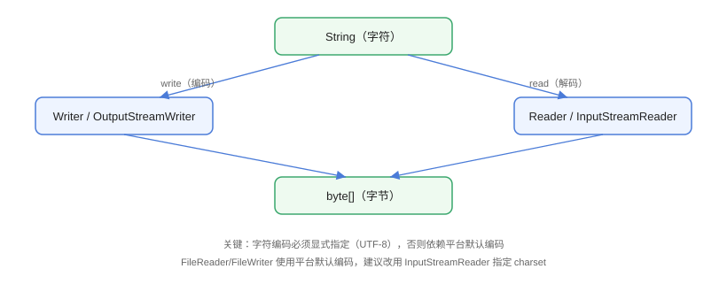

# 字符流：Reader 与 Writer

字符流以**字符（char）**为单位读写数据，自动完成字符与字节之间的编解码，适合处理文本文件、日志、配置文件等。字符流基类是 `Reader`（输入）和 `Writer`（输出），核心实现通过 `InputStreamReader` / `OutputStreamWriter` 桥接到字节流。

## 编解码原理



写入时：`String` → 按 `Charset` 编码 → `byte[]` → 落盘；
读取时：`byte[]` → 按 `Charset` 解码 → `char[]` / `String`。

::: warning 编码是字符流的灵魂
同一个文本用 UTF-8 与 GBK 编码，字节完全不同。**读写必须指定同一编码**，否则必然乱码。现代项目统一使用 UTF-8。
:::

## 常用类速查

| 类 | 说明 |
| --- | --- |
| `InputStreamReader` | 字节输入流 → 字符输入流，可指定 `Charset` |
| `OutputStreamWriter` | 字符输出流 → 字节输出流，可指定 `Charset` |
| `FileReader` / `FileWriter` | 便捷类，但**编码不可控**（JDK 18 前使用平台默认编码） |
| `BufferedReader` / `BufferedWriter` | 缓冲 + `readLine` / `newLine`，最常用组合 |
| `StringReader` / `StringWriter` | 以字符串为数据源/目标的字符流 |
| `PrintWriter` | 便捷输出，`println` 全家桶 |

## 基本用法

### 指定编码的读写（推荐）

```java
// CharacterStream/EncodingReadWrite.java
import java.io.BufferedReader;
import java.io.BufferedWriter;
import java.io.IOException;
import java.nio.charset.StandardCharsets;
import java.nio.file.Files;
import java.nio.file.Path;

public class EncodingReadWrite {
    public static void main(String[] args) throws IOException {
        Path file = Path.of("utf8.txt");

        // 写入：显式指定 UTF-8
        try (BufferedWriter writer = Files.newBufferedWriter(file, StandardCharsets.UTF_8)) {
            writer.write("你好，世界");
            writer.newLine();
            writer.write("第二行");
        }

        // 读取：同样显式指定 UTF-8
        try (BufferedReader reader = Files.newBufferedReader(file, StandardCharsets.UTF_8)) {
            String line;
            while ((line = reader.readLine()) != null) {
                System.out.println(line);
            }
        }

        Files.deleteIfExists(file);
    }
}
```

预期输出：

```text
你好，世界
第二行
```

### 桥接流：InputStreamReader / OutputStreamWriter

当数据源是 `InputStream`（如网络流、字节流包装的文件）时，用桥接流转成字符流：

```java
// CharacterStream/BridgeStreamDemo.java
import java.io.FileInputStream;
import java.io.FileOutputStream;
import java.io.IOException;
import java.io.InputStreamReader;
import java.io.OutputStreamWriter;
import java.nio.charset.StandardCharsets;

public class BridgeStreamDemo {
    public static void main(String[] args) throws IOException {
        try (OutputStreamWriter osw =
                 new OutputStreamWriter(new FileOutputStream("bridge.txt"),
                                        StandardCharsets.UTF_8)) {
            osw.write("通过桥接流写入中文");
        }

        try (InputStreamReader isr =
                 new InputStreamReader(new FileInputStream("bridge.txt"),
                                       StandardCharsets.UTF_8)) {
            int ch;
            while ((ch = isr.read()) != -1) {
                System.out.print((char) ch);
            }
        }

        new java.io.File("bridge.txt").delete();
    }
}
```

### 逐行处理大文件

```java
// CharacterStream/ReadLineLarge.java
import java.io.BufferedReader;
import java.io.IOException;
import java.nio.charset.StandardCharsets;
import java.nio.file.Files;
import java.nio.file.Path;

public class ReadLineLarge {
    public static void main(String[] args) throws IOException {
        Path file = Path.of("access.log");

        // 生成 100 万行测试数据
        try (var writer = Files.newBufferedWriter(file, StandardCharsets.UTF_8)) {
            for (int i = 0; i < 1_000_000; i++) {
                writer.write("2026-08-29 10:00:0" + (i % 10) + " GET /api/user " + i);
                writer.newLine();
            }
        }

        // 逐行读取，内存占用稳定
        long count = 0;
        long start = System.currentTimeMillis();
        try (BufferedReader reader = Files.newBufferedReader(file, StandardCharsets.UTF_8)) {
            String line;
            while ((line = reader.readLine()) != null) {
                count++;
            }
        }
        System.out.println("读取 " + count + " 行，耗时 " +
                (System.currentTimeMillis() - start) + " ms");

        Files.deleteIfExists(file);
    }
}
```

::: tip 为什么 BufferedReader 适合大文件
`readLine` 只在内存中保留一行，配合内部缓冲（默认 8KB），无论文件多大，内存占用几乎不变，是日志、大数据文本处理的标配。
:::

## FileReader / FileWriter 的坑

```java
// CharacterStream/FileReaderPitfall.java
import java.io.FileReader;
import java.io.IOException;

public class FileReaderPitfall {
    public static void main(String[] args) throws IOException {
        // FileReader 使用平台默认编码：Windows 下可能是 GBK
        // 读取 UTF-8 文件时会乱码
        try (FileReader reader = new FileReader("utf8_file.txt")) {
            int ch;
            while ((ch = reader.read()) != -1) {
                System.out.print((char) ch);
            }
        }
    }
}
```

::: danger 不要在生产用 FileReader/FileWriter
JDK 18 之前它们使用平台默认编码，Windows（GBK）与 Linux（UTF-8）行为不一致，跨平台必踩坑。**统一用 `Files.newBufferedReader/Writer(path, StandardCharsets.UTF_8)` 或 `InputStreamReader/OutputStreamWriter` 显式指定编码**。
:::

## 易错点与最佳实践

::: danger 常见坑
1. **编码不一致**：写入 UTF-8、读取 GBK，或反之，必然乱码；编码必须全局统一并显式指定。
2. **`readLine()` 返回 null 才结束**：判断条件写成 `!= null`，不要在循环里重复调用 `readLine()` 导致跳行。
3. **字符流写中文用错缓冲区**：`char[]` 缓冲区的大小是字符数，不是字节数，中文占 1 个 char（代理对除外）。
4. **忘记 `flush`**：`BufferedWriter` 数据在缓冲区，需要即时可见时手动 `flush()`。
5. **用 `StringBuilder` 拼接超长文本**：逐行处理时用 `StringBuilder` 可能内存暴涨，直接流式写入目标。
:::

::: tip 最佳实践
- 文本文件优先 `Files.newBufferedReader` / `newBufferedWriter` + `StandardCharsets.UTF_8`。
- 需要格式化输出（`println`）用 `PrintWriter`，注意它吞异常（`checkError()` 才能感知）。
- Java 11+ 小文件直接 `Files.readString/writeString`，免去手工管理流。
:::

## 验证方式

```shell
javac EncodingReadWrite.java
java EncodingReadWrite
```

预期：输出 `你好，世界` 与 `第二行`，无乱码。再用十六进制工具（如 `xxd utf8.txt`）确认文件以 `E4 BD A0`（"你" 的 UTF-8 编码）开头。

## 参考资料

- [Java Reader API 文档](https://docs.oracle.com/en/java/javase/25/docs/api/java.base/java/io/Reader.html)
- [Java Writer API 文档](https://docs.oracle.com/en/java/javase/25/docs/api/java.base/java/io/Writer.html)
- [Oracle Java 教程：字符流与编码](https://docs.oracle.com/javase/tutorial/essential/io/charstreams.html)
