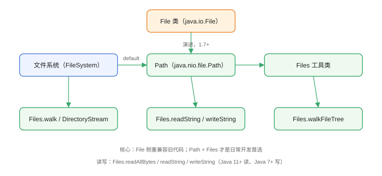

# 文件 IO：File 与 Path/Files

文件 IO 是程序与磁盘数据交互的基础操作，包括创建、读取、写入、复制、移动、删除和遍历。Java 提供两套 API：老牌 `java.io.File` 与 Java 7 引入的 `java.nio.file.Path` + `Files`（常称 NIO.2）。日常开发首选后者，它更简洁、更安全、功能更全。

## 两套 API 的关系

`File` 与 `Path` 都是「文件路径的抽象」，`Files` 是围绕 `Path` 的静态工具类，封装了绝大多数文件操作。两者关系如下图：



| 能力 | java.io.File | java.nio.file.Path + Files |
| --- | --- | --- |
| 引入版本 | JDK 1.0 | JDK 7（NIO.2） |
| 路径表示 | 字符串语义 | 平台无关的 Path 对象 |
| 文件读写 | 不支持（需配合流） | `Files.readAllBytes` / `readString` / `writeString` |
| 目录遍历 | `listFiles` 递归麻烦 | `Files.walk` / `walkFileTree` |
| 属性访问 | 方法少且部分不跨平台 | `Files.readAttributes` 统一模型 |
| 符号链接 | 支持有限 | 完整支持 |
| 文件监听 | 不支持 | `WatchService` |

::: tip 一句话理解
`File` 是老代码兼容层；新代码一律用 `Path` + `Files`，两者可互转：`path.toFile()` 与 `file.toPath()`。
:::

## Path 的创建与常用方法

### 创建 Path

```java
// FileIO/PathDemo.java
import java.nio.file.Path;
import java.nio.file.Paths;

public class PathDemo {
    public static void main(String[] args) {
        // 方式一：Paths.get（Java 7+）
        Path p1 = Paths.get("D:/data", "logs", "app.log");
        // 方式二：Path.of（Java 11+，推荐）
        Path p2 = Path.of("D:/data", "logs", "app.log");
        // 方式三：URI
        Path p3 = Path.of("file:///D:/data/logs/app.log");

        System.out.println("p1 是否等于 p2：" + p1.equals(p2));
        System.out.println("文件系统：" + p1.getFileSystem());

        // 常用信息
        System.out.println("文件名：" + p1.getFileName());
        System.out.println("父路径：" + p1.getParent());
        System.out.println("根路径：" + p1.getRoot());
        System.out.println("路径元素数：" + p1.getNameCount());
        System.out.println("绝对路径：" + p1.toAbsolutePath());
        System.out.println("标准化：" + p1.normalize());
    }
}
```

预期输出（Windows）：

```text
p1 是否等于 p2：true
文件系统：sun.nio.fs.WindowsFileSystem@xxx
文件名：app.log
父路径：D:\data\logs
根路径：D:\
路径元素数：3
绝对路径：D:\data\logs\app.log
标准化：D:\data\logs\app.log
```

### Path 常用方法速查

| 方法 | 作用 |
| --- | --- |
| `resolve(String)` | 在当前路径下拼接子路径 |
| `resolveSibling(String)` | 替换最后一个元素并拼接 |
| `normalize()` | 去除 `.` 和 `..`，标准化路径 |
| `relativize(Path)` | 计算两个路径的相对关系 |
| `startsWith` / `endsWith` | 判断路径前缀/后缀 |
| `toAbsolutePath()` | 转为绝对路径 |

## Files 核心操作

### 读写文件

```java
// FileIO/FilesReadWriteDemo.java
import java.io.IOException;
import java.nio.charset.StandardCharsets;
import java.nio.file.Files;
import java.nio.file.Path;
import java.nio.file.StandardOpenOption;
import java.util.List;

public class FilesReadWriteDemo {
    public static void main(String[] args) throws IOException {
        Path file = Path.of("demo.txt");

        // 写入字符串（Java 11+）
        Files.writeString(file, "第一行\n第二行\n", StandardCharsets.UTF_8);

        // 追加写入
        Files.writeString(file, "追加内容\n", StandardCharsets.UTF_8,
                StandardOpenOption.APPEND);

        // 按行写入
        Files.write(file, List.of("行 A", "行 B"), StandardCharsets.UTF_8);

        // 读取为字符串
        String content = Files.readString(file, StandardCharsets.UTF_8);
        System.out.println("读取内容：\n" + content);

        // 按行读取
        List<String> lines = Files.readAllLines(file, StandardCharsets.UTF_8);
        System.out.println("行数：" + lines.size());

        // 读取字节
        byte[] bytes = Files.readAllBytes(file);
        System.out.println("字节数：" + bytes.length);

        Files.deleteIfExists(file);
    }
}
```

::: warning 关于大文件
`readAllBytes` / `readString` 会把整个文件载入内存，只适合小文件。**大文件必须用流式读取**（`Files.newBufferedReader`、`Files.newInputStream`），否则容易 OOM。
:::

### 复制、移动与删除

```java
// FileIO/FilesCopyMoveDemo.java
import java.io.IOException;
import java.nio.file.Files;
import java.nio.file.Path;
import java.nio.file.StandardCopyOption;

public class FilesCopyMoveDemo {
    public static void main(String[] args) throws IOException {
        Path src = Path.of("src.txt");
        Path dst = Path.of("dst.txt");

        Files.writeString(src, "hello copy");

        // 复制：REPLACE_EXISTING 覆盖已存在目标
        Files.copy(src, dst, StandardCopyOption.REPLACE_EXISTING);

        // 移动/重命名
        Path moved = Path.of("moved.txt");
        Files.move(dst, moved, StandardCopyOption.REPLACE_EXISTING);

        // 判断与删除
        System.out.println("移动后存在：" + Files.exists(moved));
        Files.deleteIfExists(src);
        Files.deleteIfExists(moved);
    }
}
```

### 目录遍历

```java
// FileIO/DirectoryWalkDemo.java
import java.io.IOException;
import java.nio.file.Files;
import java.nio.file.Path;
import java.nio.file.attribute.BasicFileAttributes;
import java.util.stream.Stream;

public class DirectoryWalkDemo {
    public static void main(String[] args) throws IOException {
        Path dir = Path.of("sample");
        Files.createDirectories(dir.resolve("sub"));
        Files.writeString(dir.resolve("a.txt"), "a");
        Files.writeString(dir.resolve("sub/b.txt"), "b");

        // 浅层遍历（只读当前目录）
        System.out.println("=== 浅层 ===");
        try (var stream = Files.list(dir)) {
            stream.forEach(System.out::println);
        }

        // 递归遍历
        System.out.println("=== 递归 ===");
        try (Stream<Path> stream = Files.walk(dir)) {
            stream.forEach(System.out::println);
        }

        // 按类型过滤
        System.out.println("=== 仅 .txt 文件 ===");
        try (Stream<Path> stream = Files.walk(dir)) {
            stream.filter(Files::isRegularFile)
                  .filter(p -> p.toString().endsWith(".txt"))
                  .forEach(System.out::println);
        }

        // 删除目录树（先删子后删父）
        try (Stream<Path> stream = Files.walk(dir)) {
            stream.sorted(Comparator.reverseOrder())
                  .forEach(p -> {
                      try { Files.deleteIfExists(p); }
                      catch (IOException e) { throw new RuntimeException(e); }
                  });
        }
    }
}
```

::: danger 删除目录树的坑
`Files.delete` 只能删除**空目录**。递归删除必须先删除子文件再删父目录，最稳妥的写法是用 `Files.walk` + 逆序（先叶子后根），或者用 `walkFileTree` 的 `SimpleFileVisitor` 实现。
:::

## 文件属性

```java
// FileIO/FileAttributesDemo.java
import java.io.IOException;
import java.nio.file.Files;
import java.nio.file.Path;
import java.nio.file.attribute.BasicFileAttributes;
import java.nio.file.attribute.FileTime;

public class FileAttributesDemo {
    public static void main(String[] args) throws IOException {
        Path file = Path.of("attr.txt");
        Files.writeString(file, "test");

        // 读取基础属性（一次系统调用）
        BasicFileAttributes attrs = Files.readAttributes(file, BasicFileAttributes.class);
        System.out.println("大小：" + attrs.size());
        System.out.println("创建时间：" + attrs.creationTime());
        System.out.println("最后修改时间：" + attrs.lastModifiedTime());
        System.out.println("是否目录：" + attrs.isDirectory());
        System.out.println("是否符号链接：" + attrs.isSymbolicLink());

        // 修改时间
        Files.setLastModifiedTime(file, FileTime.fromMillis(System.currentTimeMillis()));

        Files.deleteIfExists(file);
    }
}
```

## 易错点与最佳实践

::: danger 常见坑
1. **路径分隔符硬编码**：Windows 用 `\`、Linux 用 `/`，不要拼字符串，用 `Path.of("a", "b")` 或 `File.separator`。
2. **默认编码陷阱**：`Files.readString` 不传 charset 时用 UTF-8（Java 18+ 已是默认），老 API `FileReader` 用平台默认编码，跨平台会乱码。
3. **忘记关闭流**：`Files.list` / `Files.walk` 返回的流必须关闭（try-with-resources），否则句柄泄漏。
4. **`Files.move` 跨文件系统**：可能抛 `AtomicMoveNotSupportedException` 或退化为复制+删除，跨盘移动要处理异常。
5. **符号链接递归遍历**：`Files.walk` 默认不跟随符号链接，避免死循环；需要跟随时注意环路风险。
:::

::: tip 最佳实践
- 文件内容小（< 10MB）→ `readString` / `writeString`；大文件 → `Files.newBufferedReader` 逐行或 `Files.newInputStream` 分块。
- 需要校验文件内容时，用 `Files.mismatch(path1, path2)`（Java 12+）快速判断两个文件是否一致，返回 -1 表示完全相同。
- 需要原子写入时：先写临时文件，再 `Files.move(..., ATOMIC_MOVE)` 覆盖目标，避免读到半截文件。
:::

## 验证方式

```shell
javac PathDemo.java
java PathDemo
```

预期：输出 Path 的解析信息、`p1.equals(p2)` 为 `true`。再运行 `FilesReadWriteDemo`，确认文件内容完整、控制台无异常。

## 参考资料

- [Oracle Java 教程：File I/O（NIO.2）](https://docs.oracle.com/javase/tutorial/essential/io/fileio.html)
- [Path 类 API 文档](https://docs.oracle.com/en/java/javase/25/docs/api/java.base/java/nio/file/Path.html)
- [Files 类 API 文档](https://docs.oracle.com/en/java/javase/25/docs/api/java.base/java/nio/file/Files.html)
