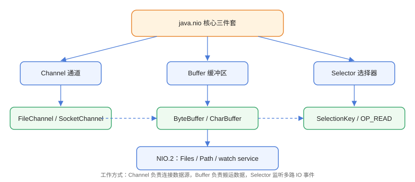

# NIO 核心概念

NIO（New IO，`java.nio` 包）是 Java 1.4 引入、Java 7 通过 NIO.2 大幅增强的 IO 体系。它抛弃了「流」的单向阻塞模型，改用**通道（Channel）+ 缓冲区（Buffer）+ 选择器（Selector）**三件套，并支持非阻塞、多路复用与文件系统增强 API，是高并发网络编程（Netty 等框架）的基础。

## 与传统 IO 的对比



| 维度 | 传统 IO（java.io） | NIO（java.nio） |
| --- | --- | --- |
| 数据载体 | 流（Stream）单向读写 | 通道（Channel）双向读写 |
| 数据缓冲 | 流内部隐式缓冲 | Buffer 显式管理（position/limit/capacity） |
| 阻塞性 | 阻塞 | 支持非阻塞（网络通道） |
| 多路复用 | 无，一连接一线程 | Selector 单线程管多连接 |
| 文件操作 | File + 流 | Path + Files（NIO.2） |
| 异步 | 无 | AIO（AsynchronousChannel，Java 7+） |

::: tip 一句话理解
传统 IO 像「水管」：数据一端流向另一端；NIO 像「仓库 + 传送带」：Channel 是传送带，Buffer 是仓库，Selector 是调度员。
:::

## 三大核心组件

### Channel 通道

通道是数据的传输载体，**双向**，可读可写。它不是流，更接近操作系统层面的描述符（fd）。

| 通道 | 用途 |
| --- | --- |
| `FileChannel` | 文件读写，支持零拷贝 `transferTo/transferFrom` |
| `SocketChannel` | TCP 客户端通道（非阻塞） |
| `ServerSocketChannel` | TCP 服务端监听通道 |
| `DatagramChannel` | UDP 数据报通道 |
| `AsynchronousFileChannel` 等 | AIO 异步通道（Java 7+） |

### Buffer 缓冲区

缓冲区是通道读写的「中转仓库」，本质是内存中的数组，通过 `position`（当前位置）、`limit`（可读写边界）、`capacity`（容量）三个游标管理状态。

常用 Buffer：

| Buffer | 元素类型 |
| --- | --- |
| `ByteBuffer` | byte（最常用） |
| `CharBuffer` | char |
| `IntBuffer` / `LongBuffer` / `FloatBuffer` / `DoubleBuffer` | 对应基本类型 |

### Selector 选择器

选择器实现**多路复用**：一个线程注册多个通道，通过 `select()` 监听就绪事件（可连接、可读、可写），有事件才处理，没有就阻塞等待。详见 [Selector 与多路复用](../Selector/index.md)。

## 一次 NIO 文件读写

```java
// NIO/FirstNioDemo.java
import java.io.IOException;
import java.nio.ByteBuffer;
import java.nio.channels.FileChannel;
import java.nio.file.Path;
import java.nio.file.StandardOpenOption;

public class FirstNioDemo {
    public static void main(String[] args) throws IOException {
        Path file = Path.of("nio-demo.txt");

        // 打开通道（写）
        try (FileChannel channel = FileChannel.open(file,
                StandardOpenOption.CREATE, StandardOpenOption.WRITE)) {

            // 1. 分配缓冲区并写入内容
            ByteBuffer buffer = ByteBuffer.allocate(64);
            buffer.put("Hello NIO".getBytes());

            // 2. flip：从写模式切换到读模式
            buffer.flip();

            // 3. 通道把缓冲区数据写到文件
            while (buffer.hasRemaining()) {
                channel.write(buffer);
            }
        }

        // 打开通道（读）
        try (FileChannel channel = FileChannel.open(file, StandardOpenOption.READ)) {
            ByteBuffer buffer = ByteBuffer.allocate(64);
            channel.read(buffer);

            buffer.flip();
            byte[] bytes = new byte[buffer.remaining()];
            buffer.get(bytes);
            System.out.println("读到的内容：" + new String(bytes));
        }

        java.nio.file.Files.deleteIfExists(file);
    }
}
```

预期输出：`读到的内容：Hello NIO`

关键点：

1. `allocate(64)` 分配堆内缓冲区；
2. `put` 写入数据后 `flip()`，把 `position` 归零、`limit` 设为写入长度；
3. `channel.write(buffer)` 把 `position` 到 `limit` 的数据写出；
4. 读取时同样 `read(buffer)` 再 `flip()` 后消费。

## NIO.2 增强

Java 7 的 NIO.2 大幅强化了文件系统能力：

| 能力 | API |
| --- | --- |
| 路径与文件操作 | `Path` / `Files`（详见 [文件 IO](../FileIO/index.md)） |
| 文件属性 | `Files.readAttributes`、`Files.getFileStore` |
| 目录监控 | `WatchService`（监听新增/修改/删除事件） |
| 符号链接 | `Files.createSymbolicLink` / `readSymbolicLink` |
| 异步 IO | `AsynchronousFileChannel` / `AsynchronousSocketChannel` |
| 文件系统提供者 | `FileSystemProvider` SPI |

### WatchService 示例

```java
// NIO/WatchDirDemo.java
import java.io.IOException;
import java.nio.file.*;

public class WatchDirDemo {
    public static void main(String[] args) throws IOException, InterruptedException {
        Path dir = Path.of("watch-dir");
        Files.createDirectories(dir);

        WatchService watchService = FileSystems.getDefault().newWatchService();
        dir.register(watchService,
                StandardWatchEventKinds.ENTRY_CREATE,
                StandardWatchEventKinds.ENTRY_MODIFY,
                StandardWatchEventKinds.ENTRY_DELETE);

        System.out.println("监听目录：" + dir.toAbsolutePath());

        // 另起线程创建文件模拟事件
        Thread t = new Thread(() -> {
            try {
                Thread.sleep(1000);
                Files.writeString(dir.resolve("new.txt"), "hello");
                Thread.sleep(500);
                Files.deleteIfExists(dir.resolve("new.txt"));
            } catch (Exception e) {
                e.printStackTrace();
            }
        });
        t.start();

        // 阻塞等待事件
        WatchKey key;
        while ((key = watchService.take()) != null) {
            for (WatchEvent<?> event : key.pollEvents()) {
                System.out.println("事件类型：" + event.kind() +
                        "，文件：" + event.context());
            }
            key.reset();
        }
    }
}
```

预期输出（顺序可能略有差异）：

```text
监听目录：D:\...\watch-dir
事件类型：ENTRY_CREATE，文件：new.txt
事件类型：ENTRY_DELETE，文件：new.txt
```

## 易错点与最佳实践

::: danger 常见坑
1. **忘记 `flip()`**：写完直接读会读到 position 之后的无意义数据；读完全部内容后还需 `clear()` 或 `compact()` 才能复用缓冲区。
2. **通道未设置非阻塞**：`SocketChannel` 默认阻塞，必须 `configureBlocking(false)` 才能注册到 Selector。
3. **`FileChannel` 与 Selector 不兼容**：文件通道不支持注册到 Selector，只有网络通道可以。
4. **Buffer 容量不足**：一次 `read` 可能读不满，也可能数据超过容量，需要循环读并扩容或分片处理。
5. **`watchService.take()` 会阻塞**：在守护线程中运行，注意线程生命周期。
:::

::: tip 最佳实践
- 文件复制优先 `transferTo/transferFrom` 零拷贝，性能远超手工 Buffer 循环。
- 高并发网络编程直接基于 NIO 封装好的 Netty，不要重复造轮子。
- 小文件读写优先 `Files` 工具类，代码可读性远好于手写 Channel + Buffer。
:::

## 验证方式

```shell
javac FirstNioDemo.java
java FirstNioDemo
```

预期：输出 `读到的内容：Hello NIO` 且控制台无异常。再运行 `WatchDirDemo`，确认捕获到创建/删除事件。

## 参考资料

- [Oracle Java 教程：NIO](https://docs.oracle.com/javase/tutorial/essential/io/fileio.html)
- [java.nio 包 API 文档](https://docs.oracle.com/en/java/javase/25/docs/api/java.base/java/nio/package-summary.html)
- [java.nio.channels 包 API 文档](https://docs.oracle.com/en/java/javase/25/docs/api/java.base/java/nio/channels/package-summary.html)
