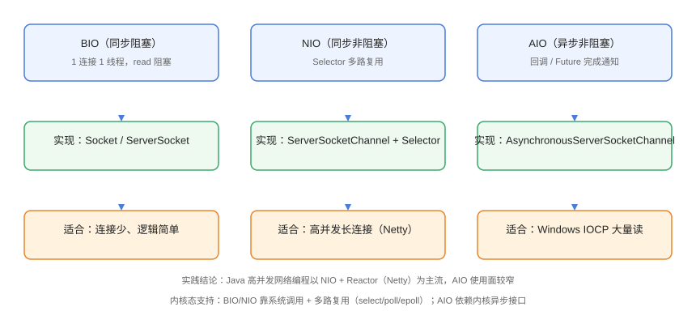

# 网络 IO 模型：BIO/NIO/AIO

网络 IO 模型描述「数据从网卡到应用内存」的过程中，线程如何等待与处理数据。Java 中常见三种：BIO（同步阻塞）、NIO（同步非阻塞 + 多路复用）、AIO（异步非阻塞）。理解它们的差异，是学习 Netty 与高并发服务设计的前提。

## 三种模型对比



| 维度 | BIO | NIO | AIO |
| --- | --- | --- | --- |
| 全称 | Blocking IO | Non-blocking IO | Asynchronous IO |
| 阻塞性 | 阻塞 | 非阻塞 | 非阻塞 |
| 同步/异步 | 同步 | 同步 | 异步 |
| 线程模型 | 1 连接 1 线程 | 1 线程管理多连接（Selector） | 内核完成后再回调 |
| 底层机制 | 每连接一个 fd 阻塞等待 | select / poll / epoll | IOCP（Windows）/ epoll+回调（Linux） |
| 代表 API | `Socket` / `ServerSocket` | `SocketChannel` + `Selector` | `AsynchronousSocketChannel` |
| 复杂度 | 低 | 中 | 高 |
| 应用 | 连接少、逻辑简单 | 高并发长连接（Netty） | 大量连接 + 大量读场景 |

::: tip 一句话理解
BIO 是「一个服务员盯一桌客人」；NIO 是「一个领班用对讲机轮询所有桌子，有需要才过去」；AIO 是「客人按铃，领班收到通知再过去」。
:::

## BIO：同步阻塞

```java
// NetworkIO/BioServer.java
import java.io.BufferedReader;
import java.io.IOException;
import java.io.InputStreamReader;
import java.io.PrintWriter;
import java.net.ServerSocket;
import java.net.Socket;
import java.util.concurrent.ExecutorService;
import java.util.concurrent.Executors;

public class BioServer {
    public static void main(String[] args) throws IOException {
        ExecutorService pool = Executors.newFixedThreadPool(10);

        try (ServerSocket server = new ServerSocket(8888)) {
            System.out.println("BIO 服务端启动：8888");
            while (true) {
                // accept 阻塞等待连接
                Socket socket = server.accept();
                pool.submit(() -> handle(socket));
            }
        }
    }

    private static void handle(Socket socket) {
        try (socket;
             BufferedReader in = new BufferedReader(
                     new InputStreamReader(socket.getInputStream()));
             PrintWriter out = new PrintWriter(socket.getOutputStream(), true)) {
            String line;
            while ((line = in.readLine()) != null) {
                out.println("echo: " + line);
            }
        } catch (IOException e) {
            e.printStackTrace();
        }
    }
}
```

问题：每个连接占用一个线程，线程数 = 连接数。连接多、空闲多时，大量线程阻塞在 `read()`，内存与上下文切换开销爆炸。

::: danger BIO 的适用边界
BIO 只适合**连接少、请求短**的场景（内网小服务、工具脚本）。高并发场景下，线程池打满后新连接会排队或拒绝。
:::

## NIO：同步非阻塞 + 多路复用

前面 [Selector 与多路复用](../Selector/index.md) 已给出完整实现。核心变化：

1. `configureBlocking(false)` 让读写不再阻塞线程；
2. 通道注册到 `Selector`，`select()` 只返回就绪事件；
3. 一个线程处理成千上万个连接。

## AIO：异步非阻塞

```java
// NetworkIO/AioServer.java
import java.io.IOException;
import java.net.InetSocketAddress;
import java.nio.ByteBuffer;
import java.nio.channels.AsynchronousServerSocketChannel;
import java.nio.channels.AsynchronousSocketChannel;
import java.nio.channels.CompletionHandler;
import java.nio.charset.StandardCharsets;

public class AioServer {
    public static void main(String[] args) throws IOException {
        try (AsynchronousServerSocketChannel server =
                     AsynchronousServerSocketChannel.open()) {
            server.bind(new InetSocketAddress(8888));
            System.out.println("AIO 服务端启动：8888");

            server.accept(null, new CompletionHandler<AsynchronousSocketChannel, Void>() {
                @Override
                public void completed(AsynchronousSocketChannel client, Void attachment) {
                    // 继续接受下一个连接
                    server.accept(null, this);

                    ByteBuffer buffer = ByteBuffer.allocate(1024);
                    client.read(buffer, buffer, new CompletionHandler<Integer, ByteBuffer>() {
                        @Override
                        public void completed(Integer result, ByteBuffer buf) {
                            if (result > 0) {
                                buf.flip();
                                String msg = StandardCharsets.UTF_8
                                        .decode(buf).toString().trim();
                                System.out.println("收到：" + msg);
                                ByteBuffer out = ByteBuffer.wrap(
                                        ("echo: " + msg).getBytes(StandardCharsets.UTF_8));
                                client.write(out, null, new CompletionHandler<Integer, Void>() {
                                    @Override
                                    public void completed(Integer r, Void a) { }
                                    @Override
                                    public void failed(Throwable exc, Void a) {
                                        exc.printStackTrace();
                                    }
                                });
                            }
                        }

                        @Override
                        public void failed(Throwable exc, ByteBuffer buf) {
                            exc.printStackTrace();
                        }
                    });
                }

                @Override
                public void failed(Throwable exc, Void attachment) {
                    exc.printStackTrace();
                }
            });

            // 主线程保活
            Thread.sleep(60_000);
        } catch (InterruptedException e) {
            Thread.currentThread().interrupt();
        }
    }
}
```

AIO 把「等待」交给内核：发起 `read` 后立即返回，内核数据就绪并拷贝完成后回调 `CompletionHandler`。Java 的 AIO 在 Windows 上基于 IOCP 表现不错，在 Linux 上实现基于 epoll 模拟，使用面较窄。

::: warning AIO 的现实处境
Java AIO 的 Linux 实现并不占优，主流高并发框架（Netty）选择 NIO + Reactor，而非 AIO。**学习 AIO 理解模型即可，生产首选 NIO/Netty**。
:::

## 如何选择

| 场景 | 推荐 |
| --- | --- |
| 学习、简单工具、连接数 < 100 | BIO |
| 高并发 TCP 服务、网关、IM | NIO + Netty |
| Windows 平台大量异步 IO | AIO（IOCP） |
| HTTP 服务 | 直接用 Tomcat/Netty 等成熟容器 |

## 易错点与最佳实践

::: danger 常见坑
1. **NIO 忘了设非阻塞**：`SocketChannel` 默认阻塞，直接 `register` 抛异常。
2. **AIO 回调里抛异常**：回调异常不会传播到主线程，必须捕获并记录日志，否则静默失败。
3. **读写不循环**：`read()` 一次可能读半包，要累积到完整消息再解析（粘包/半包）。
4. **BIO 线程池耗尽**：没有队列与拒绝策略兜底，连接会被丢弃。
5. **模型混用**：一个服务里 BIO 与 NIO 混用会让线程模型复杂化，先统一再优化。
:::

::: tip 最佳实践
- 高性能网络服务直接基于 Netty，配置主从 Reactor + 业务线程池 + 编解码器。
- 用 `jstack` 观察线程阻塞点：大量线程卡在 `socketRead0` 说明 BIO 模型，考虑迁移。
- 压测时对比三种模型在 1000 并发下的线程数，NIO 的线程数基本恒定。
:::

## 验证方式

分别启动 `BioServer` 与 `AioServer`，用 `telnet 127.0.0.1 8888` 或前述客户端连接，输入文本确认回显；再用 `jstack <pid>` 观察 BIO 场景下每个连接一个阻塞线程、AIO 场景下线程数很少。

## 参考资料

- [Oracle Java 教程：Socket 编程](https://docs.oracle.com/javase/tutorial/networking/sockets/index.html)
- [AsynchronousServerSocketChannel API 文档](https://docs.oracle.com/en/java/javase/25/docs/api/java.base/java/nio/channels/AsynchronousServerSocketChannel.html)
- [Netty 官方文档：线程模型](https://netty.io/wiki/thread-model.html)
