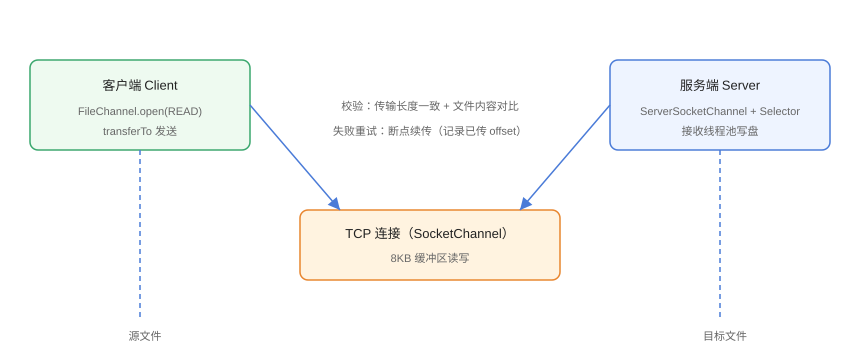

# 实战：NIO 文件传输服务器

综合运用 FileChannel、SocketChannel、ByteBuffer 与线程池，实现一个可用的文件传输服务：客户端读取本地文件并发给服务端，服务端接收并写盘，支持断点续传与传输校验。这是理解 NIO 文件 + 网络协作的完整闭环。

## 整体设计



设计要点：

1. **客户端**：`FileChannel.open(READ)` 读文件，`transferTo` 或 Buffer 循环发送；
2. **传输协议**：先发固定格式的文件头（文件名 + 文件大小 + 起始偏移），再发文件字节；
3. **服务端**：`ServerSocketChannel` + 每连接一个处理线程（此处简化用 BIO 连接 + NIO 文件通道写盘，重点展示通道配合）；
4. **断点续传**：客户端记录已传偏移，断线后从偏移继续；
5. **校验**：传输完成后对比文件大小与 `Files.mismatch`。

## 协议定义

```text
请求（UTF-8，\n 分隔）：
  第一行：文件名
  第二行：文件大小（字节）
  第三行：起始偏移（0 表示从头传）
  之后：文件字节流

响应（UTF-8，\n 分隔）：
  OK <已接收字节数>    或    ERR <原因>
```

## 服务端实现

```java
// Practice/FileServer.java
import java.io.BufferedReader;
import java.io.IOException;
import java.io.InputStreamReader;
import java.net.ServerSocket;
import java.net.Socket;
import java.nio.ByteBuffer;
import java.nio.channels.FileChannel;
import java.nio.charset.StandardCharsets;
import java.nio.file.Files;
import java.nio.file.Path;
import java.nio.file.StandardOpenOption;
import java.util.concurrent.ExecutorService;
import java.util.concurrent.Executors;

public class FileServer {
    private static final Path SAVE_DIR = Path.of("uploads");

    public static void main(String[] args) throws IOException {
        Files.createDirectories(SAVE_DIR);
        ExecutorService pool = Executors.newFixedThreadPool(8);

        try (ServerSocket server = new ServerSocket(9000)) {
            System.out.println("文件服务端启动：9000，保存目录：" +
                    SAVE_DIR.toAbsolutePath());
            while (true) {
                Socket socket = server.accept();
                pool.submit(() -> handle(socket));
            }
        }
    }

    private static void handle(Socket socket) {
        Path target = null;
        try (socket;
             BufferedReader reader = new BufferedReader(
                     new InputStreamReader(socket.getInputStream(),
                             StandardCharsets.UTF_8))) {
            // 读文件头
            String fileName = reader.readLine();
            long fileSize = Long.parseLong(reader.readLine());
            long offset = Long.parseLong(reader.readLine());

            target = SAVE_DIR.resolve(fileName).normalize();
            // 防目录穿越：目标必须在 SAVE_DIR 内
            if (!target.startsWith(SAVE_DIR)) {
                reply(socket, "ERR 非法文件名");
                return;
            }

            long received = 0;
            try (FileChannel out = FileChannel.open(target,
                    StandardOpenOption.CREATE, StandardOpenOption.WRITE)) {
                out.position(offset);          // 断点续传：从偏移写

                byte[] buffer = new byte[8192];
                int len;
                while (received < fileSize - offset
                        && (len = socket.getInputStream().read(buffer)) != -1) {
                    ByteBuffer bb = ByteBuffer.wrap(buffer, 0, len);
                    while (bb.hasRemaining()) {
                        out.write(bb);
                    }
                    received += len;
                }
            }

            reply(socket, "OK " + received);
            System.out.println("完成：" + fileName + " 共 " + received + " 字节");
        } catch (Exception e) {
            e.printStackTrace();
            try { reply(socket, "ERR " + e.getMessage()); } catch (IOException ignored) { }
        }
    }

    private static void reply(Socket socket, String msg) throws IOException {
        socket.getOutputStream().write((msg + "\n").getBytes(StandardCharsets.UTF_8));
        socket.getOutputStream().flush();
    }
}
```

::: danger 目录穿越漏洞
文件名若直接拼接可能被注入 `../` 逃出保存目录。必须 `normalize()` 后校验 `startsWith(SAVE_DIR)`，否则攻击者可任意写文件。
:::

## 客户端实现

```java
// Practice/FileClient.java
import java.io.IOException;
import java.io.InputStream;
import java.net.Socket;
import java.nio.ByteBuffer;
import java.nio.channels.FileChannel;
import java.nio.charset.StandardCharsets;
import java.nio.file.Files;
import java.nio.file.Path;
import java.nio.file.StandardOpenOption;

public class FileClient {
    public static void main(String[] args) throws IOException {
        Path file = Path.of("send-file.bin");
        long size = Files.size(file);
        long offset = 0;    // 断点续传时填已传偏移

        try (Socket socket = new Socket("127.0.0.1", 9000);
             FileChannel in = FileChannel.open(file, StandardOpenOption.READ)) {

            // 发送文件头
            String header = file.getFileName() + "\n" + size + "\n" + offset + "\n";
            socket.getOutputStream().write(header.getBytes(StandardCharsets.UTF_8));
            socket.getOutputStream().flush();

            // 从偏移处开始传输
            in.position(offset);
            long remaining = size - offset;
            ByteBuffer buffer = ByteBuffer.allocate(64 * 1024);
            long sent = 0;

            while (remaining > 0) {
                buffer.clear();
                int read = in.read(buffer);
                if (read == -1) break;
                buffer.flip();
                while (buffer.hasRemaining()) {
                    socket.getOutputStream().write(buffer.array(),
                            buffer.position(), buffer.remaining());
                    sent += buffer.remaining();
                    buffer.position(buffer.limit());
                }
                remaining -= read;
                if (sent % (1024 * 1024) < 64 * 1024) {
                    System.out.println("已发送 " + sent + " / " + (size - offset) + " 字节");
                }
            }

            // 读取响应
            socket.shutdownOutput();
            InputStream is = socket.getInputStream();
            byte[] resp = new byte[1024];
            int n = is.read(resp);
            System.out.println("服务端响应：" +
                    new String(resp, 0, n, StandardCharsets.UTF_8).trim());
        }
    }
}
```

## 断点续传说明

断线后，客户端记录已成功发送的字节数（可写入 `.progress` 文件），重连时把该值作为 `offset` 发送；服务端 `out.position(offset)` 从偏移处继续写入，不会覆盖已接收数据。

```java
// Practice/ProgressSave.java（断点进度记录示意）
import java.nio.file.Files;
import java.nio.file.Path;

public class ProgressSave {
    private static final Path PROGRESS = Path.of("upload.progress");

    public static void save(long offset) throws java.io.IOException {
        Files.writeString(PROGRESS, String.valueOf(offset));
    }

    public static long load() throws java.io.IOException {
        return Files.exists(PROGRESS)
                ? Long.parseLong(Files.readString(PROGRESS).trim())
                : 0L;
    }
}
```

## 完整性校验

传输完成后，服务端可以主动比对大小：

```java
// Practice/VerifyDemo.java
import java.nio.file.Files;
import java.nio.file.Path;

public class VerifyDemo {
    public static void main(String[] args) throws java.io.IOException {
        Path original = Path.of("send-file.bin");
        Path received = Path.of("uploads/send-file.bin");

        if (Files.size(original) != Files.size(received)) {
            System.out.println("大小不一致，传输失败");
        } else if (Files.mismatch(original, received) == -1) {
            System.out.println("校验通过：文件内容完全一致");
        } else {
            System.out.println("内容不一致，需要重传");
        }
    }
}
```

## 验证方式

```shell
# 1. 生成 20MB 测试文件
fsutil file createnew send-file.bin 20971520

# 2. 终端 1：启动服务端
javac FileServer.java
java FileServer

# 3. 终端 2：启动客户端
javac FileClient.java
java FileClient

# 4. 校验
javac VerifyDemo.java
java VerifyDemo
```

预期：

```text
文件服务端启动：9000，保存目录：...\uploads
已发送 65536 / 20971520 字节
...
服务端响应：OK 20971520
校验通过：文件内容完全一致
```

## 进阶方向

| 方向 | 说明 |
| --- | --- |
| 多客户端并发 | 服务端用线程池已支持；更进一步用 Selector 单线程多路复用 |
| 大文件内存占用 | 当前固定 8KB/64KB 缓冲区，内存稳定；避免一次性 `readAllBytes` |
| 加密传输 | 叠加 TLS（`SSLSocket` / Netty SSL 处理器） |
| 秒传与断点续传 | 先传文件哈希，服务端已有完整文件直接返回秒传 |
| 生产化 | 换成 Netty 实现协议编解码、流量控制与背压 |

## 参考资料

- [FileChannel API 文档](https://docs.oracle.com/en/java/javase/25/docs/api/java.base/java/nio/channels/FileChannel.html)
- [SocketChannel API 文档](https://docs.oracle.com/en/java/javase/25/docs/api/java.base/java/nio/channels/SocketChannel.html)
- [Netty 官方文档](https://netty.io/wiki/user-guide-for-4.x.html)
