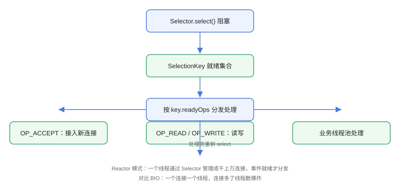

# Selector 与多路复用

Selector（选择器）是 NIO 多路复用的核心：**一个线程**可以同时监听成百上千个通道的 IO 事件（连接就绪、可读、可写），事件就绪才处理，空闲时阻塞等待。这套模型就是经典 Reactor 模式的 Java 实现，也是 Netty 高性能的底层基础。

## 工作流程



典型循环：

```text
while (true) {
    selector.select();              // 1. 阻塞等待就绪事件
    Set<SelectionKey> keys = selector.selectedKeys();
    for (SelectionKey key : keys) {
        // 2. 按 readyOps 分发处理
        if (key.isAcceptable()) { /* 接入新连接 */ }
        if (key.isReadable())    { /* 读取数据 */ }
        if (key.isWritable())    { /* 写出数据 */ }
    }
    keys.clear();                   // 3. 清空已处理集合（关键！）
}
```

::: danger 忘记 clear 是经典 Bug
`selector.selectedKeys()` 返回的集合不会自动移除，处理完必须 `keys.clear()`，否则同一事件会被重复处理，导致死循环或重复逻辑。
:::

## SelectionKey 与就绪事件

注册通道后得到 `SelectionKey`，它记录通道、选择器与感兴趣的事件。

| 事件常量 | 含义 | 常用判断方法 |
| --- | --- | --- |
| `OP_ACCEPT` | 服务端有新连接 | `key.isAcceptable()` |
| `OP_CONNECT` | 客户端连接完成 | `key.isConnectable()` |
| `OP_READ` | 通道可读 | `key.isReadable()` |
| `OP_WRITE` | 通道可写 | `key.isWritable()` |

## 完整多路复用服务器

```java
// Selector/MultiplexerServer.java
import java.io.IOException;
import java.net.InetSocketAddress;
import java.nio.ByteBuffer;
import java.nio.channels.SelectionKey;
import java.nio.channels.Selector;
import java.nio.channels.ServerSocketChannel;
import java.nio.channels.SocketChannel;
import java.util.Iterator;
import java.util.Set;

public class MultiplexerServer {
    public static void main(String[] args) throws IOException {
        Selector selector = Selector.open();

        // 服务端通道
        ServerSocketChannel serverChannel = ServerSocketChannel.open();
        serverChannel.configureBlocking(false);          // 必须非阻塞
        serverChannel.bind(new InetSocketAddress(8888));
        serverChannel.register(selector, SelectionKey.OP_ACCEPT);

        System.out.println("服务端启动，监听 8888 ...");
        ByteBuffer buffer = ByteBuffer.allocate(1024);

        while (true) {
            selector.select();                           // 阻塞等待事件
            Set<SelectionKey> selectedKeys = selector.selectedKeys();
            Iterator<SelectionKey> it = selectedKeys.iterator();

            while (it.hasNext()) {
                SelectionKey key = it.next();
                it.remove();                             // 处理完立即移除

                if (key.isAcceptable()) {
                    // 接入新连接
                    ServerSocketChannel ssc = (ServerSocketChannel) key.channel();
                    SocketChannel client = ssc.accept();
                    client.configureBlocking(false);
                    client.register(selector, SelectionKey.OP_READ);
                    System.out.println("新连接：" + client.getRemoteAddress());
                } else if (key.isReadable()) {
                    // 读取并回显
                    SocketChannel client = (SocketChannel) key.channel();
                    buffer.clear();
                    int read = client.read(buffer);
                    if (read == -1) {
                        System.out.println("客户端关闭连接");
                        client.close();
                        continue;
                    }
                    buffer.flip();
                    byte[] data = new byte[buffer.remaining()];
                    buffer.get(data);
                    String msg = new String(data).trim();
                    System.out.println("收到：" + msg);

                    // 回显
                    buffer.clear();
                    buffer.put(("echo: " + msg).getBytes());
                    buffer.flip();
                    while (buffer.hasRemaining()) {
                        client.write(buffer);
                    }
                }
            }
        }
    }
}
```

配合客户端验证：

```java
// Selector/MultiplexerClient.java
import java.io.IOException;
import java.net.InetSocketAddress;
import java.nio.ByteBuffer;
import java.nio.channels.SocketChannel;

public class MultiplexerClient {
    public static void main(String[] args) throws IOException {
        try (SocketChannel channel = SocketChannel.open()) {
            channel.connect(new InetSocketAddress("127.0.0.1", 8888));

            ByteBuffer buffer = ByteBuffer.allocate(1024);
            buffer.put("hello nio".getBytes());
            buffer.flip();
            channel.write(buffer);

            buffer.clear();
            channel.read(buffer);
            buffer.flip();
            byte[] data = new byte[buffer.remaining()];
            buffer.get(data);
            System.out.println("服务端响应：" + new String(data));
        }
    }
}
```

预期输出（服务端）：

```text
服务端启动，监听 8888 ...
新连接：/127.0.0.1:xxxxx
收到：hello nio
```

客户端输出：`服务端响应：echo: hello nio`

## Reactor 模式

上面的代码是单线程 Reactor：Selector 线程既处理连接，又处理读写。生产环境通常演进为多线程模型：

| 模型 | 结构 | 适用 |
| --- | --- | --- |
| 单 Reactor 单线程 | 一个线程管 select + 业务 | 教学、极简场景 |
| 单 Reactor 多线程 | select 线程 + 业务线程池 | 业务耗时场景 |
| 主从 Reactor 多线程 | 主 Reactor 管 accept，从 Reactor 管读写 | 高并发生产（Netty 默认） |

Netty 的 `EventLoop` 就是主从 Reactor 的实现，把通道注册、事件分发、任务调度统一到一个线程内执行，避免锁竞争。

::: tip 为什么要非阻塞
`configureBlocking(false)` 后，`accept()` / `read()` 不会阻塞线程，通道才能注册进 Selector 统一调度；这也是 NIO 区别于 BIO「一连接一线程」的根本。
:::

## 易错点与最佳实践

::: danger 常见坑
1. **通道没设非阻塞**：`configureBlocking(false)` 未调用就 `register`，抛 `IllegalBlockingModeException`。
2. **selectedKeys 不清理**：处理完不移除导致事件反复触发。
3. **注册重复**：同一通道对同一 Selector 重复 `register` 会覆盖旧的 SelectionKey，附件（attachment）丢失。
4. **`OP_WRITE` 一直就绪**：可写事件几乎永远就绪，若一直注册会造成忙轮询；只应在需要写时临时注册，写完注销。
5. **单线程处理耗时业务**：把大计算/阻塞操作放在 select 线程会拖垮所有连接，应交给业务线程池。
:::

::: tip 最佳实践
- 生产代码直接用 Netty，不要手写 Selector 轮子（编解码、扩容、异常处理全是坑）。
- 半包/粘包处理：`ByteBuffer` 需要扩容或累积缓冲，参考 [网络 IO 模型](../NetworkIO/index.md)。
- 监控 select 阻塞时间与 selectedKeys 数量，异常波动常是连接泄漏或死循环。
:::

## 验证方式

```shell
javac MultiplexerServer.java MultiplexerClient.java
java MultiplexerServer        # 终端 1
java MultiplexerClient        # 终端 2
```

预期：客户端收到 `echo: hello nio`，服务端打印连接与消息日志。用多个客户端并发连接，确认单线程 Selector 也能同时服务。

## 参考资料

- [Selector API 文档](https://docs.oracle.com/en/java/javase/25/docs/api/java.base/java/nio/channels/Selector.html)
- [SelectionKey API 文档](https://docs.oracle.com/en/java/javase/25/docs/api/java.base/java/nio/channels/SelectionKey.html)
- [Netty 官方文档：EventLoop 与线程模型](https://netty.io/wiki/thread-model.html)
