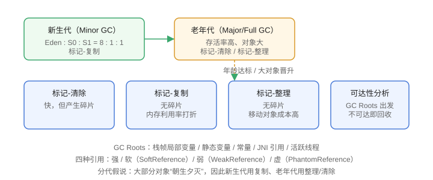

# GC 算法

垃圾回收（Garbage Collection，GC）解决“谁该回收、怎么回收”两个问题。这一篇讲清楚**可达性分析**、**四种引用**和**三大回收算法**，以及它们如何配合分代模型工作。

## 判断对象是否存活

### 引用计数法（理论）

给对象加引用计数器，为 0 时回收。缺点：**无法解决循环引用**，主流 JVM 不采用。

```text
A 引用 B，B 引用 A，但没有外部引用 → 两个对象互相“保命”，永远无法回收
```

### 可达性分析（HotSpot 采用）

从 **GC Roots** 出发，沿引用链搜索，不可达的对象判定为可回收：

```text
GC Roots 包括：
1. 虚拟机栈（栈帧局部变量）中引用的对象
2. 静态变量引用的对象
3. 常量引用的对象
4. JNI（native 方法）引用的对象
5. 活跃线程等
```

```java [JVM/GcAlgorithm/GcRootsDemo.java]
public class GcRootsDemo {
    private static GcRootsDemo staticObj;   // 静态变量 → GC Root

    public static void main(String[] args) {
        GcRootsDemo localObj = new GcRootsDemo();   // 栈帧局部变量 → GC Root
        GcRootsDemo[] arr = new GcRootsDemo[1];
        arr[0] = new GcRootsDemo();                 // 数组元素 → GC Root（通过数组）
        localObj = null;                            // 失去引用，可回收
    }
}
```

## 四种引用

| 引用类型 | 回收时机 | 用途 |
| --- | --- | --- |
| 强引用 | 永不回收 | `new` 出来的默认引用 |
| 软引用（SoftReference） | 内存不足时回收 | 缓存 |
| 弱引用（WeakReference） | 下次 GC 就回收 | 缓存、ThreadLocal key |
| 虚引用（PhantomReference） | 随时可能回收，配合引用队列 | 对象回收跟踪、堆外内存释放 |

```java [JVM/GcAlgorithm/ReferenceDemo.java]
import java.lang.ref.SoftReference;
import java.lang.ref.WeakReference;

public class ReferenceDemo {
    public static void main(String[] args) {
        Object obj = new Object();
        SoftReference<Object> soft = new SoftReference<>(obj);
        WeakReference<Object> weak = new WeakReference<>(obj);

        obj = null;                 // 只有软/弱引用指向对象
        System.gc();                // 弱引用对象大概率被回收
        System.out.println(soft.get());
        System.out.println(weak.get());
    }
}
```

## 三大回收算法

### 1. 标记-清除（Mark-Sweep）

```text
标记存活对象 → 清除不可达对象
缺点：产生内存碎片，大对象分配困难
```

### 2. 标记-复制（Mark-Copy）

```text
把内存分成两块，只用一块；GC 时把存活对象复制到另一块，再整块清空
优点：无碎片、效率高
缺点：可用内存减半（HotSpot 用 Eden : Survivor = 8 : 1 : 1 优化）
```

新生代默认比例：`Eden : S0 : S1 = 8 : 1 : 1`，只有约 10% 内存被“浪费”在幸存区。

### 3. 标记-整理（Mark-Compact）

```text
标记存活对象 → 向一端移动 → 清理边界外的内存
优点：无碎片
缺点：移动对象成本高
```

老年代通常使用标记-整理或与之配合的算法。

## 分代收集理论

大部分对象“朝生夕灭”（弱分代假说），因此堆分成新生代与老年代，采用不同算法：

| 区域 | 特点 | 算法 |
| --- | --- | --- |
| 新生代 | 对象多、存活少 | 标记-复制 |
| 老年代 | 存活率高、对象大 | 标记-清除 / 标记-整理 |



## 对象晋升老年代

```text
对象在 Eden 出生
  → 经历一次 Minor GC 存活且年龄 +1
  → 年龄达到阈值（默认 15，可通过 -XX:MaxTenuringThreshold 调整）
  → 晋升到老年代
  → 大对象直接进入老年代
```

动态年龄判定：如果 Survivor 中同龄对象大小之和超过 Survivor 空间一半，则大于等于该年龄的对象直接晋升。

## 触发条件

| GC 类型 | 触发 |
| --- | --- |
| Minor GC（新生代） | Eden 空间不足 |
| Major GC / Full GC（老年代） | 老年代空间不足、元空间不足、`System.gc()`、晋升失败等 |

## 易错点

::: danger 常见错误
1. 以为“没有引用就一定立即回收”：GC 是不确定的，`System.gc()` 只是建议。
2. 用强引用做缓存：内存不足也无法回收，导致 OOM；用软引用/弱引用或专用缓存库。
3. 大对象频繁创建：直接进老年代，老年代 GC 频繁，吞吐下降。
4. 分不清 Minor GC 和 Full GC：两者触发条件和影响范围不同，日志里都要看。
5. 循环引用误区：HotSpot 用可达性分析，循环引用对象一样会被回收。
:::

## 验证方式

1. 运行 `ReferenceDemo`，观察弱引用对象被回收、软引用在内存充足时仍在。
2. 用 `-Xlog:gc` 启动程序，观察 Eden 不足触发的 Minor GC 日志。
3. 用 `jstat -gcutil <pid>` 观察年轻代/老年代占用与 GC 次数变化。

## 参考资料

- HotSpot GC 调优指南：https://docs.oracle.com/en/java/javase/25/gctuning/
- 可达性分析说明：https://docs.oracle.com/javase/specs/jvms/se25/html/jvms-5.html
- 引用类文档：https://docs.oracle.com/en/java/javase/25/docs/api/java.base/java/lang/ref/package-summary.html
