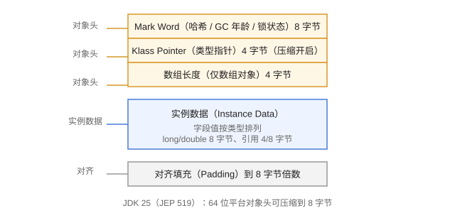

# 对象创建与内存布局

Java 中 `new` 一个对象背后有一套固定流程：类加载检查、分配内存、初始化零值、设置对象头、执行构造方法。了解对象在内存中的“长相”，才能解释为什么会有指针压缩、为什么大对象要小心。

## 对象创建流程

```text
1. 类加载检查（类不存在则先加载）
2. 在堆上分配内存
3. 内存空间初始化为零值
4. 设置对象头（Mark Word、类型指针、数组长度）
5. 执行构造方法 <init>
```

## 内存分配方式

| 方式 | 适用 | 说明 |
| --- | --- | --- |
| 指针碰撞（Bump the Pointer） | 堆内存规整（Serial/ParNew） | 移动指针即可 |
| 空闲列表（Free List） | 堆内存碎片化（CMS） | 维护空闲块列表 |

并发分配使用 **CAS + 失败重试**或 **TLAB（Thread Local Allocation Buffer）**：每个线程在 Eden 划一块私有缓冲区，避免竞争。

## 对象内存布局

```text
┌────────────────────────────────────────────┐
│ 对象头（Header）                            │
│   Mark Word（哈希、GC 年龄、锁状态等）       │
│   Klass Pointer（指向类元数据）             │
│   [数组长度]（仅数组对象）                  │
├────────────────────────────────────────────┤
│ 实例数据（Instance Data）                   │
│   long/double 8 字节、引用 4/8 字节等       │
├────────────────────────────────────────────┤
│ 对齐填充（Padding）到 8 字节倍数            │
└────────────────────────────────────────────┘
```



| 部分 | 作用 |
| --- | --- |
| Mark Word | 存哈希码、GC 分代年龄、锁标志位（偏向锁/轻量锁/重量锁） |
| Klass Pointer | 指向方法区的类元数据，用于确定对象类型 |
| 数组长度 | 数组对象特有，4 字节 |
| 实例数据 | 字段值，按类型排列 |
| 对齐填充 | 对象大小必须是 8 字节的倍数 |

## 查看对象布局：JOL

使用 OpenJDK 的 JOL 工具（Java Object Layout）可以实际查看：

```xml [pom.xml]
<dependency>
  <groupId>org.openjdk.jol</groupId>
  <artifactId>jol-core</artifactId>
  <version>0.17</version>
</dependency>
```

```java [JVM/ObjectLayout/ObjectLayoutDemo.java]
import org.openjdk.jol.info.ClassLayout;

public class ObjectLayoutDemo {
    public static void main(String[] args) {
        System.out.println(ClassLayout.parseInstance(new Object()).toPrintable());
    }
}
```

输出片段（64 位 JVM，压缩指针开启）：

```text
java.lang.Object object internals:
OFF  SZ   TYPE DESCRIPTION
  0   8        (object header: mark)
  8   4        (object header: class)
 12   4        (object alignment gap)
Instance size: 16 bytes
```

## JDK 25：紧凑对象头（JEP 519）

JDK 25 把 64 位平台的对象头从 12 字节（8 Mark Word + 4 Klass Pointer）压缩到 **8 字节**，可减少约 30% 的 CPU 负载并显著节省内存。该特性在不同 JDK 版本中的启用方式不同，使用前以官方发布说明为准。

## 指针压缩（Compressed Oops）

64 位 JVM 中引用默认占 8 字节；开启 `-XX:+UseCompressedOops`（**堆小于 32GB 时默认开启**）后压缩为 4 字节，减少内存占用。

::: warning 注意
堆超过 32GB 时压缩失效，引用回到 8 字节，可能“加内存反而性能下降”；因此 32GB 附近是调优时需要专门测试的分界点。
:::

## 对象访问定位

```text
方式1：句柄访问（对象引用 → 句柄池 → 对象实例数据 + 类型数据）
方式2：直接指针（对象引用 → 对象实例数据，类型数据经 Klass Pointer）
```

HotSpot 使用**直接指针**方式，访问更快。

## 逃逸分析与栈上分配

如果对象不“逃逸”出方法（不被外部引用），JVM 可能做**标量替换**，把对象拆成基本类型直接放栈上，减少堆分配与 GC 压力。

```java
public long sum() {
    Point p = new Point(1, 2);   // p 没有逃逸，可能被标量替换
    return p.x + p.y;
}
```

## 易错点

::: danger 常见错误
1. 以为 `new` 出来的对象一定在堆：逃逸分析 + 标量替换下可能分配在栈上（这是优化结果，不是承诺）。
2. 大量创建“大对象”（如大数组、大字符串）：大对象直接进老年代，老年代 GC 频繁且成本高。
3. 不理解对象头：锁状态、GC 年龄都存在 Mark Word 里，所以“锁膨胀”和“GC 年龄”会互相影响。
4. 堆内存接近 32GB 时盲目加内存：压缩指针失效，内存可能不降反升。
5. 用 `System.gc()` 调内存：只是建议，不能保证回收，生产环境应通过工具分析而不是手动触发。
:::

## 验证方式

1. 用 JOL 查看 `Object`、`int[]`、自定义类的内存布局，对比对象头与对齐填充。
2. 分别以 `-XX:+UseCompressedOops` 和 `-XX:-UseCompressedOops` 启动，对比同一对象的大小。
3. 用 `-Xlog:gc` 观察大对象直接进入老年代的日志（`[gc,ergo]` 相关输出）。

## 参考资料

- JEP 519（紧凑对象头）：https://openjdk.org/jeps/519
- JOL 项目：https://openjdk.org/projects/code-tools/jol/
- 压缩指针说明：https://wiki.openjdk.org/display/HotSpot/CompressedOops
